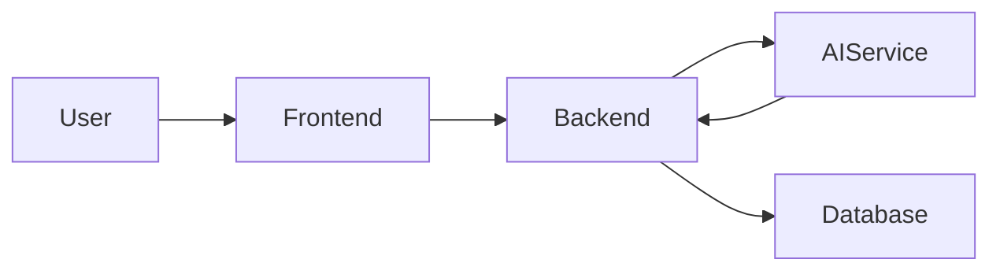

# Steps Documentation

## 1. 사용 시점

다음 작업이 끝난 뒤 사용합니다.

1. 구현
2. 관련 검증
3. Git 변경 확인
4. 실제 결과 확인

아직 수행하지 않은 작업이나 검증이 끝나지 않은 작업을 완료된 것처럼 기록하지 않습니다.

다음과 같은 작은 변경은 생략할 수 있습니다.

- 단순 오탈자
- 문장 한 줄 수정
- 영향이 없는 한 파일의 매우 작은 변경

## 2. 기존 형식 확인

기존 Steps 문서가 있으면 다음을 확인합니다.

- 문서 위치
- 파일명
- 번호 체계
- 제목 형식
- 섹션 순서
- 문체
- 표와 Mermaid 사용 방식

기존 형식을 우선 유지합니다.

## 3. 문서 위치와 이름

기존 규칙이 없으면 다음 경로를 사용합니다.

```text
docs/steps/
```

특정 서비스 전용 문서 구조가 이미 있다면 해당 서비스 아래에 작성할 수 있습니다.

```text
frontend/docs/steps/
```

현재 저장소에는 `frontend/docs/steps/`가 존재하지만 `backend/docs/steps/`, `ai_service/docs/steps/`는 없습니다. 존재하지 않는 디렉터리를 Steps 작성을 위해 임의로 만들지 말고, 기존 구조가 없으면 `docs/steps/`를 사용합니다.

기본 파일명:

```text
step-<번호>-<작업명>.md
```

관련 Plans 문서가 있다면 같은 번호와 작업명을 사용합니다.

예:

```text
docs/plans/plan-01-dashboard-refactoring.md
docs/steps/step-01-dashboard-refactoring.md
```

## 4. Steps 문서 목적

기존 대화를 보지 않은 사람이 다음을 이해할 수 있어야 합니다.

- 왜 작업했는지
- 기존 문제는 무엇이었는지
- 어떤 코드와 구조를 확인했는지
- 실제로 무엇을 바꿨는지
- 왜 해당 방법을 선택했는지
- 시스템 흐름이 어떻게 달라졌는지
- 어떻게 검증했는지
- 무엇이 아직 남아 있는지

## 5. 필수 작성 내용

Steps 문서에는 다음 내용을 포함합니다.

1. 작업 목적과 배경
2. 변경 전 문제 또는 제약사항
3. 실제로 확인한 코드와 구조
4. 적용한 해결 방법
5. 해당 방법을 선택한 이유
6. 수정한 주요 파일
7. 각 파일의 역할
8. 주요 데이터 흐름 또는 실행 흐름
9. 수행한 검증 명령
10. 검증 결과
11. 기존 Plans와 달라진 내용
12. 계획과 달라진 이유
13. 남은 제한사항
14. 후속 작업

## 6. 권장 문서 구조

```markdown
# 작업 제목

## 1. 작업 개요

## 2. 기존 문제

## 3. 확인한 구조

## 4. 적용한 해결 방법

## 5. 주요 변경 파일

## 6. 데이터 및 실행 흐름

## 7. 검증

## 8. Plans와 달라진 내용

## 9. 제한사항 및 후속 작업
```

## 7. 파일 변경 설명

주요 파일은 다음 표 형태를 사용할 수 있습니다.

| 파일   | 변경 내용      | 역할                     |
| ------ | -------------- | ------------------------ |
| `경로` | 실제 변경 내용 | 시스템에서 담당하는 역할 |

파일명을 단순 나열하지 않고 왜 수정했는지 설명합니다.

## 8. 흐름 설명

데이터 또는 실행 흐름이 복잡하면 Mermaid를 사용할 수 있습니다.



실제 구현과 맞지 않는 예시 흐름을 그대로 사용하지 않습니다.

## 9. 검증 작성

검증 항목에는 다음을 작성합니다.

- 실행한 명령
- 성공 또는 실패
- 확인한 결과
- 실행하지 못한 항목
- 실행하지 못한 이유
- 기존 오류와 신규 오류 구분

예:

```markdown
| 검증         | 결과 | 비고                        |
| ------------ | ---- | --------------------------- |
| `pnpm lint`  | 성공 | 신규 오류 없음              |
| `pnpm build` | 실패 | 기존 환경변수 누락으로 실패 |
```

## 10. 작성 금지 사항

- 확인하지 않은 내용을 사실처럼 작성하지 않습니다.
- 실행하지 않은 테스트를 통과했다고 쓰지 않습니다.
- 계획만 존재하는 기능을 구현 완료라고 쓰지 않습니다.
- 코드 전체를 문서에 복사하지 않습니다.
- “Codex가 수정했다”는 표현을 중심으로 쓰지 않습니다.
- 실제 시스템 변경과 판단 근거를 중심으로 작성합니다.
- Plans 문서를 그대로 반복하지 않습니다.

## 11. Git 변경 확인

Steps 문서 작성 후 다음을 확인합니다.

```bash
git status --short
git diff -- <작성한 Steps 문서>
```

이번 단계에서 작성한 Steps 문서 변경만 기준으로 한글 Conventional Commit 메시지를 제안합니다.

실제 commit은 수행하지 않습니다.
