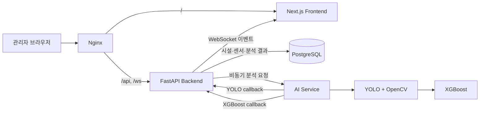

<div align="center">

# SmartDrain

### 이미지·센서 기반 빗물받이 위험 관제 시스템

[](#프로젝트-성격)
[](#프로젝트-성격)
[](#기술-스택)
[](#기술-스택)
[](#기술-스택)
[](#실행-방법)

**SmartDrain**은 빗물받이 이미지와 수위·유속 데이터를 결합해 시설 위험 상태를 분석하고, 관리자가 지도 기반 대시보드에서 현황과 분석 이력을 확인할 수 있도록 만든 관제 시스템입니다.

**팀 MVP를 개인 Fork로 이어받아 아키텍처 리팩터링과 AI 에이전트 기능 고도화를 진행하는 버전입니다.**

</div>

---

## 프로젝트 성격

이 저장소는 기존 팀 프로젝트로 개발했던 SmartDrain MVP를 기반으로, 개인 포트폴리오와 장기 고도화를 목적으로 구조를 재정비하는 Fork 버전입니다.

- 원본 팀 프로젝트: [star2871/smartdrain](https://github.com/star2871/smartdrain)
- 현재 개인 고도화 저장소: [yellow-pang/smartdrain-agent-upgrade](https://github.com/yellow-pang/smartdrain-agent-upgrade)
- 현재 브랜치 목적: `refactor/global-architecture`에서 frontend/backend/AI service 책임을 분리하고, 향후 AI 에이전트 기능을 추가하기 쉬운 구조로 정리

기존 MVP는 이미지 분석, 센서 데이터, 비동기 AI callback, DB 저장, WebSocket 기반 실시간 대시보드까지 연결한 통합 흐름 검증에 초점을 두었습니다. 현재 버전은 그 결과물을 단순 유지하는 것이 아니라, 개인 프로젝트로 완전히 가져와 아키텍처, 문서, 실행 환경, 서비스 경계를 다시 정리하는 단계입니다.

---

## 프로젝트 소개

도시의 빗물받이는 낙엽, 쓰레기, 토사 등으로 막힐 경우 배수 성능이 저하되고 침수 위험이 높아질 수 있습니다. 관리 대상 시설이 많으면 현장 점검만으로 모든 상태를 빠르게 비교하고 우선순위를 정하기 어렵습니다.

SmartDrain은 다음 데이터를 하나의 흐름으로 연결합니다.

1. 빗물받이 이미지
2. 수위·유속 센서값
3. YOLO·OpenCV 이미지 분석
4. XGBoost 위험 등급 분류
5. PostgreSQL 결과 저장
6. REST API·WebSocket 기반 대시보드 갱신

현재 구현은 시설별 샘플 이미지와 모의 센서 데이터를 사용합니다. 실제 CCTV 스트림, IoT 센서, 사용자 인증, 작업 큐, 에이전트 기반 자동 진단은 고도화 범위입니다.

---

## 고도화 방향

| 영역 | 현재 상태 | 고도화 방향 |
| --- | --- | --- |
| Architecture | MVP 기능 중심의 통합 구현 | `frontend/`, `backend/`, `ai_service/` 책임 분리와 실행 기준 정리 |
| Backend | FastAPI, Alembic, WebSocket, AI callback | API 계약 안정화, 작업 상태 추적 강화, 운영 보안 경계 정리 |
| AI Service | YOLO/OpenCV + XGBoost 분석 서버 | 모델 artifact 관리, callback 신뢰성, 에이전트 기반 분석 orchestration 확장 |
| Frontend | 지도 기반 대시보드와 상세 화면 | 실시간 상태 UX 개선, 운영자 workflow, 장애/빈 상태 표현 강화 |
| Infra | Docker Compose, Nginx, Jenkins | 로컬/배포 환경 재현성 강화, secret과 모델 파일 주입 정책 명확화 |
| Documentation | MVP 산출물과 구현 기록 혼재 | 대표 README와 서비스별 README 역할 분리, 포트폴리오 친화 문서화 |

---

## 폴더 구조

현재 리팩터링의 목표 구조는 다음과 같습니다.

```text
smartdrain-agent-upgrade/
├─ frontend/                 # Next.js 관리자 대시보드
│  ├─ app/                   # App Router 페이지
│  ├─ components/            # 지도, 대시보드, 상세 화면 컴포넌트
│  ├─ lib/                   # API client, adapter, query, websocket, util
│  ├─ public/                # 정적 이미지와 아이콘
│  └─ docs/                  # frontend 작업 계획, 검증, PR 기록
├─ backend/                  # FastAPI Backend
│  ├─ app/                   # API, service, model, schema, websocket 코드
│  ├─ alembic/               # DB migration scripts
│  ├─ alembic.ini            # backend 전용 Alembic 설정
│  ├─ requirements.txt       # backend runtime 의존성
│  ├─ Dockerfile             # backend/migration/seed 공용 이미지
│  └─ README.md              # backend 단독 실행과 검증 안내
├─ ai_service/               # 비동기 AI 분석 서비스
│  ├─ http/                  # FastAPI endpoint와 callback 전송
│  ├─ analysis/              # YOLO/XGBoost orchestration
│  ├─ yolo/                  # YOLO/OpenCV 분석 계약과 구현
│  ├─ xgboost/               # feature 생성과 위험도 추론
│  ├─ image_source/          # mock image source resolver
│  └─ README.md              # AI service 실행과 모듈 책임 안내
├─ ai-vision/                # 모델 학습, PoC, 실험 코드
├─ mock_data/                # 로컬/시연용 샘플 이미지
├─ nginx/                    # reverse proxy 설정
├─ docs/                     # 원 MVP 산출물과 전체 아키텍처 문서
├─ .jenkins/                 # Jenkins 배포/검증 스크립트
├─ jenkins/                  # Jenkins 실행 보조 구성
├─ docker-compose.yml        # 운영 기준 Compose
├─ docker-compose.dev.yml    # 개발 기준 Compose override
├─ .env.example              # Compose/배포 입력값 예시
├─ AGENTS.md                 # 저장소 전체 Codex 작업 기준
└─ README.md                 # 프로젝트 대표 문서
```

정리 원칙은 단순합니다. 루트에는 전체 프로젝트를 조립하는 파일만 남기고, 특정 서비스의 실행 설정과 의존성은 해당 서비스 디렉터리 안에서 소유합니다.

---

## README 운영 방향

`backend`, `ai_service`, `frontend`의 README는 삭제하지 않고 유지하는 방향을 추천합니다.

| 선택지 | 장점 | 단점 | 판단 |
| --- | --- | --- | --- |
| 루트 README 하나로 통합 | 포트폴리오 독자가 한 문서에서 전체 맥락을 파악하기 쉽다 | 서비스별 실행·검증·계약 설명이 길어져 대표 문서가 무거워진다 | 대표 설명은 루트에 통합 |
| 하위 README 유지 | 각 서비스 담당자가 바로 실행하고 문제를 진단하기 쉽다 | 문서 중복과 오래된 내용이 생길 수 있다 | 서비스별 운영 노트로 유지 |
| 하위 README 삭제 | 문서 위치가 단순해진다 | backend/AI/frontend의 실행 차이를 루트가 모두 떠안는다 | 비추천 |

따라서 현재 추천 구조는 다음과 같습니다.

- `README.md`: 프로젝트 성격, 아키텍처, 실행 요약, 포트폴리오용 대표 문서
- `backend/README.md`: FastAPI 단독 실행, migration, seed, backend-AI callback 계약
- `ai_service/README.md`: AI 분석 흐름, 모듈 책임, 모델 artifact와 callback 정책
- `frontend/README.md`: Next.js 실행, 빌드 검증, API/WebSocket 연동 기준

---

## 주요 화면

<table>
  <tr>
    <td width="50%" align="center">
      
      <br />
      <strong>메인 대시보드</strong><br />
      시설 위치, 상태별 통계, 위험 시설 우선순위
    </td>
    <td width="50%" align="center">
      
      <br />
      <strong>시설 상세 화면</strong><br />
      CCTV 이미지, 센서 추세, AI 결과, 위험 이력
    </td>
  </tr>
</table>

---

## 핵심 기능

### 지도 기반 통합 관제

- Kakao Map 기반 빗물받이 위치 표시
- `good`, `caution`, `danger`, `unknown` 상태별 시설 구분
- 위험 시설 우선 목록과 선택 시설 상세 패널 제공
- 전체·상태별 시설 통계 제공

### 시설 상세 모니터링

- 시설 위치와 기본 정보
- CCTV 스냅샷 및 촬영 시각
- 수위·유속 시계열 차트
- YOLO 막힘 분석 결과
- XGBoost 위험 등급과 판단 결과
- 과거 위험 이력 조회

### 비동기 AI 분석

- Backend가 `AnalysisJob`을 생성한 뒤 AI Service에 분석 요청
- AI Service가 YOLO/OpenCV와 XGBoost를 순차 실행
- YOLO 결과와 XGBoost 결과를 별도 callback으로 저장
- 중복 callback 멱등 처리
- 분석 상태를 `processing -> yolo_completed -> completed/failed`로 추적

### 실시간 상태 동기화

- WebSocket을 이용한 시설 상태·AI 결과 실시간 반영
- 연결 종료 시 자동 재연결
- 재연결 후 TanStack Query 캐시 재검증
- Zustand와 Query Cache를 함께 갱신해 화면 간 상태 동기화

---

## 시스템 아키텍처



### 분석 처리 흐름

```text
최신 센서 데이터 조회
        ↓
AnalysisJob 생성
        ↓
AI Service 분석 요청
        ↓
샘플 이미지 선택
        ↓
YOLO 객체 탐지 + OpenCV 막힘 영역 분석
        ↓
막힘률·신뢰도·수위·유속으로 XGBoost 추론
        ↓
Backend callback 및 PostgreSQL 저장
        ↓
시설 상태 갱신 + WebSocket broadcast
        ↓
메인·상세 화면 실시간 반영
```

---

## 기술 스택

| 영역 | 기술 |
| --- | --- |
| Frontend | Next.js, React, TypeScript, Tailwind CSS |
| 상태·데이터 | TanStack Query, Zustand, Axios |
| 지도·시각화 | Kakao Maps SDK, Recharts |
| Backend | FastAPI, SQLAlchemy, Alembic, Pydantic |
| Database | PostgreSQL 16 |
| AI | Ultralytics YOLO, OpenCV, XGBoost, scikit-learn |
| 실시간 통신 | WebSocket |
| Infra | Docker Compose, Nginx |
| CI/CD | Jenkins |

---

## 주요 API

| Method | Path | 설명 |
| --- | --- | --- |
| `GET` | `/api/drains` | 시설 목록 조회 |
| `GET` | `/api/drains/{drain_id}` | 시설 상세 조회 |
| `GET` | `/api/dashboard/summary` | 대시보드 상태 요약 |
| `GET` | `/api/drains/{drain_id}/sensor-data` | 센서 이력 조회 |
| `GET` | `/api/drains/{drain_id}/analysis/latest` | 최신 통합 분석 결과 |
| `GET` | `/api/drains/{drain_id}/risk-history` | 위험 이력 조회 |
| `POST` | `/api/sensor-data` | 센서 데이터 저장 |
| `POST` | `/api/analysis/async-run` | 비동기 AI 분석 시작 |
| `POST` | `/api/ai-callback/yolo-result` | YOLO 결과 callback |
| `POST` | `/api/ai-callback/xgboost-result` | XGBoost 결과 callback |
| `WS` | `/ws/drains/status` | 시설·분석 상태 실시간 이벤트 |

개발 환경에서는 `http://localhost:8080/docs`에서 Swagger 문서를 확인할 수 있습니다.

---

## 실행 방법

### 사전 요구사항

- Docker Engine 또는 Docker Desktop
- Docker Compose v2
- Kakao Maps JavaScript 키
- YOLO `best.pt` 모델 파일

### 1. 환경변수 준비

```bash
cp .env.example .env
```

Windows PowerShell:

```powershell
Copy-Item .env.example .env
```

`.env`에서 최소 다음 값을 설정합니다.

```dotenv
POSTGRES_PASSWORD=change-your-password
COMPOSE_DATABASE_URL=postgresql+psycopg://smartdrain:change-your-password@db:5432/smartdrain_db
SMARTDRAIN_YOLO_MODEL_PATH=/absolute/path/to/best.pt
COMPOSE_FRONTEND_KAKAO_MAP_APP_KEY=your-kakao-javascript-key
```

실제 비밀번호와 API 키는 Git에 커밋하지 않습니다.

### 2. 개발 환경 실행

```bash
docker compose -f docker-compose.yml -f docker-compose.dev.yml up --build
```

| 대상 | 주소 |
| --- | --- |
| 대시보드 | `http://localhost:8080` |
| Swagger | `http://localhost:8080/docs` |
| REST API | `http://localhost:8080/api/...` |
| WebSocket | `ws://localhost:8080/ws/drains/status` |

### 3. 샘플 데이터 생성

서비스가 정상 기동된 뒤 최초 1회 실행합니다.

```bash
docker compose --profile seed run --rm seed
```

### 4. 운영 기준 실행

```bash
docker compose up --build -d
docker compose ps
```

종료:

```bash
docker compose down
```

DB volume까지 삭제하려면 다음 명령을 사용합니다.

```bash
docker compose down -v
```

---

## 서비스별 단독 실행

전체 흐름은 Docker Compose 기준을 권장합니다. 특정 서비스만 개발할 때는 각 README를 기준으로 실행합니다.

| 서비스 | 문서 | 기준 파일 |
| --- | --- | --- |
| Backend | [backend/README.md](backend/README.md) | `backend/.env.example`, `backend/requirements.txt`, `backend/alembic.ini` |
| AI Service | [ai_service/README.md](ai_service/README.md) | `ai_service/.env.example`, `ai_service/requirements.txt` |
| Frontend | [frontend/README.md](frontend/README.md) | `frontend/.env.example`, `frontend/package.json` |

---

## 테스트

### Backend

```bash
cd backend
python -m compileall app
python -m alembic upgrade head
python -m app.seeds.seed_mock_data
```

### AI Service

```bash
python -m pytest ai_service
```

### Frontend

```bash
cd frontend
pnpm install --frozen-lockfile
pnpm lint
pnpm exec tsc --noEmit
pnpm build
```

### Compose 설정 검사

```bash
docker compose config --quiet
docker compose -f docker-compose.yml -f docker-compose.dev.yml config --quiet
```

현재 저장소에는 브라우저 기반 전체 E2E 테스트가 별도로 구성되어 있지 않습니다. API smoke test, Docker Compose health check, 수동 통합 테스트를 함께 사용합니다.

---

## 환경변수

| 변수 | 설명 | 기본값 |
| --- | --- | --- |
| `SMARTDRAIN_YOLO_MODEL_PATH` | 호스트의 YOLO 모델 절대 경로 | `./ai_service/model/best.pt` |
| `COMPOSE_FRONTEND_KAKAO_MAP_APP_KEY` | Kakao Maps JavaScript 키 | 빈 값 |
| `COMPOSE_FRONTEND_API_BASE_URL` | Frontend API base URL | 빈 값, same-origin |
| `COMPOSE_DATABASE_URL` | Backend PostgreSQL 연결 문자열 | 로컬 기본값 |
| `COMPOSE_AI_SERVER_ENABLED` | Backend의 AI 요청 활성화 | `true` |
| `COMPOSE_ANALYSIS_SCHEDULER_ENABLED` | 자동 분석 scheduler 활성화 | `false` |
| `COMPOSE_ANALYSIS_SCHEDULER_INTERVAL_SECONDS` | 분석 대상 탐색 주기 | `300` |
| `COMPOSE_ANALYSIS_JOB_TIMEOUT_SECONDS` | 분석 작업 timeout | `600` |
| `COMPOSE_CORS_ORIGINS` | Backend 직접 호출 허용 origin | localhost 목록 |

전체 설정은 [`.env.example`](.env.example)을 참고하세요.

---

## 프로젝트 상태

| 항목 | 상태 |
| --- | --- |
| 기존 MVP 기능 개발 | 완료 |
| 개인 Fork 전환 | 진행 중 |
| 글로벌 폴더 구조 리팩터링 | 진행 중 |
| 메인·상세 화면 | 완료 |
| REST API·DB migration | 완료 |
| 비동기 AI callback | 완료 |
| WebSocket 실시간 반영 | 완료 |
| Docker·Nginx 환경 | 완료 |
| Jenkins 검증·배포 pipeline | 완료 |
| AI 에이전트 기능 | 고도화 예정 |
| 실제 CCTV·IoT 연동 | 고도화 예정 |
| 운영 사용자 인증·권한 | 고도화 예정 |

### MVP 데이터 범위

현재 구현은 프로젝트 시연과 통합 흐름 검증을 위해 다음 데이터를 사용합니다.

- 시설별 고정 샘플 이미지
- 모의 수위·유속 센서 데이터
- 저장소에 포함된 XGBoost 모델
- 외부에서 주입하는 YOLO 모델

실제 운영으로 확장할 경우 CCTV/RTSP, IoT/MQTT, 사용자 인증, 서비스 간 callback 인증, 영속 작업 큐와 현장 데이터 기반 모델 검증이 추가로 필요합니다.

---

## 주요 문서

| 문서 | 내용 |
| --- | --- |
| [프로젝트 정의](docs/01_프로젝트정의서.md) | 기존 MVP 프로젝트 배경과 목표 |
| [요구사항 정의서](docs/03_요구사항정의서.md) | 기능·비기능 요구사항 |
| [MVP 범위](docs/04_MVP범위.md) | 구현 범위와 제외 범위 |
| [시스템 아키텍처](docs/06_시스템아키텍처.md) | 시스템 구성과 데이터 흐름 |
| [ERD](docs/07_ERD.md) | 데이터 모델과 관계 |
| [YOLO·XGBoost PoC](docs/09_YOLO_XGBoost_PoC.md) | AI 분석 설계와 실험 |
| [API 명세](docs/11_API명세서.md) | Frontend·Backend API 계약 |
| [개발·운영 배포 가이드](frontend/docs/deployment/development-production-guide.md) | 실행·배포·환경변수 가이드 |

---

## 생성형 AI 활용 고지

코드 작성, Docker·Nginx 설정, 테스트 보조와 문서 정리에 생성형 AI 도구를 활용했습니다. 결과물은 요구사항과 실제 실행 결과를 검토한 뒤 반영합니다.

비밀정보, 배포 권한, 인프라 비용, 운영 장애 대응은 생성형 AI의 제안만으로 결정하지 않습니다.

---

<div align="center">

**SmartDrain의 핵심 성과는 이미지 분석, 센서 데이터, 비동기 AI 처리, DB 저장과 실시간 대시보드를 하나의 추적 가능한 흐름으로 연결한 것입니다. 현재 저장소는 이 MVP를 개인 고도화 프로젝트로 확장하는 작업 공간입니다.**

</div>
