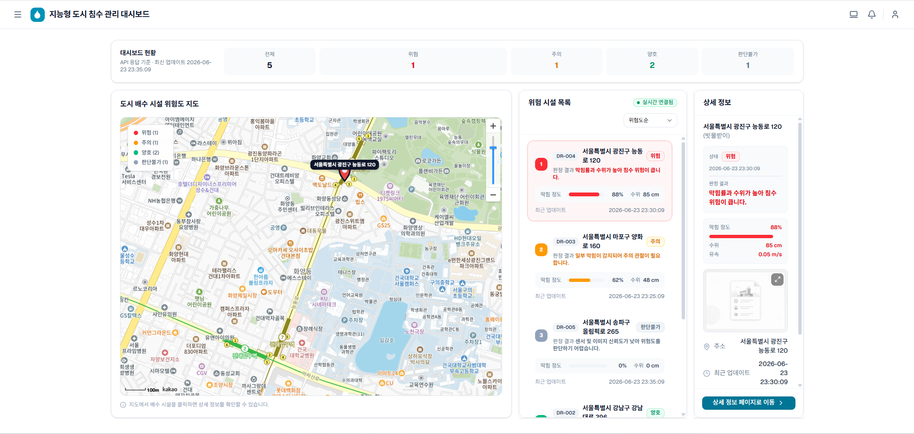
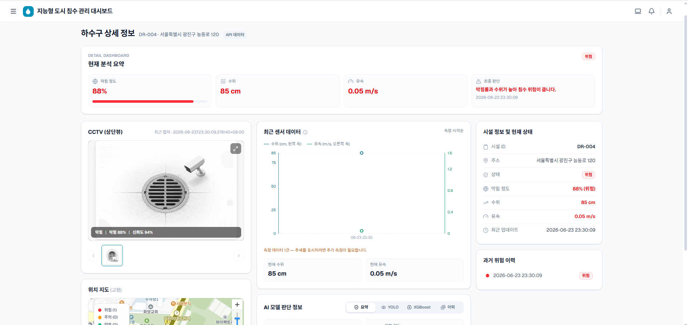
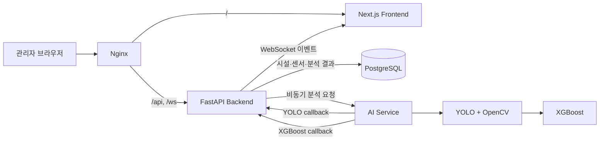

<div align="center">

# SmartDrain

### 이미지·센서 기반 빗물받이 위험 관제 시스템

[](#프로젝트-상태)
[](#프로젝트-상태)
[](#기술-스택)
[](#기술-스택)
[](#기술-스택)
[](#실행-방법)

**SmartDrain**은 빗물받이 이미지와 수위·유속 데이터를 결합해 시설의 위험 상태를 분석하고,  
관리자가 지도 기반 대시보드에서 전체 현황과 분석 이력을 확인할 수 있도록 구현한 통합 MVP입니다.

**MVP 개발 완료 · `main` 브랜치 병합 완료**

</div>

---

## 프로젝트 소개

도시의 빗물받이는 낙엽, 쓰레기, 토사 등으로 막힐 경우 배수 성능이 저하되고 침수 위험이 높아질 수 있습니다. 하지만 관리 대상 시설이 많으면 현장 점검만으로 모든 상태를 빠르게 비교하고 우선순위를 정하기 어렵습니다.

SmartDrain은 다음 데이터를 하나의 흐름으로 연결합니다.

1. 빗물받이 이미지
2. 수위·유속 센서값
3. YOLO·OpenCV 이미지 분석
4. XGBoost 위험 등급 분류
5. PostgreSQL 결과 저장
6. REST API·WebSocket 기반 대시보드 갱신

> 현재 MVP는 **시설별 샘플 이미지와 모의 센서 데이터**를 사용합니다. 실제 CCTV 스트림과 IoT 센서 연동은 운영 확장 범위입니다.

---

## 주요 화면

<table>
  <tr>
    <td width="50%" align="center">
      
      <br />
      <strong>메인 대시보드</strong><br />
      시설 위치, 상태별 통계, 위험 시설 우선순위
    </td>
    <td width="50%" align="center">
      
      <br />
      <strong>시설 상세 화면</strong><br />
      CCTV 이미지, 센서 추세, AI 결과, 위험 이력
    </td>
  </tr>
</table>

---

## 핵심 기능

### 지도 기반 통합 관제

- Kakao Map을 이용한 빗물받이 위치 표시
- `양호`, `주의`, `위험`, `판단불가` 상태별 마커 구분
- 위험 시설 우선 목록과 선택 시설 상세 패널 제공
- 전체·상태별 시설 통계 제공

### 시설 상세 모니터링

- 시설 위치와 기본 정보
- CCTV 스냅샷 및 촬영 시각
- 수위·유속 시계열 차트
- YOLO 막힘 분석 결과
- XGBoost 위험 등급과 판단 결과
- 과거 위험 이력 조회

### 비동기 AI 분석

- Backend가 `AnalysisJob`을 먼저 생성한 뒤 AI Service에 분석 요청
- AI Service가 YOLO/OpenCV와 XGBoost를 순차 실행
- YOLO 결과와 XGBoost 결과를 별도 callback으로 저장
- 중복 callback 멱등 처리
- 분석 상태를 `processing → yolo_completed → completed/failed`로 추적

### 실시간 상태 동기화

- WebSocket을 이용한 시설 상태·AI 결과 실시간 반영
- 연결 종료 시 자동 재연결
- 재연결 후 TanStack Query 캐시 재검증
- Zustand와 Query Cache를 함께 갱신해 화면 간 상태 동기화

### 운영 환경 구성

- Nginx를 이용한 `/`, `/api`, `/ws` same-origin 구성
- PostgreSQL health check 이후 Alembic migration 자동 실행
- Docker Compose 기반 개발·운영 환경 분리
- Jenkins 기반 정적 검사, AI 테스트, 배포, smoke test 파이프라인

---

## 시스템 아키텍처



### 분석 처리 흐름

```text
최신 센서 데이터 조회
        ↓
AnalysisJob 생성
        ↓
AI Service 분석 요청
        ↓
샘플 이미지 선택
        ↓
YOLO 객체 탐지 + OpenCV 막힘 영역 분석
        ↓
막힘률·신뢰도·수위·유속으로 XGBoost 추론
        ↓
Backend callback 및 PostgreSQL 저장
        ↓
시설 상태 갱신 + WebSocket broadcast
        ↓
메인·상세 화면 실시간 반영
```

---

## AI 분석 방식

### YOLO + OpenCV

YOLO는 빗물받이 영역과 이물질 객체를 검출하고, OpenCV는 HSV 색상 영역·CLAHE·형태학 연산으로 토사와 비정형 오염 영역을 보완합니다.

주요 출력값:

- `obstruction_ratio`: 막힘 비율
- `confidence_score`: 탐지 신뢰도
- `drain_box`, `debris_boxes`: 검출 영역
- `status`: 이미지 분석 상태

### XGBoost

YOLO/OpenCV 결과와 센서값을 다음 순서로 입력합니다.

1. `obstruction_ratio`
2. `confidence_score`
3. `water_level`
4. `flow_velocity`

최종 등급:

- `good`
- `caution`
- `danger`
- `unknown`

> API의 `risk_score`는 위험도의 절대 크기라기보다 **선택된 위험 등급에 대한 모델 확률**을 의미합니다.

### 모델 파일 정책

- XGBoost 모델 JSON은 저장소에서 추적합니다.
- YOLO `best.pt`는 용량과 배포 환경을 고려해 Git 외부에서 주입합니다.
- `SMARTDRAIN_YOLO_MODEL_PATH`가 유효한 파일을 가리키지 않으면 AI Service는 시작하지 않습니다.

---

## 기술 스택

| 영역        | 기술                                            |
| ----------- | ----------------------------------------------- |
| Frontend    | Next.js 16, React 19, TypeScript, Tailwind CSS  |
| 상태·데이터 | TanStack Query, Zustand, Axios                  |
| 지도·시각화 | Kakao Maps SDK, Recharts                        |
| Backend     | FastAPI, SQLAlchemy, Alembic, Pydantic          |
| Database    | PostgreSQL 16                                   |
| AI          | Ultralytics YOLO, OpenCV, XGBoost, scikit-learn |
| 실시간 통신 | WebSocket                                       |
| Infra       | Docker Compose, Nginx                           |
| CI/CD       | Jenkins                                         |

---

## 데이터 모델

| 테이블            | 역할                              |
| ----------------- | --------------------------------- |
| `drains`          | 시설 기본 정보와 현재 상태        |
| `sensor_data`     | 수위·유속 시계열 데이터           |
| `yolo_results`    | 이미지 분석 결과                  |
| `xgboost_results` | 최종 위험 등급과 판단 결과        |
| `analysis_jobs`   | 비동기 분석 작업 상태와 오류 추적 |

Alembic migration은 Compose의 `migrate` 서비스에서 자동 실행됩니다.

---

## 주요 API

| Method | Path                                     | 설명                         |
| ------ | ---------------------------------------- | ---------------------------- |
| `GET`  | `/api/drains`                            | 시설 목록 조회               |
| `GET`  | `/api/drains/{drain_id}`                 | 시설 상세 조회               |
| `GET`  | `/api/dashboard/summary`                 | 대시보드 상태 요약           |
| `GET`  | `/api/drains/{drain_id}/sensor-data`     | 센서 이력 조회               |
| `GET`  | `/api/drains/{drain_id}/analysis/latest` | 최신 통합 분석 결과          |
| `GET`  | `/api/drains/{drain_id}/risk-history`    | 위험 이력 조회               |
| `POST` | `/api/sensor-data`                       | 센서 데이터 저장             |
| `POST` | `/api/analysis/async-run`                | 비동기 AI 분석 시작          |
| `POST` | `/api/ai-callback/yolo-result`           | YOLO 결과 callback           |
| `POST` | `/api/ai-callback/xgboost-result`        | XGBoost 결과 callback        |
| `WS`   | `/ws/drains/status`                      | 시설·분석 상태 실시간 이벤트 |

개발 환경에서는 `http://localhost:8080/docs`에서 전체 Swagger 문서를 확인할 수 있습니다.

---

## 프로젝트 구조

```text
smartdrain/
├─ frontend/             # Next.js 관리자 대시보드
│  ├─ app/               # App Router 페이지
│  ├─ components/        # 지도·대시보드·상세 UI
│  ├─ lib/               # API, Query, WebSocket, adapter
│  └─ docs/              # Frontend 구현·테스트 기록
├─ backend/              # FastAPI Backend
│  ├─ app/models/        # SQLAlchemy 모델
│  ├─ app/routers/       # REST·Callback·WebSocket API
│  ├─ app/services/      # 분석·대시보드·스케줄러 로직
│  └─ alembic/           # DB migration
├─ ai_service/           # 비동기 AI 분석 서비스
│  ├─ yolo/              # YOLO/OpenCV 분석
│  ├─ xgboost/           # 특징 생성과 위험 등급 추론
│  ├─ analysis/          # 전체 분석 orchestration
│  └─ http/              # API와 Backend callback
├─ ai-vision/            # 모델 학습·PoC·실험 코드
├─ mock_data/            # 시설별 샘플 이미지
├─ nginx/                # Reverse proxy 설정
├─ docs/                 # 프로젝트 정의·요구사항·아키텍처
├─ .jenkins/             # Jenkins 검증·배포 스크립트
├─ docker-compose.yml
└─ docker-compose.dev.yml
```

---

## 실행 방법

### 사전 요구사항

- Docker Engine 또는 Docker Desktop
- Docker Compose v2
- Kakao Maps JavaScript 키
- YOLO `best.pt` 모델 파일

### 1. 환경변수 준비

```bash
cp .env.example .env
```

Windows PowerShell:

```powershell
Copy-Item .env.example .env
```

`.env`에서 최소 다음 값을 설정합니다.

```dotenv
POSTGRES_PASSWORD=change-your-password
COMPOSE_DATABASE_URL=postgresql+psycopg://smartdrain:change-your-password@db:5432/smartdrain_db
SMARTDRAIN_YOLO_MODEL_PATH=/absolute/path/to/best.pt
COMPOSE_FRONTEND_KAKAO_MAP_APP_KEY=your-kakao-javascript-key
```

> 실제 비밀번호와 API 키는 Git에 커밋하지 않습니다.

### 2. 개발 환경 실행

```bash
docker compose -f docker-compose.yml -f docker-compose.dev.yml up --build
```

| 대상      | 주소                                   |
| --------- | -------------------------------------- |
| 대시보드  | `http://localhost:8080`                |
| Swagger   | `http://localhost:8080/docs`           |
| REST API  | `http://localhost:8080/api/...`        |
| WebSocket | `ws://localhost:8080/ws/drains/status` |

### 3. 샘플 데이터 생성

서비스가 정상 기동된 뒤 최초 1회 실행합니다.

```bash
docker compose --profile seed run --rm seed
```

### 4. 운영 기준 실행

```bash
docker compose up --build -d
docker compose ps
```

운영 Compose에서는 Nginx만 외부 포트에 공개되며 Backend, AI Service, PostgreSQL은 내부 네트워크에서 통신합니다.

### 종료

```bash
docker compose down
```

DB volume까지 삭제하려면 다음 명령을 사용합니다.

```bash
docker compose down -v
```

---

## 환경변수

| 변수                                          | 설명                           | 기본값                       |
| --------------------------------------------- | ------------------------------ | ---------------------------- |
| `SMARTDRAIN_YOLO_MODEL_PATH`                  | 호스트의 YOLO 모델 절대 경로   | `./ai_service/model/best.pt` |
| `COMPOSE_FRONTEND_KAKAO_MAP_APP_KEY`          | Kakao Maps JavaScript 키       | 빈 값                        |
| `COMPOSE_FRONTEND_API_BASE_URL`               | Frontend API base URL          | 빈 값, same-origin           |
| `COMPOSE_DATABASE_URL`                        | Backend PostgreSQL 연결 문자열 | 로컬 기본값                  |
| `COMPOSE_AI_SERVER_ENABLED`                   | Backend의 AI 요청 활성화       | `true`                       |
| `COMPOSE_ANALYSIS_SCHEDULER_ENABLED`          | 자동 분석 scheduler 활성화     | `false`                      |
| `COMPOSE_ANALYSIS_SCHEDULER_INTERVAL_SECONDS` | 분석 대상 탐색 주기            | `300`                        |
| `COMPOSE_ANALYSIS_JOB_TIMEOUT_SECONDS`        | 분석 작업 timeout              | `600`                        |
| `COMPOSE_CORS_ORIGINS`                        | Backend 직접 호출 허용 origin  | localhost 목록               |

전체 설정은 [`.env.example`](.env.example)을 참고하세요.

---

## 테스트

### AI Service

```bash
python -m pytest ai_service
```

`main` 병합 기준 검증 결과:

```text
115 passed
```

### Frontend

```bash
cd frontend
pnpm install --frozen-lockfile
pnpm lint
pnpm exec tsc --noEmit
pnpm build
```

### Python 문법 검사

```bash
python -m compileall backend ai_service ai-vision mock_ai_server
```

### Compose 설정 검사

```bash
docker compose config --quiet
docker compose -f docker-compose.yml -f docker-compose.dev.yml config --quiet
```

> Backend 전용 pytest와 브라우저 기반 전체 E2E 테스트는 저장소에 별도 구성돼 있지 않으며, API·Docker smoke test와 수동 통합 테스트를 함께 사용했습니다.

---

## 배포와 CI/CD

Jenkins pipeline은 다음 순서로 동작합니다.

1. 환경변수 파일 주입
2. Compose·Nginx 설정 사전 검사
3. Frontend lint image build
4. AI Service test image 실행
5. 모델 파일 존재 여부 검사
6. Docker Compose 배포
7. 선택적 mock data seed
8. smoke test
9. 실패 시 로그 수집

Nginx는 다음 경로를 단일 origin으로 제공합니다.

```text
/       → Frontend
/api/*  → Backend REST API
/ws/*   → Backend WebSocket
```

---

## 프로젝트 상태

| 항목                       | 상태        |
| -------------------------- | ----------- |
| MVP 기능 개발              | 완료        |
| `main` 브랜치 병합         | 완료        |
| 메인·상세 화면             | 완료        |
| REST API·DB migration      | 완료        |
| 비동기 AI callback         | 완료        |
| WebSocket 실시간 반영      | 완료        |
| Docker·Nginx 환경          | 완료        |
| Jenkins 검증·배포 pipeline | 완료        |
| 실제 CCTV·IoT 연동         | MVP 범위 외 |
| 운영 사용자 인증·권한      | MVP 범위 외 |

### MVP 데이터 범위

현재 구현은 프로젝트 시연과 통합 흐름 검증을 위해 다음 데이터를 사용합니다.

- 시설별 고정 샘플 이미지
- 모의 수위·유속 센서 데이터
- 저장소에 포함된 XGBoost 모델
- 외부에서 주입하는 YOLO 모델

실제 운영으로 확장할 경우 CCTV/RTSP, IoT/MQTT, 사용자 인증, 서비스 간 callback 인증, 영속 작업 큐와 현장 데이터 기반 모델 검증이 추가로 필요합니다.

---

## 주요 문서

| 문서                                                                              | 내용                      |
| --------------------------------------------------------------------------------- | ------------------------- |
| [프로젝트 정의](docs/01_프로젝트정의서.md)                                        | 프로젝트 배경과 목표      |
| [요구사항 정의서](docs/03_요구사항정의서.md)                                      | 기능·비기능 요구사항      |
| [MVP 범위](docs/04_MVP범위.md)                                                    | 구현 범위와 제외 범위     |
| [시스템 아키텍처](docs/06_시스템아키텍처.md)                                      | 시스템 구성과 데이터 흐름 |
| [ERD](docs/07_ERD.md)                                                             | 데이터 모델과 관계        |
| [YOLO·XGBoost PoC](docs/09_YOLO_XGBoost_PoC.md)                                   | AI 분석 설계와 실험       |
| [API 명세](docs/11_API명세서.md)                                                  | Frontend·Backend API 계약 |
| [개발·운영 배포 가이드](frontend/docs/deployment/development-production-guide.md) | 실행·배포·환경변수 가이드 |

---

## 생성형 AI 활용 고지

코드 작성, Docker·Nginx 설정, 테스트 보조와 문서 정리에 생성형 AI 도구를 활용했습니다. 모든 결과물은 팀원이 요구사항과 실제 실행 결과를 검토한 후 반영했습니다.

비밀정보, 배포 권한, 인프라 비용, 운영 장애 대응은 생성형 AI의 제안만으로 결정하지 않습니다.

---

<div align="center">

**SmartDrain의 핵심 성과는 이미지 분석, 센서 데이터, 비동기 AI 처리, DB 저장과 실시간 대시보드를 하나의 추적 가능한 흐름으로 연결한 것입니다.**

</div>
