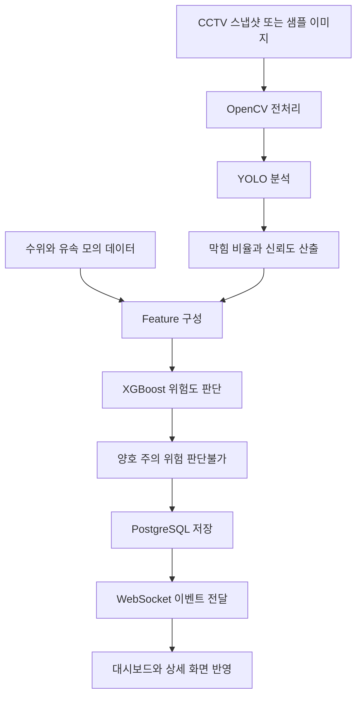

# 지능형 도시 침수 관리 시스템 요구사항 정의서

## 1. 문서 개요

| 항목 | 내용 |
|---|---|
| 문서명 | 지능형 도시 침수 관리 시스템 요구사항 정의서 |
| 프로젝트명 | 지능형 도시 침수 관리 및 모니터링 시스템 |
| 버전 | v0.3 |
| 작성일 | 2026-06-17 |
| 작성 기준 | 프로젝트 정의서, MVP 범위, 와이어프레임, ERD 기준 |
| 문서 상태 | MVP 개발 기준 |
| 주요 사용자 | 관리자, 배수 시설 관리자, 시스템 운영자 |

---

## 2. 작성 목적

본 문서는 지능형 도시 침수 관리 시스템의 기획 내용을 개발 가능한 요구사항 단위로 정리하기 위해 작성한다.

본 시스템은 침수 위험 지역 내 개별 빗물받이를 대상으로 CCTV 스냅샷 이미지 또는 샘플 이미지와 수위·유속 모의 센서 데이터를 수집하고, OpenCV, YOLO, XGBoost를 활용하여 최종 위험도를 판단한다. 관리자는 지도 기반 대시보드와 상세 화면에서 빗물받이별 상태를 확인한다.

---

## 3. 프로젝트 목표 요약

```text
CCTV 스냅샷 이미지 또는 샘플 이미지
→ OpenCV 전처리
→ YOLO 기반 막힘 분석
→ 수위·유속 모의 센서 데이터 결합
→ XGBoost 기반 최종 위험도 판단
→ PostgreSQL 저장
→ WebSocket 기반 상태 갱신
→ 지도 대시보드 및 상세 화면 표시
```

최종 위험도는 다음 4단계로 분류한다.

| 화면 표시 | 내부 코드값 | 의미 |
|---|---|---|
| 양호 | `good` | 현재 침수 위험이 낮고 배수 상태가 안정적인 상태 |
| 주의 | `caution` | 일부 막힘, 수위 상승, 유속 저하 등 모니터링이 필요한 상태 |
| 위험 | `danger` | 침수 가능성이 높아 즉시 확인이 필요한 상태 |
| 판단불가 | `unknown` | 이미지 품질 저하, 센서 누락, 모델 신뢰도 부족 등으로 판단이 어려운 상태 |

---

## 4. 요구사항 범위

### 4.1 MVP 포함 범위

| 구분 | 포함 기능 |
|---|---|
| 데이터 수집 | CCTV 스냅샷 이미지 또는 샘플 이미지, 수위·유속 모의 데이터 수집 |
| 데이터 저장 | 빗물받이 정보, 센서 데이터, YOLO 분석 결과, XGBoost 판단 결과 저장 |
| 이미지 전처리 | OpenCV 기반 이미지 읽기, 리사이징, 노이즈 제거, ROI 추출 |
| 이미지 분석 | YOLO 기반 빗물받이 상태 분석, 막힘 비율 산출, confidence score 산출 |
| 위험도 판단 | YOLO 결과와 센서 데이터를 XGBoost에 입력하여 최종 위험도 산출 |
| 위험도 이력 | 위험 점수, 위험 등급, 판단 시각 저장 및 조회 |
| 실시간 갱신 | WebSocket 기반 위험도 변경 이벤트 전달 |
| 대시보드 | Kakao Maps API 기반 지도 마커, 위험도 색상, 위험 시설 목록 표시 |
| 상세 조회 | CCTV 이미지, 센서 데이터, YOLO 결과, XGBoost 결과, 차트 표시 |

### 4.2 고도화 범위

| 구분 | 기능 |
|---|---|
| 실제 CCTV 연동 | RTSP 기반 영상 수집 및 주기적 프레임 캡처 |
| 실제 센서 연동 | MQTT 기반 IoT 센서 데이터 수집 |
| 대응 요청 | 담당자 배정, 작업 상태 변경, 조치 이력 관리 |
| 작업자 화면 | 현장 작업자용 모바일 또는 웹 화면 |
| 외부 알림 | SMS, 이메일, 카카오 알림톡, 웹푸시 연동 |
| 모델 고도화 | 실제 침수 이력 기반 XGBoost 재학습, YOLO Fine-Tuning |
| LLM 요약 | 위험도 설명, 대응 우선순위 추천, 보고서 자동 생성 |
| 기상 데이터 | 강우량, 기상 특보, 지역별 날씨 API 연동 |

---

## 5. 사용자 정의

| 사용자 | 주요 기능 | MVP 적용 |
|---|---|---|
| 관리자 | 대시보드 조회, 위험도 확인, 상세 정보 확인 | 포함 |
| 배수 시설 관리자 | 위험도 이력 확인, 반복 위험 시설 파악 | 포함 |
| 시스템 운영자 | 데이터 저장 상태, 분석 결과, WebSocket 갱신 상태 점검 | 일부 포함 |
| 현장 작업자 | 대응 요청 확인, 작업 상태 변경 | 고도화 |

---

## 6. 기능 요구사항

### 6.1 데이터 수집 요구사항

| ID | 요구사항 | 우선순위 |
|---|---|---|
| REQ-DATA-001 | 시스템은 CCTV 스냅샷 이미지 URL 또는 샘플 이미지 경로를 수집할 수 있어야 한다. | MVP |
| REQ-DATA-002 | 시스템은 빗물받이별 수위와 유속 모의 데이터를 수집할 수 있어야 한다. | MVP |
| REQ-DATA-003 | 수집된 센서 데이터는 `sensor_data` 테이블에 저장되어야 한다. | MVP |
| REQ-DATA-004 | 이미지 경로와 촬영 시각은 YOLO 분석 결과와 함께 `yolo_result_data` 테이블에 저장되어야 한다. | MVP |
| REQ-DATA-005 | 데이터 누락 또는 품질 저하 시 `unknown` 판단에 활용할 수 있는 상태값을 기록해야 한다. | MVP |

### 6.2 AI 이미지 분석 요구사항

| ID | 요구사항 | 우선순위 |
|---|---|---|
| REQ-AI-001 | 시스템은 OpenCV를 활용해 분석용 이미지를 전처리해야 한다. | MVP |
| REQ-AI-002 | 시스템은 YOLO 기반으로 빗물받이 막힘 상태를 분석해야 한다. | MVP |
| REQ-AI-003 | YOLO 분석 결과로 막힘 비율을 산출해야 한다. | MVP |
| REQ-AI-004 | YOLO 분석 confidence score를 저장해야 한다. | MVP |
| REQ-AI-005 | 이미지 품질 또는 신뢰도가 기준에 미달할 경우 판단불가 처리에 활용해야 한다. | MVP |
| REQ-AI-006 | YOLO 분석 결과는 `yolo_result_data` 테이블에 저장되어야 한다. | MVP |

### 6.3 XGBoost 위험도 판단 요구사항

| ID | 요구사항 | 우선순위 |
|---|---|---|
| REQ-XGB-001 | 시스템은 YOLO 결과와 센서 데이터를 XGBoost 입력 Feature로 구성해야 한다. | MVP |
| REQ-XGB-002 | XGBoost 입력값은 `obstruction_ratio`, `confidence_score`, `water_level_cm`, `flow_velocity_mps`를 포함해야 한다. | MVP |
| REQ-XGB-003 | 시스템은 XGBoost 기반으로 `risk_score`와 `risk_level`을 산출해야 한다. | MVP |
| REQ-XGB-004 | XGBoost 판단 결과는 `xgboost_data` 테이블에 저장되어야 한다. | MVP |
| REQ-XGB-005 | XGBoost 판단은 최종 화면 표시 위험도 산출 기준으로 사용되어야 한다. | MVP |

### 6.4 위험도 표시 요구사항

| ID | 요구사항 | 우선순위 |
|---|---|---|
| REQ-RISK-001 | 시스템은 위험도를 양호, 주의, 위험, 판단불가로 분류해야 한다. | MVP |
| REQ-RISK-002 | 위험도 이력은 시간순으로 조회할 수 있어야 한다. | MVP |
| REQ-RISK-003 | 위험 상태 발생 시 관리자 화면에 즉시 반영되어야 한다. | MVP |
| REQ-RISK-004 | 지도 마커, 위험 시설 목록, 상세 화면은 동일한 위험도 기준을 사용해야 한다. | MVP |

### 6.5 대시보드 및 상세 화면 요구사항

| ID | 요구사항 | 우선순위 |
|---|---|---|
| REQ-UI-001 | 시스템은 Kakao Maps API 기반으로 빗물받이 위치를 지도에 표시해야 한다. | MVP |
| REQ-UI-002 | 지도 마커는 위험도에 따라 다른 색상으로 표시되어야 한다. | MVP |
| REQ-UI-003 | 위험 시설 목록은 위험도가 높은 항목을 우선 확인할 수 있도록 구성해야 한다. | MVP |
| REQ-UI-004 | 상세 화면은 CCTV 이미지, 센서 데이터, YOLO 결과, XGBoost 결과를 표시해야 한다. | MVP |
| REQ-UI-005 | 상세 화면은 위험도 변화 이력 또는 차트를 제공해야 한다. | MVP |

### 6.6 WebSocket 요구사항

| ID | 요구사항 | 우선순위 |
|---|---|---|
| REQ-WS-001 | 백엔드는 위험도 변경 이벤트를 WebSocket으로 전달해야 한다. | MVP |
| REQ-WS-002 | 프론트엔드는 WebSocket 이벤트를 수신해 지도 마커와 위험 시설 목록을 갱신해야 한다. | MVP |
| REQ-WS-003 | 상세 화면은 선택된 빗물받이의 최신 상태를 WebSocket 이벤트로 갱신해야 한다. | MVP |

---

## 7. 위험도 분류 기준

MVP의 최종 위험도는 XGBoost 출력값을 기준으로 판단한다. 아래 기준은 학습 데이터가 부족한 초기 단계에서 Feature 설계와 테스트 시나리오를 구성하기 위한 참고 기준이다.

| 위험도 | 판단 기준 예시 |
|---|---|
| 양호 | 막힘 비율 낮음, 수위 낮음, 유속 안정, confidence score 확보 |
| 주의 | 막힘 비율 증가, 수위 상승, 유속 저하, 센서 또는 이미지 일부 이상 징후 |
| 위험 | 막힘 비율 높음, 수위 높음, 유속 급감, 침수 가능성이 높은 조합 |
| 판단불가 | 이미지 누락, 센서 누락, confidence score 미달, 분석 실패 |

---

## 8. 데이터 요구사항

### 8.1 `drain_data`

```text
drain_id
drain_code
address
latitude
longitude
status
```

### 8.2 `sensor_data`

```text
measured_at
drain_id
water_level_cm
flow_velocity_mps
quality_status
```

### 8.3 `yolo_result_data`

```text
yolo_result_id
drain_id
captured_at
image_url
obstruction_ratio
confidence_score
yolo_status
```

### 8.4 `xgboost_data`

```text
xgboost_id
drain_id
sensor_measured_at
yolo_result_id
evaluated_at
risk_score
risk_level
final_decision
```

---

## 9. 주요 API 요구사항

| Method | Endpoint | 설명 |
|---|---|---|
| GET | `/api/drains` | 빗물받이 목록 및 지도 마커 데이터 조회 |
| GET | `/api/drains/{drain_id}` | 특정 빗물받이 상세 정보 조회 |
| GET | `/api/drains/{drain_id}/risk-history` | 위험도 이력 조회 |
| POST | `/api/sensor-data` | 수위·유속 데이터 저장 |
| POST | `/api/analysis/yolo` | YOLO 분석 결과 저장 |
| POST | `/api/analysis/xgboost` | XGBoost 위험도 판단 결과 저장 |
| GET | `/api/dashboard/summary` | 대시보드 요약 데이터 조회 |
| WS | `/ws/drains/status` | 위험도 상태 변경 이벤트 수신 |

고도화 단계에서는 대응 요청, 작업자 상태 관리, 외부 알림 API를 별도로 추가한다.

---

## 10. AI 처리 파이프라인



---

## 11. 비기능 요구사항

| 항목 | 요구사항 |
|---|---|
| 응답 성능 | 주요 조회 API는 시연 환경 기준 2초 이내 응답을 목표로 한다. |
| 데이터 정합성 | 센서 데이터, YOLO 결과, XGBoost 결과 간 참조 관계를 유지한다. |
| 모듈 분리 | 프론트엔드, 백엔드, AI 분석, DB 저장 로직을 분리한다. |
| 실시간성 | 위험도 변경 이벤트는 WebSocket으로 화면에 반영한다. |
| 확장성 | 실제 CCTV, 실제 센서, 외부 알림, 대응 요청 기능을 후속 확장할 수 있어야 한다. |
| 보안 | 운영 단계에서는 관리자 인증과 권한 관리를 추가한다. |
| 로그 | 데이터 수집, AI 분석, WebSocket 이벤트 처리 실패를 로그로 남길 수 있어야 한다. |

---

## 12. 향후 고도화 계획

| 구분 | 고도화 방향 |
|---|---|
| YOLO | 실제 빗물받이 이미지 확보, Fine-Tuning, 야간·우천 데이터 학습 |
| XGBoost | 실제 침수 이력과 조치 이력 기반 재학습 |
| 센서 | 실제 IoT 센서 MQTT 연동 |
| CCTV | RTSP 스트림 연동 및 주기적 프레임 캡처 |
| 대응 요청 | 담당자 배정, 작업 상태 변경, 조치 이력 관리 |
| 알림 | SMS, 이메일, 카카오 알림톡, 웹푸시 연동 |
| LLM | 위험도 설명 생성, 보고서 자동 생성 |

---

## 13. 변경 이력

| 버전 | 일자 | 변경 내용 |
|---|---|---|
| v0.1 | 2026-06-15 | 초기 요구사항 정의 |
| v0.2 | 2026-06-17 | OpenCV, YOLO, XGBoost 반영 |
| v0.3 | 2026-06-17 | 빗물받이 용어 통일, XGBoost 및 WebSocket MVP 반영, 대응 요청 고도화 이동 |
