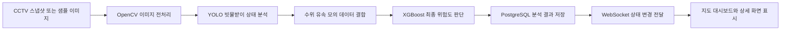

# 04_MVP 범위

## 1. MVP 정의

본 프로젝트의 MVP는 **CCTV 스냅샷 이미지 또는 샘플 이미지**와 **수위·유속 모의 센서 데이터**를 기반으로 침수 위험 지역 내 개별 빗물받이의 위험도를 분석하고, 관리자가 Kakao 지도 기반 대시보드에서 위험 상태를 실시간으로 확인할 수 있는 최소 기능 범위로 정의한다.

MVP의 핵심 목표는 관리자가 다음 정보를 빠르게 확인할 수 있도록 하는 것이다.

- 어느 빗물받이가 위험한지
- 왜 위험한지
- 최근 상태가 어떻게 변하고 있는지
- 지도와 상세 화면에서 동일한 위험도 기준이 적용되는지

---

## 2. MVP 핵심 흐름



텍스트 흐름은 다음과 같다.

```text
CCTV 스냅샷 이미지 또는 샘플 이미지
→ OpenCV 전처리
→ YOLO 분석
→ 수위·유속 모의 센서 데이터 결합
→ XGBoost 기반 최종 위험도 판단
→ PostgreSQL 저장
→ WebSocket 실시간 상태 전달
→ 지도 대시보드 및 상세 화면 표시
```

---

## 3. MVP 포함 기능

### 3.1 CCTV 스냅샷 처리

MVP에서는 프론트엔드 이미지 업로드 기능을 제공하지 않는다. 백엔드는 CCTV 스냅샷 이미지 URL 또는 저장된 샘플 이미지 경로를 기반으로 이미지를 조회한다.

#### 포함 범위

- 이미지 URL 또는 저장 경로 관리
- 백엔드에서 이미지 조회
- OpenCV 기반 이미지 읽기 및 전처리
- 전처리 이미지의 YOLO 분석 활용
- 상세 화면에서 분석에 사용된 최신 이미지 표시

---

### 3.2 센서 데이터 수집 및 조회

MVP에서는 실제 센서 장비 대신 모의 데이터를 활용한다. 빗물받이별 수위와 유속 데이터를 저장하고 조회할 수 있어야 하며, 해당 데이터는 XGBoost 최종 위험도 판단의 입력값으로 사용된다.

#### 포함 범위

- 빗물받이별 수위 데이터 저장
- 빗물받이별 유속 데이터 저장
- 최근 센서 데이터 조회
- 센서 데이터 이력 조회
- XGBoost 입력값으로 센서 데이터 활용
- 상세 화면에서 수위·유속 정보 표시

---

### 3.3 OpenCV 기반 이미지 전처리

YOLO 분석 품질을 높이기 위해 OpenCV로 이미지를 전처리한다.

#### 포함 범위

- 이미지 로드
- 리사이징
- 밝기 보정
- 노이즈 제거
- ROI 추출
- YOLO 입력 형식 변환

---

### 3.4 YOLO 기반 빗물받이 상태 분석

YOLO는 이미지에서 빗물받이와 이물질 상태를 분석하고, XGBoost 입력에 필요한 이미지 기반 Feature를 산출한다.

#### 포함 범위

- 이미지 기반 빗물받이 상태 분석
- 막힘 비율 산출
- confidence score 산출
- YOLO 판정 상태 저장
- 분석 결과를 XGBoost 입력값으로 전달

#### YOLO 실행 방식

| 방식 | 설명 | MVP 적용 판단 |
|---|---|---|
| 백엔드 직접 분석 | 백엔드 또는 AI 모듈에서 이미지 전처리 후 YOLO 분석 수행 | 구현 가능 시 적용 |
| 분석 결과 연동 | YOLO 결과를 별도 생성 후 백엔드가 저장하고 XGBoost 판단에 활용 | 안정적인 MVP 대안 |

MVP 문서에서는 구체적 실행 방식보다 **YOLO 결과가 XGBoost 최종 판단에 사용되는 구조**를 기준으로 정의한다.

---

### 3.5 XGBoost 기반 최종 위험도 판단

MVP에서 XGBoost는 필수 기능이다. XGBoost는 YOLO 분석 결과와 센서 데이터를 함께 입력받아 최종 위험도와 위험 점수를 산출한다.

#### 입력값

| 입력값 | 설명 |
|---|---|
| `obstruction_ratio` | YOLO 기반 막힘 비율 |
| `confidence_score` | YOLO 분석 신뢰도 |
| `water_level_cm` | 수위 값 |
| `flow_velocity_mps` | 유속 값 |

#### 출력값

| 출력값 | 설명 |
|---|---|
| `risk_score` | 위험 점수 |
| `risk_level` | `good / caution / danger / unknown` 중 하나 |
| `final_decision` | 화면 표시와 관리 판단에 사용할 최종 결과 |

---

### 3.6 위험도 분류

| 화면 표시 | 내부 코드값 | 표시 색상 | 의미 |
|---|---|---|---|
| 양호 | `good` | 초록색 | 현재 침수 위험이 낮고 배수 상태가 안정적인 상태 |
| 주의 | `caution` | 노란색 또는 주황색 | 수위 상승, 일부 막힘, 유속 저하 등 모니터링이 필요한 상태 |
| 위험 | `danger` | 빨간색 | 침수 가능성이 높아 즉시 확인이 필요한 상태 |
| 판단불가 | `unknown` | 회색 | 이미지 품질 저하, 센서 누락, 모델 신뢰도 부족 등으로 판단이 어려운 상태 |

위험도 결과는 지도 마커 색상, 위험 시설 목록, 상세 화면의 상태 정보, 위험도 변화 차트에 동일하게 반영된다.

---

### 3.7 지도 기반 대시보드

관리자는 Kakao Maps API 기반 대시보드에서 등록된 빗물받이 위치와 위험 상태를 확인한다.

#### 포함 범위

- Kakao Maps API 기반 지도 표시
- 빗물받이 위치 마커 표시
- 위험도별 마커 색상 구분
- 위험 시설 목록 표시
- 선택한 빗물받이 요약 정보 표시
- 상세 정보 화면으로 이동

---

### 3.8 빗물받이 상세 정보 화면

상세 화면에서는 선택한 빗물받이의 이미지, 센서 데이터, AI 분석 결과, 위험도 이력을 확인한다.

#### 포함 범위

- CCTV 스냅샷 또는 샘플 이미지 확인
- 빗물받이 시설 ID 및 주소 확인
- 현재 위험도 확인
- 수위·유속 데이터 확인
- YOLO 분석 결과 확인
- XGBoost 위험도 판단 결과 확인
- 최근 업데이트 시간 확인
- 위험도 변화 차트 확인

---

### 3.9 WebSocket 기반 상태 갱신

MVP에서는 WebSocket을 활용하여 위험도 변경 이벤트를 프론트엔드에 전달한다.

#### 포함 범위

- 위험도 변경 이벤트 전송
- 지도 마커 색상 갱신
- 위험 시설 목록 갱신
- 선택 빗물받이 요약 정보 갱신
- 상세 화면 상태 정보 갱신
- 화면 내 위험 표시 갱신

---

## 4. MVP 제외 및 고도화 기능

| 기능 | 설명 | 분류 |
|---|---|---|
| 대응 요청 | 점검 또는 청소 요청 생성, 담당자 배정, 작업 상태 관리 | 고도화 |
| 작업자 화면 | 현장 작업자가 요청을 확인하고 조치 상태를 변경하는 화면 | 고도화 |
| 실제 CCTV RTSP | 실제 CCTV 스트림 연결 및 주기적 프레임 캡처 | 고도화 |
| 실제 IoT 센서 MQTT | 실제 수위·유속 센서 장비 연동 | 고도화 |
| 외부 알림 | SMS, 이메일, 카카오 알림톡, 웹푸시 | 고도화 |
| 관리자 인증 및 권한 | 관리자, 운영자, 작업자 권한 분리 | 고도화 |
| LLM 기반 요약 | 위험도 설명, 대응 우선순위, 보고서 자동 생성 | 고도화 |
| 기상 데이터 API | 강우량, 기상 특보, 지역별 날씨 연동 | 고도화 |

---

## 5. MVP 기능 우선순위

| 우선순위 | 기능 | MVP 여부 |
|---|---|---|
| 1순위 | 빗물받이 목록 및 위치 조회 | 필수 |
| 1순위 | Kakao 지도 기반 마커 표시 | 필수 |
| 1순위 | 위험도별 마커 색상 표시 | 필수 |
| 1순위 | CCTV 스냅샷 또는 샘플 이미지 표시 | 필수 |
| 1순위 | 센서 데이터 표시 | 필수 |
| 1순위 | XGBoost 최종 위험도 등급 표시 | 필수 |
| 2순위 | OpenCV 이미지 전처리 | 필수 |
| 2순위 | YOLO 분석 결과 활용 | 필수 |
| 2순위 | XGBoost 최종 위험도 판단 | 필수 |
| 2순위 | 빗물받이 상세 정보 화면 | 필수 |
| 2순위 | 위험도 변화 차트 | 필수 |
| 3순위 | WebSocket 상태 갱신 | 필수 |
| 고도화 | 대응 요청 | 제외 |
| 고도화 | 작업자 화면 | 제외 |
| 고도화 | 실제 CCTV RTSP 연동 | 제외 |
| 고도화 | 실제 IoT 센서 MQTT 연동 | 제외 |

---

## 6. MVP 성공 기준

MVP 구현이 완료되면 관리자는 다음 기능을 수행할 수 있어야 한다.

- Kakao 지도에서 빗물받이 위치와 위험도를 확인할 수 있다.
- 위험도에 따라 지도 마커 색상이 구분되어 표시된다.
- 위험 시설 목록에서 우선 확인이 필요한 빗물받이를 확인할 수 있다.
- 특정 빗물받이를 선택하여 상세 정보를 확인할 수 있다.
- CCTV 스냅샷 이미지 또는 샘플 이미지와 센서 데이터를 확인할 수 있다.
- YOLO 분석 결과와 XGBoost 최종 위험도 판단 결과를 확인할 수 있다.
- 위험도 변화 이력을 차트로 확인할 수 있다.
- WebSocket을 통해 위험 상태 변경이 화면에 반영된다.

---

## 7. 정리

본 MVP의 핵심은 **AI 위험도 분석 결과를 관리자 화면에서 직관적으로 확인하는 것**이다. MVP 범위는 지도 기반 대시보드, 빗물받이 상세 정보, CCTV 스냅샷 또는 샘플 이미지, 센서 모의 데이터, YOLO 분석 결과, XGBoost 위험도 판단, WebSocket 상태 갱신을 중심으로 구성한다.

대응 요청, 작업자 화면, 실제 CCTV 및 실제 센서 연동, 외부 알림, LLM 요약은 MVP 이후 고도화 기능으로 분리한다.
