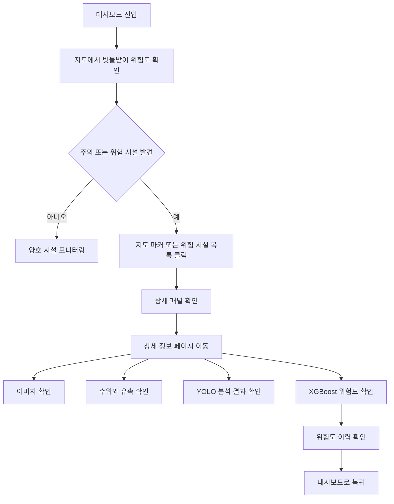
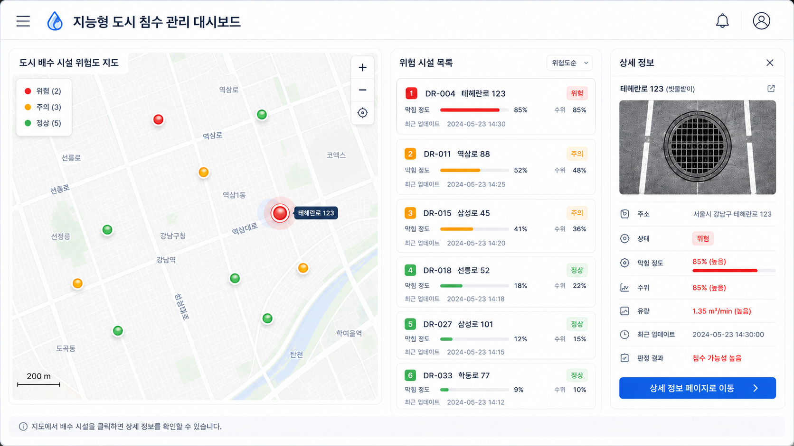
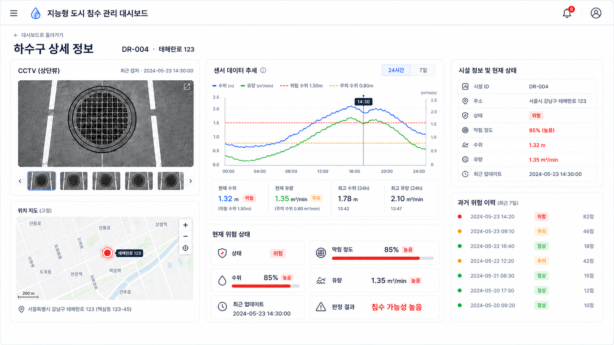
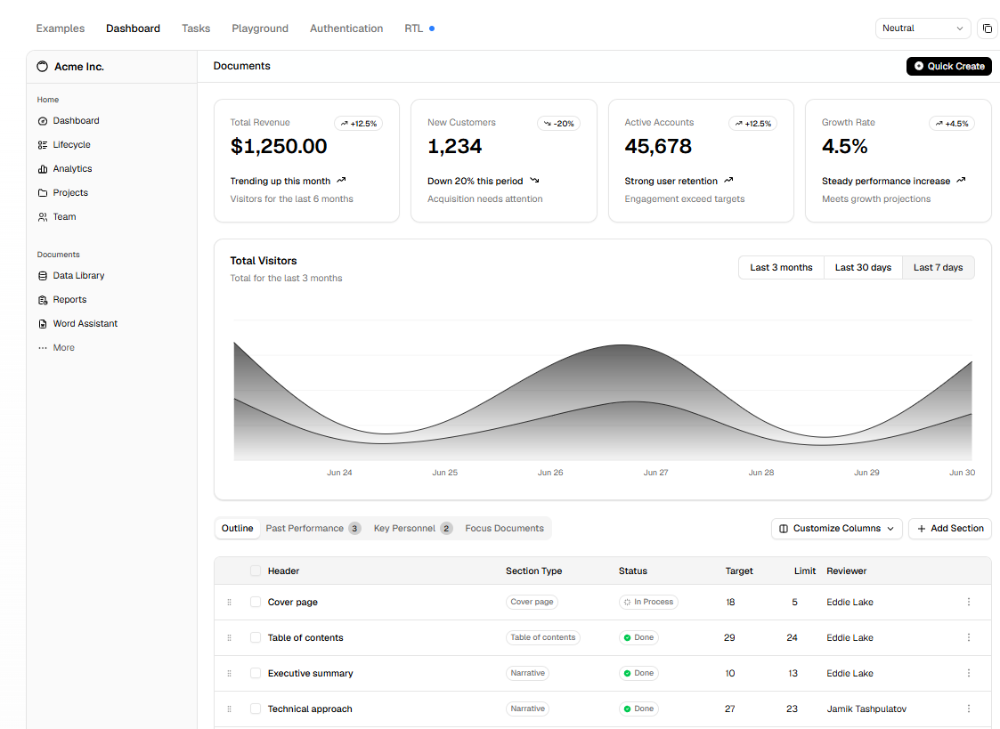
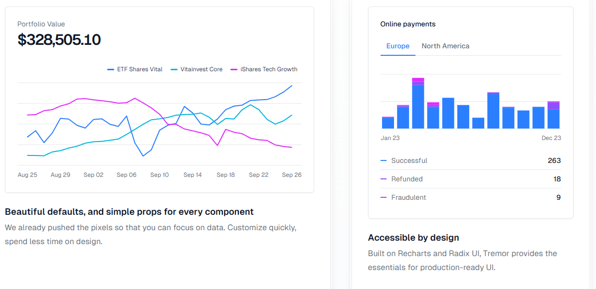
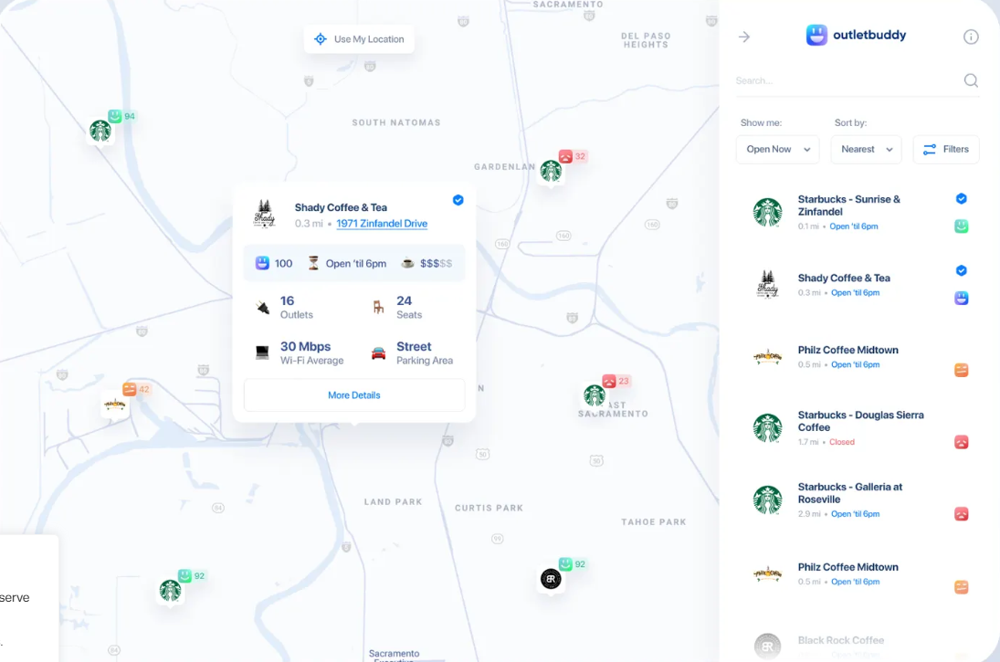

# 05_와이어프레임

## 1. 문서 개요

| 항목 | 내용 |
|---|---|
| 문서명 | 와이어프레임 |
| 프로젝트명 | 지능형 도시 침수 관리 및 모니터링 시스템 |
| 작성 목적 | 관리자가 어떤 화면에서 어떤 정보를 확인하고 어떤 행동을 하는지 정리한다. |
| 주요 사용자 | 지자체 관리자, 배수 시설 관리자, 시스템 운영자 |
| 작성 기준 | 프로젝트 정의서, MVP 범위, 요구사항 정의서, 디자인 참고 이미지 |
| 작성 상태 | MVP 개발 기준 |

본 문서는 지능형 도시 침수 관리 및 모니터링 시스템의 화면 구성을 정리하기 위한 문서이다. MVP의 핵심 화면은 `대시보드 화면`과 `빗물받이 상세 정보 화면`이다.

대시보드에서는 도시 배수 시설의 전체 위험도를 지도와 목록으로 확인한다. 상세 화면에서는 선택한 빗물받이의 이미지, 센서 데이터, YOLO 분석 결과, XGBoost 판단 결과를 확인한다.

---

## 2. 화면 설계 기준

| 설계 기준 | 설명 |
|---|---|
| 지도 중심 | 빗물받이 위치와 위험도를 지도 마커로 먼저 확인한다. |
| 상태 색상 명확화 | 양호, 주의, 위험, 판단불가 상태를 색상으로 구분한다. |
| 상세 정보 연결 | 지도 마커 또는 목록을 클릭하면 상세 정보를 확인할 수 있어야 한다. |
| WebSocket 갱신 | 위험도 변경 이벤트를 수신해 지도, 목록, 상세 화면을 갱신한다. |
| AI 판단 근거 표시 | YOLO 결과, 센서 데이터, XGBoost 판단 결과를 같은 화면에서 확인한다. |
| 확장 가능성 | 대응 요청, 작업자 화면, 운영 로그 화면은 고도화 기능으로 분리한다. |

---

## 3. 화면 목록

| 화면 ID | 화면명 | 설명 | MVP 여부 |
|---|---|---|---|
| SCR-001 | 대시보드 화면 | 지도 기반으로 빗물받이 위치와 위험도를 확인하는 메인 화면 | 필수 |
| SCR-002 | 빗물받이 상세 정보 화면 | 선택한 빗물받이의 이미지, 센서 정보, AI 분석 결과를 확인하는 화면 | 필수 |
| SCR-003 | 대응 요청 화면 | 위험 상태 빗물받이에 대해 점검 또는 청소 요청을 생성하는 화면 | 고도화 |
| SCR-004 | 작업자 요청 확인 화면 | 현장 작업자가 배정된 요청을 확인하는 화면 | 고도화 |
| SCR-005 | 시스템 운영 및 로그 화면 | 데이터 수집, AI 분석 실패, 시스템 상태를 확인하는 화면 | 고도화 |

---

## 4. 전체 화면 흐름

---

## 5. 공통 UI 정책

### 5.1 상단바

| 구성 요소 | 설명 |
|---|---|
| 메뉴 버튼 | 좌측 메뉴 또는 사이드바를 열 수 있는 버튼이다. |
| 서비스명 | `지능형 도시 침수 관리 대시보드`를 표시한다. |
| 상태 표시 영역 | 위험 상태 발생 여부와 WebSocket 연결 상태를 표시한다. |
| 사용자 아이콘 | 관리자 정보, 설정, 로그아웃 등으로 확장할 수 있다. |

### 5.2 위험도 색상 기준

| 화면 표시 | 내부 코드값 | 색상 | 의미 |
|---|---|---|---|
| 양호 | `good` | 초록색 | 현재 침수 위험이 낮고 배수 상태가 안정적인 상태 |
| 주의 | `caution` | 노란색 또는 주황색 | 수위 상승, 일부 막힘, 유속 저하 등 모니터링이 필요한 상태 |
| 위험 | `danger` | 빨간색 | 침수 가능성이 높아 즉시 확인이 필요한 상태 |
| 판단불가 | `unknown` | 회색 | 이미지 품질 저하, 센서 누락, 모델 신뢰도 부족 상태 |

### 5.3 데이터 갱신 표시

| 항목 | 표시 방식 |
|---|---|
| 최근 업데이트 시간 | 각 시설 카드와 상세 화면에 표시한다. |
| 실시간 데이터 | WebSocket 이벤트 수신 시 화면 상태를 갱신한다. |
| 데이터 지연 | 최근 업데이트 시간이 오래된 경우 강조 표시한다. |
| 데이터 없음 | 판단불가 또는 데이터 없음 메시지로 처리한다. |

---

## 6. SCR-001 대시보드 화면

### 6.1 화면 목적

대시보드는 관리자가 도시 배수 시설의 전체 상태를 가장 먼저 확인하는 화면이다. 지도에서 빗물받이 위치를 확인하고, 위험도에 따라 색상이 다른 마커를 볼 수 있다. 위험 시설 목록과 상세 패널을 함께 제공하여 우선 확인 대상에 빠르게 접근할 수 있도록 한다.

### 6.2 화면 구성

| 영역 | 구성 요소 | 설명 |
|---|---|---|
| 상단바 | 서비스명, WebSocket 상태, 사용자 메뉴 | 시스템 상태와 사용자 메뉴를 제공한다. |
| 지도 영역 | 빗물받이 마커, 위험도 범례, 확대/축소 | 빗물받이 위치와 위험도를 지도에 표시한다. |
| 위험 시설 목록 | 시설 ID, 주소, 막힘 정도, 수위, 위험도 | 주의 또는 위험 시설을 우선 확인할 수 있게 한다. |
| 상세 패널 | 이미지, 주소, 수위, 유속, YOLO 결과, XGBoost 결과 | 선택한 빗물받이의 요약 정보를 보여준다. |
| 안내 영역 | 기준 시간, 데이터 상태 | 사용자가 데이터 기준 시점을 이해할 수 있게 한다. |

### 6.3 표시 데이터

| 데이터 | 설명 | 비고 |
|---|---|---|
| 빗물받이 ID | 시설을 구분하는 고유 코드 | 예: DR-004 |
| 주소 | 설치 위치 주소 | 지도 및 상세 화면에서 사용 |
| 위도/경도 | 지도 마커 표시 위치 | Kakao Maps API 연동 |
| 위험도 상태 | 양호, 주의, 위험, 판단불가 | XGBoost 결과 기준 |
| 막힘 정도 | 이미지 분석 기반 막힘 비율 | YOLO 결과 기준 |
| 수위 | 최근 센서 수위 값 | XGBoost 입력값 |
| 유속 | 최근 흐름 데이터 | XGBoost 입력값 |
| 위험 점수 | XGBoost가 산출한 위험 점수 | 상세 화면과 차트에 사용 |
| 최근 업데이트 | 마지막 수집 또는 분석 시간 | 데이터 신뢰도 확인 |

### 6.4 사용자 동작

| 동작 | 결과 |
|---|---|
| 지도 마커 클릭 | 해당 빗물받이의 상세 패널을 표시한다. |
| 위험 시설 목록 클릭 | 해당 시설의 상세 패널 또는 상세 페이지로 이동한다. |
| 위험도 필터 선택 | 선택한 상태의 마커만 지도에 표시한다. |
| 상세 정보 버튼 클릭 | 빗물받이 상세 정보 화면으로 이동한다. |
| 새로고침 클릭 | 최신 API 데이터 기준으로 대시보드를 다시 조회한다. |

### 6.5 예외 처리

| 상황 | 표시 방식 |
|---|---|
| 지도 데이터 없음 | `등록된 배수 시설이 없습니다.` 메시지를 표시한다. |
| 위험도 데이터 없음 | 판단불가 또는 데이터 없음 상태로 표시한다. |
| 센서 데이터 지연 | 최근 업데이트 시간을 강조한다. |
| API 오류 | `대시보드 정보를 불러오지 못했습니다.` 메시지를 표시한다. |
| 이미지 없음 | 기본 이미지 또는 `최근 이미지가 없습니다.` 문구를 표시한다. |
| WebSocket 연결 끊김 | 연결 상태를 표시하고 API 기준 최신 데이터를 유지한다. |

---

## 7. SCR-002 빗물받이 상세 정보 화면

### 7.1 화면 목적

상세 정보 화면은 특정 빗물받이의 현재 상태를 자세히 확인하는 화면이다. 관리자는 이미지, 센서 데이터, YOLO 분석 결과, XGBoost 위험도 판단 결과를 함께 보고 위험 상태를 이해한다.

### 7.2 진입 경로

| 진입 위치 | 설명 |
|---|---|
| 대시보드 지도 마커 | 특정 빗물받이를 선택한다. |
| 대시보드 위험 시설 목록 | 주의 또는 위험 시설을 선택한다. |
| 상세 패널의 이동 버튼 | 더 자세한 정보를 보기 위해 상세 페이지로 이동한다. |

### 7.3 화면 구성

| 영역 | 구성 요소 | 설명 |
|---|---|---|
| 상단 영역 | 뒤로가기, 화면 제목, 시설 ID | 대시보드로 돌아갈 수 있다. |
| 이미지 영역 | 최근 CCTV 스냅샷 또는 샘플 이미지 | 빗물받이의 외관 상태를 확인한다. |
| 센서 차트 영역 | 수위, 유속 추세 | 시간대별 변화와 위험 징후를 확인한다. |
| YOLO 결과 영역 | 막힘 비율, confidence score, 이미지 기반 상태 | 이미지 분석 결과를 확인한다. |
| XGBoost 결과 영역 | 위험 점수, 위험도, 최종 판단 | 최종 위험도 판단 결과를 보여준다. |
| 시설 정보 영역 | 시설 ID, 주소, 최근 업데이트 | 시설 기본 정보를 표시한다. |
| 위험 이력 영역 | 최근 위험도 변화 이력 | 반복 위험 또는 상태 변화를 확인한다. |

### 7.4 표시 데이터

| 데이터 | 설명 | 비고 |
|---|---|---|
| 이미지 | 최근 수집 또는 샘플 이미지 | `yolo_result_data.image_url` 기준 |
| YOLO 분석 결과 | 막힘 비율, confidence score, yolo_status | 이미지 기반 분석 결과 |
| 수위 | 현재 수위 값 | 모의 센서 데이터 기준 |
| 유속 | 현재 유속 값 | 모의 센서 데이터 기준 |
| XGBoost 위험도 | 양호, 주의, 위험, 판단불가 | 최종 화면 표시 기준 |
| 위험 점수 | 종합 위험도 점수 | 차트 및 상세 카드에 사용 |
| 최종 판단 | 관리자 확인에 필요한 판단 코드 | `xgboost_data.final_decision` 기준 |
| 최근 업데이트 | 마지막 분석 시간 | 데이터 기준 시간 |

### 7.5 사용자 동작

| 동작 | 결과 |
|---|---|
| 뒤로가기 클릭 | 대시보드 화면으로 이동한다. |
| 새로고침 클릭 | 해당 빗물받이의 최신 정보를 다시 조회한다. |
| 이미지 확대 클릭 | 이미지를 크게 확인한다. |
| 이력 보기 클릭 | 위험도 변화 그래프 또는 분석 이력을 확인한다. |

### 7.6 예외 처리

| 상황 | 표시 방식 |
|---|---|
| 이미지 없음 | `최근 이미지가 없습니다.` 문구를 표시한다. |
| 분석 결과 없음 | `아직 분석 결과가 없습니다.` 문구를 표시한다. |
| 센서 데이터 없음 | `센서 데이터 미수신` 상태로 표시한다. |
| 판단불가 상태 | 재수집 필요 또는 수동 확인 필요 안내를 표시한다. |
| 상세 API 오류 | `상세 정보를 불러오지 못했습니다.` 문구를 표시한다. |

---

## 8. 고도화 화면

### 8.1 대응 요청 화면

대응 요청 화면은 위험 상태로 판단된 빗물받이에 대해 현장 점검 또는 청소 요청을 생성하는 기능이다. MVP에서는 제외하고 고도화 화면으로 분리한다.

| 영역 | 구성 요소 | 설명 |
|---|---|---|
| 빗물받이 정보 | 시설 ID, 주소, 위험도 | 요청 대상 정보를 표시한다. |
| 위험 정보 | 막힘 정도, 수위, 유속, XGBoost 판단 결과 | 요청이 필요한 이유를 보여준다. |
| 담당자 정보 | 이름, 연락처, 담당 지역 | 지역 담당자를 확인한다. |
| 요청 입력 | 요청 유형, 요청 메모 | 관리자가 요청 내용을 입력한다. |
| 버튼 영역 | 요청 생성, 취소 | 요청 생성 또는 이전 화면 복귀를 처리한다. |

### 8.2 작업자 요청 확인 화면

작업자가 배정된 대응 요청을 확인하고 작업 상태를 변경하는 화면은 고도화 범위로 둔다.

### 8.3 시스템 운영 및 로그 화면

데이터 수집 실패, AI 분석 실패, WebSocket 이벤트 처리 실패 등을 확인하는 운영 화면은 고도화 범위로 둔다.

---

## 9. 디자인 참고 방향

### 9.1 메인 화면 참고

- 지도는 화면의 가장 큰 영역으로 배치한다.
- 위험도는 초록, 노랑 또는 주황, 빨강, 회색으로 명확히 구분한다.
- 우측에는 위험 시설 목록과 선택 시설 상세 정보를 배치한다.
- 발표 시 설명하기 쉬운 구조를 우선한다.

### 9.2 상세 화면 참고

- 좌측에는 이미지와 위치 정보를 배치한다.
- 중앙에는 센서 데이터 추세 차트를 배치한다.
- 우측에는 시설 정보, YOLO 결과, XGBoost 결과를 배치한다.
- 위험 상태, 막힘 정도, 수위, 유속은 카드 형태로 구분한다.

### 9.3 v0 디자인 참고

- 흰색 배경, 얇은 테두리, 카드형 컴포넌트를 사용한다.
- 차트는 복잡한 색상보다 읽기 쉬운 구성을 우선한다.
- 상태 색상은 서비스 의미가 있으므로 양호, 주의, 위험, 판단불가 색상만 명확하게 유지한다.

---

## 10. MVP와 고도화 구분

| 구분 | 화면 | 처리 방향 |
|---|---|---|
| MVP | 대시보드 화면 | 지도, 목록, 상태 표시, WebSocket 갱신을 포함한다. |
| MVP | 빗물받이 상세 정보 화면 | 이미지, 센서 데이터, YOLO 결과, XGBoost 결과를 포함한다. |
| 고도화 | 대응 요청 화면 | 담당자 배정과 요청 상태 관리는 후속 범위로 둔다. |
| 고도화 | 작업자 요청 확인 화면 | 작업자용 화면은 후속 확장으로 분리한다. |
| 고도화 | 시스템 운영 및 로그 화면 | 운영 모니터링은 발표 후 확장 방향으로 제시한다. |
