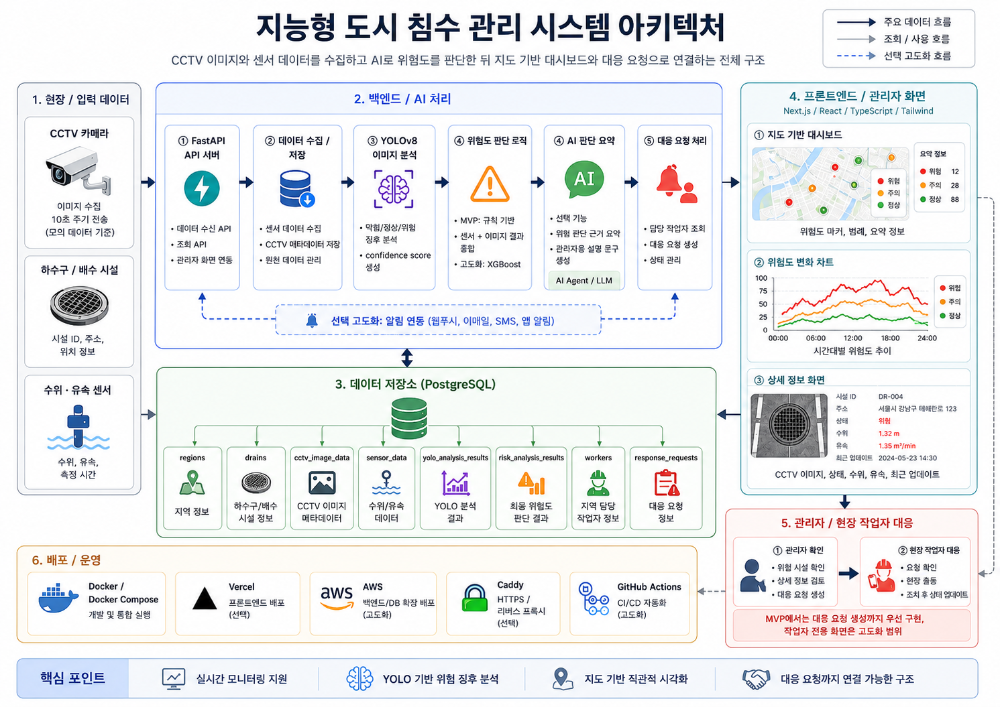
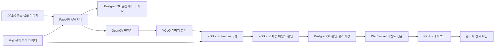
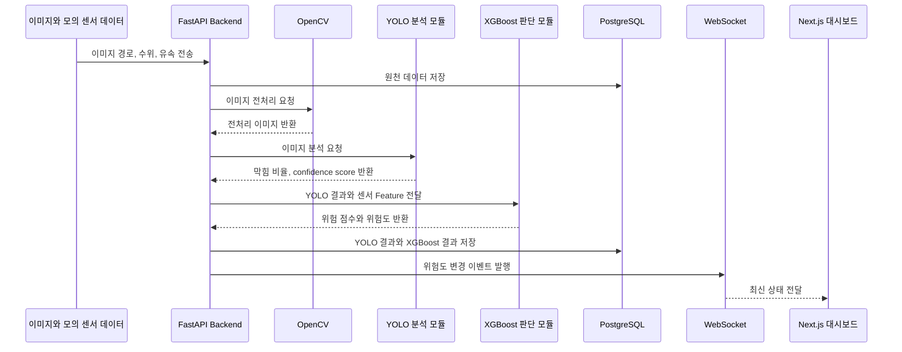
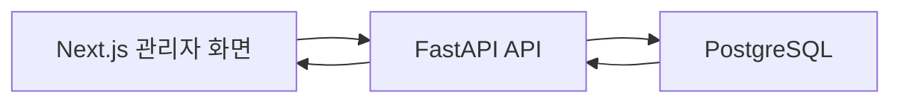
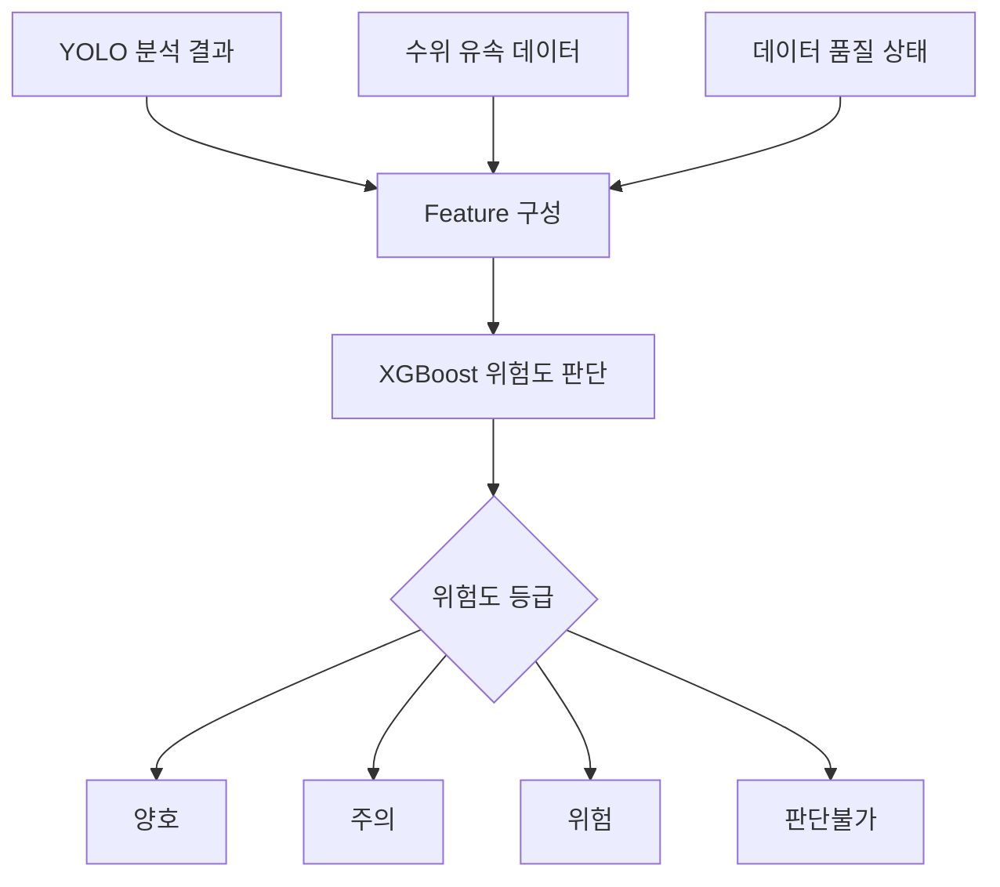

# 06_시스템 아키텍처

## 1. 문서 개요

| 항목 | 내용 |
|---|---|
| 문서명 | 시스템 아키텍처 |
| 프로젝트명 | 지능형 도시 침수 관리 및 모니터링 시스템 |
| 작성 목적 | 이미지와 센서 데이터를 기반으로 침수 위험도를 판단하고 관리자 화면에 표시하는 전체 시스템 구조를 정리한다. |
| 작성 기준 | MVP 범위, 요구사항 정의서, 와이어프레임, ERD 기준 |
| 주요 사용자 | 관리자, 배수 시설 관리자, 시스템 운영자 |
| 적용 범위 | 데이터 수집, AI 분석, XGBoost 위험도 판단, DB 저장, WebSocket 갱신, 대시보드 조회 |

본 문서는 시스템이 어떤 구성 요소로 이루어지고 각 구성 요소가 어떤 데이터를 주고받는지 설명한다. MVP에서는 실제 CCTV RTSP와 실제 IoT 센서를 직접 연동하지 않고, 샘플 이미지와 모의 센서 데이터를 활용한다.

---

## 2. 전체 아키텍처 이미지

아래 이미지는 발표 자료에 포함할 수 있는 전체 시스템 아키텍처 참고 이미지이다.



---

## 3. 시스템 구성 요약

```text
현장 입력 데이터
→ 백엔드 및 AI 처리
→ 데이터 저장소
→ WebSocket 상태 전달
→ 프론트엔드 관리자 화면
```

| 영역 | 주요 구성 | 역할 |
|---|---|---|
| 현장 입력 데이터 | CCTV 스냅샷 또는 샘플 이미지, 수위·유속 모의 데이터, 빗물받이 시설 정보 | 분석에 필요한 이미지와 센서 Feature를 제공한다. |
| 백엔드 및 AI 처리 | FastAPI, OpenCV, YOLO, XGBoost | 데이터를 수신하고 이미지 분석 및 최종 위험도 판단을 수행한다. |
| 데이터 저장소 | PostgreSQL | 빗물받이, 센서 데이터, YOLO 결과, XGBoost 결과를 저장한다. |
| 실시간 전달 | WebSocket | 위험도 변경 이벤트를 관리자 화면에 전달한다. |
| 프론트엔드 | Next.js, React, TypeScript, Kakao Maps API | 지도 대시보드, 위험 시설 목록, 상세 화면을 제공한다. |
| 고도화 영역 | 실제 CCTV RTSP, 실제 IoT 센서 MQTT, 대응 요청, 외부 알림, LLM 요약 | MVP 이후 확장 기능으로 분리한다. |

---

## 4. MVP 기준 핵심 흐름



| 단계 | 설명 | MVP 구현 기준 |
|---|---|---|
| 1 | 스냅샷 이미지와 수위·유속 데이터를 준비한다. | 샘플 이미지와 모의 센서 데이터 사용 |
| 2 | FastAPI 서버가 입력 데이터를 수신한다. | REST API 기반 수신 |
| 3 | 이미지를 OpenCV로 전처리한다. | 리사이징, 노이즈 제거, ROI 추출 |
| 4 | YOLO가 이미지 기반 막힘 상태를 분석한다. | 막힘 비율과 confidence score 산출 |
| 5 | YOLO 결과와 센서 데이터를 XGBoost Feature로 구성한다. | `obstruction_ratio`, `confidence_score`, `water_level_cm`, `flow_velocity_mps` |
| 6 | XGBoost가 최종 위험도를 판단한다. | 양호, 주의, 위험, 판단불가 |
| 7 | 분석 결과를 PostgreSQL에 저장한다. | 4개 핵심 테이블 사용 |
| 8 | 위험도 변경 이벤트를 WebSocket으로 전달한다. | 지도, 목록, 상세 화면 갱신 |

---

## 5. 주요 데이터 흐름

### 5.1 데이터 수집 및 분석 흐름



### 5.2 화면 조회 흐름

프론트엔드는 DB에 직접 접근하지 않는다. 관리자 화면은 항상 FastAPI를 통해 데이터를 조회하고, FastAPI가 PostgreSQL에서 필요한 데이터를 가져온다.



| 조회 화면 | 호출 API 예시 | 조회 데이터 |
|---|---|---|
| 대시보드 | `GET /api/drains` | 빗물받이 위치, 위험도, 마커 데이터 |
| 대시보드 요약 | `GET /api/dashboard/summary` | 전체 시설 수, 양호 수, 주의 수, 위험 수, 판단불가 수 |
| 상세 정보 | `GET /api/drains/{drain_id}` | 시설 정보, 최신 센서 데이터, YOLO 결과, XGBoost 결과 |
| 위험도 이력 | `GET /api/drains/{drain_id}/risk-history` | 시간대별 위험도 변화 |
| 실시간 갱신 | `WS /ws/drains/status` | 위험도 변경 이벤트 |

---

## 6. 영역별 상세 구조

### 6.1 현장 입력 데이터

| 구성 요소 | 수집 데이터 | 설명 |
|---|---|---|
| CCTV 스냅샷 또는 샘플 이미지 | 이미지 경로, 촬영 시각, 빗물받이 ID | MVP에서는 샘플 이미지 또는 저장된 이미지 경로를 사용한다. |
| 빗물받이 시설 정보 | 시설 ID, 주소, 위도, 경도, 운영 상태 | 지도 마커와 상세 화면 조회에 사용한다. |
| 수위·유속 모의 데이터 | 수위, 유속, 측정 시간 | XGBoost 위험도 판단 입력값으로 사용한다. |

### 6.2 백엔드 및 AI 처리

| 모듈 | 역할 | 설명 |
|---|---|---|
| FastAPI API 서버 | API 제공 | 프론트엔드와 데이터 수집 모듈에서 호출하는 REST API를 제공한다. |
| 데이터 수집 및 저장 모듈 | 수집 데이터 처리 | 센서 데이터와 이미지 경로를 DB 저장 형식으로 정리한다. |
| OpenCV 전처리 | 이미지 전처리 | 이미지 읽기, 리사이징, 노이즈 제거, ROI 추출을 수행한다. |
| YOLO 이미지 분석 | 이미지 기반 상태 분석 | 막힘 비율과 confidence score를 반환한다. |
| XGBoost 판단 모듈 | 최종 위험도 산출 | YOLO 결과와 센서 데이터를 결합하여 위험 점수와 위험도를 산출한다. |
| WebSocket 모듈 | 상태 변경 전달 | 위험도 변경 이벤트를 프론트엔드로 전달한다. |

### 6.3 데이터 저장소

PostgreSQL은 MVP의 중심 저장소이다. 이미지는 DB에 직접 저장하지 않고 이미지 경로를 저장한다.

| 테이블 | 저장 내용 | 사용 화면 / 기능 |
|---|---|---|
| `drain_data` | 빗물받이 ID, 관리 코드, 주소, 위도, 경도, 운영 상태 | 지도 마커, 상세 정보 |
| `sensor_data` | 수위, 유속, 측정 시간, 데이터 품질 상태 | XGBoost 입력, 센서 차트 |
| `yolo_result_data` | 이미지 경로, 막힘 비율, confidence score, YOLO 상태 | 이미지 분석 결과 표시 |
| `xgboost_data` | 위험 점수, 위험도, 최종 판단, 판단 시각 | 대시보드, 상세 화면, 위험도 이력 |

### 6.4 프론트엔드 관리자 화면

| 화면 | 주요 표시 정보 | 설명 |
|---|---|---|
| 지도 기반 대시보드 | 위험도 마커, 범례, 요약 정보 | 전체 시설 상태를 한눈에 확인한다. |
| 위험 시설 목록 | 위험도순 시설 목록, 막힘 정도, 수위 | 우선 확인할 시설을 빠르게 찾는다. |
| 상세 정보 화면 | 이미지, 주소, 수위, 유속, YOLO 결과, XGBoost 결과 | 특정 빗물받이의 판단 정보를 확인한다. |
| 위험도 변화 차트 | 시간대별 수위, 유속, 위험도 점수 | 위험이 증가하는 흐름을 확인한다. |

---

## 7. 위험도 판단 구조

위험도 판단은 이미지 분석 결과와 센서 데이터를 함께 사용한다. MVP에서는 XGBoost를 최종 위험도 판단 모듈로 사용한다.



| 등급 | 기준 예시 | 화면 표시 |
|---|---|---|
| 양호 | 막힘 비율 낮음, 수위 낮음, 유속 안정 | 초록색 |
| 주의 | 수위 상승, 일부 막힘, confidence score 중간 | 노란색 또는 주황색 |
| 위험 | 수위 높음, 유속 저하, 막힘 정도 높음 | 빨간색 |
| 판단불가 | 이미지 품질 낮음, 센서 누락, 모델 신뢰도 낮음 | 회색 |

---

## 8. 실시간 상태 갱신 구조

WebSocket은 MVP 구성 요소이다. 백엔드는 XGBoost 판단 결과가 저장되거나 위험도 상태가 변경될 때 WebSocket 이벤트를 발행한다.

```json
{
  "type": "DRAIN_STATUS_UPDATED",
  "payload": {
    "drainId": "DR-004",
    "riskCode": "danger",
    "riskScore": 0.91,
    "waterHeight": 85,
    "flowVelocity": 0.05,
    "obstructionRatio": 0.88,
    "updatedAt": "2026-06-17T10:30:00"
  }
}
```

| 적용 위치 | 갱신 내용 |
|---|---|
| 지도 마커 | 위험도에 따른 색상 갱신 |
| 위험 시설 목록 | 위험도와 정렬 상태 갱신 |
| 상세 화면 | 선택된 빗물받이의 최신 상태 갱신 |
| 요약 카드 | 양호, 주의, 위험, 판단불가 개수 갱신 |

---

## 9. 배포 및 운영 구조

| 구분 | 기술 | 적용 기준 |
|---|---|---|
| MVP | Docker / Docker Compose | 백엔드와 PostgreSQL 개발 환경을 통합 실행한다. |
| MVP 후보 | Vercel | Next.js 프론트엔드 배포에 사용할 수 있다. |
| MVP 후보 | Render 또는 Railway | FastAPI 백엔드 배포 후보로 검토한다. |
| 고도화 | AWS | 백엔드, DB, 파일 저장소 등을 클라우드로 확장할 때 사용한다. |
| 고도화 | GitHub Actions | 테스트, 빌드, 배포 자동화를 구성할 때 사용한다. |
| 고도화 | Caddy | HTTPS와 리버스 프록시가 필요할 경우 사용한다. |

MVP 발표에서는 실제 구현 범위와 고도화 범위를 구분해서 설명한다.

---

## 10. MVP와 고도화 범위 구분

| 구분 | MVP | 고도화 |
|---|---|---|
| 데이터 수집 | 샘플 이미지, 수위·유속 모의 데이터 | 실제 CCTV RTSP, 실제 IoT 센서 MQTT |
| 이미지 분석 | OpenCV 전처리, YOLO 분석 | 데이터 증강, 모델 재학습, 성능 개선 |
| 위험도 판단 | XGBoost 기반 최종 위험도 판단 | 실제 침수 이력 기반 재학습 |
| 실시간 처리 | WebSocket 상태 갱신 | 외부 알림 및 운영 이벤트 확장 |
| 화면 | 대시보드, 상세 정보 | 작업자 전용 화면, 운영 로그 화면 |
| 대응 프로세스 | 화면 내 위험 확인 | 대응 요청, 담당자 배정, 작업 이력 관리 |
| 배포 | 로컬 또는 MVP용 배포 | AWS, CI/CD, HTTPS 운영 구성 |

---

## 11. 아키텍처 설계 시 주의사항

| 항목 | 주의할 점 |
|---|---|
| 프론트엔드와 DB 연결 | 프론트엔드는 DB에 직접 접근하지 않고 FastAPI를 통해 조회한다. |
| 이미지 저장 방식 | 이미지 원본은 DB에 직접 저장하지 않고 경로와 분석 메타데이터를 저장한다. |
| 위험도 판단 | YOLO 결과만으로 판단하지 않고 수위·유속 데이터를 XGBoost에 함께 입력한다. |
| 테이블 구조 | MVP에서는 `drain_data`, `sensor_data`, `yolo_result_data`, `xgboost_data`를 기준으로 설계한다. |
| 고도화 기능 | 실제 CCTV, 실제 센서, 대응 요청, 외부 알림, LLM 요약은 MVP와 분리해서 설명한다. |
| 발표 설명 | 현재 구현 범위와 확장 가능 범위를 구분해서 말해야 한다. |

---

## 12. 발표 시 설명 흐름

```text
1. 침수 위험 지역의 빗물받이 이미지와 수위·유속 데이터가 입력됩니다.
2. FastAPI 서버가 데이터를 수신하고 PostgreSQL에 저장합니다.
3. 이미지는 OpenCV 전처리 후 YOLO로 분석합니다.
4. YOLO 결과와 센서 데이터를 XGBoost에 입력해 최종 위험도를 산출합니다.
5. 결과는 PostgreSQL에 저장되고 WebSocket으로 관리자 화면에 전달됩니다.
6. 관리자는 Next.js 대시보드에서 지도 마커, 위험 시설 목록, 상세 정보를 확인합니다.
7. 실제 CCTV, 실제 센서, 대응 요청, 외부 알림은 고도화 범위로 확장할 수 있습니다.
```

---

## 13. 정리

본 시스템 아키텍처는 이미지 분석 결과와 센서 데이터를 함께 활용해 개별 빗물받이의 침수 위험도를 판단하는 구조이다. MVP에서는 샘플 이미지, 모의 센서 데이터, OpenCV, YOLO, XGBoost, PostgreSQL, WebSocket, 지도 기반 대시보드를 핵심 구성으로 구현한다.

실제 CCTV RTSP 연동, 실제 IoT 센서 MQTT 연동, 대응 요청, 외부 알림, LLM 요약은 고도화 기능으로 분리한다.
