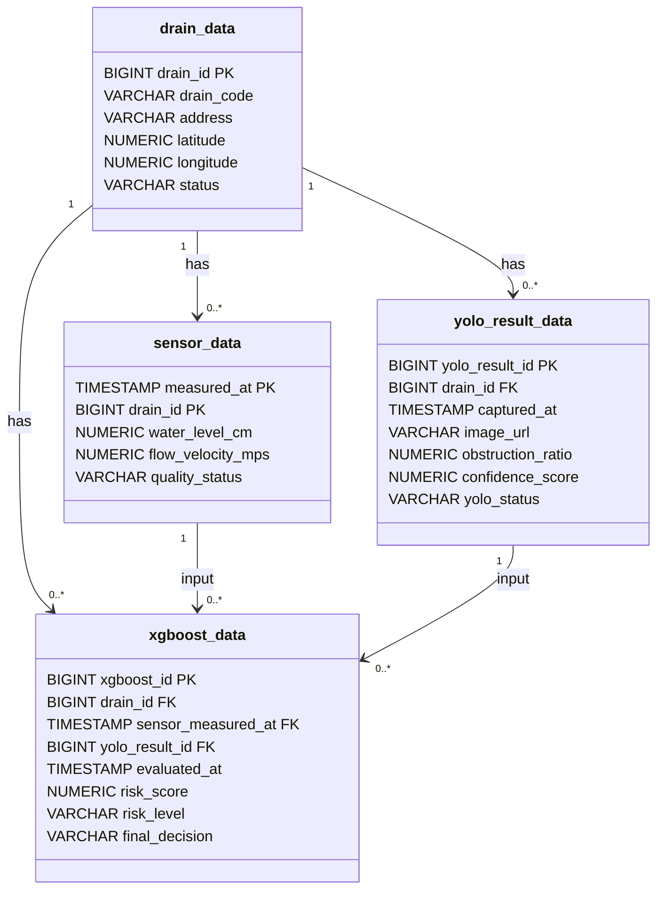

# 07_ERD 및 테이블 명세서

## 1. 개요

본 문서는 **빗물받이 침수 위험 분석 시스템**에서 사용하는 PostgreSQL 기반 데이터베이스 테이블 구조를 정의한다.

MVP에서는 빗물받이 기본 정보, 수위·유속 센서 데이터, YOLO 이미지 분석 결과, XGBoost 최종 위험도 판단 결과를 저장한다. CCTV 이미지 원본은 DB에 직접 저장하지 않고, `yolo_result_data.image_url`에 이미지 경로 또는 URL을 저장한다.

---

## 2. 데이터 모델링 기준

| 구분 | 설명 | 적용 내용 |
|---|---|---|
| 개념 모델링 | 주요 데이터 개체 정의 | 빗물받이, 센서 데이터, YOLO 결과, XGBoost 결과 |
| 논리 모델링 | 테이블, 컬럼, 관계 정의 | PK, FK, 1:N 관계, 복합키 설계 |
| 물리 모델링 | 실제 DBMS 기준 자료형 정의 | PostgreSQL 기준 자료형과 제약조건 적용 |
| 추적성 | 최종 판단 근거 추적 | 어떤 센서 데이터와 YOLO 결과가 XGBoost 판단에 사용되었는지 추적 |

---

## 3. 전체 테이블 구조

> 위 다이어그램은 MVP 기준 논리 모델이다. 대응 요청, 작업자, 외부 알림, 기상 데이터는 고도화 단계에서 별도 테이블로 확장한다.

---

## 4. 테이블 목록

| 테이블명 | 설명 | 데이터 성격 |
|---|---|---|
| `drain_data` | 빗물받이 기본 정보 관리 | 마스터 데이터 |
| `sensor_data` | 수위·유속 센서 측정값 저장 | 원천 시계열 데이터 |
| `yolo_result_data` | 이미지 기반 YOLO 분석 결과 저장 | 영상 분석 데이터 |
| `xgboost_data` | XGBoost 기반 최종 위험도 판단 결과 저장 | 최종 분석 결과 데이터 |

---

## 5. 테이블 상세 명세

### 5.1 `drain_data`

빗물받이의 기본 정보와 위치 정보를 저장하는 기준 테이블이다.

| 컬럼명 | 자료형 | 제약조건 | 설명 |
|---|---|---|---|
| `drain_id` | `BIGSERIAL` | PK, NOT NULL | 빗물받이 고유 ID |
| `drain_code` | `VARCHAR(50)` | UNIQUE, NOT NULL | 빗물받이 관리 코드 |
| `address` | `VARCHAR(255)` | NOT NULL | 설치 위치 주소 |
| `latitude` | `NUMERIC(10,7)` | NOT NULL | 위도 |
| `longitude` | `NUMERIC(10,7)` | NOT NULL | 경도 |
| `status` | `VARCHAR(20)` | NOT NULL, DEFAULT `'active'` | 운영 상태 |

#### 주요 용도

- 지도 마커 표시
- 상세 화면의 시설 정보 표시
- 센서 데이터, YOLO 결과, XGBoost 결과의 기준 데이터 역할

---

### 5.2 `sensor_data`

수위와 유속 데이터를 저장한다. MVP에서는 실제 장비 대신 모의 데이터를 활용할 수 있으며, 시계열 데이터 특성을 고려하여 `drain_id`와 `measured_at`을 복합키로 사용한다.

| 컬럼명 | 자료형 | 제약조건 | 설명 |
|---|---|---|---|
| `measured_at` | `TIMESTAMP` | PK, NOT NULL | 센서 측정 시각 |
| `drain_id` | `BIGINT` | PK, FK, NOT NULL | 측정 대상 빗물받이 ID |
| `water_level_cm` | `NUMERIC(8,2)` | NOT NULL | 수위 값, 단위 cm |
| `flow_velocity_mps` | `NUMERIC(8,3)` | NOT NULL | 유속 값, 단위 m/s |
| `quality_status` | `VARCHAR(20)` | NOT NULL, DEFAULT `'valid'` | 데이터 품질 상태 |

#### 권장 코드값

| 컬럼 | 코드값 | 설명 |
|---|---|---|
| `quality_status` | `valid` | 판단에 사용할 수 있는 데이터 |
| `quality_status` | `missing` | 수신되지 않은 데이터 |
| `quality_status` | `suspect` | 이상치 가능성이 있는 데이터 |

---

### 5.3 `yolo_result_data`

CCTV 스냅샷 이미지 또는 샘플 이미지에 대해 YOLO 모델이 분석한 결과를 저장한다. 이미지 원본은 DB에 직접 저장하지 않고 `image_url`에 경로를 저장한다.

| 컬럼명 | 자료형 | 제약조건 | 설명 |
|---|---|---|---|
| `yolo_result_id` | `BIGSERIAL` | PK, NOT NULL | YOLO 분석 결과 ID |
| `drain_id` | `BIGINT` | FK, NOT NULL | 분석 대상 빗물받이 ID |
| `captured_at` | `TIMESTAMP` | NOT NULL | 이미지 촬영 또는 샘플 기준 시각 |
| `image_url` | `VARCHAR(500)` | NOT NULL | 이미지 저장 경로 또는 URL |
| `obstruction_ratio` | `NUMERIC(5,4)` | NOT NULL | 막힘 비율, 0~1 범위 |
| `confidence_score` | `NUMERIC(5,4)` | NOT NULL | YOLO 분석 신뢰도, 0~1 범위 |
| `yolo_status` | `VARCHAR(20)` | NOT NULL | YOLO 판정 상태 |

#### 권장 코드값

| 컬럼 | 코드값 | 설명 |
|---|---|---|
| `yolo_status` | `good` | 이미지 기준 위험 징후가 낮음 |
| `yolo_status` | `caution` | 일부 막힘 또는 모니터링 필요 |
| `yolo_status` | `danger` | 이미지 기준 위험 징후가 높음 |
| `yolo_status` | `unknown` | 이미지 품질 저하 또는 분석 실패 |

---

### 5.4 `xgboost_data`

센서 데이터와 YOLO 분석 결과를 기반으로 XGBoost 모델이 산출한 최종 위험도 판단 결과를 저장한다.

| 컬럼명 | 자료형 | 제약조건 | 설명 |
|---|---|---|---|
| `xgboost_id` | `BIGSERIAL` | PK, NOT NULL | XGBoost 판단 결과 ID |
| `drain_id` | `BIGINT` | FK, NOT NULL | 판단 대상 빗물받이 ID |
| `sensor_measured_at` | `TIMESTAMP` | FK, NOT NULL | 판단에 사용된 센서 측정 시각 |
| `yolo_result_id` | `BIGINT` | FK, NOT NULL | 판단에 사용된 YOLO 결과 ID |
| `evaluated_at` | `TIMESTAMP` | NOT NULL | 위험도 판단 시각 |
| `risk_score` | `NUMERIC(5,4)` | NOT NULL | 위험 점수, 0~1 범위 |
| `risk_level` | `VARCHAR(20)` | NOT NULL | 최종 위험 등급 코드 |
| `final_decision` | `VARCHAR(30)` | NOT NULL | 관리자 화면에 표시할 최종 판단 코드 |

#### 권장 코드값

| 컬럼 | 코드값 | 설명 |
|---|---|---|
| `risk_level` | `good` | 양호 |
| `risk_level` | `caution` | 주의 |
| `risk_level` | `danger` | 위험 |
| `risk_level` | `unknown` | 판단불가 |
| `final_decision` | `monitor` | 지속 모니터링 |
| `final_decision` | `check_required` | 현장 확인 필요 |
| `final_decision` | `urgent_check` | 즉시 확인 필요 |
| `final_decision` | `review_required` | 데이터 재확인 필요 |

---

## 6. 테이블 관계 명세

| 관계 | 카디널리티 | 설명 |
|---|---|---|
| `drain_data` → `sensor_data` | 1:N | 하나의 빗물받이는 여러 개의 센서 측정 데이터를 가진다. |
| `drain_data` → `yolo_result_data` | 1:N | 하나의 빗물받이는 여러 개의 YOLO 분석 결과를 가진다. |
| `drain_data` → `xgboost_data` | 1:N | 하나의 빗물받이는 여러 개의 XGBoost 판단 결과를 가진다. |
| `sensor_data` → `xgboost_data` | 1:N | 센서 측정값은 XGBoost 판단 입력값으로 사용된다. |
| `yolo_result_data` → `xgboost_data` | 1:N | YOLO 분석 결과는 XGBoost 판단 입력값으로 사용된다. |

---

## 7. 인덱스 권장 사항

| 테이블 | 인덱스 | 목적 |
|---|---|---|
| `drain_data` | `drain_code` | 관리 코드 기준 조회 |
| `sensor_data` | `drain_id`, `measured_at DESC` | 특정 빗물받이의 최근 센서 데이터 조회 |
| `yolo_result_data` | `drain_id`, `captured_at DESC` | 특정 빗물받이의 최근 이미지 분석 결과 조회 |
| `xgboost_data` | `drain_id`, `evaluated_at DESC` | 위험도 이력 및 상세 화면 조회 |
| `xgboost_data` | `risk_level` | 위험 시설 목록 필터링 |

---

## 8. 고도화 확장 테이블

MVP에는 포함하지 않지만, 향후 다음 테이블을 추가할 수 있다.

| 후보 테이블 | 역할 | 분류 |
|---|---|---|
| `response_request_data` | 점검 또는 청소 요청 저장 | 고도화 |
| `worker_data` | 담당자 및 작업자 정보 저장 | 고도화 |
| `weather_data` | 강우량, 기상 특보 데이터 저장 | 고도화 |
| `notification_log_data` | 외부 알림 발송 이력 저장 | 고도화 |
| `operation_log_data` | 데이터 수집 및 분석 실패 로그 저장 | 고도화 |

---

## 9. 설계 의도

본 테이블 구조는 원천 데이터와 분석 결과 데이터를 분리하는 방향으로 설계하였다.

- `drain_data`는 지도와 상세 화면의 기준이 되는 빗물받이 정보를 저장한다.
- `sensor_data`는 수위·유속 측정값을 시계열 형태로 저장한다.
- `yolo_result_data`는 이미지 분석 결과와 이미지 경로를 저장한다.
- `xgboost_data`는 센서 데이터와 YOLO 결과를 조합한 최종 위험도 판단 결과를 저장한다.

이를 통해 어떤 센서값과 어떤 YOLO 결과를 기반으로 최종 위험도 판단이 이루어졌는지 추적할 수 있다. 또한 향후 대응 요청, 작업자 관리, 기상 데이터, 외부 알림 기능을 추가하기에도 적합하다.
