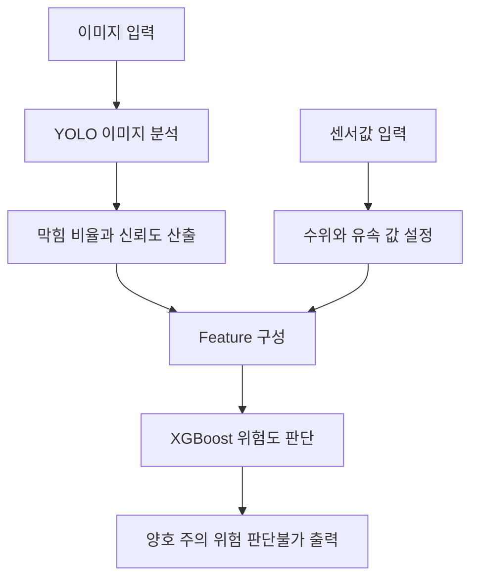

# 09_YOLO + XGBoost PoC 검증

## 1. 문서 개요

본 문서는 프로젝트에서 수행한 **YOLO + XGBoost 기반 PoC 검증 내용**을 정리한다.

PoC는 실제 운영 시스템이 아니라 가능성 검증 단계이다. 본 PoC는 이미지 분석 결과와 센서 데이터를 결합했을 때 최종 위험도 판단이 달라지는지 확인하는 것을 목적으로 한다.

---

## 2. PoC 추진 목적

본 PoC는 빗물받이 상태를 판단할 때 **이미지 분석 결과와 센서 데이터를 결합하는 방식이 유효한지 확인**하기 위해 진행하였다.

이미지만 사용할 경우 빗물받이의 외관 상태나 막힘 정도는 확인할 수 있지만, 실제 수위나 유속 변화까지 반영하기 어렵다. 반대로 센서값만 사용할 경우 현장의 시각적 막힘 상태를 직접 판단하기 어렵다.

따라서 본 PoC에서는 YOLO 기반 이미지 분석 결과와 수위·유속 값을 함께 사용하여, 두 데이터가 결합되었을 때 XGBoost의 최종 위험도 판단이 달라지는지 확인하였다.

---

## 3. PoC 구성 개요

| 구분 | 내용 |
|---|---|
| 이미지 분석 | YOLO 모델을 활용하여 빗물받이 이미지 상태 분석 |
| 학습 이미지 | GPT 생성 이미지와 샘플 이미지를 활용하여 YOLO 학습 또는 테스트 이미지 구성 |
| 센서 입력 | 실제 센서 대신 슬라이더 또는 임시 입력값으로 수위, 유속 값을 가상 입력 |
| 위험도 판단 | YOLO 분석 결과와 센서값을 XGBoost 모델에 함께 반영 |
| 결과 출력 | 양호 / 주의 / 위험 / 판단불가 형태로 최종 상태 확인 |

본 PoC는 실제 CCTV, 실제 센서, 운영 DB를 모두 연동한 완성형 구조가 아니다. 이미지 분석과 센서값 결합 방식의 가능성을 확인하기 위한 검증용 구조이다.

---

## 4. PoC 동작 흐름

PoC의 기본 흐름은 다음과 같다.

1. 빗물받이 이미지를 입력한다.
2. YOLO 모델이 이미지 기반 상태를 분석한다.
3. YOLO는 막힘 비율과 confidence score를 산출한다.
4. 슬라이더 또는 임시 입력값으로 수위와 유속을 입력한다.
5. 이미지 분석 결과와 센서값을 XGBoost 모델에 함께 전달한다.
6. 최종적으로 양호, 주의, 위험, 판단불가 중 하나의 상태를 출력한다.

---

## 5. XGBoost 입력 및 출력

### 5.1 입력 Feature

| 입력값 | 설명 |
|---|---|
| `obstruction_ratio` | YOLO가 산출한 막힘 비율 |
| `confidence_score` | YOLO 분석 신뢰도 |
| `water_level_cm` | 수위 값 |
| `flow_velocity_mps` | 유속 값 |

### 5.2 출력값

| 출력값 | 설명 |
|---|---|
| `risk_score` | XGBoost가 산출한 위험 점수 |
| `risk_level` | `good / caution / danger / unknown` 중 하나 |
| `final_decision` | 관리자 화면에 표시할 최종 판단 코드 |

---

## 6. PoC 검증 내용

### 6.1 이미지 차이에 따른 결과 변화

센서값이 동일하더라도 입력 이미지의 상태가 달라지면 최종 위험도 판단 결과가 달라지는 것을 확인하였다.

이는 YOLO가 분석한 이미지 기반 막힘 상태가 XGBoost의 최종 판단에 반영될 수 있음을 의미한다.

### 6.2 센서값 차이에 따른 결과 변화

동일한 이미지를 사용하더라도 수위와 유속 값이 달라지면 최종 판단 결과가 달라지는 것을 확인하였다.

이는 센서값이 단순 참고 정보가 아니라, 최종 위험도 판단에 직접적인 영향을 줄 수 있음을 의미한다.

### 6.3 결합 판단 가능성

이미지와 센서값을 함께 사용할 경우, 단일 데이터만 사용하는 방식보다 더 현실적인 위험도 판단 구조를 구성할 수 있음을 확인하였다.

---

## 7. PoC 결과 요약

| 검증 항목 | 확인 결과 |
|---|---|
| 이미지 영향성 | 센서값이 같더라도 이미지 상태에 따라 판단 결과가 달라짐 |
| 센서 영향성 | 같은 이미지라도 수위와 유속 값에 따라 판단 결과가 달라짐 |
| 결합 판단 가능성 | 이미지 분석 결과와 센서값을 함께 반영한 위험도 판단이 가능함 |
| 프로젝트 적용성 | MVP의 XGBoost 기반 최종 위험도 판단 구조에 적용 가능함 |
| 확장 가능성 | 향후 실제 CCTV 및 실제 센서 데이터 연동 구조로 확장 가능성이 있음 |

따라서 본 PoC는 영상 분석과 센서 데이터 결합을 통한 침수 위험 판단 구조가 프로젝트 방향과 부합한다는 점을 확인한 단계로 볼 수 있다.

---

## 8. PoC 한계

| 구분 | 한계 |
|---|---|
| 이미지 데이터 | 실제 현장 이미지가 아닌 GPT 생성 이미지와 샘플 이미지를 사용함 |
| 센서 데이터 | 실제 센서 장비가 아닌 슬라이더 또는 임시 입력값을 사용함 |
| 판단 기준 | 실제 운영 기준이 아닌 PoC 검증용 기준을 사용함 |
| 실시간성 | 실제 CCTV 스트림 및 실제 센서 수집 구조는 포함하지 않음 |
| 운영 연동 | 백엔드, DB, 프론트엔드와의 완전한 운영 연동은 별도 구현이 필요함 |
| 모델 신뢰도 | 실제 침수 이력과 충분한 현장 데이터 기반의 검증은 아직 부족함 |

현재 결과는 실제 서비스 성능을 보장하는 결과가 아니라, 기술 구조의 적용 가능성을 확인한 결과로 해석해야 한다.

---

## 9. 향후 개선 방향

| 구분 | 개선 방향 |
|---|---|
| 이미지 데이터 | 실제 빗물받이 이미지 및 CCTV 프레임 데이터 확보 |
| 센서 데이터 | 실제 수위, 유속 센서 데이터 또는 API 연동 |
| YOLO | 실제 현장 이미지 기반 Fine-Tuning 및 데이터 증강 |
| XGBoost | 실제 침수 이력과 조치 이력 기반 재학습 |
| 백엔드 연동 | 분석 요청, 결과 저장, WebSocket 이벤트 발행 API 구성 |
| 데이터베이스 | `sensor_data`, `yolo_result_data`, `xgboost_data` 저장 구조와 연결 |
| 프론트엔드 | 관리자 대시보드에서 위험도 및 판단 결과 표시 |
| 판단 기준 | 실제 사례 기반으로 양호 / 주의 / 위험 / 판단불가 기준 보정 |

---

## 10. 정리

본 PoC를 통해 YOLO 이미지 분석 결과와 수위·유속 센서 입력값을 결합한 XGBoost 위험도 판단 구조가 프로젝트 방향에 유효함을 확인하였다.

다만 현재 PoC는 실제 운영 시스템이 아니며, 실제 이미지 데이터, 실제 센서 데이터, 백엔드 및 프론트엔드 연동을 통해 추가 검증과 고도화가 필요하다. MVP에서는 이 PoC 구조를 바탕으로 YOLO 결과와 모의 센서 데이터를 XGBoost에 입력하여 최종 위험도를 산출하는 흐름을 구현한다.
