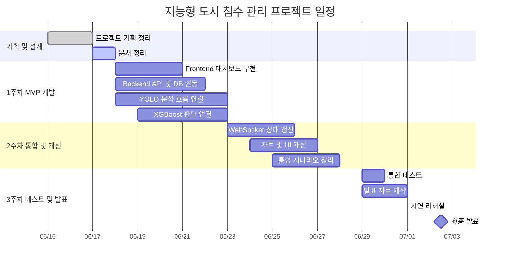
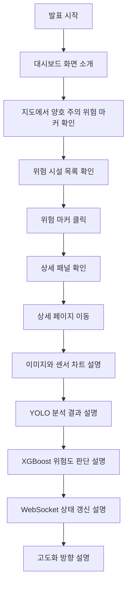

# 10_역할분담_일정_발표목차

## 1. 문서 개요

| 항목 | 내용 |
|---|---|
| 문서명 | 역할분담, 일정, 발표 목차 |
| 프로젝트명 | 지능형 도시 침수 관리 및 모니터링 시스템 |
| 프로젝트 기간 | 2026-06-15 ~ 2026-07-01 |
| 발표일 | 2026-07-02 |
| 작성 목적 | 팀원별 역할, 개발 일정, 발표 흐름을 정리한다. |
| 작성 기준 | MVP 개발 계획, 문서 정리 기준, 발표 준비 일정 |

본 문서는 팀 프로젝트 진행을 위해 역할을 나누고, 짧은 기간 안에 MVP와 고도화 기능을 어느 순서로 만들지 정리한다.

MVP는 빗물받이 지도 대시보드, 상세 화면, OpenCV 전처리, YOLO 분석 결과, XGBoost 위험도 판단, PostgreSQL 저장, WebSocket 상태 갱신을 핵심 범위로 둔다. 대응 요청, 작업자 화면, 외부 알림, LLM 요약은 고도화 범위로 분리한다.

---

## 2. 역할 분담 기준

역할은 기능 단위로 크게 4개 영역으로 나눈다. 각 영역은 독립적으로 개발할 수 있어야 하지만 최종 시연에서는 하나의 흐름으로 연결되어야 한다.

| 역할 | 담당자 | 주요 담당 | 핵심 산출물 |
|---|---|---|---|
| Frontend | 오택률 | 대시보드, 상세 화면, 지도 UI, 차트 UI, WebSocket 이벤트 반영 | 관리자 화면, 지도 마커, 위험 시설 목록, 상세 페이지 |
| Backend | 이명근 | FastAPI API 설계, PostgreSQL 연동, WebSocket 서버, 위험도 데이터 저장 및 조회 | REST API, WebSocket, DB 연동 구조, 데이터 저장 및 조회 기능 |
| AI | 송희수, 김윤섭 | OpenCV 전처리, YOLO 이미지 분석, XGBoost 위험도 판단 | 이미지 분석 결과, 전처리 로직, XGBoost 판단 모델 |
| PM | 송희수 | 전체 일정 관리, 역할 조율, 진행 상황 점검 | 프로젝트 일정표, 역할 분담표, 진행 체크리스트 |
| 발표 | 오택률 | 발표 자료 구성, 발표 흐름 정리, 시연 설명 준비 | 발표 자료, 발표 대본, 시연 시나리오 |
| 공통 | 전체 팀원 | 개발 문서 작성, 기능 통합 점검, 최종 테스트 | 개발 문서, 통합 점검 결과, 최종 시연 준비 |

---

## 3. 역할별 상세 업무

### 3.1 Frontend

| 구분 | 작업 내용 | 우선순위 |
|---|---|---|
| 대시보드 화면 | Kakao Maps API 기반 빗물받이 마커 표시 | 필수 |
| 위험 시설 목록 | 주의 또는 위험 시설을 카드 또는 리스트로 표시 | 필수 |
| 상세 패널 | 마커 클릭 시 요약 정보 표시 | 필수 |
| 상세 페이지 | 이미지, 센서 차트, YOLO 결과, XGBoost 결과 표시 | 필수 |
| 차트 UI | 수위, 유속, 위험도 변화 그래프 표시 | 필수 |
| WebSocket 반영 | 위험도 변경 이벤트 수신 후 지도와 목록 갱신 | 필수 |
| 디자인 개선 | v0 참고 이미지 기반 UI 정리 | 고도화 |
| 대응 요청 UI | 점검 또는 청소 요청 화면 구성 | 고도화 |

### 3.2 Backend

| 구분 | 작업 내용 | 우선순위 |
|---|---|---|
| API 기본 구조 | FastAPI 프로젝트 구조 생성 | 필수 |
| DB 연동 | PostgreSQL 연결 및 SQLAlchemy 모델 구성 | 필수 |
| 빗물받이 API | 전체 목록, 상세 정보 조회 | 필수 |
| 센서 데이터 API | 수위·유속 모의 데이터 저장 및 조회 | 필수 |
| YOLO 결과 API | YOLO 분석 결과 저장 및 조회 | 필수 |
| XGBoost 결과 API | 최종 위험도 판단 결과 저장 및 조회 | 필수 |
| WebSocket 서버 | 위험도 변경 이벤트 전달 | 필수 |
| 대응 요청 API | 담당자 조회, 요청 생성, 상태 관리 | 고도화 |
| 외부 알림 API | SMS, 이메일, 카카오 알림톡 연동 | 고도화 |

### 3.3 AI

| 구분 | 작업 내용 | 우선순위 |
|---|---|---|
| 이미지 데이터 준비 | 양호, 주의, 위험, 판단불가 테스트 이미지 구성 | 필수 |
| OpenCV 처리 | 이미지 로딩, 크롭, 리사이징, 전처리 | 필수 |
| YOLO 분석 | 빗물받이 막힘 상태 탐지 또는 분류 | 필수 |
| 결과 포맷 정리 | 막힘 비율, confidence score, yolo_status 반환 | 필수 |
| XGBoost 판단 | 센서 데이터와 이미지 결과를 조합한 위험도 판단 | 필수 |
| 테스트 케이스 | 양호, 주의, 위험, 판단불가 시나리오 테스트 | 필수 |
| 모델 고도화 | 실제 이미지와 실제 센서 이력 기반 재학습 | 고도화 |

### 3.4 PM/문서/발표/통합

| 구분 | 작업 내용 | 우선순위 |
|---|---|---|
| 문서 관리 | 개발 문서 작성 및 정리 | 필수 |
| 일정 관리 | 주차별 목표와 마감 관리 | 필수 |
| 통합 흐름 정리 | 화면, API, AI 분석 흐름 연결 | 필수 |
| 발표 자료 | 발표 목차, 시연 순서, 설명 스크립트 작성 | 필수 |
| 시연 준비 | 양호, 주의, 위험, 판단불가 시나리오 구성 | 필수 |
| 최종 점검 | 발표 전 오류, 데이터, 화면 흐름 확인 | 필수 |

---

## 4. 일정 계획

### 4.1 전체 일정 요약

| 기간 | 단계 | 목표 | 주요 산출물 |
|---|---|---|---|
| 6/15 ~ 6/17 | 기획 및 설계 | 프로젝트 방향 확정, 개발 문서 초안 작성 | 프로젝트 정의서, 요구사항, MVP 범위, 와이어프레임, 아키텍처, ERD |
| 6/18 ~ 6/23 | 1주차 MVP 개발 | 핵심 흐름 구현 | 모의 데이터, YOLO 분석 결과, XGBoost 판단, API, DB, 대시보드, 상세 화면 |
| 6/24 ~ 6/28 | 2주차 통합 및 개선 | 기능 통합, WebSocket 반영, 화면 완성도 개선 | 실시간 상태 갱신, 차트 개선, 시연 데이터 정리 |
| 6/29 ~ 7/1 | 3주차 테스트 및 발표 준비 | 통합 테스트, 발표 자료, 시연 준비 | 테스트 결과, 발표 자료, 시연 시나리오 |
| 7/2 | 최종 발표 | 프로젝트 발표 및 질의응답 | 발표 완료 |

### 4.2 간트차트

---

## 5. 주차별 목표

### 5.1 6/15 ~ 6/17: 기획 및 설계

| 목표 | 내용 |
|---|---|
| 주제 확정 | 지능형 도시 침수 관리 및 모니터링 시스템으로 방향을 정한다. |
| 화면 흐름 정리 | 대시보드와 상세 화면 중심으로 사용자 흐름을 정리한다. |
| MVP 범위 확정 | 샘플 이미지, 모의 센서 데이터, YOLO, XGBoost, WebSocket, 대시보드를 핵심 범위로 둔다. |
| 개발 문서 작성 | 회의 내용을 기준으로 팀원이 이해할 수 있는 형태로 정리한다. |

### 5.2 6/18 ~ 6/23: 1주차 MVP 개발

| 목표 | 내용 |
|---|---|
| Frontend | 지도, 위험 시설 목록, 상세 화면 기본 UI를 구현한다. |
| Backend | 빗물받이 조회, 센서 데이터 저장, YOLO 결과 저장, XGBoost 결과 조회 API를 구현한다. |
| AI | OpenCV, YOLO, XGBoost 분석 결과를 서비스에서 사용할 수 있는 형태로 정리한다. |
| 통합 | 모의 데이터와 AI 결과가 대시보드와 상세 화면에 표시되는 흐름을 만든다. |

### 5.3 6/24 ~ 6/28: 2주차 통합 및 개선

| 목표 | 내용 |
|---|---|
| WebSocket | 위험도 변경 이벤트를 프론트엔드에 반영한다. |
| UI 개선 | v0 참고 이미지를 기준으로 화면 완성도를 높인다. |
| 차트 개선 | 수위, 유속, 위험도 변화를 보기 쉽게 정리한다. |
| 테스트 데이터 | 양호, 주의, 위험, 판단불가 시연 데이터를 구성한다. |
| 고도화 정리 | 대응 요청, 작업자 화면, 외부 알림, LLM 요약은 발표의 확장 방향으로 정리한다. |

### 5.4 6/29 ~ 7/1: 테스트 및 발표 준비

| 목표 | 내용 |
|---|---|
| 통합 테스트 | 양호, 주의, 위험, 판단불가 시나리오를 테스트한다. |
| 오류 정리 | API 오류, 이미지 없음, 센서 데이터 없음, WebSocket 연결 오류 상황을 확인한다. |
| 발표 자료 | 문제 정의, 해결 방향, 구현 결과, 시연 순서를 정리한다. |
| 리허설 | 발표 시간에 맞춰 설명과 시연 흐름을 점검한다. |

---

## 6. 주요 산출물 관리

| 번호 | 문서명 | 담당 성격 | 상태 |
|---|---|---|---|
| 01 | 프로젝트 정의서 | 기획 | 작성 완료 |
| 02 | 페르소나 및 시나리오 | 기획 | 작성 완료 |
| 03 | 요구사항 정의서 | 기획/백엔드 | 작성 완료 |
| 04 | MVP 범위 | 기획/전체 | 작성 완료 |
| 05 | 와이어프레임 | 프론트/문서 | 작성 완료 |
| 06 | 시스템 아키텍처 | 백엔드/문서 | 작성 완료 |
| 07 | ERD | 백엔드/DB | 작성 완료 |
| 08 | 기술스택 선정근거 | 전체 | 작성 완료 |
| 09 | YOLO + XGBoost PoC | AI | 작성 완료 |
| 10 | 역할분담, 일정, 발표 목차 | PM/발표 | 작성 완료 |

---

## 7. 발표 목차

발표는 서비스 필요성부터 시작해 구현 화면과 기술 구조로 이어지는 흐름으로 구성한다.

| 순서 | 발표 항목 | 설명 |
|---|---|---|
| 1 | 프로젝트 소개 | 지능형 도시 침수 관리 시스템의 주제와 한 줄 소개 |
| 2 | 문제 정의 | 침수 위험 확인 지연, CCTV 관제 한계, 배수 시설 관리 부담 |
| 3 | 해결 방향 | 이미지 분석, 센서 데이터, XGBoost 위험도 판단, 지도 시각화 |
| 4 | MVP 범위 | 이번 기간 안에 구현할 핵심 기능과 고도화 기능 구분 |
| 5 | 화면 흐름 | 대시보드에서 위험 시설을 확인하고 상세 화면으로 이동하는 흐름 |
| 6 | 시스템 구조 | Frontend, Backend, DB, AI 분석 모듈, WebSocket 연결 구조 |
| 7 | AI 분석 구조 | OpenCV, YOLO, XGBoost 입력값과 출력값 설명 |
| 8 | 구현 결과 | 실제 화면과 API 동작 결과 |
| 9 | 시연 | 양호, 주의, 위험, 판단불가 시나리오 기반 시연 |
| 10 | 역할 분담 및 일정 | 팀원별 역할과 개발 일정 |
| 11 | 한계점 및 고도화 | 실제 CCTV, 실제 센서, 대응 요청, 외부 알림, LLM 요약 확장 |

---

## 8. 발표 시연 시나리오

### 8.1 기본 시연 흐름

### 8.2 시연 데이터 구성

| 시나리오 | 입력 데이터 | 기대 결과 |
|---|---|---|
| 양호 | 수위 낮음, 유속 안정, 이미지상 막힘 낮음 | 초록색 양호 마커 표시 |
| 주의 | 일부 막힘, 수위 상승, 유속 저하 | 노란색 또는 주황색 주의 마커 표시 |
| 위험 | 막힘 정도 높음, 수위 높음, 유속 급감 | 빨간색 위험 마커 표시 |
| 판단불가 | 이미지 품질 낮음 또는 센서 누락 | 회색 판단불가 상태 표시 |

---

## 9. 발표 담당 기준

현재 발표는 한 명이 대표로 진행하는 방향으로 잡는다. 단 발표자가 모든 내용을 혼자 만든다는 의미는 아니며, 각 파트 담당자는 본인 영역의 핵심 설명 자료와 시연 데이터를 준비해야 한다.

| 구분 | 담당 내용 |
|---|---|
| 발표자 | 전체 발표 진행, 흐름 설명, 질의응답 대응 |
| Frontend 담당 | 화면 캡처, UI 설명 포인트, 시연 화면 준비 |
| Backend 담당 | API 흐름, DB 저장 구조, WebSocket 흐름, 테스트 데이터 준비 |
| AI 담당 | YOLO 결과, OpenCV 처리, XGBoost 판단 구조 정리 |
| 전체 | 발표 전 통합 테스트와 리허설 참여 |

---

## 10. 리스크와 대응 방안

| 리스크 | 영향 | 대응 방안 |
|---|---|---|
| YOLO 분석 정확도 부족 | 이미지 분석 결과 신뢰도 저하 | 발표용 샘플 데이터와 센서 결합 판단을 함께 사용한다. |
| XGBoost 학습 데이터 부족 | 모델 판단 신뢰도 설명이 약해질 수 있음 | PoC 수준 모델임을 명시하고 입력 Feature 변화에 따른 결과 차이를 시연한다. |
| 실제 센서 데이터 부족 | 실제 운영성 설명이 약해질 수 있음 | 모의 센서 데이터를 주기적으로 생성해 흐름을 보여준다. |
| WebSocket 연동 오류 | 실시간 갱신 시연 실패 가능 | API 조회 화면과 사전 시연 영상을 백업으로 준비한다. |
| 지도 API 연동 지연 | 대시보드 핵심 화면 구현 지연 | 지도 마커 데이터와 정적 위치 데이터를 먼저 준비한다. |
| 기능 범위 과다 | 기간 내 구현 실패 | 대시보드, 상세 화면, YOLO 결과, XGBoost 판단, WebSocket을 우선 완성한다. |
| 발표 시연 오류 | 평가 영향 | 영상 캡처 또는 백업 화면을 준비한다. |

---

## 11. 고도화 범위 정리

| 고도화 기능 | 설명 |
|---|---|
| 대응 요청 | 위험 시설에 대한 점검 또는 청소 요청 생성 |
| 작업자 화면 | 작업자가 배정된 요청을 확인하고 상태를 변경하는 화면 |
| 외부 알림 | SMS, 이메일, 카카오 알림톡, 웹푸시 |
| 실제 CCTV RTSP | 실제 CCTV 스트림 연결 및 프레임 캡처 |
| 실제 IoT 센서 MQTT | 실제 센서 장비 연동 |
| LLM 요약 | 위험도 설명, 대응 우선순위, 보고서 자동 생성 |
| 운영 로그 | 데이터 수집 실패, 분석 실패, 이벤트 전송 실패 관리 |

---

## 12. 정리

본 프로젝트 일정은 짧은 기간 안에 MVP 핵심 흐름을 완성하는 데 초점을 둔다. MVP의 우선순위는 대시보드, 상세 화면, OpenCV 전처리, YOLO 분석, XGBoost 위험도 판단, PostgreSQL 저장, WebSocket 상태 갱신이다.

대응 요청, 작업자 화면, 외부 알림, 실제 CCTV 및 실제 센서 연동, LLM 요약은 고도화 기능으로 분리하여 발표의 확장 방향으로 설명한다.
