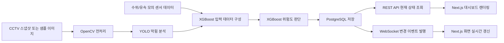
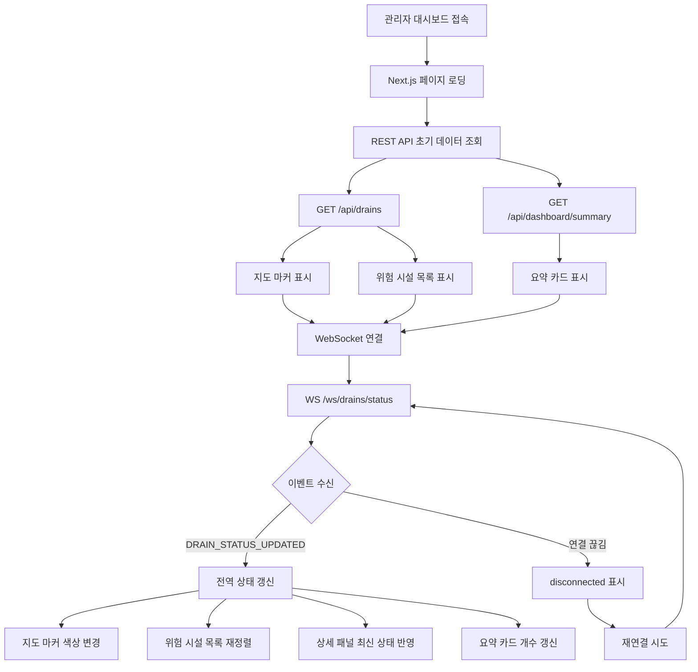
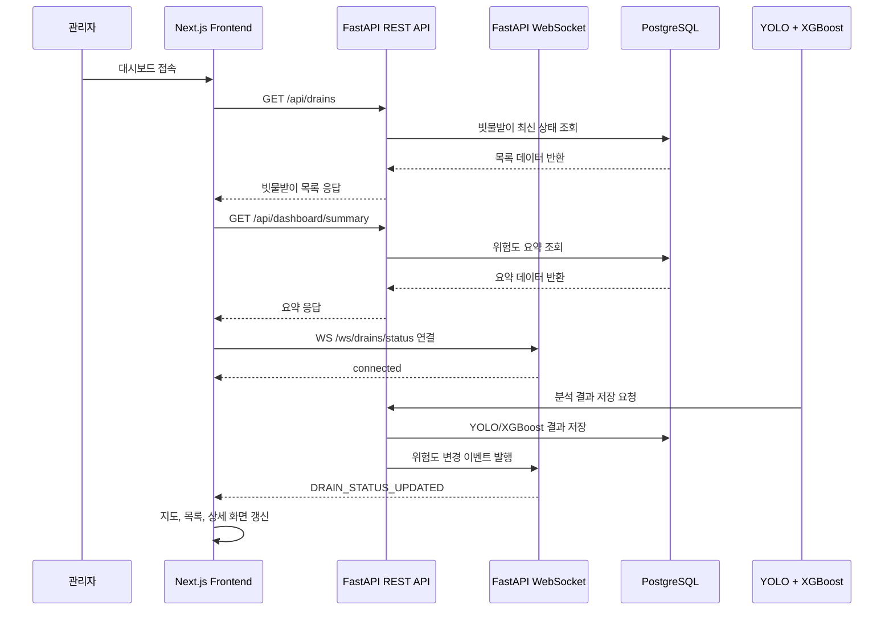

# SmartDrain MVP API 통합 명세서

| 항목 | 내용 |
|---|---|
| 문서명 | SmartDrain MVP API 통합 명세서 |
| 문서 상태 | 통합 초안(검토 의견 반영) |
| 기준일 | 2026-06-18 |
| 적용 범위 | SmartDrain MVP 프론트엔드-백엔드 연동 |
| 대상 화면 | 대시보드, 빗물받이 상세 화면, 실시간 위험도 갱신 |
| 백엔드 기준 | FastAPI MVP 백엔드 API 명세서 2차 초안 |
| 프론트 기준 | SmartDrain MVP API 명세서 v1 |
| 권장 저장 위치 | `docs/api-contract/api-contract.md` |
| 목적 | 백엔드와 프론트엔드가 같은 API 계약을 기준으로 구현하도록 통합 기준을 제공한다. |

---

## 1. 문서 목적

이 문서는 SmartDrain MVP에서 프론트엔드와 백엔드가 맞춰야 하는 API 계약을 하나로 통합한 명세서이다.

프론트엔드는 분석을 직접 수행하지 않는다. 백엔드는 CCTV 스냅샷 이미지 또는 샘플 이미지, 수위·유속 모의 센서 데이터, YOLO 분석 결과를 기반으로 XGBoost 최종 위험도를 판단하고 저장한다. 프론트엔드는 REST API로 현재 상태를 조회하고, 이후 변경 이벤트는 WebSocket으로 수신하여 지도, 목록, 상세 패널, 상세 페이지, 요약 카드를 갱신한다.

핵심 원칙은 다음과 같다.

| 원칙 | 설명 |
|---|---|
| 초기 데이터는 REST API | 대시보드 첫 진입 시 현재 빗물받이 목록, 요약 정보, 상세 데이터를 REST API로 조회한다. |
| 실시간 변경은 WebSocket | 최초 렌더링 이후 위험도, 수위, 유속, 막힘률 변경 이벤트는 WebSocket으로 수신한다. |
| 분석 책임은 백엔드 | YOLO 분석 결과 저장, XGBoost 위험도 판단, 최종 판단 문구 생성은 백엔드가 담당한다. |
| 프론트는 화면 표시 담당 | 프론트는 응답 DTO를 adapter로 변환한 뒤 지도, 목록, 카드, 차트에 표시한다. |
| 위험도 코드는 통일 | `good`, `caution`, `danger`, `unknown`만 사용한다. |
| 응답 필드는 camelCase | API 응답은 프론트 DTO 기준으로 camelCase를 사용한다. |
| DB 모델은 snake_case 가능 | SQLAlchemy/DB 내부는 snake_case를 유지하고, 응답 변환 단계에서 camelCase로 변환한다. |

---

## 2. 두 문서 연관성 점검 결과

### 2.1 이미 잘 맞는 부분

| 구분 | 백엔드 문서 | 프론트 문서 | 통합 판단 |
|---|---|---|---|
| 초기 조회 방식 | REST API로 초기 데이터 조회 | REST API로 초기 데이터 조회 | 일치 |
| 실시간 갱신 | WebSocket으로 위험도 변경 이벤트 전달 | WebSocket으로 이벤트 수신 후 화면 갱신 | 일치 |
| 위험도 코드 | `good/caution/danger/unknown` | `good/caution/danger/unknown` | 일치 |
| WebSocket endpoint | `/ws/drains/status` | `/ws/drains/status` | 일치 |
| 주요 화면 | 대시보드, 상세 화면, 실시간 갱신 | 대시보드, 상세 화면, 실시간 갱신 | 일치 |
| 공통 wrapper | `ApiResponse`, `ApiListResponse` | `ApiResponse`, `ApiListResponse` | 거의 일치 |
| 주요 API | 목록, 상세, 센서 이력, 위험 이력, 요약, 최신 분석 | 목록, 상세, 센서 이력, 위험 이력, 요약, 최신 분석 | 일치 |
| 프론트 처리 | adapter를 통해 UI 타입 변환 | adapter를 통해 UI 타입 변환 | 일치 |

### 2.2 정리 또는 합의가 필요한 부분

| 우선순위 | 항목 | 현재 차이/주의점 | 통합 결정안 |
|---|---|---|---|
| 필수 | 빗물받이 식별자 | 백엔드 문서에는 path parameter가 숫자 PK 또는 `drain_code` 가능, 프론트 문서는 `id` 중심 | API 응답의 `id`는 프론트 상태 관리용 외부 식별자로 사용한다. 가능하면 `drain_code` 기반 문자열 값을 사용하고, DB 내부 숫자 PK는 백엔드 관계 설정에만 사용한다. 요청 path는 MVP에서 `id`를 사용하되, 백엔드는 숫자 PK와 `drain_code` 모두 허용 가능하다. |
| 필수 | `drainId` vs `id` | REST 응답은 `id`, WebSocket payload는 `drainId` 사용 | REST 응답은 `id`, WebSocket 이벤트는 `payload.drainId`로 유지한다. 프론트 adapter에서 같은 식별자로 매핑한다. |
| 필수 | `timestamp` 필수 여부 | 백엔드 문서는 `timestamp: string`, 프론트 문서는 `timestamp?: string` | 통합 명세에서는 `timestamp: string`을 필수로 권장한다. 프론트 타입은 안전하게 optional 처리 가능하다. |
| 필수 | 막힘률 단위 | 프론트 문서는 0~1 또는 0~100 대응 가능, 백엔드는 0~1 기준 | API 계약은 `obstructionRatio`를 0~1 ratio로 확정한다. 화면에서는 프론트가 퍼센트로 변환한다. |
| 필수 | YOLO 상태값 | 예시에 `danger`, `blocked`가 혼재 | `yoloStatus`는 `clear`, `partially_blocked`, `blocked`, `unknown` 중 하나로 권장한다. 최종 위험도는 `riskLevel`에서만 `good/caution/danger/unknown`을 사용한다. |
| 권장 | Dashboard summary API | 프론트 문서는 합의 필요, 백엔드 문서는 권장/제공 쪽에 가까움 | MVP에서는 `GET /api/dashboard/summary`를 제공하는 것을 권장한다. 프론트가 목록에서 계산하는 방식은 fallback으로 둔다. |
| 권장 | 최신 분석 API | 선택 API로 정의 | 상세 응답이 커질 경우 `GET /api/drains/{id}/analysis/latest`를 별도 호출한다. MVP에서는 상세 응답에 포함해도 된다. |
| 권장 | 테스트용 POST API | 백엔드 문서에는 테스트/데모 API가 있음, 프론트 문서에는 없음 | 통합 명세서에는 “백엔드 테스트 및 데모용 API”로 분리한다. 일반 사용자 프론트 화면에서는 직접 호출하지 않는다. |
| 권장 | 인증 | MVP 1차 미적용/미정 | MVP에서는 미적용, 후속 고도화 시 JWT 또는 세션 인증 추가로 명시한다. |
| 권장 | WebSocket 재연결 | 프론트 문서에 상태값이 더 구체적 | 연결 상태 타입을 `connecting/connected/disconnected/reconnecting/error`로 확정한다. |

---

## 3. 최종 합의 기준 요약

| 항목 | 최종 기준 |
|---|---|
| REST Base URL | `NEXT_PUBLIC_API_BASE_URL` |
| Local 예시 | `http://localhost:8000` |
| WebSocket endpoint | `/ws/drains/status` |
| REST 응답 필드명 | camelCase |
| DB 필드명 | snake_case 가능 |
| 공통 단건 응답 | `ApiResponse<T>` |
| 공통 목록 응답 | `ApiListResponse<T>` |
| 위험도 코드 | `good`, `caution`, `danger`, `unknown` |
| YOLO 상태 코드 권장 | `clear`, `partially_blocked`, `blocked`, `unknown` |
| 위험 점수 | 0~1 number |
| 막힘률 | 0~1 ratio |
| 수위 | cm |
| 유속 | m/s |
| 날짜/시간 | ISO 8601, `+09:00` 포함 권장 |
| 초기 화면 조회 | REST API |
| 이후 실시간 갱신 | WebSocket |
| 프론트 변환 방식 | API DTO → adapter → UI 타입 |

### 3.1 식별자 운영 기준

| 항목 | 기준 |
|---|---|
| DB 내부 PK | 숫자 `id` 사용 |
| 외부 API 응답 ID | `drain_code` 기반 문자열 ID 사용 권장 |
| REST path parameter | 숫자 PK 또는 `drain_code` 모두 허용 가능 |
| 프론트 상태 관리 ID | REST 응답의 `id: string` 사용 |
| WebSocket 식별자 | 이벤트 payload의 `drainId: string` 사용 |

API 응답의 `id`는 프론트 상태 관리와 WebSocket 갱신 기준으로 사용하는 외부 식별자이며, 가능하면 `drain_code` 값을 사용한다. DB 내부 숫자 PK는 백엔드 내부 관계 설정에만 사용한다.

---

## 4. 전체 데이터 흐름

### 4.1 시스템 처리 흐름



### 4.2 프론트 초기 로딩과 WebSocket 갱신 흐름



### 4.3 시퀀스 다이어그램



---

## 5. API 공통 규칙

### 5.1 Base URL

| 환경 | 값 | 설명 |
|---|---|---|
| Local | `http://localhost:8000` | FastAPI 개발 서버 |
| Frontend env | `NEXT_PUBLIC_API_BASE_URL` | Next.js axios baseURL |

프론트 예시:

```ts
import axios from "axios";

export const apiClient = axios.create({
  baseURL: process.env.NEXT_PUBLIC_API_BASE_URL,
  timeout: 10000,
});
```

### 5.2 날짜/시간 기준

| 항목 | 기준 |
|---|---|
| 형식 | ISO 8601 string |
| 예시 | `2026-06-18T09:30:00+09:00` |
| 권장 timezone | Asia/Seoul 기준 offset 포함 |
| 백엔드 반환 기준 | `+09:00` 포함 ISO 문자열 |

### 5.3 숫자 단위 기준

| 필드 | 타입 | 단위 | 예시 | 설명 |
|---|---|---|---|---|
| `riskScore` | number | 0~1 score | `0.91` | XGBoost 또는 규칙 기반 위험 점수 |
| `obstructionRatio` | number | 0~1 ratio | `0.88` | 화면에서는 88%로 표시 |
| `waterLevelCm` | number | cm | `85` | 수위 |
| `flowVelocityMps` | number | m/s | `0.05` | 유속 |
| `latitude` | number | 위도 | `37.5665` | 지도 마커 표시 |
| `longitude` | number | 경도 | `126.9780` | 지도 마커 표시 |

### 5.4 위험도 코드

| 화면 표시 | 코드 | 의미 | 정렬 우선순위 | 색상 기준 |
|---|---|---|---|---|
| 위험 | `danger` | 침수 또는 막힘 위험 높음 | 3 | 빨간색 |
| 주의 | `caution` | 위험 증가 가능성 있음 | 2 | 노란색 또는 주황색 |
| 판단불가 | `unknown` | 데이터 없음, 분석 실패, 통신 지연 | 1 | 회색 |
| 양호 | `good` | 정상 범위 | 0 | 초록색 |

TypeScript 기준:

```ts
type RiskLevel = "good" | "caution" | "danger" | "unknown";
```

### 5.5 YOLO 상태 코드 권장

최종 위험도와 YOLO 판정 상태를 혼동하지 않기 위해 `yoloStatus`는 별도 코드값을 권장한다.

| 코드 | 의미 | 비고 |
|---|---|---|
| `clear` | 막힘이 거의 없음 | 최종 위험도 `good`과 반드시 같을 필요는 없음 |
| `partially_blocked` | 일부 막힘 | 센서값에 따라 최종 위험도는 `caution` 또는 `danger` 가능 |
| `blocked` | 심한 막힘 | 수위/유속과 결합하여 최종 판단 |
| `unknown` | 이미지 품질 저하 또는 분석 실패 | 최종 위험도 `unknown` 판단 근거가 될 수 있음 |

---

## 6. 공통 응답 형식

### 6.1 단건 응답 wrapper

```ts
type ApiResponse<T> = {
  success: boolean;
  data: T | null;
  message?: string;
  error?: {
    code: string;
    message: string;
    detail?: unknown;
  };
  timestamp: string;
};
```

성공 예시:

```json
{
  "success": true,
  "data": {
    "id": "DR-004",
    "roadAddress": "서울시 광진구 능동로 120",
    "latitude": 37.5472,
    "longitude": 127.0743,
    "riskLevel": "danger",
    "riskScore": 0.91,
    "obstructionRatio": 0.88,
    "waterLevelCm": 85,
    "flowVelocityMps": 0.05,
    "finalDecision": "막힘률과 수위가 높아 침수 위험이 큽니다.",
    "updatedAt": "2026-06-18T09:30:00+09:00"
  },
  "timestamp": "2026-06-18T09:30:01+09:00"
}
```

실패 예시:

```json
{
  "success": false,
  "data": null,
  "message": "요청한 빗물받이를 찾을 수 없습니다.",
  "error": {
    "code": "DRAIN_NOT_FOUND",
    "message": "Drain not found",
    "detail": {
      "id": "DR-999"
    }
  },
  "timestamp": "2026-06-18T09:30:01+09:00"
}
```

### 6.2 목록 응답 wrapper

```ts
type ApiListResponse<T> = ApiResponse<{
  items: T[];
  totalCount: number;
}>;
```

목록 응답 예시:

```json
{
  "success": true,
  "data": {
    "items": [],
    "totalCount": 0
  },
  "timestamp": "2026-06-18T09:30:01+09:00"
}
```

---

## 7. REST API 종합 목록

### 7.1 프론트 연동용 주요 API

| 목적 | Method | Endpoint | 응답 타입 | 사용 화면 | MVP 중요도 | 구현 상태 | 담당 |
|---|---|---|---|---|---|---|---|
| 빗물받이 목록 조회 | GET | `/api/drains` | `ApiListResponse<DrainListItemDto>` | 대시보드 지도, 위험 시설 목록 | 필수 | 구현 완료 / 테스트 필요 | Backend 제공 / Frontend 사용 |
| 빗물받이 상세 조회 | GET | `/api/drains/{id}` | `ApiResponse<DrainDetailDto>` | 상세 요약 패널, 상세 페이지 | 필수 | 구현 완료 / 테스트 필요 | Backend 제공 / Frontend 사용 |
| 센서 이력 조회 | GET | `/api/drains/{id}/sensors` | `ApiListResponse<SensorHistoryDto>` | 상세 페이지 센서 차트 | 필수 | 구현 완료 / 테스트 필요 | Backend 제공 / Frontend 사용 |
| 위험 이력 조회 | GET | `/api/drains/{id}/risk-history` | `ApiListResponse<RiskHistoryDto>` | 상세 페이지 위험 이력 차트 | 필수 | 구현 완료 / 테스트 필요 | Backend 제공 / Frontend 사용 |
| 대시보드 요약 조회 | GET | `/api/dashboard/summary` | `ApiResponse<DashboardSummaryDto>` | 대시보드 요약 카드 | 권장 | 구현 완료 / 테스트 필요 | Backend 제공 / Frontend 사용 |
| 최신 분석 결과 조회 | GET | `/api/drains/{id}/analysis/latest` | `ApiResponse<AnalysisResultDto>` | YOLO/XGBoost 결과 카드 | 선택 | 구현 완료 / 테스트 필요 | Backend 제공 / Frontend 사용 |
| 위험도 이벤트 수신 | WS | `/ws/drains/status` | `DrainStatusUpdatedEventDto` | 전체 화면 실시간 갱신 | 필수 | 구현 완료 / 테스트 필요 | Backend 발행 / Frontend 수신 |

### 7.2 백엔드 테스트 및 데모용 API

아래 API는 FastAPI `/docs` 테스트, 더미 데이터 생성, 시연 데이터 입력용이다. 일반 관리자 화면에서 직접 호출하지 않는 것을 기본으로 한다.

| 목적 | Method | Endpoint | 설명 | 상태 | 담당 |
|---|---|---|---|---|---|
| 빗물받이 등록 | POST | `/api/drains` | 테스트용 빗물받이 생성 | 데모/테스트 | Backend |
| 센서 데이터 저장 | POST | `/api/sensor-data` | 수위, 유속 모의 데이터 저장 | 데모/테스트 | Backend |
| YOLO 결과 저장 | POST | `/api/analysis/yolo` | 이미지 분석 결과 저장 | 데모/테스트 | Backend / AI |
| XGBoost 위험도 판단 | POST | `/api/analysis/xgboost` | 센서 데이터와 YOLO 결과 기반 최종 위험도 판단 | 데모/테스트 | Backend / AI |

### 7.3 호환용 endpoint 정리

| 기존 Endpoint | 통합 명세 Endpoint | 처리 방향 |
|---|---|---|
| `/api/drains/{id}/sensor-data` | `/api/drains/{id}/sensors` | 프론트 명세 기준 alias 추가 권장 |
| `/api/drains/{id}/sensor-data/latest` | `/api/drains/{id}/analysis/latest` 일부 포함 | 최신 센서값은 상세/분석 응답에 포함 가능 |
| `/api/drains/{id}/yolo-results` | `/api/drains/{id}/analysis/latest` 일부 포함 | 최신 YOLO 결과는 최신 분석 응답에 포함 가능 |
| `/api/drains/{id}/risk/latest` | `/api/drains/{id}/analysis/latest` 일부 포함 | 최신 위험도 결과는 최신 분석 응답에 포함 가능 |

---

## 8. REST API 상세 명세

## 8.1 빗물받이 목록 조회

| 항목 | 내용 |
|---|---|
| Method | GET |
| Endpoint | `/api/drains` |
| Query | MVP 1차 없음 |
| 목적 | 대시보드 지도 마커와 위험 시설 목록을 표시하기 위한 현재 상태 조회 |
| 응답 타입 | `ApiListResponse<DrainListItemDto>` |

### 응답 DTO

```ts
type DrainListItemDto = {
  id: string;
  roadAddress: string;
  fullAddress?: string;
  latitude: number;
  longitude: number;
  riskLevel: RiskLevel;
  riskScore: number;
  obstructionRatio: number;
  waterLevelCm: number;
  flowVelocityMps: number;
  finalDecision: string;
  updatedAt: string;
};
```

### 응답 예시

```json
{
  "success": true,
  "data": {
    "items": [
      {
        "id": "DR-004",
        "roadAddress": "서울시 광진구 능동로 120",
        "fullAddress": "서울시 광진구 능동로 120 어린이대공원역 4번 출구 앞",
        "latitude": 37.5472,
        "longitude": 127.0743,
        "riskLevel": "danger",
        "riskScore": 0.91,
        "obstructionRatio": 0.88,
        "waterLevelCm": 85,
        "flowVelocityMps": 0.05,
        "finalDecision": "막힘률과 수위가 높아 침수 위험이 큽니다.",
        "updatedAt": "2026-06-18T09:30:00+09:00"
      }
    ],
    "totalCount": 1
  },
  "timestamp": "2026-06-18T09:30:01+09:00"
}
```

### 프론트 반영 위치

| 필드 | 사용 위치 |
|---|---|
| `id` | 선택 상태, 상세 페이지 이동 |
| `latitude`, `longitude` | Kakao 지도 마커 |
| `riskLevel` | 마커 색상, 상태 배지, 위험 시설 목록 정렬 |
| `riskScore` | 위험 점수 표시 |
| `obstructionRatio` | 막힘률 progress |
| `waterLevelCm` | 수위 표시 |
| `flowVelocityMps` | 유속 표시 |
| `updatedAt` | 최근 업데이트 시간 |

---

## 8.2 빗물받이 상세 조회

| 항목 | 내용 |
|---|---|
| Method | GET |
| Endpoint | `/api/drains/{id}` |
| Path parameter | `id`: 빗물받이 ID. MVP에서는 `DR-004` 같은 drain code 사용 권장 |
| 목적 | 상세 패널과 상세 페이지에 필요한 최신 상태 조회 |
| 응답 타입 | `ApiResponse<DrainDetailDto>` |

### 응답 DTO

```ts
type DrainDetailDto = DrainListItemDto & {
  imageUrl?: string;
  sensorSummary?: SensorSummaryDto;
  sensorHistory?: SensorHistoryDto[];
  yoloResult?: YoloResultDto;
  xgboostResult?: XgboostResultDto;
  riskHistory?: RiskHistoryDto[];
};
```

### 응답 예시

```json
{
  "success": true,
  "data": {
    "id": "DR-004",
    "roadAddress": "서울시 광진구 능동로 120",
    "fullAddress": "서울시 광진구 능동로 120 어린이대공원역 4번 출구 앞",
    "latitude": 37.5472,
    "longitude": 127.0743,
    "riskLevel": "danger",
    "riskScore": 0.91,
    "obstructionRatio": 0.88,
    "waterLevelCm": 85,
    "flowVelocityMps": 0.05,
    "finalDecision": "막힘률과 수위가 높아 침수 위험이 큽니다.",
    "updatedAt": "2026-06-18T09:30:00+09:00",
    "imageUrl": "/static/samples/drain_004.jpg",
    "sensorSummary": {
      "waterLevelCm": 85,
      "flowVelocityMps": 0.05,
      "measuredAt": "2026-06-18T09:29:30+09:00"
    },
    "yoloResult": {
      "imageUrl": "/static/samples/drain_004.jpg",
      "obstructionRatio": 0.88,
      "confidenceScore": 0.94,
      "yoloStatus": "blocked",
      "analyzedAt": "2026-06-18T09:29:40+09:00"
    },
    "xgboostResult": {
      "riskScore": 0.91,
      "riskLevel": "danger",
      "finalDecision": "막힘률과 수위가 높아 침수 위험이 큽니다.",
      "predictedAt": "2026-06-18T09:29:50+09:00"
    },
    "riskHistory": [
      {
        "changedAt": "2026-06-18T09:30:00+09:00",
        "riskLevel": "danger",
        "riskScore": 0.91
      }
    ]
  },
  "timestamp": "2026-06-18T09:30:01+09:00"
}
```

---

## 8.3 센서 이력 조회

| 항목 | 내용 |
|---|---|
| Method | GET |
| Endpoint | `/api/drains/{id}/sensors` |
| Path parameter | `id`: 빗물받이 ID |
| 목적 | 상세 페이지 수위/유속 차트 표시 |
| 응답 타입 | `ApiListResponse<SensorHistoryDto>` |

### Query parameter

| 이름 | 타입 | 필수 | 기본값 | 설명 |
|---|---|---|---|---|
| `range` | string | N | `24h` | `24h`, `7d` |
| `limit` | number | N | `100` | 최대 반환 개수 |

### 응답 DTO

```ts
type SensorHistoryDto = {
  measuredAt: string;
  waterLevelCm: number;
  flowVelocityMps: number;
};
```

### 응답 예시

```json
{
  "success": true,
  "data": {
    "items": [
      {
        "measuredAt": "2026-06-18T09:29:30+09:00",
        "waterLevelCm": 85,
        "flowVelocityMps": 0.05
      }
    ],
    "totalCount": 1
  },
  "timestamp": "2026-06-18T09:30:01+09:00"
}
```

---

## 8.4 위험 이력 조회

| 항목 | 내용 |
|---|---|
| Method | GET |
| Endpoint | `/api/drains/{id}/risk-history` |
| Path parameter | `id`: 빗물받이 ID |
| 목적 | 상세 페이지 최근 위험도 변화 표시 |
| 응답 타입 | `ApiListResponse<RiskHistoryDto>` |

### Query parameter

| 이름 | 타입 | 필수 | 기본값 | 설명 |
|---|---|---|---|---|
| `days` | number | N | `7` | 최근 N일 |
| `limit` | number | N | `50` | 최대 반환 개수 |

### 응답 DTO

```ts
type RiskHistoryDto = {
  changedAt: string;
  riskLevel: RiskLevel;
  riskScore: number;
};
```

### 응답 예시

```json
{
  "success": true,
  "data": {
    "items": [
      {
        "changedAt": "2026-06-18T09:30:00+09:00",
        "riskLevel": "danger",
        "riskScore": 0.91
      }
    ],
    "totalCount": 1
  },
  "timestamp": "2026-06-18T09:30:01+09:00"
}
```

---

## 8.5 최신 분석 결과 조회

| 항목 | 내용 |
|---|---|
| Method | GET |
| Endpoint | `/api/drains/{id}/analysis/latest` |
| Path parameter | `id`: 빗물받이 ID |
| 목적 | 선택한 빗물받이의 최신 센서, YOLO, XGBoost 결과 조회 |
| 응답 타입 | `ApiResponse<AnalysisResultDto>` |
| 상태 | 선택. 상세 응답에 포함하면 생략 가능 |

### 응답 DTO

```ts
type AnalysisResultDto = {
  sensorSummary?: SensorSummaryDto;
  yoloResult?: YoloResultDto;
  xgboostResult?: XgboostResultDto;
  updatedAt?: string;
};
```

### 응답 예시

```json
{
  "success": true,
  "data": {
    "sensorSummary": {
      "waterLevelCm": 85,
      "flowVelocityMps": 0.05,
      "measuredAt": "2026-06-18T09:29:30+09:00"
    },
    "yoloResult": {
      "imageUrl": "/static/samples/drain_004.jpg",
      "obstructionRatio": 0.88,
      "confidenceScore": 0.94,
      "yoloStatus": "blocked",
      "analyzedAt": "2026-06-18T09:29:40+09:00"
    },
    "xgboostResult": {
      "riskScore": 0.91,
      "riskLevel": "danger",
      "finalDecision": "막힘률과 수위가 높아 침수 위험이 큽니다.",
      "predictedAt": "2026-06-18T09:29:50+09:00"
    },
    "updatedAt": "2026-06-18T09:30:00+09:00"
  },
  "timestamp": "2026-06-18T09:30:01+09:00"
}
```

---

## 8.6 대시보드 요약 조회

| 항목 | 내용 |
|---|---|
| Method | GET |
| Endpoint | `/api/dashboard/summary` |
| 목적 | 전체 빗물받이 상태 개수와 최근 업데이트 시간 표시 |
| 응답 타입 | `ApiResponse<DashboardSummaryDto>` |
| 상태 | 권장. 없으면 프론트가 `GET /api/drains` 결과로 계산 가능 |

### 응답 DTO

```ts
type DashboardSummaryDto = {
  totalCount: number;
  goodCount: number;
  cautionCount: number;
  dangerCount: number;
  unknownCount: number;
  latestUpdatedAt?: string;
};
```

### 응답 예시

```json
{
  "success": true,
  "data": {
    "totalCount": 120,
    "goodCount": 92,
    "cautionCount": 19,
    "dangerCount": 6,
    "unknownCount": 3,
    "latestUpdatedAt": "2026-06-18T09:30:00+09:00"
  },
  "timestamp": "2026-06-18T09:30:01+09:00"
}
```

---

## 9. 데이터 입력 및 분석 실행 API

이 영역은 MVP 데모와 FastAPI `/docs` 테스트용이다. 실제 관리자 프론트 화면에서는 직접 호출하지 않을 수 있다.

## 9.1 빗물받이 등록

| 항목 | 내용 |
|---|---|
| Method | POST |
| Endpoint | `/api/drains` |
| 목적 | 테스트 또는 초기 데이터용 빗물받이 생성 |

요청 예시:

```json
{
  "drainCode": "DR-004",
  "name": "어린이대공원역 4번 출구 빗물받이",
  "address": "서울시 광진구 능동로 120",
  "latitude": 37.5472,
  "longitude": 127.0743,
  "status": "good"
}
```

## 9.2 센서 데이터 저장

| 항목 | 내용 |
|---|---|
| Method | POST |
| Endpoint | `/api/sensor-data` |
| 목적 | 수위, 유속 모의 센서 데이터 저장 |

요청 예시:

```json
{
  "drainId": 1,
  "waterLevelCm": 85,
  "flowVelocityMps": 0.05
}
```

## 9.3 YOLO 결과 저장

| 항목 | 내용 |
|---|---|
| Method | POST |
| Endpoint | `/api/analysis/yolo` |
| 목적 | YOLO 이미지 분석 결과 저장 |

요청 예시:

```json
{
  "drainId": 1,
  "imageUrl": "/static/samples/drain_004.jpg",
  "obstructionRatio": 0.88,
  "confidenceScore": 0.94,
  "yoloStatus": "blocked"
}
```

## 9.4 XGBoost 위험도 판단 실행

| 항목 | 내용 |
|---|---|
| Method | POST |
| Endpoint | `/api/analysis/xgboost` |
| 목적 | 센서 데이터와 YOLO 결과 기반 최종 위험도 판단 |

XGBoost 판단 API는 요청으로 전달된 `sensorDataId`와 `yoloResultId`를 기준으로 DB에서 센서값과 YOLO 결과를 조회한 뒤 위험도를 계산한다.

요청 예시:

```json
{
  "drainId": 1,
  "sensorDataId": 1,
  "yoloResultId": 1
}
```

MVP 규칙 기반 판단 기준 예시:

| 조건 | 결과 |
|---|---|
| `confidenceScore < 0.5` | `unknown` |
| `obstructionRatio >= 0.8` and `waterLevelCm >= 70` | `danger` |
| `obstructionRatio >= 0.6` or `waterLevelCm >= 50` | `caution` |
| 그 외 | `good` |

---

## 10. WebSocket 명세

## 10.1 연결 정보

| 항목 | 내용 |
|---|---|
| Endpoint | `/ws/drains/status` |
| 목적 | 위험도, 수위, 유속, 막힘률 변경 이벤트 수신 |
| 연결 시점 | REST API 초기 데이터 조회 완료 후 |
| 인증 | MVP 1차 미적용 |
| 이벤트 기준 | `DRAIN_STATUS_UPDATED` |

프론트 처리 흐름:

```text
REST API 초기 데이터 조회
→ 화면 렌더링
→ WebSocket 연결
→ DRAIN_STATUS_UPDATED 이벤트 수신
→ drainId 기준으로 기존 항목 갱신
→ 지도, 목록, 상세 패널, 요약 카드 갱신
```

## 10.2 위험도 변경 이벤트

### 이벤트 DTO

```ts
type DrainStatusUpdatedEventDto = {
  type: "DRAIN_STATUS_UPDATED";
  payload: {
    drainId: string;
    riskLevel: RiskLevel;
    riskScore: number;
    waterLevelCm?: number;
    flowVelocityMps?: number;
    obstructionRatio?: number;
    finalDecision?: string;
    updatedAt: string;
  };
};
```

### 이벤트 예시

```json
{
  "type": "DRAIN_STATUS_UPDATED",
  "payload": {
    "drainId": "DR-004",
    "riskLevel": "danger",
    "riskScore": 0.91,
    "waterLevelCm": 85,
    "flowVelocityMps": 0.05,
    "obstructionRatio": 0.88,
    "finalDecision": "막힘률과 수위가 높아 침수 위험이 큽니다.",
    "updatedAt": "2026-06-18T09:30:00+09:00"
  }
}
```

## 10.3 이벤트별 화면 반영

| 이벤트 필드 | 갱신 대상 UI |
|---|---|
| `drainId` | 갱신할 빗물받이 식별 |
| `riskLevel` | 지도 마커 색상, 상태 배지, 위험 시설 목록 정렬 |
| `riskScore` | 위험 점수 표시 |
| `waterLevelCm` | 수위 카드, 센서 최신값 |
| `flowVelocityMps` | 유속 카드, 센서 최신값 |
| `obstructionRatio` | 막힘률 progress |
| `finalDecision` | 최종 판단 문구 |
| `updatedAt` | 최근 업데이트 시간 |

## 10.4 WebSocket 연결 상태

| 상태 | 의미 | 프론트 표시 |
|---|---|---|
| `connecting` | 연결 시도 중 | 연결 중 |
| `connected` | 정상 연결 | 실시간 연결됨 |
| `disconnected` | 연결 끊김 | 연결 끊김 |
| `reconnecting` | 재연결 시도 중 | 재연결 중 |
| `error` | 연결 실패 | 실시간 연결 오류 |

---

## 11. DTO 상세 정의

```ts
type RiskLevel = "good" | "caution" | "danger" | "unknown";

type YoloStatus = "clear" | "partially_blocked" | "blocked" | "unknown";

type ApiResponse<T> = {
  success: boolean;
  data: T | null;
  message?: string;
  error?: {
    code: string;
    message: string;
    detail?: unknown;
  };
  timestamp: string;
};

type ApiListResponse<T> = ApiResponse<{
  items: T[];
  totalCount: number;
}>;

type DrainListItemDto = {
  id: string;
  roadAddress: string;
  fullAddress?: string;
  latitude: number;
  longitude: number;
  riskLevel: RiskLevel;
  riskScore: number;
  obstructionRatio: number;
  waterLevelCm: number;
  flowVelocityMps: number;
  finalDecision: string;
  updatedAt: string;
};

type DrainDetailDto = DrainListItemDto & {
  imageUrl?: string;
  sensorSummary?: SensorSummaryDto;
  sensorHistory?: SensorHistoryDto[];
  yoloResult?: YoloResultDto;
  xgboostResult?: XgboostResultDto;
  riskHistory?: RiskHistoryDto[];
};

type SensorSummaryDto = {
  waterLevelCm: number;
  flowVelocityMps: number;
  measuredAt: string;
};

type SensorHistoryDto = {
  measuredAt: string;
  waterLevelCm: number;
  flowVelocityMps: number;
};

type YoloResultDto = {
  imageUrl?: string;
  obstructionRatio: number;
  confidenceScore: number;
  yoloStatus: YoloStatus;
  analyzedAt: string;
};

type XgboostResultDto = {
  riskScore: number;
  riskLevel: RiskLevel;
  finalDecision: string;
  predictedAt: string;
};

type RiskHistoryDto = {
  changedAt: string;
  riskLevel: RiskLevel;
  riskScore: number;
};

type AnalysisResultDto = {
  sensorSummary?: SensorSummaryDto;
  yoloResult?: YoloResultDto;
  xgboostResult?: XgboostResultDto;
  updatedAt?: string;
};

type DashboardSummaryDto = {
  totalCount: number;
  goodCount: number;
  cautionCount: number;
  dangerCount: number;
  unknownCount: number;
  latestUpdatedAt?: string;
};

type DrainStatusUpdatedEventDto = {
  type: "DRAIN_STATUS_UPDATED";
  payload: {
    drainId: string;
    riskLevel: RiskLevel;
    riskScore: number;
    waterLevelCm?: number;
    flowVelocityMps?: number;
    obstructionRatio?: number;
    finalDecision?: string;
    updatedAt: string;
  };
};
```

---

## 12. 에러 응답 형식

### 12.1 기본 구조

```json
{
  "success": false,
  "data": null,
  "message": "요청 처리 중 오류가 발생했습니다.",
  "error": {
    "code": "INTERNAL_SERVER_ERROR",
    "message": "Internal server error",
    "detail": {}
  },
  "timestamp": "2026-06-18T09:30:01+09:00"
}
```

### 12.2 에러 코드

| HTTP Status | code | 상황 | 프론트 처리 |
|---|---|---|---|
| 400 | `INVALID_REQUEST` | 잘못된 query/path/body parameter | 오류 메시지 표시 |
| 404 | `DRAIN_NOT_FOUND` | 존재하지 않는 빗물받이 ID | 상세 없음 화면 표시 |
| 422 | `VALIDATION_ERROR` | 요청값 검증 실패 | 입력값 확인 안내 |
| 500 | `INTERNAL_SERVER_ERROR` | 서버 내부 오류 | 재시도 안내 |
| 503 | `ANALYSIS_UNAVAILABLE` | 분석 결과 생성 실패 또는 AI 모듈 오류 | 판단불가 상태 표시 |
| 503 | `SENSOR_DATA_UNAVAILABLE` | 센서 데이터 없음 또는 지연 | 센서 없음 상태 표시 |

---

## 13. 프론트 구현 연결 기준

프론트는 백엔드 API 응답을 직접 화면에 사용하지 않고, adapter를 통해 UI 표시용 타입으로 변환한다.

```text
FastAPI 응답 DTO
→ frontend/lib/api/adapters.ts
→ UI 표시용 타입
→ Dashboard / Detail page component
```

| 파일 | 역할 |
|---|---|
| `frontend/lib/api/types.ts` | API DTO, 공통 응답, WebSocket 이벤트 타입 |
| `frontend/lib/api/client.ts` | axios instance |
| `frontend/lib/api/drains.ts` | REST API 호출 함수 |
| `frontend/lib/api/adapters.ts` | API DTO를 UI 표시용 타입으로 변환 |
| `frontend/lib/risk.ts` | 위험도 코드, 라벨, 색상, 정렬 우선순위 |
| `frontend/lib/websocket/drain-status-socket.ts` | WebSocket 연결 및 이벤트 수신 |
| `frontend/stores/drain-store.ts` | 선택 빗물받이, 최신 상태, 연결 상태 관리 |

현재 API 함수 기준:

```ts
export async function getDrains();
export async function getDrainDetail(id: string);
export async function getDrainSensorHistory(id: string, params?: { range?: string; limit?: number });
export async function getDrainRiskHistory(id: string, params?: { days?: number; limit?: number });
export async function getDashboardSummary();
export async function getLatestAnalysis(id: string);
```

---

## 14. 백엔드 구현 연결 기준

| 영역 | 구현 기준 |
|---|---|
| Router | REST API endpoint와 WebSocket endpoint를 분리한다. |
| Schema | DB 모델은 snake_case, 응답 schema는 camelCase로 변환한다. |
| Service | 센서 데이터, YOLO 결과, XGBoost 결과를 조합해 DTO를 생성한다. |
| WebSocket manager | 연결된 클라이언트 목록을 관리하고, 위험도 변경 시 이벤트를 broadcast한다. |
| Error handler | 공통 `ApiResponse` 실패 구조로 반환한다. |
| 테스트 | FastAPI `/docs`에서 POST 테스트 API 입력 후 GET API와 WebSocket 반영을 확인한다. |

권장 파일 구조 예시:

```text
backend/
  app/
    main.py
    core/
      config.py
      database.py
    routers/
      drains.py
      dashboard.py
      analysis.py
      sensor_data.py
      websocket.py
    schemas/
      api_response.py
      drain.py
      sensor_data.py
      yolo_result.py
      xgboost_result.py
      dashboard.py
    services/
      drain_service.py
      sensor_service.py
      yolo_service.py
      xgboost_service.py
      dashboard_service.py
    websocket/
      manager.py
    ai/
      opencv_preprocess.py
      yolo_model.py
      xgboost_model.py
    models/
      drain.py
      sensor_data.py
      yolo_result.py
      xgboost_result.py
```

---

## 15. Agent에게 요청할 때 사용할 지시문

아래 요청문은 프론트 담당자와 백엔드 담당자가 각각 Codex 또는 개발 에이전트에게 전달할 수 있도록 작성한 것이다.

### 15.1 백엔드 에이전트 요청문

```text
SmartDrain MVP API 통합 명세서 기준으로 FastAPI 백엔드 API를 구현해줘.

반드시 지켜야 할 기준:
1. REST API 응답은 ApiResponse<T>, ApiListResponse<T> wrapper를 사용한다.
2. 응답 필드는 프론트 DTO 기준으로 camelCase를 사용한다.
3. 내부 DB/SQLAlchemy 모델은 snake_case를 유지해도 되지만 응답 변환 단계에서 camelCase로 변환한다.
4. 위험도 코드는 good, caution, danger, unknown만 사용한다.
5. obstructionRatio는 0~1 ratio로 반환한다.
6. waterLevelCm는 cm, flowVelocityMps는 m/s로 반환한다.
7. WebSocket endpoint는 /ws/drains/status로 제공한다.
8. 위험도 변경 이벤트는 DRAIN_STATUS_UPDATED 타입으로 발행한다.
9. payload에는 drainId, riskLevel, riskScore, waterLevelCm, flowVelocityMps, obstructionRatio, finalDecision, updatedAt을 포함한다.
10. timestamp는 ISO 8601 형식이고 +09:00 offset을 포함하는 것을 권장한다.

구현해야 할 프론트 연동 API:
- GET /api/drains
- GET /api/drains/{id}
- GET /api/drains/{id}/sensors
- GET /api/drains/{id}/risk-history
- GET /api/dashboard/summary
- GET /api/drains/{id}/analysis/latest
- WS /ws/drains/status

데모/테스트용 API:
- POST /api/drains
- POST /api/sensor-data
- POST /api/analysis/yolo
- POST /api/analysis/xgboost

완료 후 FastAPI /docs에서 테스트 가능한 요청/응답 예시를 맞춰줘.
```

### 15.2 프론트엔드 에이전트 요청문

```text
SmartDrain MVP API 통합 명세서 기준으로 Next.js 프론트엔드 API 연동 코드를 구현해줘.

반드시 지켜야 할 기준:
1. axios client는 NEXT_PUBLIC_API_BASE_URL을 baseURL로 사용한다.
2. API DTO 타입은 frontend/lib/api/types.ts에 정의한다.
3. REST API 호출 함수는 frontend/lib/api/drains.ts에 작성한다.
4. 백엔드 응답 DTO는 frontend/lib/api/adapters.ts에서 UI 표시용 타입으로 변환한다.
5. 위험도 코드 good, caution, danger, unknown은 frontend/lib/risk.ts에서 라벨, 색상, 정렬 우선순위로 관리한다.
6. obstructionRatio는 0~1 ratio로 수신하고 화면에서는 percent로 변환한다.
7. 대시보드 최초 진입 시 GET /api/drains와 GET /api/dashboard/summary를 호출한다.
8. 초기 데이터 렌더링 후 WS /ws/drains/status에 연결한다.
9. DRAIN_STATUS_UPDATED 이벤트 수신 시 drainId 기준으로 기존 항목을 갱신한다.
10. 이벤트 수신 시 지도 마커, 위험 시설 목록, 상세 패널, 요약 카드를 새로고침 없이 갱신한다.
11. WebSocket 연결 상태는 connecting, connected, disconnected, reconnecting, error로 관리한다.

구현해야 할 함수:
- getDrains()
- getDrainDetail(id)
- getDrainSensorHistory(id, params)
- getDrainRiskHistory(id, params)
- getDashboardSummary()
- getLatestAnalysis(id)
- connectDrainStatusSocket()

완료 후 API mock 또는 실제 FastAPI 응답 기준으로 화면이 깨지지 않는지 확인해줘.
```

### 15.3 통합 테스트 에이전트 요청문

```text
SmartDrain MVP API 통합 명세서 기준으로 프론트엔드와 백엔드 연동 테스트를 점검해줘.

테스트 순서:
1. POST /api/drains로 테스트 빗물받이를 생성한다.
2. POST /api/sensor-data로 수위/유속 모의 데이터를 저장한다.
3. POST /api/analysis/yolo로 YOLO 결과를 저장한다.
4. POST /api/analysis/xgboost로 최종 위험도를 판단한다.
5. GET /api/drains 응답으로 지도 마커와 위험 시설 목록에 필요한 필드가 있는지 확인한다.
6. GET /api/drains/{id} 응답으로 상세 화면에 필요한 imageUrl, sensorSummary, yoloResult, xgboostResult, riskHistory가 있는지 확인한다.
7. GET /api/drains/{id}/sensors 응답으로 차트 데이터가 그려지는지 확인한다.
8. GET /api/drains/{id}/risk-history 응답으로 위험도 이력이 그려지는지 확인한다.
9. GET /api/dashboard/summary 응답으로 요약 카드가 표시되는지 확인한다.
10. WS /ws/drains/status 연결 후 DRAIN_STATUS_UPDATED 이벤트 수신 시 화면이 갱신되는지 확인한다.

점검 기준:
- 모든 응답은 ApiResponse 또는 ApiListResponse wrapper를 사용해야 한다.
- 필드명은 camelCase여야 한다.
- riskLevel은 good/caution/danger/unknown 중 하나여야 한다.
- obstructionRatio는 0~1 ratio여야 한다.
- 날짜는 ISO 8601 문자열이어야 한다.
- 에러 응답은 error.code와 error.message를 포함해야 한다.
```

---

## 16. MVP API 테스트 순서

FastAPI `/docs`에서 다음 순서로 테스트한다.

```text
1. POST /api/drains
2. POST /api/sensor-data
3. POST /api/analysis/yolo
4. POST /api/analysis/xgboost
5. GET /api/drains
6. GET /api/drains/{id}
7. GET /api/drains/{id}/sensors
8. GET /api/drains/{id}/risk-history
9. GET /api/drains/{id}/analysis/latest
10. GET /api/dashboard/summary
11. WS /ws/drains/status 이벤트 수신 확인
```

---

## 17. MVP 확인 체크리스트

| 구분 | 확인 항목 | 담당 | 상태 |
|---|---|---|---|
| REST | `GET /api/drains` 응답으로 지도 마커와 목록을 그릴 수 있는가 | Backend/Frontend | 확인 필요 |
| REST | `GET /api/drains/{id}` 응답으로 상세 화면을 그릴 수 있는가 | Backend/Frontend | 확인 필요 |
| REST | 센서 이력 응답으로 수위/유속 차트를 그릴 수 있는가 | Backend/Frontend | 확인 필요 |
| REST | 위험 이력 응답으로 최근 위험도 변화를 표시할 수 있는가 | Backend/Frontend | 확인 필요 |
| REST | 대시보드 요약 카드에 필요한 개수를 받을 수 있는가 | Backend/Frontend | 확인 필요 |
| WS | `DRAIN_STATUS_UPDATED` 수신 시 기존 항목을 갱신할 수 있는가 | Backend/Frontend | 확인 필요 |
| 상태 코드 | `good/caution/danger/unknown`이 백엔드와 프론트에서 동일한가 | 공통 | 반영 완료 |
| 단위 | 수위 cm, 유속 m/s, 막힘률 0~1 ratio 기준인가 | 공통 | 반영 완료 |
| 예외 | 이미지 없음, 센서 없음, 분석 실패가 표현되는가 | Backend/Frontend | 확인 필요 |
| 문서 | API 변경 시 이 문서와 프론트/백엔드 타입이 함께 수정되는가 | 공통 | 확인 필요 |

---

## 18. 후속 변경 관리 기준

API 명세가 변경되면 다음 순서로 반영한다.

1. 이 문서의 변경 이력에 버전, 날짜, 변경 내용을 추가한다.
2. 변경된 endpoint 또는 DTO 표를 수정한다.
3. 백엔드 schema와 router/service 응답 변환 로직을 수정한다.
4. 프론트 `frontend/lib/api/types.ts` 타입을 수정한다.
5. 프론트 `frontend/lib/api/drains.ts` 호출 함수를 수정한다.
6. 프론트 `frontend/lib/api/adapters.ts` 변환 로직을 수정한다.
7. WebSocket 이벤트 변경 시 백엔드 WebSocket manager와 프론트 socket client를 함께 수정한다.
8. 화면 영향이 있으면 프론트 작업 문서의 남은 작업과 리스크를 갱신한다.

| 변경 종류 | 반드시 수정할 위치 |
|---|---|
| endpoint 변경 | 이 문서 7~10장, 백엔드 router, 프론트 `drains.ts` |
| DTO 필드명 변경 | 이 문서 DTO 정의, 백엔드 schema, 프론트 `types.ts`, adapter |
| 위험도 코드 변경 | 이 문서 5.4장, 백엔드 enum, 프론트 `risk.ts` |
| WebSocket 이벤트 변경 | 이 문서 10장, 백엔드 WebSocket manager, 프론트 socket client |
| 단위 변경 | 이 문서 5.3장, 백엔드 DTO 변환, 프론트 adapter, 화면 라벨 |
| 에러 코드 변경 | 이 문서 12장, 백엔드 exception handler, 프론트 에러 처리 |

---

## 19. 현재 비고

- 실제 YOLO 모델과 XGBoost 모델 파일은 아직 연결하지 않아도 된다.
- MVP 단계에서는 더미 함수와 규칙 기반 위험도 판단 로직을 사용할 수 있다.
- SQLAlchemy 모델 구조는 유지하고, API 응답 단계에서 프론트 명세에 맞는 DTO로 변환한다.
- 숫자 PK와 `drain_code`를 모두 조회 가능하게 처리할 수 있으나, 프론트 응답 필드는 `id: string`으로 통일한다.
- 최종 API 명세는 FastAPI `/docs`에서 실제 요청/응답 테스트 후 확정한다.
