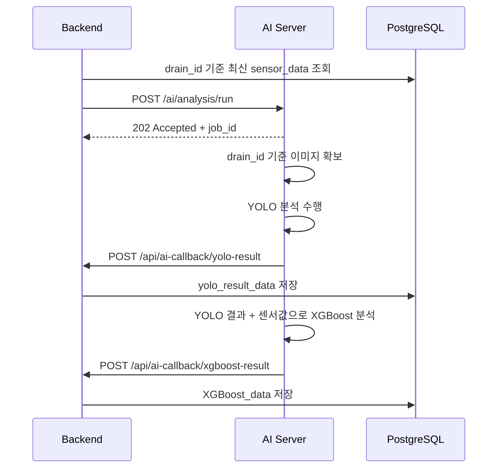

# SmartDrain 백엔드-AI 서버 비동기 분석 API 정리

## 1. 핵심 구조

SmartDrain MVP에서는 백엔드가 AI 서버에 특정 빗물받이의 최신 센서값을 전달하면, AI 서버가 내부적으로 분석 작업을 수행한다.

AI 서버는 결과를 한 번에 반환하지 않는다.

처리 순서는 다음과 같다.

```text
1. Backend → AI Server
   최신 센서값 전달 후 분석 작업 시작 요청

2. AI Server
   drain_id 기준으로 이미지 확보
   MVP: AI 서버 내부 목업 이미지 사용
   향후: AI 서버가 CCTV API 직접 호출

3. AI Server → Backend
   YOLO 분석 결과 callback

4. AI Server
   YOLO 결과 + 센서값 기반 XGBoost 최종 판단

5. AI Server → Backend
   XGBoost 최종 결과 callback
```

---

## 2. 사용 Endpoint

본 구조에서는 endpoint를 3개만 사용한다.

| 방향                  | Method | Endpoint                          | 역할               |
| ------------------- | ------ | --------------------------------- | ---------------- |
| Backend → AI Server | POST   | `/ai/analysis/run`                | 분석 작업 시작         |
| AI Server → Backend | POST   | `/api/ai-callback/yolo-result`    | YOLO 중간 결과 전달    |
| AI Server → Backend | POST   | `/api/ai-callback/xgboost-result` | XGBoost 최종 결과 전달 |

---

## 3. Backend → AI Server 분석 시작 요청

### 3.1 백엔드 조회 기준

백엔드는 `sensor_data` 테이블에서 특정 `drain_id`의 최신 센서 데이터 1건을 조회한다.

`sensor_data` 기준 컬럼은 다음과 같다.

| 컬럼                  | 설명           |
| ------------------- | ------------ |
| `measured_at`       | 센서 측정 시각     |
| `drain_id`          | 빗물받이 ID      |
| `water_level_cm`    | 수위, cm       |
| `flow_velocity_mps` | 유속, m/s      |
| `quality_status`    | 센서 데이터 품질 상태 |

최신 센서값 조회 기준:

```sql
SELECT
  drain_id,
  measured_at,
  water_level_cm,
  flow_velocity_mps,
  quality_status
FROM sensor_data
WHERE drain_id = :drain_id
  AND quality_status = 'valid'
ORDER BY measured_at DESC
LIMIT 1;
```

MVP에서는 목업 빗물받이 4개를 사용하므로, 백엔드는 4개 `drain_id`에 대해 각각 최신 센서값을 조회하고 `/ai/analysis/run`을 개별 호출한다.

batch endpoint는 만들지 않는다.

```text
drain_id = 1 최신값 조회 → /ai/analysis/run 요청
drain_id = 2 최신값 조회 → /ai/analysis/run 요청
drain_id = 3 최신값 조회 → /ai/analysis/run 요청
drain_id = 4 최신값 조회 → /ai/analysis/run 요청
```

---

### 3.2 Request

```http
POST /ai/analysis/run
```

백엔드는 AI 서버에 이미지 경로, snapshot URL, CCTV URL을 전달하지 않는다.
AI 서버는 `drain_id`를 기준으로 자체적으로 이미지 소스를 결정한다.

```json
{
  "request_id": "REQ_20260618_001",
  "drain_id": 2,
  "sensor_data": {
    "measured_at": "2026-06-18T08:36:13+09:00",
    "water_level_cm": 98.13,
    "flow_velocity_mps": 0.4512,
    "quality_status": "valid"
  }
}
```

| 필드                              | 타입     | 필수 | 설명                 |
| ------------------------------- | ------ | -- | ------------------ |
| `request_id`                    | string | Y  | 백엔드가 생성하는 분석 요청 ID |
| `drain_id`                      | number | Y  | 분석 대상 빗물받이 ID      |
| `sensor_data.measured_at`       | string | Y  | 센서 측정 시각           |
| `sensor_data.water_level_cm`    | number | Y  | 수위 값, cm           |
| `sensor_data.flow_velocity_mps` | number | Y  | 유속 값, m/s          |
| `sensor_data.quality_status`    | string | Y  | 센서 데이터 품질 상태       |

---

### 3.3 Response

AI 서버는 분석 결과를 즉시 반환하지 않고, 작업 접수 상태만 반환한다.

```json
{
  "accepted": true,
  "request_id": "REQ_20260618_001",
  "job_id": "AI_JOB_001",
  "status": "processing"
}
```

| 필드           | 타입      | 설명               |
| ------------ | ------- | ---------------- |
| `accepted`   | boolean | 분석 작업 접수 여부      |
| `request_id` | string  | 백엔드가 전달한 요청 ID   |
| `job_id`     | string  | AI 서버가 생성한 작업 ID |
| `status`     | string  | 작업 상태            |

---

## 4. AI 서버 이미지 처리 기준

백엔드는 이미지 관련 값을 전달하지 않는다.

| 구분       | 이미지 처리 방식               |
| -------- | ----------------------- |
| MVP      | AI 서버 내부에 저장된 목업 이미지 사용 |
| 향후 실제 연동 | AI 서버가 CCTV API를 직접 호출  |
| 백엔드 역할   | 이미지 경로 전달하지 않음          |

예시:

```text
drain_id = 1 → AI 서버 내부 mock image 1 사용
drain_id = 2 → AI 서버 내부 mock image 2 사용
drain_id = 3 → AI 서버 내부 mock image 3 사용
drain_id = 4 → AI 서버 내부 mock image 4 사용
```

향후 CCTV API 연동 시에도 백엔드 요청 형식은 유지하고, AI 서버 내부 이미지 확보 방식만 변경한다.

---

## 5. AI Server → Backend YOLO 결과 Callback

### 5.1 Request

```http
POST /api/ai-callback/yolo-result
```

MVP에서는 YOLO callback에서 빗물받이 ID, 촬영 시각, 이미지 경로를 보내지 않는다.

YOLO 결과값은 다음 3개만 전달한다.

```json
{
  "request_id": "REQ_20260618_001",
  "job_id": "AI_JOB_001",
  "yolo_result": {
    "obstruction_ratio": 0.82,
    "confidence_score": 0.94,
    "yolo_status": "blocked"
  }
}
```

| 필드                              | 타입     | 필수 | 설명            |
| ------------------------------- | ------ | -- | ------------- |
| `request_id`                    | string | Y  | 최초 분석 요청 ID   |
| `job_id`                        | string | Y  | AI 서버 작업 ID   |
| `yolo_result.obstruction_ratio` | number | Y  | 막힘 비율, 0~1    |
| `yolo_result.confidence_score`  | number | Y  | YOLO 신뢰도, 0~1 |
| `yolo_result.yolo_status`       | string | Y  | YOLO 판정 상태    |

---

### 5.2 YOLO 상태 코드

MVP에서는 아래 3개 상태만 사용한다.

| 코드        | 의미  |
| --------- | --- |
| `good`    | 양호  |
| `dirty`   | 더러움 |
| `blocked` | 막힘  |

---

### 5.3 Backend 저장 매핑

`yolo_result_data` 저장 기준은 다음과 같다.

| DB 컬럼               | 값 출처                           |
| ------------------- | ------------------------------ |
| `yolo_result_id`    | DB 자동 생성                       |
| `drain_id`          | `request_id`로 백엔드가 조회          |
| `captured_at`       | MVP에서는 저장하지 않거나 nullable 처리 권장 |
| `image_uri`         | MVP에서는 저장하지 않거나 nullable 처리 권장 |
| `obstruction_ratio` | YOLO callback                  |
| `confidence_score`  | YOLO callback                  |
| `yolo_status`       | YOLO callback                  |

현재 테이블에서 `captured_at`, `image_uri`가 `NOT NULL`이면 MVP callback 구조와 충돌한다.
따라서 MVP 기준으로는 아래 중 하나를 선택해야 한다.

| 방식                                     | 설명                        | 권장    |
| -------------------------------------- | ------------------------- | ----- |
| `captured_at`, `image_uri` nullable 처리 | 실제 CCTV 연동 전까지 비워둘 수 있음   | 권장    |
| 백엔드 저장 시각과 임시 이미지 경로 저장                | 테이블 변경 없이 진행 가능하지만 의미가 약함 | 임시 가능 |

---

### 5.4 Response

백엔드는 YOLO 결과 저장에 성공하면 성공 응답을 반환한다.

```json
{
  "success": true,
  "message": "YOLO result saved"
}
```

---

## 6. AI Server → Backend XGBoost 결과 Callback

### 6.1 Request

```http
POST /api/ai-callback/xgboost-result
```

AI 서버는 YOLO 분석 결과와 최초 요청에서 받은 센서값을 기반으로 XGBoost 최종 판단을 수행한다.

XGBoost callback에는 최종 판정 시각 `evaluated_at`을 포함한다.

```json
{
  "request_id": "REQ_20260618_001",
  "job_id": "AI_JOB_001",
  "xgboost_result": {
    "risk_score": 0.91,
    "risk_level": "danger",
    "final_decision": "dispatch_required",
    "evaluated_at": "2026-06-18T08:36:25+09:00"
  }
}
```

| 필드                              | 타입     | 필수 | 설명               |
| ------------------------------- | ------ | -- | ---------------- |
| `request_id`                    | string | Y  | 최초 분석 요청 ID      |
| `job_id`                        | string | Y  | AI 서버 작업 ID      |
| `xgboost_result.risk_score`     | number | Y  | 위험도 점수, 0~1      |
| `xgboost_result.risk_level`     | string | Y  | 위험도 등급           |
| `xgboost_result.final_decision` | string | Y  | 최종 대응 판단         |
| `xgboost_result.evaluated_at`   | string | Y  | XGBoost 최종 판정 시각 |

---

### 6.2 위험도 코드

| 코드        | 의미   |
| --------- | ---- |
| `good`    | 양호   |
| `caution` | 주의   |
| `danger`  | 위험   |
| `unknown` | 판단불가 |

DB에는 코드값을 저장하고, 화면에서는 한글 라벨로 변환하는 것을 권장한다.

---

### 6.3 최종 판단 코드

| 코드                  | 의미       |
| ------------------- | -------- |
| `normal`            | 정상 운영    |
| `monitoring`        | 모니터링 필요  |
| `field_check`       | 현장 확인 필요 |
| `dispatch_required` | 출동 필요    |

---

### 6.4 Backend 저장 매핑

`XGBoost_data` 저장 기준은 다음과 같다.

| DB 컬럼                | 값 출처                             |
| -------------------- | -------------------------------- |
| `xgboost_id`         | DB 자동 생성                         |
| `drain_id`           | `request_id`로 백엔드가 조회            |
| `sensor_measured_at` | 최초 분석 요청에 사용한 센서 측정 시각           |
| `yolo_result_id`     | YOLO callback 저장 후 생성된 ID        |
| `evaluated_at`       | XGBoost callback의 `evaluated_at` |
| `risk_score`         | XGBoost callback                 |
| `risk_level`         | XGBoost callback                 |
| `final_decision`     | XGBoost callback                 |

---

### 6.5 Response

백엔드는 XGBoost 결과 저장에 성공하면 성공 응답을 반환한다.

```json
{
  "success": true,
  "message": "XGBoost result saved"
}
```

---

## 7. 비동기 요청 매핑 기준

YOLO callback과 XGBoost callback은 `drain_id`를 직접 받지 않는다.

따라서 백엔드는 최초 분석 요청 시점에 아래 정보를 저장해야 한다.

| 항목                   | 설명                           |
| -------------------- | ---------------------------- |
| `request_id`         | 백엔드가 생성한 분석 요청 ID            |
| `job_id`             | AI 서버가 반환한 작업 ID             |
| `drain_id`           | 분석 대상 빗물받이 ID                |
| `sensor_measured_at` | 분석에 사용한 최신 센서 측정 시각          |
| `yolo_result_id`     | YOLO callback 저장 후 생성된 결과 ID |

예시:

| request_id         | job_id       | drain_id | sensor_measured_at          | yolo_result_id |
| ------------------ | ------------ | -------: | --------------------------- | -------------: |
| `REQ_20260618_001` | `AI_JOB_001` |        2 | `2026-06-18T08:36:13+09:00` |             15 |

이 매핑이 없으면 백엔드는 callback 결과를 어떤 빗물받이에 저장해야 하는지 알 수 없다.

MVP에서도 서버 재시작이나 callback 지연을 고려하면 메모리 저장보다는 DB 저장을 권장한다.

---

## 8. 전체 시퀀스



---

## 9. MVP 완료 기준

| 항목               | 완료 기준                                                                                  |
| ---------------- | -------------------------------------------------------------------------------------- |
| 분석 시작 요청         | 백엔드가 `/ai/analysis/run`으로 최신 센서값 전달                                                    |
| 이미지 처리           | AI 서버가 내부 목업 이미지 사용                                                                    |
| YOLO callback    | AI 서버가 막힘 비율, 신뢰도, 판정 상태 전달                                                            |
| YOLO 저장          | 백엔드가 `yolo_result_data`에 저장                                                            |
| XGBoost callback | AI 서버가 위험 점수, 위험 등급, 최종 판단, 판정 시각 전달                                                   |
| XGBoost 저장       | 백엔드가 `XGBoost_data`에 저장                                                                |
| 요청 매핑            | 백엔드가 `request_id`, `job_id`, `drain_id`, `sensor_measured_at`, `yolo_result_id`를 연결 관리 |
| endpoint 수       | 3개만 사용                                                                                 |

---

## 10. 최종 확정 사항

```text
백엔드는 AI 서버에 센서 최신값만 전달한다.

백엔드는 이미지 URL, snapshot URL, CCTV URL을 전달하지 않는다.

AI 서버는 drain_id를 기준으로 이미지 소스를 직접 결정한다.

MVP에서는 AI 서버 내부 목업 이미지를 사용한다.

향후 실제 연동에서는 AI 서버가 CCTV API를 직접 호출한다.

AI 서버는 YOLO 결과를 먼저 callback으로 보낸다.

AI 서버는 이후 XGBoost 최종 결과를 callback으로 보낸다.

YOLO 결과 ID와 XGBoost 결과 ID는 DB에서 자동 생성한다.

YOLO callback은 실제 분석 결과 3개만 전달한다.

XGBoost callback은 최종 판정 시각 evaluated_at을 포함한다.
```
