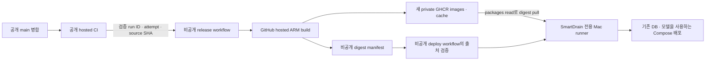

# Plan 06. 공개 소스와 비공개 배포 이미지 운영

> 상태: **검토 후 미채택 · 분석 기록 보관**. 2026-10-04 조사 후 사용자가 공개 이미지 배포를 유지하고 보안 기초 점검을 기록하기로 결정했다. 아래 내용은 당시 비공개 전환 대안과 구현 조건이며, 현재 적용할 계획이나 구현 완료 기록이 아니다. workflow·패키지 권한·운영 컨테이너는 변경하지 않았다.

현재 운영 판단과 확인된 보안 문제·후속 검증은 [공개 이미지 보안 기초 점검](../steps/step-06-public-image-security-review.md)을 기준으로 확인한다. 이 문서는 실제 파일, GitHub API, GHCR 익명 접근, Mac 컨테이너를 조사한 당시 분석을 보관한다.

## 1. 당시 요청 배경과 제안의 완료 조건

개인 Fork의 소스는 공개하되, 직접 게시한 배포 이미지와 빌드 캐시는 소유자와 허용된 배포 작업만 다운로드할 수 있어야 한다. 현재 공개 이미지 게시 구조와 미완성 Mac CD를 구분하고, 추가로 필요한 권한·인증·배포 출처·운영 경로를 분석한다.

구현 후 완료 조건은 새 패키지의 익명 pull 거부, 허용된 작업의 digest pull 성공, 공개 repo/fork의 패키지 접근 차단, 기존 PostgreSQL과 모델을 유지하는 Mac 배포다. 공개 소스로 타인이 자신의 이미지를 빌드하는 것까지 막는 요구는 아니다.

## 2. 현재 구현과 조사 근거

조사 시작 branch는 `dev`, HEAD는 `f003d1c`, 작업 트리는 clean이었다. 개인 Fork의 원격 main은 `9b85e3dc62d9d7164d594f9961a1309f3f758eee`다. 로컬 main은 여전히 `upstream/main`을 추적하므로 적용 대상은 개인 Fork의 `origin/main`으로 명시한다.

| 대상 | 실제 확인 결과 | 수정에 미치는 영향 |
| --- | --- | --- |
| Release | [main 실행 37193646542](https://github.com/yellow-pang/smartdrain-agent-upgrade/actions/runs/37193646542)에서 CI, 세 ARM 이미지 게시, manifest 성공. Mac dispatch는 skipped | 게시 성공을 운영 배포 성공으로 해석하지 않음 |
| GHCR 이미지 | `smartdrain-backend`, `smartdrain-ai`, `smartdrain-frontend`의 해당 main tag/index/platform manifest와 앱 layer HEAD가 익명 HTTP 200 | 기존 패키지 이름을 새 비공개 패키지로 전환해야 함 |
| GHCR 캐시 | 세 패키지의 `buildcache-arm64` manifest와 마지막 cache layer HEAD가 모두 익명 HTTP 200 | runtime 이미지와 cache ref를 함께 전환 |
| 공개 repo 설정 | 자동배포 variable 미등록, Secret 이름은 `COMPOSE_FRONTEND_KAKAO_MAP_APP_KEY`만 존재, environment 없음 | dispatch 권한과 main 제한 environment를 준비해야 함 |
| 예정 운영 repo | 소유자 계정의 `yellow-pang/mac-mini-deploy` API 조회 404, 계정 repo 목록에도 없음 | 현재 계정 조회상 생성되지 않은 상태. receiver 구현을 확인할 대상이 없음 |
| Mac 실행 | `smartdrain-mac-{backend,ai-service,frontend}` 로컬 이미지로 실행. db/nginx 포함 다섯 서비스 healthy | 공개 최신 이미지와 실행 artifact의 동일성은 미검증 |
| 실제 bind/volume | nginx와 YOLO 모델은 개발 checkout의 파일을 read-only bind. DB volume은 `smartdrain-mac_postgres_data` | 배포 파일 경로를 분리하되 project/volume을 유지 |
| 준비된 운영 root | `/Users/tro/apps/smartdrain`에 `.env`, 모델, 과거 Compose 사본과 DB dump 있음. 실제 live bind 원본은 아님 | 준비와 적용을 구분. 모델 hash·백업 복구 가능성은 별도 검증 |
| Mac runner | 실행 중인 두 runner는 다른 프로젝트 repo 전용. SmartDrain 운영 repo/runner는 확인되지 않음 | 기존 runner를 재등록하지 않고 전용 runner 준비 |
| Docker 인증/연결 | 현재 기본 Docker config에 GHCR auth 항목 없음. OrbStack endpoint는 `unix:///Users/tro/.orbstack/run/docker.sock`, CLI 29.4.0, Compose 5.1.2 | 작업별 인증 분리와 비대화형 runner 연결 검증 필요 |

확인한 구현은 `.github/workflows/{ci,release}.yml`, `docker-compose.yml`, `.env.example`, `.dockerignore`, 세 서비스 Dockerfile, `.jenkins/scripts/deploy.sh`다. `.dockerignore`에는 루트 `.env*`, `.aws`, 일반 key 파일과 AI 모델 `.pt`의 제외 규칙이 있다. 후속 보안 점검에서 하위 민감 경로의 제외 공백을 확인했으므로 전체 경로가 보호된다고 해석하지 않는다. 운영 환경의 실제 secret 값은 출력하거나 문서에 기록하지 않았다.

기존 [Plan 04](plan-04-github-actions-cicd.md)는 public build + private Mac CD를 제안했고 package를 private로 운영하려 했다. 현재 public CI/게시와 Compose image 변수는 구현되었지만, 실제 package는 공개이고 private CD는 준비되지 않았다. 당시 수치와 경로의 미준비 표시는 역사적 조사 결과다. [운영 런북](../verification/17_배포_운영_런북.md)의 초기 설정 안내도 실제 등록 완료를 뜻하지 않는다.

## 3. 새로 확인한 제약과 남은 미확인 항목

GHCR 패키지는 한 번 Public으로 바꾸면 Private으로 되돌릴 수 없다. 기존 이름의 visibility만 변경하는 방안은 사용할 수 없다. 공개 repo의 Actions에 private package 접근을 부여하면 fork도 접근할 가능성이 있다는 공식 주의점이 있다. 따라서 패키지 권한의 public repo 상속·Actions access까지 다뤄야 한다. [GitHub 접근 제어 문서](https://docs.github.com/en/packages/learn-github-packages/configuring-a-packages-access-control-and-visibility)

| 미확인 항목 | 현재 확인하지 못한 이유 | 구현 전/중 확인 방법 |
| --- | --- | --- |
| 기존 package의 세부 ACL, 새 이름 사용 가능 여부 | 현재 gh 인증에 `read:packages` scope가 없어 package 관리 API 403 | 소유자 Package settings 또는 적절한 package 권한으로 확인. 기존 로그인 scope를 임의 확대하지 않음 |
| private repo의 실제 workflow/runner/환경 보호 기능 | repo가 계정 조회에 없음 | 승인 후 repo 준비, default branch/main workflow 존재와 전용 runner 등록 확인 |
| 계정의 private Actions 잔여 minutes·과금 설정 | user API의 plan 값이 null, billing 화면은 조회하지 않음 | 계정 Billing에서 allowance·budget 확인. 비공개 environment 지원도 확인 |
| private ARM cold build의 시간·메모리·여유 공간 | 현재 성공 run의 backend/AI build는 짧고 캐시가 있었음 | 새 private cache로 첫 ARM build, 실제 자원·소요 시간 기록 |
| SmartDrain runner의 OrbStack 접근과 PATH | 기존 다른 repo runner 존재는 SmartDrain 실행 권한을 증명하지 않음 | 등록된 runner job에서 Docker/Compose/socket/Python 사전 검증 |
| 인증된 private pull과 실제 CD | 아직 새 private package/receiver가 없음 | private 게시 후 운영 변경 없는 pull·후보 AI smoke, 이어 통제된 첫 적용 |

기본 Docker config에 auth가 없다는 결과는 다른 `DOCKER_CONFIG`나 Keychain에도 인증 정보가 없다는 뜻이 아니다. 모델 파일의 존재/크기와 DB dump 존재는 내용 hash 일치나 복구 성공을 증명하지 않는다.

## 4. 구현 대안 비교

| 대안 | 장점 | 비용·제약 | 판단 |
| --- | --- | --- | --- |
| 공개 workflow의 `GITHUB_TOKEN`으로 새 private package 게시 | workflow 이동 최소, 공개 hosted build 유지 | public repo Actions access·권한 상속과 fork 접근 가능성을 관리해야 함 | 개인 전용 다운로드 목표의 기본안으로 추천하지 않음 |
| 공개 main의 제한된 job에서 PAT classic으로 게시, package ACL은 독립 설정 | 공개 hosted build 유지, 변경 범위가 작음 | 장기 `write:packages` Secret 관리·회전 필요. 공개 source label/상속 제거와 public Actions access 배제 필수 | 비용·작은 변경 범위를 우선할 때 대안 |
| 공개 CI 유지 + 비공개 운영 repo에서 ARM 게시와 Mac CD | 공개 repo/fork에 package 접근을 주지 않음. build/pull에 작업별 `GITHUB_TOKEN` 사용 | private repo/workflow 준비, private hosted build minutes와 자원 검증 필요 | **추천** |

권장안은 Plan 04에서 예정한 비공개 운영 repo를 활용해 게시 권한도 함께 소유하게 한다. 다른 registry, 새 배포 프레임워크, 앱 코드 재설계는 필요하지 않다. PAT를 사용하는 대안에서 GHCR 인증은 fine-grained PAT가 아닌 PAT classic을 사용해야 한다. 배포 호출용 fine-grained PAT와 registry 인증용 PAT는 별도 역할이다. [GHCR 인증 문서](https://docs.github.com/en/packages/working-with-a-github-packages-registry/working-with-the-container-registry)

## 5. 추천 실행 흐름과 권한

첫 검증 때는 비공개 release의 게시까지만 수동 실행하고 자동 Mac 배포는 비활성화한다. 이미 성공한 private build run은 deploy workflow에서 재사용하며 AI 이미지를 다시 빌드하지 않는다.

| 위치/작업 | 필요한 권한 | 제공하지 않는 권한 |
| --- | --- | --- |
| 공개 PR/main CI와 수동 build-only | `contents: read` | package 접근, 운영 secret, Mac runner |
| 공개 main의 private release 호출 | 운영 repo 하나의 Actions write를 가진 fine-grained dispatch token | registry 읽기/쓰기 credential |
| 비공개 ARM build | job의 `GITHUB_TOKEN`, `contents: read`, `packages: write` | 운영 `.env`, DB·모델, Mac Docker 접근 |
| 비공개 release의 deploy 호출 | 해당 repo `actions: write`를 이 job에만 부여 | package write, Mac 직접 실행 |
| 비공개 deploy 검증/Mac job | artifact 확인용 `actions: read`, 필요한 `contents: read`, Mac pull용 `packages: read` | package 게시/삭제 권한 |

`GITHUB_TOKEN`은 job별로 생성되고 job 종료 시 만료된다. package 연결·Actions access는 비공개 운영 repo로 한정하고 공개 소스 repo에는 부여하지 않는다. [GitHub token 문서](https://docs.github.com/en/actions/concepts/security/github_token)

새 package 이름 후보는 `ghcr.io/yellow-pang/smartdrain-private-{backend,ai,frontend}`다. 이름의 `private` 문자열이 권한을 설정해 주는 것은 아니다. 새 이름으로 최초 게시 후 Private visibility와 비공개 repo 연결을 확인한다. Cache도 같은 새 package의 `:buildcache-arm64`로 전환한다.

## 6. 수정하거나 추가할 예상 파일

| 위치 | 변경 내용 | 변경 이유 |
| --- | --- | --- |
| 공개 `.github/workflows/release.yml` | main의 package write/login/push/public cache/manifest를 제거하고 CI 후 private release 요청. 수동 build-only 유지 | 공개 repo에 private package 접근 권한을 주지 않음 |
| 공개 `.github/workflows/ci.yml` | 기존 CI는 유지, 최종 gate가 source 검증에 사용 가능한지 확인 | main의 검사 결과를 재사용하고 동일 SHA의 불필요한 중복 CI 방지 |
| 공개 `docker-compose.yml`, `.env.example` | 기존 image 변수와 동일 backend/migrate/seed 계약 재사용. 기본적으로 수정 불필요 | 이미 digest reference를 주입할 수 있음 |
| 공개 `docs/verification/17_배포_운영_런북.md`, 필요한 README | 게시 위치·권한·run 식별자·첫 적용·재배포 안내 갱신 | 공개 run 성공 의미와 실제 Mac 적용 구분 |
| 비공개 `.github/workflows/release-smartdrain.yml` | source 검증 → 기존 세 ARM build → private cache/push → manifest → 조건부 deploy 요청 | 게시 소유권 이동, 기존 Dockerfile/target/platform/action 고정 재사용 |
| 비공개 `.github/workflows/deploy-smartdrain.yml` | 자동 요청/수동 재배포 수신, private build run·manifest 검증, 전용 Mac job | 성공한 게시 결과를 다시 빌드하지 않고 적용 |
| 비공개 `scripts/release_manifest.py`, `scripts/validate_release.py` | manifest 생성과 source/build 출처·digest·attempt 검증 | workflow 이동으로 달라지는 SHA/run 의미를 명시적으로 처리 |
| 비공개 `scripts/deploy-smartdrain.sh` | job별 registry 인증, digest pull, 후보 검증, migration, Compose 적용과 결과 기록 | 현재 Jenkins script의 서버 build와 Linux 경로를 재사용할 수 없음 |
| 비공개 검증 테스트 | 허용하지 않은 repo/SHA/package/run/attempt, 만료 artifact, 인증 실패의 거부 경로 | 운영·package 권한 경계의 회귀 방지 |

외부 repo의 정확한 파일 배치는 생성/기존 구조 확인 후 확정한다. 현재 공개 repo에 private 운영 workflow를 임시 복사해 실행하지 않는다.

## 7. 핵심 코드 변경 사항

### 7.1 source SHA와 build 실행 식별자 분리

현재 workflow는 `${{ github.sha }}`를 앱 SHA, image tag, revision, manifest SHA로 함께 사용한다. workflow를 private repo로 옮기면 이 값은 **운영 repo commit**이 된다. 검증된 `source_sha`로 공개 소스를 checkout하고, build context를 그 source 디렉터리로 제한하며 tag/revision에는 source SHA를 쓴다.

manifest는 schema 2로 바꾸고 다음 의미를 구분한다.

- source: 고정 public repo, 검증된 main SHA, public CI run ID/attempt와 workflow.
- build: 고정 private repo, 실행한 workflow SHA/path, private build run ID, service별 build attempt와 manifest attempt.
- images: 고정된 세 새 package의 `@sha256:<64자리 hex>`와 `linux/arm64`.

현재 `smartdrain-<service>` 정규식과 단일 `run_id` 계약을 그대로 복사하면 안 된다. 게시자와 수신자를 함께 갱신하고 schema 1을 조용히 새 의미로 해석하지 않는다. 서비스별 artifact 이름과 같은 run의 성공 build 재사용은 유지한다.

공개 repo를 가리키는 `org.opencontainers.image.source` label은 그대로 옮기지 않는다. private workflow의 자동 package 연결을 확인하고, 실제 공개 앱 출처는 manifest 및 별도 label에 기록한다. 공개 repo 권한 상속을 다시 만들지 않는다.

현재 Frontend용 `COMPOSE_FRONTEND_KAKAO_MAP_APP_KEY` Secret은 공개 repo에만 있다. private publisher의 Frontend job에서 사용하려면 해당 private repo에 다시 등록해야 한다. GitHub API로 기존 Secret 원문을 꺼내 옮길 수 없으므로 실제 값의 등록은 별도 설정 작업이다. public CI/수동 build-only에는 기존 CI와 같은 placeholder/빈 공개 빌드값을 사용하고 운영 키를 전달하지 않는다.

### 7.2 trigger와 성공 의미 분리

public main의 CI 성공 후 고정 private workflow/ref로 run ID/attempt/SHA만 보낸다. private receiver는 입력을 믿지 않고 API로 고정 source repo/workflow, `push`, `main`, SHA, 최신 attempt 성공을 확인한 뒤 build한다. 공개 source metadata 조회 방법과 API rate limit을 검증하고 실패 시 진행하지 않는다.

public 호출 job은 private build 완료를 기다리지 않는다. private source 검증은 public run 종료를 제한 시간 동안 기다릴 수 있다. 같은 방식으로 private release는 deploy 요청 접수 후 끝나고 deploy receiver가 build run 완료를 확인한다. 호출자와 수신자가 서로 완료를 기다리는 구조를 만들지 않는다.

기존 public 자동배포 flag가 private 이미지 게시까지 막지 않도록 역할을 분리한다. public의 `SMARTDRAIN_PRIVATE_RELEASE_ENABLED`는 새 private 게시 요청 활성화, private의 `SMARTDRAIN_AUTO_DEPLOY_ENABLED`는 Mac 자동 적용 활성화로 제안한다. flag가 꺼졌거나 인증이 실패하면 기존 public 게시나 로컬 build로 fallback하지 않는다.

public main 호출 token은 main만 허용하는 `release` environment에 둔다. workflow/default branch 및 main 보호 규칙은 실제 설정한다. private deploy도 trusted main에서만 실행하고 최신 public main SHA를 적용 직전에 다시 확인한다. 전용 runner에는 PR job을 배정하지 않는다.

### 7.3 registry credential을 Mac 작업에만 전달

Mac job의 `packages: read` token을 `docker login --password-stdin`에 사용한다. 운영 `.env`, image build argument, artifact, 앱 컨테이너 환경에는 registry token을 넣지 않는다. [Docker login 문서](https://docs.docker.com/reference/cli/docker/login/)

job 전용 임시 `DOCKER_CONFIG`와 제한된 파일 권한, 성공/실패 정리를 사용한다. 공유 `~/.docker/config.json`을 덮어쓰거나 공유 GHCR 로그인에 logout하지 않는다. macOS의 helper 자동 탐지가 공용 Keychain을 사용할 수 있으므로 임시 디렉터리만 바꾸면 인증 저장도 격리된다고 가정하지 않는다. 설치된 CLI 29.4.0의 config 로딩/`ContainsAuth` 동작을 확인했으며, 초기 `{"auths":{"ghcr.io":{}}}` 설정으로 helper 자동 탐지를 피하는 방안을 구현 시 검증한다. [CLI 로딩 코드](https://github.com/docker/cli/blob/v29.4.0/cli/config/config.go), [인증 설정 판정 코드](https://github.com/docker/cli/blob/v29.4.0/cli/config/configfile/file.go)

인증 config를 바꾸면 기존 OrbStack context도 자동으로 따라오지 않는다. 변경 전에 확인한 socket을 같은 작업에서 `DOCKER_HOST`로 명시하고 충돌하는 `DOCKER_CONTEXT`를 제거하거나, 검증된 동등한 연결 방식을 사용한다. 임시 config에서 Compose plugin 탐색도 확인한다. [Docker CLI 환경 설정](https://docs.docker.com/reference/cli/docker/)

### 7.4 digest pull 이후 기존 서비스에 적용

세 image 변수가 모두 새 private package의 허용된 digest인지 검사한다. 운영 변경 전에 전부 pull하고 platform/소스 revision·manifest 대응을 확인한다. 후보 AI는 기존 기준 hash의 모델을 read-only mount하여 `--verify-reference` smoke를 통과해야 한다.

Compose는 항상 `-p smartdrain-mac`, 명시한 env/Compose 경로를 사용한다. pull 뒤 `--no-build --pull never`로 이미지를 적용하고 migration 순서는 Plan 04의 기존 절차를 따른다. backend/migrate/seed는 같은 backend digest를 사용하지만 seed는 자동 실행하지 않는다.

현재 DB volume `smartdrain-mac_postgres_data`, `127.0.0.1:8099`, 내부 API/callback/WS 계약을 유지한다. 모델은 준비된 운영 root에서 hash를 확인하고 nginx는 검증된 release별 절대경로를 read-only bind한다. 개발 checkout/runner `_work` 파일을 live bind 원본으로 삼지 않는다.

## 8. 단계별 작업 계획

1. **Private 게시 준비:** private repo와 main workflow, 새 package 이름/접근 정책 준비. 현재 성공한 public main CI run으로 private publisher를 수동 실행하고 새 cache를 사용한 ARM build를 검증한다. Mac 컨테이너는 유지한다.
2. **공개 publisher 전환:** public main의 직접 push를 private release 요청으로 교체하고 보호된 dispatch token/게시 flag를 준비한다. 새 main CI에서 private 게시까지 확인한다. 기존 public package에 신규 image/cache를 게시하지 않는다.
3. **Mac 적용 전 검증:** SmartDrain 전용 runner, OrbStack 연결, job별 인증 정리, digest pull, 모델 hash, 후보 추론, nginx 설정과 공간을 확인한다. 자동 적용 flag는 비활성화한다.
4. **통제된 첫 적용:** 성공한 private build run을 deploy workflow에 수동 입력하여 기존 DB/project를 유지하고 적용한다. 실제 digest/volume/bind/health/API/image/WS를 비교하고 성공 release를 기록한다.
5. **자동화 활성화:** 첫 적용 검증 후 private 자동배포 flag를 활성화한다. 다음 실제 main 병합에서 public CI → private 게시 → authenticated Mac 배포를 확인한다.

각 단계는 별도 실패 원인을 확인할 수 있게 기록한다. 토큰/권한 오류는 운영 변경 전에 실패시키며, 실패한 apply는 checkpoint와 직전 성공 release를 보존한다. migration 이후 이미지 복귀가 schema 복귀를 의미하지 않으므로 자동 rollback을 약속하지 않는다.

## 9. 범위·예상 영향·위험

분석 결과 권장 변경 범위는 CI 게시 책임 이동, 새 private package/cache, manifest 계약, 인증된 Mac CD와 운영 문서다. 실제 적용은 사용자 계획 승인 후 진행한다.

앱 코드·API·WS·callback·DB schema/Alembic·의존성·Dockerfile·Nginx 내용·공개 포트·Cloudflare·다른 프로젝트 runner·공용 Docker 인증 설정은 변경 대상이 아니다. 기존 Compose image 계약을 재사용한다. Dockerfile/build 의존성을 바꾸지 않아도 workflow 실행 저장소와 registry 권한 변경은 필요하다.

기존 public 패키지와 과거 cache는 새 private 게시로 사라지지 않는다. 과거 배포물 삭제는 별도 결정이며 이미 다운로드된 복사본은 회수할 수 없다. registry 비공개는 Kakao JavaScript 키를 브라우저에서 숨기는 기능도 아니다.

Private `ubuntu-24.04-arm`은 현재 2 CPU/8 GB RAM, public은 4 CPU/16 GB이며 둘 다 표기 SSD 14 GB다. private Actions는 계정 minutes를 사용하므로 캐시가 있는 현재 성공 run의 짧은 시간만으로 비용·cold build 성공을 보장하지 않는다. [Hosted runner 문서](https://docs.github.com/en/actions/reference/runners/github-hosted-runners)

GHCR container image 저장·전송은 현재 무료다. generic private Packages quota를 GHCR image에 그대로 적용하지 않는다. private Actions minutes/artifact 사용량과 계정 budget은 별도 확인한다. [Packages 과금 문서](https://docs.github.com/en/billing/concepts/product-billing/github-packages)

## 10. 검증 계획과 통과 기준

| 검증 | 통과 기준 |
| --- | --- |
| 문법/회귀 | workflow YAML, shell, Python 문법과 source/build 계약 테스트 통과 |
| private 권한 | 허용 token으로 동일 digest/cache 확인 성공, 익명/공개 repo token 접근 거부. visibility와 Actions access도 확인 |
| source/manifest 거부 경로 | 다른 repo/workflow/branch/SHA, 실패·취소·오래된 attempt, 다른 package/platform, artifact 누락/만료를 운영 변경 전에 거부 |
| 재시도/전달 | 부분 build 재실행에서 같은 source/build run만 사용. 게시 재빌드 없이 manual deploy 가능. bounded wait 종료와 호출 성공 의미 확인 |
| Mac 인증 분리 | 기존 Docker config/Keychain 인증을 건드리지 않음. 임시 token/config 정리, OrbStack/Compose 접근 성공, token 로그·artifact·컨테이너 환경 노출 없음 |
| pull 실패 | 권한 부족·누락 credential·manifest 불일치에서 현 컨테이너 유지, public image/local build fallback 없음 |
| 첫 실제 적용 | 세 digest 일치, 기존 DB volume 및 project 유지, 모델 hash/bind/health/실제 추론/API/image/WS 통과 |
| 자원/동시성 | 첫 private ARM cold build와 disk/time 측정. 배포 concurrency 취소 금지와 Mac project lock 검증 |

현재 분석 단계에서는 API/익명 manifest·HEAD/컨테이너 inspect와 정적 파일 조사만 실행했다. private 게시·인증된 pull·runner job·운영 교체·backup restore·원격 빌드 검증은 실행하지 않았다. 해당 검증은 아직 준비되지 않은 private repo/package/runner를 구성한 뒤 수행한다. 조사 중 sandbox의 Docker/ps 접근 제한과 runner 설정 BOM 파싱은 읽기 방법을 조정해 해결했으며 앱 장애로 분류하지 않는다.

## 11. 구현 전에 확정할 결정과 후속 작업

이 절은 비공개 전환을 다시 선택할 경우에만 필요한 조건이다. 현재는 공개 운영 유지로 결정하여 아래 전환 작업을 진행하지 않는다.

승인이 필요한 결정은 권장안의 비공개 운영 repo 생성/사용과 게시 책임 이동, 새 package 이름·ACL, dispatch secret 전달 및 workflow flags, Mac 전용 runner와 첫 운영 적용이다. 최초 전환을 검증한 뒤에는 CI와 출처 검증을 통과한 main을 자동으로 배포하는 것이 목표다.

공개 hosted build 유지가 우선이면 §4의 PAT classic 대안으로 Plan을 바꾼 뒤 구현할 수 있다. private build 자원/요금 확인 결과가 선택에 영향을 줄 수 있다.

기존 공개 package/cache 삭제 여부, 장기 사용하지 않는 공개 repo Secret 정리, AI image 용량 최적화·의존성 pinning, 토큰 회전 자동화는 별도 후속 범위다. 이 Plan 작성으로 remote 설정·branch·commit·push·PR·운영 서비스를 변경하지 않는다.
