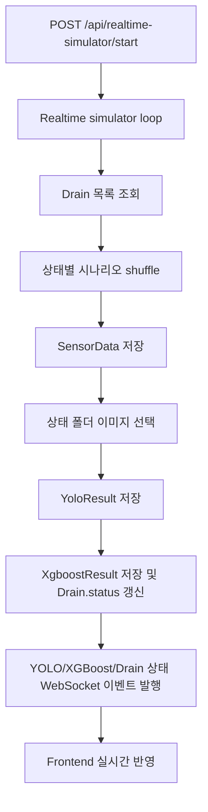

# PR 02. Scenario Based Realtime Simulator

## PR 제목

feat(backend): 상태별 시나리오 실시간 시뮬레이터 구현

## 변경 목적

사용자가 준비한 사진을 상태별 폴더에 넣으면, backend 자동 시뮬레이터가 `양호`, `주의`, `위험`, `판단불가` 시나리오 데이터를 DB에 저장하고 기존 WebSocket 흐름으로 대시보드를 갱신할 수 있게 한다.

이 PR은 PR 01에서 추가한 자동 모드 제어 기반 위에서 동작한다. PR 01이 start/stop/status와 화면 제어를 담당하고, PR 02는 실제 시연용 데이터 생성 방식을 완성한다.

## 주요 변경

| 영역 | 내용 |
| --- | --- |
| 시나리오 생성 | `good`, `caution`, `danger`, `unknown`별 센서값, 막힘률, 신뢰도, 위험 점수 범위 정의 |
| DB 저장 | 자동 tick마다 `sensor_data`, `yolo_results`, `xgboost_results`, `drains.status` 직접 저장 |
| 이미지 연결 | 상태별 이미지 폴더에서 파일을 무작위 선택해 `/api/mock-images/scenarios/...` URL로 저장 |
| WebSocket | `YOLO_RESULT_UPDATED`, `XGBOOST_RESULT_UPDATED`, `DRAIN_STATUS_UPDATED` 이벤트 발행 |
| 문서 | backend README, mock 이미지 README, steps 문서에 사용 경로와 제한사항 기록 |

## 영향받는 범위

| 범위 | 영향 |
| --- | --- |
| Backend realtime simulator | 외부 AI Service 호출 대신 시연용 synthetic 결과를 직접 저장 |
| 기존 수동 분석 API | 변경 없음. `POST /api/analysis/async-run`은 기존 AI callback 통합 검증용으로 유지 |
| DB schema | 변경 없음. 기존 테이블만 사용 |
| Frontend | 코드 변경 없음. 기존 WebSocket 이벤트 수신 구조를 그대로 사용 |
| Mock 이미지 데이터 | 상태별 이미지 배치 폴더 추가 |

## 구현 흐름



## 이미지 배치 경로

```text
mock_data/ai_image_samples/scenarios/good/
mock_data/ai_image_samples/scenarios/caution/
mock_data/ai_image_samples/scenarios/danger/
mock_data/ai_image_samples/scenarios/unknown/
```

| 폴더 | 화면 상태 | DB/API 값 |
| --- | --- | --- |
| `good` | 양호 | `good` |
| `caution` | 주의 | `caution` |
| `danger` | 위험 | `danger` |
| `unknown` | 판단불가 | `unknown` |

지원 확장자는 `.jpg`, `.jpeg`, `.png`, `.webp`다. 폴더가 비어 있으면 `image_url`은 `null`로 저장하고, 센서/분석 결과 저장은 계속한다.

## 검증 결과

| 항목 | 결과 |
| --- | --- |
| `python -B -c "ast.parse(... realtime_simulator.py ...)"` | 통과. 변경 파일 문법 파싱 성공 |
| `git diff --check` | 통과 |
| `python -m compileall app` | 실패. 기존 `__pycache__` 파일 교체 권한 문제로 `PermissionError: [WinError 5]` 발생 |
| `python -B -c "from app.services import realtime_simulator ..."` | 실패. 로컬 Python 환경에 `sqlalchemy` 미설치 |

## 리뷰 포인트

- 시나리오 모드는 실제 AI 분석 결과가 아니라 시연용 synthetic 결과를 직접 저장한다.
- 외부 AI Service 통합 흐름은 기존 수동 분석 API로 분리해 유지한다.
- `unknown`은 `판단불가` 상태를 나타내며, 기존 DB/API 상태값과 맞추기 위해 그대로 사용한다.
- 상태별 폴더에 사진이 없어도 기능은 계속 동작하지만, 화면의 최신 이미지는 비어 있을 수 있다.
- 이미지 파일명은 URL에 포함되므로 영문, 숫자, 하이픈 중심으로 두는 편이 안전하다.

## 관련 문서

- `docs/plans/plan-01-realtime-dashboard-manual-auto-mode.md`
- `docs/steps/step-01-realtime-dashboard-manual-auto-mode.md`
- `docs/pr/pr-01-realtime-dashboard-manual-auto-mode.md`
- `docs/plans/plan-02-scenario-based-realtime-simulator.md`
- `docs/steps/step-02-scenario-based-realtime-simulator.md`

## 남은 위험

- 의존성 및 DB가 준비된 backend 환경에서 start/status/API smoke를 추가 확인해야 한다.
- `ai_service` 일부 문서에는 `drain_5.jpg`를 의도적 누락으로 설명하는 오래된 문구가 남아 있어, 별도 문서 정리 작업에서 정합성을 맞추는 것이 좋다.
- 자동 모드 start/stop API의 인증·권한 제어는 아직 없다.
