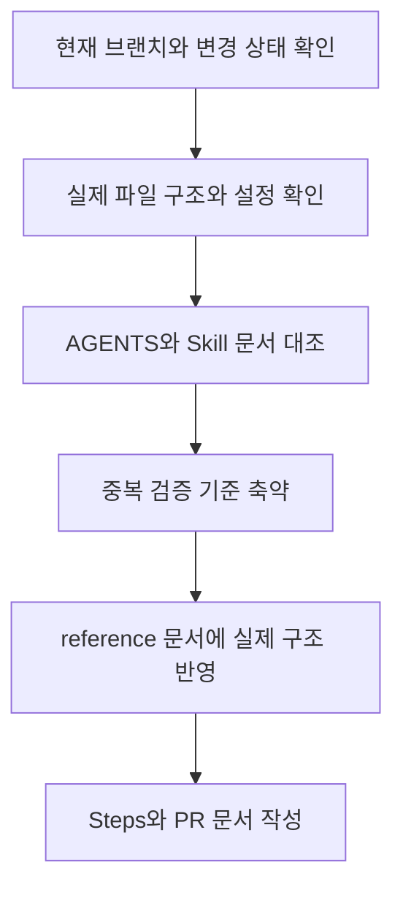

# PR 03. Codex Agent Guidelines Alignment

## PR 제목

docs: SmartDrain Codex 지침 정합성 보정

## 변경 목적

현재 저장소에 추가한 Codex 에이전트 지침과 프로젝트 전용 Skill 문서가 실제 SmartDrain 구조, 실행 명령, 검증 기준, 문서 작성 규칙과 맞도록 교정한다.

이번 변경은 애플리케이션 동작 변경이 아니라 문서와 지침의 기준 정렬이다.

## 주요 변경

| 영역 | 내용 |
| --- | --- |
| 루트 지침 | 사용자 요청과 완료 조건 비교, 의도 불일치 시 확인 순서, 회귀 테스트 우선 원칙 추가 |
| 서비스별 지침 | 검증 상세 기준을 `docs/reference/verification-guide.md` 중심으로 정리 |
| Frontend 검증 | `package.json` 실제 script와 TypeScript 직접 실행 명령을 구분 |
| Backend 검증 | 현재 pytest 구성이 확인되지 않는 점을 반영해 pytest를 조건부 후보로 조정 |
| AI Service 검증 | `ai_service/pytest.ini`, `ai_service.http.app:app` 기준 반영 |
| Skill 문서 | 4개 Skill에 YAML front matter `name`, `description` 추가 |
| 문서 생성 조건 | 작은 수정은 Plans/Steps 생략 가능, PR은 명시 요청 시 작성하도록 정리 |
| 저장소 구조 | `mock_ai_server/`, Compose 서비스명, Jenkins 파일 위치 반영 |

## 영향받는 범위

| 범위 | 영향 |
| --- | --- |
| `AGENTS.md` | 저장소 전체 Codex 작업 기준 보강 |
| `frontend/AGENTS.md` | Frontend 작업 시 검증 기준과 script 해석 명확화 |
| `backend/AGENTS.md` | Backend 테스트 구성 부재와 실행 진입점 반영 |
| `ai_service/AGENTS.md` | AI Service pytest 설정과 실행 진입점 반영 |
| `.agents/skills/*/SKILL.md` | Skill 식별 정보와 문서 생성 조건 보정 |
| `docs/reference/*` | 실제 저장소 구조, 문서 정책, 검증 기준 정렬 |

영향받지 않는 범위:

- Frontend, Backend, AI Service 애플리케이션 코드
- 패키지 의존성 및 lockfile
- Dockerfile, Docker Compose, Nginx, Jenkins 실행 설정
- DB schema 및 Alembic migration
- API, WebSocket, AI callback 계약

## 구현 흐름

## 주요 변경 파일

| 파일 | 핵심 변경 |
| --- | --- |
| `AGENTS.md` | 공통 안전 원칙, 사용자 의도 확인, Plans 생략 기준 보강 |
| `frontend/AGENTS.md` | `verification-guide.md` 참조와 실제 script 기준 추가 |
| `backend/AGENTS.md` | 실행 진입점과 pytest 조건 보정 |
| `ai_service/AGENTS.md` | 실행 진입점과 pytest 설정 기준 보정 |
| `.agents/skills/task-planning/SKILL.md` | front matter와 Plans 작성 조건 보정 |
| `.agents/skills/implementation-workflow/SKILL.md` | front matter와 Steps 작성 조건 보정 |
| `.agents/skills/steps-documentation/SKILL.md` | front matter와 Steps 생략 조건 보정 |
| `.agents/skills/pr-documentation/SKILL.md` | front matter 추가 |
| `docs/reference/repository-structure.md` | 실제 디렉터리, Compose 서비스, Jenkins 구조 반영 |
| `docs/reference/documentation-policy.md` | 문서 생성 조건과 서비스별 문서 디렉터리 기준 보정 |
| `docs/reference/verification-guide.md` | 실제 검증 후보와 CI/CD 파일 기준 보정 |
| `docs/steps/step-03-codex-agent-guidelines-alignment.md` | 이번 작업 결과 기록 |
| `docs/pr/pr-03-codex-agent-guidelines-alignment.md` | 이번 변경의 PR 리뷰용 요약 |

## 검증 결과

| 검증 항목 | 결과 | 비고 |
| --- | --- | --- |
| `git status --short --branch` | 통과 | 브랜치 `docs/codex-agent-guidelines` 확인 |
| 실제 파일 구조 확인 | 통과 | `rg --files`, 주요 디렉터리와 설정 파일 확인 |
| 주요 경로 존재 확인 | 통과 | package, requirements, Compose, Jenkins, docs 경로 확인 |
| Skill front matter 확인 | 통과 | 4개 Skill의 `name`, `description` 확인 |
| Markdown 링크 검색 | 통과 | 수정 범위에서 새로 추가한 깨진 링크 없음 |
| `git diff --check` | 통과 | whitespace error 없음. `AGENTS.md` LF/CRLF 경고만 표시 |

실행하지 않은 검증:

| 항목 | 이유 |
| --- | --- |
| Frontend lint/build | 애플리케이션 코드 변경이 없어 범위 밖 |
| Backend pytest | 현재 Backend pytest 설정과 테스트 파일이 확인되지 않음 |
| AI Service pytest | 애플리케이션 코드 변경이 없어 범위 밖 |
| Docker/Jenkins 실행 | 설정 파일을 수정하지 않았고 실행 비용이 큰 검증 |

## 리뷰 포인트

- 작은 문서 교정은 Plans/Steps를 생략할 수 있다는 기준이 충분히 명확한지 확인한다.
- 검증 명령의 기준 문서를 `docs/reference/verification-guide.md`로 모은 방향이 적절한지 확인한다.
- Backend pytest를 조건부 후보로 낮춘 표현이 현재 저장소 상태와 맞는지 확인한다.
- `backend/docs/`, `ai_service/docs/plans`, `ai_service/docs/steps`를 새로 만들지 않는 기준이 현재 문서 운영 방식과 맞는지 확인한다.
- Skill front matter의 `name`과 `description`이 실제 사용 목적을 잘 설명하는지 확인한다.

## 관련 문서

- Steps: `../steps/step-03-codex-agent-guidelines-alignment.md`

별도 Plans 문서는 없다. 이번 작업은 구조 설계나 서비스 동작 변경이 아니라 기존 문서와 지침을 실제 저장소에 맞게 교정하는 범위였기 때문이다.

## 남은 위험

- `AGENTS.md`는 작업 전부터 수정 상태였고, 하위 `AGENTS.md`, Skill, reference 문서는 untracked 상태였다. 리뷰 시 전체 문서 묶음을 함께 확인해야 한다.
- Jenkins pipeline, Docker build, 앱 테스트는 실제 실행하지 않았다.
- 기존 README와 legacy 문서 전체를 대상으로 한 광범위한 실행 명령 정합성 점검은 이번 범위에 포함하지 않았다.
