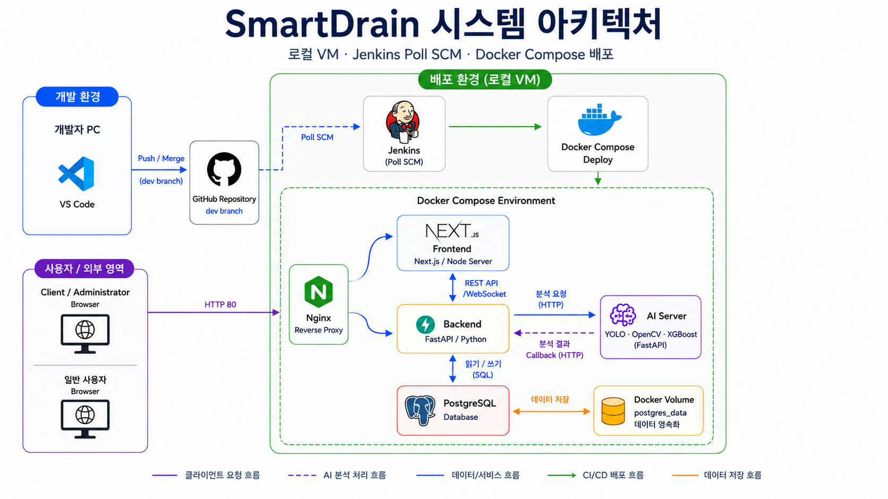
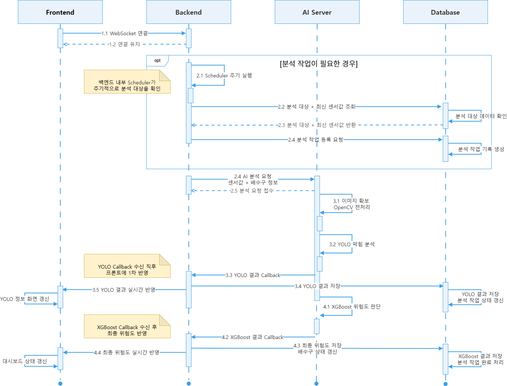
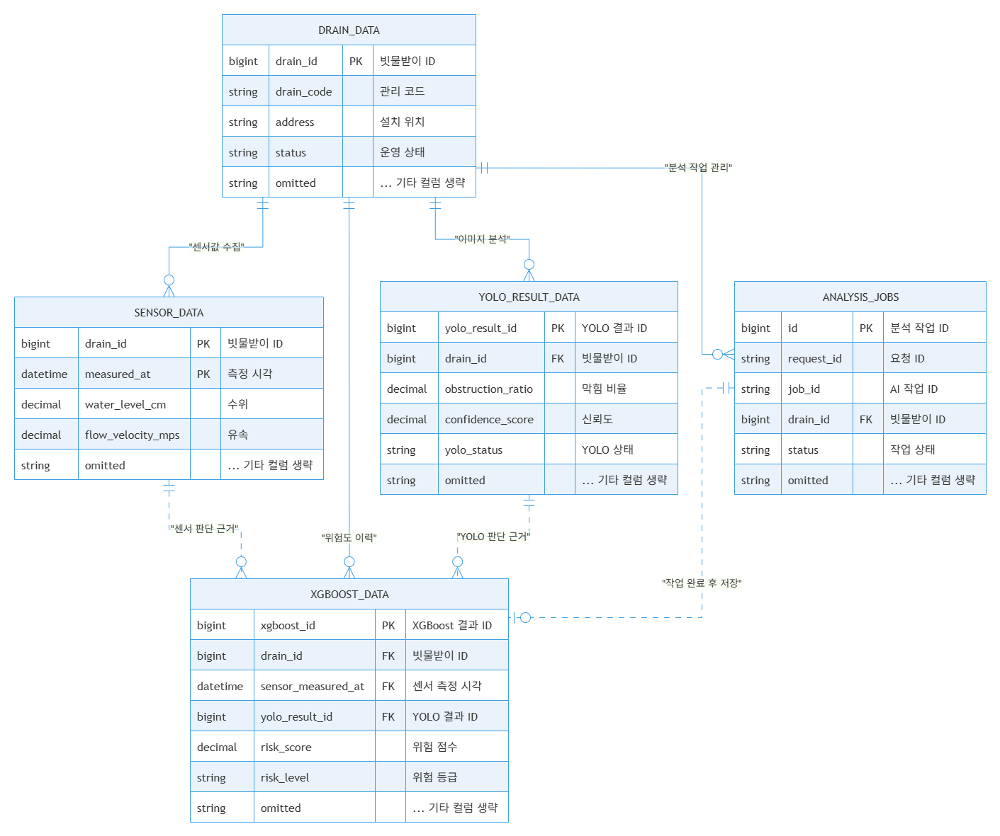
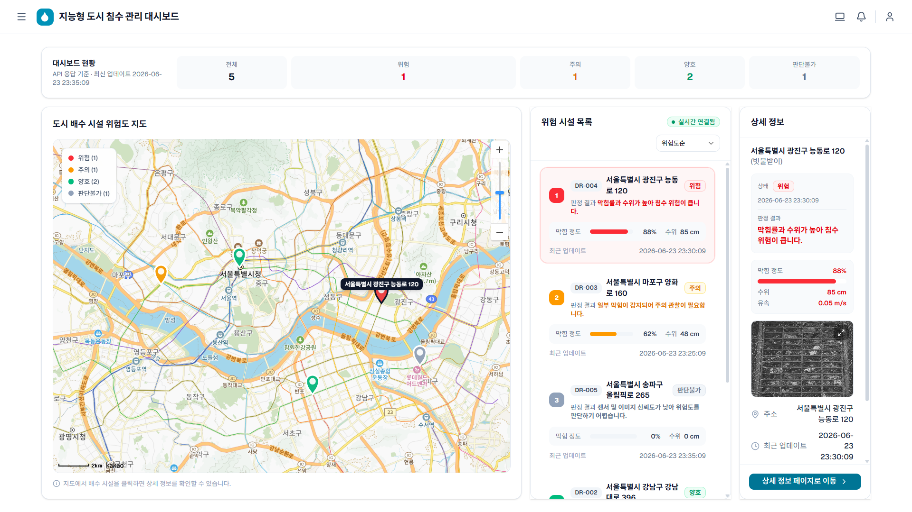
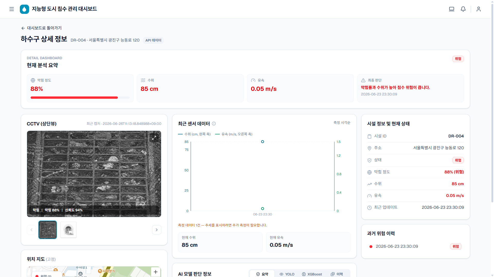

# SmartDrain 최종 기획서

## AI 기반 빗물받이 막힘 탐지 및 침수 위험 모니터링 시스템

| 항목 | 내용 |
|---|---|
| 문서명 | SmartDrain 최종 기획서 |
| 프로젝트명 | 지능형 도시 침수 관리 및 모니터링 시스템 |
| 서비스명 | SmartDrain |
| 작성 기준 | 기존 기획서, 개발 문서, 최종 구현 화면, 발표용 아키텍처 자료 |
| 주요 사용자 | 지자체 관리자, 배수 시설 관리자, 시스템 운영자 |
| 문서 목적 | 최종 구현 결과에 맞춰 서비스 목적, MVP 범위, 시스템 구조, 화면 흐름, 데이터 흐름, 기술 방향을 통합 정리한다. |

---

## 1. 프로젝트 개요

SmartDrain은 침수 위험 지역 내 개별 빗물받이를 대상으로 막힘 상태와 배수 이상 가능성을 분석하는 AI 기반 도시 침수 모니터링 시스템이다.

본 프로젝트의 MVP는 실제 CCTV RTSP 스트림과 실제 IoT 센서를 직접 운영 연동한 완성형 서비스가 아니라, CCTV 스냅샷 이미지 또는 샘플 이미지와 수위·유속 모의 센서 데이터를 활용하여 침수 위험 판단 흐름을 구현한 시연 가능한 서비스이다.

이미지는 OpenCV로 전처리하고, YOLO 모델을 통해 빗물받이 막힘 비율과 분석 신뢰도를 산출한다. 이후 YOLO 분석 결과와 수위·유속 데이터를 XGBoost 모델에 입력하여 최종 위험도를 양호, 주의, 위험, 판단불가로 분류한다.

관리자는 지도 기반 대시보드에서 빗물받이 위치와 위험 상태를 확인하고, 상세 화면에서 CCTV 이미지, 센서 데이터, AI 분석 결과, 위험 이력을 확인할 수 있다.

---

## 2. 기획 배경

도시 침수는 강우량뿐 아니라 배수 시설의 상태와도 밀접하게 연결된다. 도로 위 빗물을 배수관으로 유입시키는 빗물받이가 낙엽, 쓰레기, 담배꽁초, 공사 잔여물 등으로 막히면 배수 효율이 떨어지고 침수 위험이 커질 수 있다.

기존 침수 관제는 넓은 지역 단위의 수위, 강우량, 신고 데이터 중심으로 이루어지는 경우가 많다. 그러나 실제 현장 대응에서는 어느 위치의 빗물받이가 막혔는지, 막힘 정도가 어느 수준인지, 현재 수위와 유속이 어떻게 변하고 있는지를 빠르게 확인하는 것이 중요하다.

모든 빗물받이에 고정형 센서를 설치하는 방식은 비용과 유지관리 부담이 크다. 따라서 본 프로젝트는 이미지 기반 분석과 일부 센서 데이터를 결합하여 관리가 필요한 빗물받이를 우선 식별하는 방향으로 기획하였다.

---

## 3. 문제 정의

| 문제 | 설명 |
|---|---|
| 현장 확인 지연 | 침수 위험이 발생해도 관리자가 직접 확인하거나 신고가 접수되기 전까지 상황 파악이 늦을 수 있다. |
| CCTV 육안 관제 한계 | CCTV 이미지가 있어도 사람이 계속 확인해야 하므로 관제 효율이 낮다. |
| 센서 단독 판단 한계 | 수위나 유속만으로는 실제 막힘 상태를 직접 확인하기 어렵다. |
| 판단 기준 분산 | 이미지, 수위, 유속, 막힘 정도를 각각 확인해야 하므로 종합 판단이 어렵다. |
| 위험 시설 우선순위 부족 | 여러 시설 중 어떤 빗물받이를 먼저 확인해야 하는지 직관적으로 파악하기 어렵다. |
| 데이터 기반 관리 부족 | 과거 위험 이력과 분석 결과가 체계적으로 관리되지 않으면 반복 위험 지점을 파악하기 어렵다. |

---

## 4. 서비스 목표

| 목표 | 설명 |
|---|---|
| 개별 빗물받이 상태 분석 | CCTV 스냅샷 이미지 또는 샘플 이미지를 기반으로 빗물받이의 막힘 상태를 분석한다. |
| 이미지와 센서 데이터 결합 | YOLO 분석 결과와 수위·유속 모의 센서 데이터를 결합해 이미지 단독 판단의 한계를 보완한다. |
| XGBoost 기반 최종 위험도 판단 | 막힘 비율, 신뢰도, 수위, 유속을 입력값으로 사용해 최종 위험도를 분류한다. |
| 지도 기반 관제 화면 제공 | 지도 대시보드에서 빗물받이 위치와 위험 상태를 색상으로 표시한다. |
| 상태 변화 추적 | 센서 데이터, YOLO 결과, XGBoost 결과를 저장하여 위험 이력을 확인할 수 있도록 한다. |
| 실시간 상태 반영 | WebSocket을 통해 위험도 변경 이벤트를 프론트엔드에 전달하고 화면 상태를 갱신한다. |

---

## 5. MVP 범위

### 5.1 MVP 정의

SmartDrain MVP는 CCTV 스냅샷 이미지 또는 샘플 이미지와 수위·유속 모의 센서 데이터를 기반으로 개별 빗물받이의 위험도를 분석하고, 관리자가 지도 기반 대시보드와 상세 화면에서 위험 상태를 확인할 수 있는 최소 기능 범위이다.

MVP의 핵심 질문은 다음과 같다.

- 어느 빗물받이가 위험한가?
- 왜 위험하다고 판단되었는가?
- 현재 막힘 정도, 수위, 유속은 어떤 상태인가?
- 최근 상태는 어떻게 기록되었는가?
- 지도와 상세 화면에서 동일한 위험도 기준이 적용되는가?

### 5.2 MVP 포함 기능

| 구분 | 포함 기능 | 설명 |
|---|---|---|
| 이미지 입력 | CCTV 스냅샷 또는 샘플 이미지 | 실제 RTSP 스트림 대신 이미지 경로 또는 샘플 이미지를 사용한다. |
| 이미지 전처리 | OpenCV | 이미지 로드, 리사이징, 밝기 보정, 노이즈 제거, 관심 영역 처리를 수행한다. |
| 이미지 분석 | YOLO | 빗물받이 막힘 비율과 confidence score를 산출한다. |
| 센서 데이터 | 수위·유속 모의 데이터 | 실제 센서 대신 모의 데이터를 저장하고 분석 입력값으로 사용한다. |
| 위험도 판단 | XGBoost | YOLO 결과와 센서 데이터를 결합해 최종 위험도를 판단한다. |
| 데이터 저장 | PostgreSQL | 시설 정보, 센서 데이터, YOLO 결과, XGBoost 결과, 분석 작업 상태를 저장한다. |
| 상태 갱신 | WebSocket | 분석 결과 변경 시 지도, 목록, 상세 화면을 갱신한다. |
| 관리자 화면 | Next.js 대시보드 | 지도, 위험 시설 목록, 상세 패널, 상세 페이지를 제공한다. |
| 배포 환경 | Docker Compose, Nginx, Jenkins | 로컬 VM 기반 배포 및 프록시 구성을 적용한다. |

### 5.3 MVP 제외 및 고도화 범위

| 구분 | 처리 방향 |
|---|---|
| 실제 CCTV RTSP 실시간 연동 | 고도화 |
| 실제 IoT 센서 MQTT 연동 | 고도화 |
| 외부 강우량 API 연동 | 고도화 |
| 문자, 이메일, 카카오 알림톡 발송 | 고도화 |
| 작업자 전용 화면 | 고도화 |
| 대응 요청 배정 및 조치 이력 관리 | 고도화 |
| LLM 기반 자연어 요약 | 고도화 |
| 모델 자동 재학습 | 고도화 |
| 실제 지자체 시스템 연동 | 고도화 |
| 운영자 권한 관리 | 고도화 |

---

## 6. 위험도 분류 체계

SmartDrain은 최종 위험도를 4단계로 분류한다.

| 화면 표시 | 내부 코드 | 색상 기준 | 의미 |
|---|---|---|---|
| 양호 | `good` | 초록색 | 현재 침수 위험이 낮고 배수 상태가 안정적인 상태 |
| 주의 | `caution` | 주황색 또는 노란색 | 일부 막힘, 수위 상승, 유속 저하 등 모니터링이 필요한 상태 |
| 위험 | `danger` | 빨간색 | 침수 가능성이 높아 즉시 확인이 필요한 상태 |
| 판단불가 | `unknown` | 회색 | 이미지 품질 저하, 센서 누락, 모델 신뢰도 부족 등으로 판단이 어려운 상태 |

위험도는 단순히 이미지 분석 결과만으로 결정하지 않는다. YOLO가 산출한 막힘 비율과 신뢰도, 수위, 유속을 함께 반영해 XGBoost가 최종 위험도를 판단한다.

---

## 7. 주요 사용자

### 7.1 지자체 관리자

| 항목 | 내용 |
|---|---|
| 주요 목표 | 침수 위험 지역의 빗물받이 상태를 빠르게 확인하고 우선 점검 대상을 선별한다. |
| 주요 화면 | 지도 대시보드, 위험 시설 목록, 상세 패널, 상세 정보 페이지 |
| 확인 데이터 | 위험도, 위치, 막힘 비율, 수위, 유속, 최근 업데이트 시간 |
| 의사결정 | 위험도가 높은 빗물받이를 우선 확인하고 후속 대응 필요 여부를 판단한다. |

### 7.2 배수 시설 관리자

| 항목 | 내용 |
|---|---|
| 주요 목표 | 특정 빗물받이의 상태 변화와 반복 위험 여부를 확인한다. |
| 주요 화면 | 상세 정보 페이지, 위험 이력, 센서 데이터 차트 |
| 확인 데이터 | CCTV 이미지, YOLO 분석 결과, XGBoost 위험도, 센서 이력 |
| 의사결정 | 반복적으로 위험이 발생하는 지점을 유지보수 우선순위에 반영한다. |

### 7.3 시스템 운영자

| 항목 | 내용 |
|---|---|
| 주요 목표 | 분석 요청, callback, DB 저장, WebSocket 반영 흐름을 점검한다. |
| 주요 화면 | 대시보드, API 응답, 로그 및 배포 상태 |
| 확인 데이터 | 분석 작업 상태, DB 저장 결과, AI 서버 응답, WebSocket 연결 상태 |
| 의사결정 | 데이터 누락, 분석 실패, 모델 파일 문제, 배포 장애 등을 확인하고 조치한다. |

---

## 8. 서비스 사용 시나리오

### 8.1 대시보드 기반 위험 시설 확인

1. 관리자가 SmartDrain 대시보드에 접속한다.
2. 지도에서 빗물받이 위치와 위험도 색상을 확인한다.
3. 위험 시설 목록에서 위험도가 높은 빗물받이를 우선 확인한다.
4. 특정 시설을 선택하면 우측 상세 패널에 주소, 상태, 막힘 정도, 수위, 유속, 최근 업데이트 시간이 표시된다.
5. 필요 시 상세 정보 페이지로 이동하여 CCTV 이미지와 센서 이력을 추가 확인한다.

### 8.2 AI 분석 결과 기반 상태 갱신

1. 백엔드 Scheduler 또는 수동 분석 요청이 분석 대상 빗물받이를 확인한다.
2. 백엔드는 최신 센서 데이터를 조회하고 분석 작업을 생성한다.
3. 백엔드는 AI 서버에 분석 시작 요청을 보낸다.
4. AI 서버는 이미지 확보 후 OpenCV 전처리와 YOLO 분석을 수행한다.
5. AI 서버는 YOLO 분석 결과를 백엔드 callback endpoint로 전달한다.
6. AI 서버는 YOLO 결과와 센서 데이터를 기반으로 XGBoost 최종 판단을 수행한다.
7. AI 서버는 XGBoost 최종 결과를 백엔드 callback endpoint로 전달한다.
8. 백엔드는 분석 결과를 DB에 저장하고 빗물받이 최신 상태를 갱신한다.
9. WebSocket을 통해 프론트엔드 화면에 최신 상태가 반영된다.

### 8.3 판단불가 시나리오

1. 이미지가 어둡거나 비가 강하게 내려 분석 신뢰도가 낮다.
2. 센서값이 누락되거나 최신 센서 데이터가 없다.
3. AI 모델이 충분한 신뢰도로 상태를 판단하지 못한다.
4. 시스템은 해당 빗물받이를 판단불가 상태로 표시한다.
5. 관리자는 재수집 또는 수동 확인이 필요한 시설로 인식한다.

---

## 9. 시스템 아키텍처



SmartDrain의 시스템은 개발자 PC, GitHub Repository, Jenkins, Docker Compose 배포 환경, Nginx, Frontend, Backend, AI Server, PostgreSQL, Docker Volume으로 구성된다.

| 구성 요소 | 역할 |
|---|---|
| Client Browser | 관리자가 접근하는 웹 브라우저이다. |
| Nginx | 외부 요청을 받아 Frontend, Backend API, WebSocket 경로로 proxy한다. |
| Frontend | Next.js 기반 관리자 대시보드와 상세 화면을 제공한다. |
| Backend | FastAPI 기반 REST API, WebSocket, 분석 작업 관리, DB 저장을 담당한다. |
| AI Server | OpenCV, YOLO, XGBoost 기반 이미지 분석 및 최종 위험도 판단을 수행한다. |
| PostgreSQL | 빗물받이 정보, 센서 데이터, YOLO 결과, XGBoost 결과, 분석 작업 상태를 저장한다. |
| Docker Volume | PostgreSQL 데이터를 영속화한다. |
| Jenkins | GitHub dev branch 변경을 Poll SCM 방식으로 감지하고 Docker Compose 배포를 수행한다. |
| Docker Compose | Frontend, Backend, AI Server, Database, Nginx를 동일한 실행 환경에서 구성한다. |

### 9.1 요청 흐름

```text
사용자 브라우저
→ Nginx
→ Next.js Frontend
→ FastAPI Backend
→ PostgreSQL 조회
→ Frontend 화면 표시
```

### 9.2 분석 흐름

```text
Backend
→ AI Server 분석 요청
→ AI Server YOLO 분석
→ Backend YOLO callback
→ AI Server XGBoost 판단
→ Backend XGBoost callback
→ PostgreSQL 저장
→ WebSocket으로 Frontend 반영
```

### 9.3 배포 흐름

```text
개발자 PC
→ GitHub dev branch push 또는 merge
→ Jenkins Poll SCM 감지
→ Docker Compose build/deploy
→ Nginx를 통해 외부 접근
```

---

## 10. AI 분석 및 WebSocket 반영 흐름



SmartDrain의 분석 흐름은 한 번의 동기 API 응답으로 끝나지 않는다. 백엔드는 분석 작업을 생성하고, AI 서버는 YOLO 중간 결과와 XGBoost 최종 결과를 각각 callback 방식으로 백엔드에 전달한다.

### 10.1 단계별 흐름

| 단계 | 설명 |
|---|---|
| 1 | Frontend가 Backend와 WebSocket을 연결하고 연결 상태를 유지한다. |
| 2 | Backend Scheduler가 주기적으로 분석 대상 빗물받이와 최신 센서값을 확인한다. |
| 3 | Backend가 분석 작업을 DB에 등록하고 AI Server에 분석을 요청한다. |
| 4 | AI Server가 이미지 확보와 OpenCV 전처리를 수행한다. |
| 5 | AI Server가 YOLO로 막힘 상태를 분석하고 YOLO 결과를 Backend에 callback한다. |
| 6 | Backend는 YOLO 결과를 저장하고 WebSocket을 통해 Frontend에 1차 반영한다. |
| 7 | AI Server가 YOLO 결과와 센서값을 이용해 XGBoost 최종 판단을 수행한다. |
| 8 | AI Server가 XGBoost 최종 결과를 Backend에 callback한다. |
| 9 | Backend는 최종 위험도를 저장하고 빗물받이 최신 상태를 갱신한다. |
| 10 | WebSocket을 통해 대시보드, 목록, 상세 화면에 최종 위험도를 반영한다. |

### 10.2 비동기 callback 구조를 사용한 이유

| 이유 | 설명 |
|---|---|
| AI 분석 시간 분리 | 이미지 분석과 모델 판단은 즉시 응답보다 시간이 걸릴 수 있어 작업 단위로 분리한다. |
| 중간 결과 저장 | YOLO 결과와 XGBoost 결과를 각각 저장해 판단 근거를 추적할 수 있다. |
| 화면 단계별 반영 | YOLO 결과 수신 후 1차 반영, XGBoost 결과 수신 후 최종 반영이 가능하다. |
| 장애 추적 | 분석 작업 상태를 기록하여 실패, 중복 callback, 선도착 callback 등을 추적할 수 있다. |

---

## 11. 데이터베이스 설계



SmartDrain의 데이터베이스는 PostgreSQL을 사용한다. MVP에서는 빗물받이 기본 정보, 센서 데이터, YOLO 이미지 분석 결과, XGBoost 최종 위험도 결과, 비동기 분석 작업 상태를 저장한다.

### 11.1 핵심 테이블

| 테이블 | 설명 | 데이터 성격 |
|---|---|---|
| `drains` | 빗물받이 기본 정보와 현재 상태 | 마스터 데이터 |
| `sensor_data` | 수위·유속 센서 측정값 | 원천 시계열 데이터 |
| `yolo_results` | 이미지 기반 YOLO 분석 결과 | 영상 분석 데이터 |
| `xgboost_results` | XGBoost 기반 최종 위험도 판단 결과 | 최종 분석 결과 데이터 |
| `analysis_jobs` | 비동기 분석 요청과 callback 상태 | 분석 작업 이력 |

### 11.2 데이터 설계 원칙

| 원칙 | 설명 |
|---|---|
| 분석 근거 추적 | XGBoost 결과가 어떤 센서 데이터와 YOLO 결과를 기반으로 생성되었는지 추적한다. |
| 이미지 원본 비저장 | 이미지 바이너리를 DB에 직접 저장하지 않고, 이미지 경로 또는 URL을 저장한다. |
| 현재 상태와 이력 분리 | 빗물받이의 최신 상태는 `drains`에 반영하고, 분석 이력은 별도 테이블에 저장한다. |
| 비동기 작업 추적 | 분석 요청, YOLO callback, XGBoost callback 상태를 `analysis_jobs`로 관리한다. |
| 고도화 확장 여지 | 대응 요청, 작업자, 외부 알림, 기상 데이터는 MVP 이후 별도 테이블로 확장한다. |

---

## 12. 주요 화면 구성

### 12.1 메인 대시보드



메인 대시보드는 관리자가 가장 먼저 확인하는 화면이다. 지도와 위험 시설 목록, 상세 패널을 함께 제공하여 위험 시설을 빠르게 식별할 수 있도록 구성한다.

| 영역 | 설명 |
|---|---|
| 상단바 | 서비스명, 알림, 사용자 메뉴를 제공한다. |
| 현황 요약 | 전체 시설 수, 위험, 주의, 양호, 판단불가 개수를 표시한다. |
| 지도 영역 | 빗물받이 위치를 지도 마커로 표시하고 위험도에 따라 색상을 다르게 표현한다. |
| 범례 | 위험, 주의, 양호, 판단불가 상태의 의미를 색상으로 안내한다. |
| 위험 시설 목록 | 위험도가 높은 시설을 우선 정렬하여 표시한다. |
| 상세 패널 | 선택한 빗물받이의 핵심 정보와 최근 이미지를 요약 제공한다. |
| 상세 이동 버튼 | 선택한 시설의 상세 정보 페이지로 이동한다. |

### 12.2 상세 정보 화면



상세 정보 화면은 선택한 빗물받이의 현재 상태와 분석 근거를 확인하는 화면이다. 이미지, 센서 데이터, 시설 정보, 위험 이력, AI 모델 판단 정보를 함께 제공한다.

| 영역 | 설명 |
|---|---|
| 현재 분석 요약 | 막힘 정도, 수위, 유속, 최종 판단 문구를 요약한다. |
| CCTV 이미지 | 분석에 사용된 최근 이미지와 이미지 목록을 표시한다. |
| 센서 데이터 | 최근 수위·유속 데이터와 측정 시각을 표시한다. |
| 시설 정보 | 시설 ID, 주소, 상태, 막힘 정도, 수위, 유속, 최근 업데이트 시간을 제공한다. |
| 과거 위험 이력 | 최근 위험 판단 이력을 표시한다. |
| AI 모델 판단 정보 | YOLO, XGBoost, 분석 이력 정보를 탭 또는 카드 형태로 확인한다. |
| 위치 지도 | 선택한 빗물받이의 위치를 지도에서 확인한다. |

---

## 13. API 및 데이터 연동 기준

SmartDrain은 초기 화면 조회와 이후 상태 변경 반영을 분리한다.

| 구분 | 방식 | 설명 |
|---|---|---|
| 초기 데이터 조회 | REST API | 대시보드 진입 시 빗물받이 목록, 요약 정보, 상세 정보를 조회한다. |
| 상태 변경 반영 | WebSocket | 분석 결과가 변경되면 지도, 목록, 상세 화면을 갱신한다. |
| 분석 요청 | Backend 내부 Scheduler 또는 수동 트리거 | 분석 대상과 최신 센서값을 확인한 뒤 AI Server에 요청한다. |
| 분석 결과 수신 | Callback API | AI Server가 YOLO 결과와 XGBoost 결과를 Backend로 전달한다. |
| 데이터 저장 | SQLAlchemy + PostgreSQL | 센서, YOLO, XGBoost, 분석 작업 상태를 저장한다. |

### 13.1 주요 REST API

| Method | Endpoint | 목적 |
|---|---|---|
| GET | `/api/drains` | 대시보드 지도 마커와 위험 시설 목록 조회 |
| GET | `/api/drains/{id}` | 특정 빗물받이 상세 정보 조회 |
| GET | `/api/drains/{id}/sensor-data` | 특정 빗물받이 센서 이력 조회 |
| GET | `/api/drains/{id}/risk-history` | 특정 빗물받이 위험 이력 조회 |
| GET | `/api/drains/{id}/risk/latest` | 최신 위험도 결과 조회 |
| GET | `/api/dashboard/summary` | 대시보드 요약 정보 조회 |
| POST | `/ai/analysis/run` | Backend에서 AI Server로 분석 시작 요청 |
| POST | `/api/ai-callback/yolo-result` | AI Server가 YOLO 중간 결과 전달 |
| POST | `/api/ai-callback/xgboost-result` | AI Server가 XGBoost 최종 결과 전달 |

### 13.2 WebSocket 기준

| 항목 | 내용 |
|---|---|
| Endpoint | `/ws/drains/status` |
| 목적 | 위험도, 막힘 정도, 수위, 유속 등 최신 상태 변경 이벤트 전달 |
| 반영 화면 | 지도 마커, 위험 시설 목록, 상세 패널, 상세 페이지 |
| 프론트 처리 | WebSocket 이벤트 수신 후 Query cache 무효화 또는 상태 갱신 |

---

## 14. AI 모델 구성

### 14.1 OpenCV

OpenCV는 YOLO 분석 전에 이미지를 전처리하는 역할을 담당한다.

| 처리 | 설명 |
|---|---|
| 이미지 로드 | 샘플 이미지 또는 이미지 경로에서 분석 대상 이미지를 불러온다. |
| 리사이징 | 모델 입력 크기에 맞게 이미지를 조정한다. |
| 밝기 보정 | 비, 야간, 어두운 이미지 등 분석 어려움이 있는 상황을 완화한다. |
| 노이즈 제거 | 이미지 품질 저하 요소를 줄인다. |
| ROI 처리 | 빗물받이 영역 중심으로 분석할 수 있도록 전처리한다. |

### 14.2 YOLO

YOLO는 이미지에서 빗물받이와 주변 이물질 상태를 분석한다.

| 출력값 | 설명 |
|---|---|
| `obstruction_ratio` | 막힘 비율, 0~1 범위 |
| `confidence_score` | 분석 신뢰도, 0~1 범위 |
| `yolo_status` | 이미지 기반 상태 코드 |
| `image_url` | 분석에 사용된 이미지 경로 또는 URL |

### 14.3 XGBoost

XGBoost는 YOLO 분석 결과와 센서 데이터를 결합하여 최종 위험도를 판단한다.

| 입력값 | 설명 |
|---|---|
| `obstruction_ratio` | YOLO가 산출한 막힘 비율 |
| `confidence_score` | YOLO 분석 신뢰도 |
| `water_level_cm` | 수위, cm 단위 |
| `flow_velocity_mps` | 유속, m/s 단위 |

| 출력값 | 설명 |
|---|---|
| `risk_score` | 위험 점수 |
| `risk_level` | `good`, `caution`, `danger`, `unknown` 중 하나 |
| `final_decision` | 최종 판단 문구 |

---

## 15. 기술 스택

| 분야 | 기술 | 역할 |
|---|---|---|
| Frontend | Next.js | 관리자 대시보드와 상세 화면 구현 |
| Frontend | React | 컴포넌트 기반 UI 개발 |
| Frontend | TypeScript | API 응답과 상태값 타입 안정성 확보 |
| Frontend | Tailwind CSS | 화면 스타일링과 반응형 구성 |
| Frontend | shadcn/ui | 카드, 버튼, 배지, 탭 등 UI 구성 |
| Frontend | TanStack Query | API 로딩, 캐싱, 재조회 관리 |
| Frontend | WebSocket Client | 위험도 상태 변경 이벤트 수신 |
| Backend | FastAPI | REST API, WebSocket, callback endpoint 제공 |
| Backend | SQLAlchemy | Python 코드 기반 DB 연동 |
| Backend | Alembic | DB migration 관리 |
| Database | PostgreSQL | 시설, 센서, 분석 결과, 작업 이력 저장 |
| AI | OpenCV | 이미지 전처리 |
| AI | YOLO | 빗물받이 막힘 분석 |
| AI | XGBoost | 최종 위험도 판단 |
| Infra | Docker Compose | 서비스 통합 실행 환경 구성 |
| Infra | Nginx | Reverse Proxy, `/`, `/api`, `/ws` 경로 분기 |
| CI/CD | Jenkins Poll SCM | dev branch 변경 감지 및 배포 자동화 |

---

## 16. 구현 현황 및 검증 기준

### 16.1 구현된 핵심 흐름

| 영역 | 구현 기준 |
|---|---|
| Frontend | 대시보드, 상세 화면, REST API 조회, WebSocket 수신 구조 |
| Backend | FastAPI REST API, WebSocket, 분석 작업 관리, callback 처리 |
| AI Server | OpenCV, YOLO, XGBoost 기반 분석 흐름 |
| Database | PostgreSQL, Alembic migration, 핵심 테이블 구성 |
| 배포 | Docker Compose, Nginx Reverse Proxy, Jenkins 배포 설정 |
| 실시간 반영 | XGBoost callback 이후 빗물받이 상태 갱신 및 WebSocket 반영 |

### 16.2 검증 시 주의할 표현

| 표현 | 사용 여부 | 이유 |
|---|---|---|
| 샘플 이미지와 모의 센서 데이터를 이용해 분석·저장·화면 반영 흐름을 구현했다. | 사용 가능 | MVP 구현 범위와 일치한다. |
| 실제 CCTV를 실시간 분석한다. | 사용 금지 | 실제 RTSP 운영 연동은 고도화 범위이다. |
| 실제 IoT 센서를 연동했다. | 사용 금지 | MVP는 모의 센서 데이터를 사용한다. |
| 자동 E2E 테스트를 모두 통과했다. | 사용 금지 | 자동 E2E는 구현 또는 실행 완료로 단정하기 어렵다. |
| risk score가 실제 침수 위험을 정밀 예측한다. | 사용 금지 | 모델 성능 검증 자료 없이는 정밀 예측 표현을 피해야 한다. |

---

## 17. 기대 효과

| 기대 효과 | 설명 |
|---|---|
| 위험 시설 조기 식별 | 관리자가 지도와 목록에서 위험도가 높은 빗물받이를 빠르게 확인할 수 있다. |
| 관제 효율 향상 | 모든 CCTV 이미지를 사람이 직접 확인하지 않아도 AI가 1차 판단을 보조한다. |
| 종합 판단 지원 | 이미지 분석 결과와 수위·유속 데이터를 함께 반영해 판단 기준을 통합한다. |
| 이력 기반 관리 | 센서 데이터, YOLO 결과, XGBoost 결과를 저장하여 위험 이력을 추적할 수 있다. |
| 확장 가능한 구조 | 실제 CCTV, IoT 센서, 외부 알림, 대응 요청 기능으로 확장 가능한 기반을 갖춘다. |

---

## 18. 한계 및 고도화 방향

### 18.1 현재 MVP의 한계

| 한계 | 설명 |
|---|---|
| 실제 CCTV 미연동 | 현재는 샘플 이미지 또는 저장된 이미지 기준으로 분석한다. |
| 실제 센서 미연동 | 수위·유속은 모의 센서 데이터를 사용한다. |
| 모델 성능 검증 제한 | 실제 현장 데이터 기반의 정량 성능 검증은 별도 자료가 필요하다. |
| 대응 요청 미구현 | 작업자 배정, 대응 요청, 조치 상태 변경은 MVP 이후 범위이다. |
| 자동 E2E 제한 | 수동 통합 확인과 일부 테스트 코드 확인 중심이다. |

### 18.2 향후 고도화 방향

| 고도화 항목 | 설명 |
|---|---|
| 실제 CCTV RTSP 연동 | CCTV 영상을 주기적으로 캡처하여 이미지 분석에 활용한다. |
| 실제 IoT 센서 연동 | MQTT 또는 API 기반으로 실제 수위·유속 센서 데이터를 수집한다. |
| 강우량 데이터 연동 | 기상청 API 등 외부 강우량 데이터를 위험도 판단에 반영한다. |
| 대응 요청 기능 | 위험 시설에 대한 담당자 배정, 요청 생성, 조치 상태 관리를 제공한다. |
| 외부 알림 | 위험 발생 시 SMS, 이메일, 카카오 알림톡 등으로 알림을 전송한다. |
| LLM 요약 | AI 판단 근거를 관리자 친화적인 자연어 요약으로 제공한다. |
| 모델 재학습 | 실제 현장 데이터를 축적해 YOLO와 XGBoost 모델을 개선한다. |
| 운영 권한 관리 | 관리자, 시설 담당자, 현장 작업자 역할별 권한을 분리한다. |

---

## 19. 최종 정리

SmartDrain은 도시 침수 위험을 빗물받이 단위로 세분화하여 확인할 수 있도록 돕는 AI 기반 모니터링 MVP이다.

본 프로젝트는 실제 운영 인프라 전체를 완성하는 데 목적을 두기보다, 이미지 분석과 센서 데이터를 결합하여 위험도를 판단하고, 그 결과를 지도 기반 대시보드와 상세 화면에 반영하는 end-to-end 흐름을 구현하는 데 초점을 둔다.

핵심 가치는 다음과 같다.

- 빗물받이 단위의 위험 상태 확인
- YOLO와 XGBoost를 결합한 AI 판단 흐름
- PostgreSQL 기반 분석 결과 저장과 이력 관리
- WebSocket 기반 상태 변경 반영
- Nginx, Docker Compose, Jenkins를 활용한 배포 구조 경험
- 실제 CCTV, IoT 센서, 대응 요청, 외부 알림으로 확장 가능한 구조

