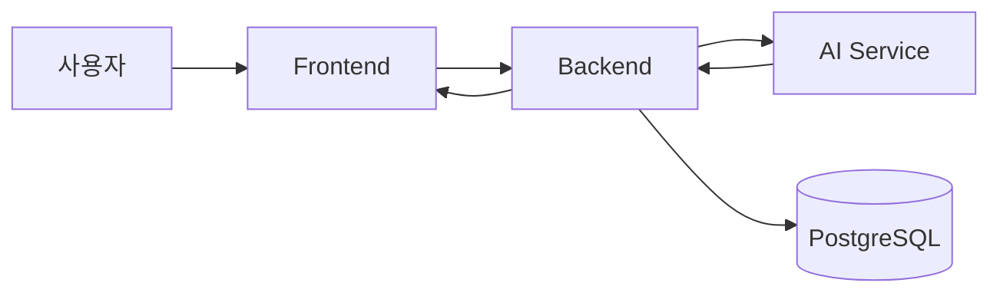

# SmartDrain Repository Structure

## 1. 문서 목적

이 문서는 SmartDrain 저장소의 주요 디렉터리, 서비스별 책임, 서비스 간 의존 방향을 설명합니다.

구체적인 파일과 실행 방식은 실제 저장소를 우선하며, 구조가 변경되면 이 문서를 함께 갱신합니다.

## 2. 전체 구조

기본 저장소 구조는 다음과 같습니다.

```text
smartdrain/
├─ AGENTS.md
├─ .agents/
│  └─ skills/
├─ frontend/
├─ backend/
├─ ai_service/
├─ ai-vision/
├─ mock_data/
├─ mock_ai_server/
├─ nginx/
├─ docs/
├─ .jenkins/
├─ jenkins/
├─ docker-compose.yml
└─ README.md
```

실제 저장소에 없는 디렉터리는 임의로 생성하지 않습니다.

## 3. 주요 디렉터리 책임

| 경로                    | 책임                                         |
| ----------------------- | -------------------------------------------- |
| `frontend/`             | Next.js 관리자 대시보드와 사용자 화면        |
| `backend/`              | FastAPI API, DB 접근, WebSocket, AI callback |
| `ai_service/`           | OpenCV, YOLO, XGBoost 기반 비동기 분석       |
| `ai-vision/`            | 모델 학습, PoC, 실험 코드와 산출물           |
| `mock_data/`            | 로컬 및 시연용 이미지와 센서 데이터          |
| `mock_ai_server/`       | Backend 연동 개발용 mock AI 서버             |
| `nginx/`                | same-origin reverse proxy 설정               |
| `docs/`                 | 설계, 참조, 계획, 작업 기록, PR 문서         |
| `.agents/`              | Codex가 사용할 프로젝트 전용 Skill           |
| `.jenkins/`, `jenkins/` | CI/CD 설정과 배포 보조 파일                  |

## 4. Frontend 책임

`frontend/`는 브라우저에서 동작하는 관리자 화면을 담당합니다.

주요 책임:

- 시설 지도
- 위험 시설 목록
- 시설 상세 화면
- 이미지와 센서 데이터 표시
- 위험 상태 시각화
- REST API 호출
- WebSocket 상태 반영
- 로딩, 오류, 빈 상태 처리

Frontend는 다음 작업을 하지 않습니다.

- DB 직접 접근
- YOLO 또는 XGBoost 직접 실행
- 서버 전용 비밀값 관리
- 분석 결과의 영구 저장

## 5. Backend 책임

`backend/`는 시스템 데이터와 서비스 간 계약의 중심입니다.

주요 책임:

- FastAPI REST API
- PostgreSQL 접근
- SQLAlchemy 모델
- Alembic migration
- WebSocket 연결과 broadcast
- AI 분석 요청
- AI Service callback 수신
- 분석 결과 저장
- Frontend용 데이터 제공

Backend만 DB에 직접 접근하는 구조를 기본으로 합니다.

## 6. AI Service 책임

`ai_service/`는 분석 실행을 담당합니다.

주요 책임:

- 입력 이미지 검증
- OpenCV 전처리
- YOLO 추론
- 막힘 비율과 신뢰도 계산
- XGBoost 위험도 예측
- 분석 결과 생성
- Backend callback

AI Service는 DB에 직접 접근하지 않습니다.

## 7. AI Vision 책임

`ai-vision/`은 운영 분석 서버와 분리된 실험 영역입니다.

주요 책임:

- 모델 학습
- 데이터셋 실험
- PoC
- 성능 비교
- 학습 산출물 생성
- 모델 평가

실험 코드를 운영용 `ai_service/`에 직접 섞지 않습니다.

운영 반영이 필요한 경우 검증된 모델 인터페이스와 파일 전달 방식을 별도로 정의합니다.

## 8. Mock Data 책임

`mock_data/`에는 다음 데이터를 둡니다.

- 시연용 이미지
- 가상 센서 데이터
- 분석 테스트 입력
- 로컬 개발용 샘플
- 네트워크나 실제 장비 없이 실행하기 위한 데이터

실제 개인정보, 비밀값, 운영 데이터는 넣지 않습니다.

## 9. Nginx 책임

`nginx/`는 reverse proxy와 same-origin 구성을 담당합니다.

예상 책임:

- Frontend 요청 전달
- Backend API proxy
- WebSocket upgrade
- 정적 파일 또는 이미지 경로
- 서비스 포트 은닉
- CORS 복잡도 감소

Nginx 설정 변경은 배포와 실행 방식에 영향을 주므로 사용자 승인 후 진행합니다.

## 10. CI/CD 책임

현재 저장소에는 루트 `Jenkinsfile`, `.jenkins/scripts/`, `jenkins/`가 있습니다.

`Jenkinsfile`은 `.jenkins/scripts/`의 shell script를 호출하며, `jenkins/`는 Jenkins 실행 보조 구성을 담습니다.

`.jenkins/`와 `jenkins/`는 다음 작업을 담당할 수 있습니다.

- build
- test
- image 생성
- 배포
- 환경별 parameter 처리
- 배포 스크립트
- 검증 결과 기록

실제 책임은 `Jenkinsfile`과 관련 스크립트를 확인한 뒤 판단합니다.

문서의 설명만으로 배포 흐름을 추측하지 않습니다.

## 11. 서비스 의존 방향

기본 의존 방향은 다음과 같습니다.



## 12. 주요 데이터 흐름

### 조회 흐름

```text
사용자
→ Frontend
→ Backend REST API
→ PostgreSQL
→ Backend
→ Frontend
```

### 분석 흐름

```text
Backend
→ AI Service 분석 요청
→ OpenCV 및 YOLO
→ XGBoost
→ Backend callback
→ PostgreSQL 저장
→ WebSocket broadcast
→ Frontend 갱신
```

실제 구현이 비동기 queue, polling 또는 다른 방식을 사용하면 현재 구현에 맞게 수정합니다.

## 13. 실행 진입점과 Compose 서비스

현재 Docker Compose의 주요 서비스 이름은 다음과 같습니다.

| 서비스 | 현재 역할 |
| ------ | --------- |
| `db` | PostgreSQL |
| `migrate` | Backend Alembic migration 실행 |
| `backend` | `uvicorn app.main:app --host 0.0.0.0 --port 8000` |
| `ai-service` | `uvicorn ai_service.http.app:app --host 0.0.0.0 --port 9000` |
| `frontend` | Next.js frontend |
| `nginx` | same-origin reverse proxy |
| `seed` | mock data seed profile |

Docker 또는 Compose 변경은 실행 방식에 영향을 주므로 사용자 승인 후 진행합니다.

## 14. 책임 경계

다음 경계를 유지합니다.

- Frontend는 DB에 직접 접근하지 않습니다.
- Frontend는 AI Service를 직접 호출하지 않습니다.
- AI Service는 DB에 직접 접근하지 않습니다.
- Backend는 데이터 저장과 외부 계약을 관리합니다.
- AI 모델 계층은 HTTP 정책을 알지 않습니다.
- 학습 코드와 운영 추론 코드를 구분합니다.
- Nginx는 비즈니스 로직을 처리하지 않습니다.

## 15. 구조 변경 원칙

서비스 책임 또는 주요 디렉터리를 변경할 때는 다음을 확인합니다.

- import 경로
- Docker COPY와 volume
- 실행 명령
- 환경변수
- CI/CD 경로
- 테스트 경로
- 문서 링크
- 배포 영향

대규모 구조 변경은 Plans 문서를 작성하고 Phase별로 진행합니다.
