---
title: "SmartDrain 프로젝트 분석 및 고도화 통합 계획서"
service_name: "SmartDrain"
document_type: "프로젝트 현황 분석 · 고도화 기획 · 에이전트 크로스체크 기준서"
version: "1.0"
status: "초안 - 코드 에이전트 검증 전"
created_at: "2026-07-06"
encoding: "UTF-8 with BOM"
language: "ko-KR"
---

# SmartDrain 프로젝트 분석 및 고도화 통합 계획서

## 0. 문서 목적

이 문서는 SmartDrain의 기존 기획 문서, 최종 보고서, 구현·검증 기록, 시연용 고도화 기록과 추가로 제안된 운영 고도화 요구사항을 하나의 기준으로 통합한다.

주요 목적은 다음과 같다.

1. 현재 프로젝트가 어떤 구조와 범위로 구성되어 있는지 기록한다.
2. 문서상 구현된 기능과 실제 코드에서 확인해야 할 기능을 분리한다.
3. 현재 프로젝트의 부족한 점과 위험 요소를 우선순위로 정리한다.
4. 인증·권한, 기준정보 관리, 현장 작업 관리, MQTT 이벤트 처리, 트랜잭션 보강, 일일 보고서 기능을 목표 구조로 구체화한다.
5. 코드 에이전트가 저장소를 읽은 뒤 문서와 코드를 동일한 기준으로 크로스체크하도록 한다.
6. 이후 설계, 구현, 테스트, 배포, 포트폴리오 설명의 기준 문서로 사용한다.

이 문서는 구현 완료를 선언하는 문서가 아니다. 실제 구현 상태는 반드시 저장소의 최신 브랜치와 커밋을 기준으로 다시 확인한다.

---

## 1. 판정 기준과 상태 표기

에이전트와 사람이 같은 의미로 상태를 해석할 수 있도록 다음 용어를 사용한다.

| 상태 | 의미 |
|---|---|
| 확인됨 | 최종 보고서, 기존 문서, 검증 기록 등에서 근거가 확인된 내용 |
| 문서상 구현 | 구현 기록은 있으나 최신 코드와 실행 결과를 다시 확인해야 하는 내용 |
| 부분 구현 | 일부 코드 또는 일부 화면만 존재하며 전체 흐름이 완성되지 않은 내용 |
| 계획 | 문서 또는 사용자 요구사항으로만 존재하며 구현 여부가 확인되지 않은 내용 |
| 제안 | 본 문서에서 추가한 개선 아이디어 |
| 확인 필요 | 코드, DB, 배포 환경 또는 실행 로그를 통해 사실 확인이 필요한 내용 |
| 제외/보류 | 현재 고도화 범위에서는 진행하지 않거나 후순위로 둔 내용 |

에이전트는 파일 이름, 주석, 문서 표현만으로 완료 여부를 판단하지 않는다. 다음 증거를 함께 확인한다.

- 실제 라우트, 서비스, 모델, 마이그레이션, 컴포넌트 존재 여부
- 호출 경로와 데이터 흐름 연결 여부
- 자동 테스트 및 수동 검증 기록
- Docker Compose 실행 가능 여부
- DB 저장과 WebSocket 반영 여부
- 배포 설정과 최근 실행 결과
- Mock 데이터와 실제 운영 데이터의 구분 여부

---

## 2. 프로젝트 개요

### 2.1 서비스 정의

SmartDrain은 샘플 이미지 또는 CCTV 스냅샷과 수위·유속 데이터를 결합하여 개별 빗물받이의 상태를 분석하고, 지도 기반 대시보드에서 위험도를 확인하도록 만든 도시 침수 위험 모니터링 서비스이다.

현재 보고서 기준 위험 상태는 다음 네 단계이다.

| 화면 표시 | 내부 코드 | 의미 |
|---|---|---|
| 양호 | `good` | 현재 침수 위험이 낮고 배수 상태가 안정적인 상태 |
| 주의 | `caution` | 일부 막힘, 수위 상승, 유속 저하 등 모니터링이 필요한 상태 |
| 위험 | `danger` | 침수 가능성이 높아 즉시 확인이 필요한 상태 |
| 판단불가 | `unknown` | 이미지 분석 실패, 센서 누락, 신뢰도 부족 등으로 판단이 어려운 상태 |

### 2.2 현재 MVP 범위

문서에서 확인된 MVP 범위는 다음과 같다.

- Next.js 기반 관리자 대시보드
- 지도, 위험 시설 목록, 빗물받이 상세 화면
- FastAPI 기반 REST API
- 분석 작업 관리와 AI 결과 수신
- OpenCV 전처리
- YOLO 기반 막힘 상태 분석
- XGBoost 기반 최종 위험도 판단
- PostgreSQL 결과 저장
- WebSocket 기반 최신 상태 갱신
- Docker Compose 기반 서비스 구성
- Nginx Reverse Proxy
- Jenkins Poll SCM 기반 로컬 VM 배포
- 샘플 이미지 및 모의 센서 데이터
- 시연용 실시간 상태 시뮬레이터 관련 구현 기록

### 2.3 현재 시스템의 성격

현재 SmartDrain은 실제 CCTV RTSP와 실제 IoT 센서를 연결한 운영 시스템이 아니라, 샘플 이미지와 모의 센서 데이터로 분석·저장·화면 반영의 전체 흐름을 시연하는 통합 MVP에 가깝다.

따라서 다음 표현을 구분한다.

| 권장 표현 | 피해야 할 표현 |
|---|---|
| 샘플 이미지와 모의 센서 데이터로 통합 분석 흐름을 구현했다. | 실제 CCTV 영상을 실시간 분석한다. |
| YOLO와 센서 데이터를 결합해 위험도를 분류한다. | 실제 침수 확률을 정밀하게 예측한다. |
| WebSocket으로 최신 상태를 화면에 반영한다. | 운영 환경에서 장애 없이 실시간 관제한다. |
| Docker Compose와 Jenkins 배포 설정이 존재한다. | 완전한 무중단 운영 배포가 검증됐다. |

---

## 3. 현재 프로젝트 구성

### 3.1 저장소 예상 구조

실제 구조는 에이전트가 다시 확인해야 하지만, 현재 문서상 주요 구성은 다음과 같다.

```text
smartdrain/
├─ frontend/
├─ backend/
├─ ai_service/
├─ ai-vision/
├─ mock_data/
├─ mock_ai_server/
├─ nginx/
├─ docs/
├─ .agents/
├─ .jenkins/
├─ jenkins/
├─ .github/
├─ docker-compose.yml
├─ docker-compose.dev.yml
├─ AGENTS.md
└─ README.md
```

### 3.2 서비스별 책임

| 영역 | 현재 책임 | 에이전트 확인 항목 |
|---|---|---|
| Frontend | 지도, 목록, 상세, REST 조회, WebSocket 반영 | 실제 페이지, 상태 관리, 재연결, 권한 처리 |
| Backend | REST API, 분석 작업, AI 요청, Callback 수신, DB 저장, WebSocket | 라우트, 트랜잭션, 중복 처리, 실패 복구 |
| AI Service | OpenCV, YOLO, XGBoost 분석 | 모델 파일, 입력·출력 DTO, 실제 추론 가능 여부 |
| AI Vision | 학습, 실험, PoC | 운영 모델과 실험 코드 분리 여부 |
| PostgreSQL | 시설, 센서, YOLO, XGBoost, 작업 상태 저장 | 실제 테이블명, 인덱스, 제약조건, 마이그레이션 |
| Nginx | Frontend, API, WebSocket Reverse Proxy | 실제 location 설정과 timeout |
| Jenkins | dev 브랜치 변경 감지 및 배포 | 실제 성공 로그, rollback, 경로 하드코딩 |
| Mock/Simulator | 시연용 데이터와 이미지 생성 | 운영 환경 노출 여부, 실제 데이터와 분리 여부 |

### 3.3 현재 분석 흐름

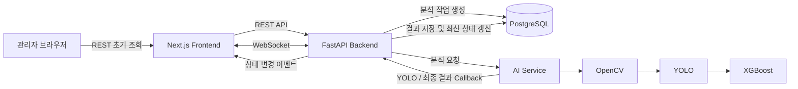

### 3.4 현재 시연용 흐름

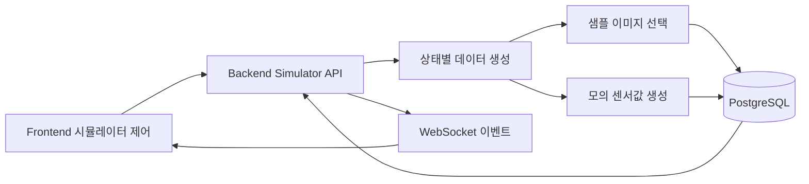

시뮬레이터는 발표와 테스트에 유용하지만, 실제 데이터와 시뮬레이션 데이터가 섞이지 않도록 별도 식별자가 필요하다.

---

## 4. 문서 기준으로 확인된 강점

| 영역 | 강점 |
|---|---|
| 문제 정의 | 침수 위험을 지역 전체가 아니라 개별 빗물받이 단위로 좁혔다. |
| 기술 흐름 | 이미지 분석, 정형 데이터 판단, DB 저장, WebSocket 갱신을 하나의 흐름으로 연결했다. |
| 책임 분리 | Frontend, Backend, AI Service, DB의 역할이 비교적 구분되어 있다. |
| 결과 추적 | 센서, YOLO, XGBoost 결과를 분리 저장하려는 방향이 있다. |
| 시연성 | 모의 데이터와 시뮬레이터로 상태 변화 시연이 가능하다. |
| 문서화 | 기획, 설계, 구현 기록, 검증 기록, 최종 보고서가 존재한다. |
| 배포 경험 | Docker Compose, Nginx, Jenkins, VM 배포 구조를 경험했다. |
| 과장 방지 | 실제 CCTV·센서가 연동된 것처럼 표현하지 않도록 범위를 구분했다. |

---

## 5. 현재 프로젝트의 미흡한 점

### 5.1 P0: 즉시 확인하거나 먼저 보완할 항목

| 항목 | 현재 문제 | 영향 | 권장 조치 |
|---|---|---|---|
| 최신 통합 현황 부재 | 과거 문서와 이후 고도화 기록이 분산되어 있다. | 완료 범위를 잘못 설명할 수 있다. | 최신 브랜치·커밋 기준 상태 문서 작성 |
| Backend E2E 검증 부족 | 문법 검사와 일부 정적 검증 위주 기록이 있다. | 실제 DB·AI·WebSocket 연결 실패 가능 | Docker 기반 통합 smoke test 작성 |
| 인증·권한 부재 | 관리자 API와 시뮬레이터 API 보호가 약하다. | 무단 수정, 위조 요청 위험 | JWT, RBAC, 감사 로그 도입 |
| 실제·시뮬레이션 데이터 혼용 | 모의 데이터가 실제 테이블에 저장될 수 있다. | 통계, 보고서, 모델 데이터 오염 | `data_source`, `is_synthetic`, `simulation_run_id` 추가 |
| Callback 신뢰성 부족 | 중복, 역순, timeout, 재시도 처리가 불명확하다. | 결과 중복 저장, 작업 상태 불일치 | Idempotency, Outbox/Inbox, retry, DLQ |
| DB 명칭 불일치 | 문서마다 테이블 이름이 다를 가능성이 있다. | 문서·코드 이해 혼란 | 실제 Migration 기준으로 통일 |
| 시연 기능 운영 노출 | Simulator endpoint가 운영에 남을 수 있다. | 운영 데이터 변조 위험 | 환경별 route 비활성화 또는 관리자 전용 처리 |

### 5.2 P1: 운영 신뢰성을 위한 항목

- Backend API 자동 테스트 부족
- Frontend component 및 브라우저 E2E 테스트 부족
- WebSocket 재연결·최신 데이터 보정 검증 부족
- AI 모델 버전, 체크섬, 성능 지표 관리 부족
- Jenkins 실제 성공 로그와 rollback 절차 부족
- DB 백업·복원 검증 부족
- 여러 Backend 인스턴스에서 WebSocket 이벤트 공유 구조 부족
- Scheduler와 Simulator가 동시에 실행될 가능성
- 장애·지연·데이터 누락을 확인할 운영 모니터링 부족
- 로그, 메트릭, 추적 ID를 연결하는 관측성 부족

### 5.3 P2: 문서와 UX 정합성 항목

- 과거 문서와 최신 API 경로가 혼재할 가능성
- 메인 상세 패널과 별도 상세 페이지의 관계가 모호함
- Cloudflare Tunnel을 실제 사용했다면 최종 아키텍처에 반영 필요
- 실시간 시뮬레이터 고도화가 최종 보고서에 충분히 반영되지 않음
- 위험도 수치 기준과 모델 출력 해석 방식이 부족함
- 한글 파일명 압축 시 인코딩이 깨지는 문제
- 와이어프레임과 실제 구현 화면의 차이를 관리하는 기준 문서 부족

---

## 6. 목표 사용자와 권한 체계

### 6.1 제안 역할

| 역할 | 코드 예시 | 주요 책임 |
|---|---|---|
| 최상위 관리자 | `SUPER_ADMIN` | 사용자, 권한, 빗물받이, 센서, 장비, 담당 구역, 정책 관리 |
| 관제 관리자 | `ADMIN` | 위험 모니터링, 작업 요청 생성, 담당자 배정, 작업 승인, 보고서 검토 |
| 현장 담당자 | `FIELD_WORKER` | 배정 작업 확인, 이동·도착·조치 상태 변경, 전후 사진 및 메모 등록 |
| 감사·조회 사용자 | `AUDITOR` | 변경 없이 이력, 통계, 보고서 조회 |
| 시스템 계정 | `SERVICE_ACCOUNT` | AI Service, MQTT Consumer, Scheduler 등 서비스 간 인증 |

최소 구현 범위는 `SUPER_ADMIN`, `ADMIN`, `FIELD_WORKER` 세 역할로 시작한다.

### 6.2 권한 매트릭스

| 기능 | SUPER_ADMIN | ADMIN | FIELD_WORKER | AUDITOR |
|---|:---:|:---:|:---:|:---:|
| 사용자·역할 관리 | O | 제한 | X | X |
| 빗물받이 등록·수정 | O | 선택 | X | 조회 |
| 센서·장비 등록·수정 | O | 선택 | X | 조회 |
| 담당 구역 관리 | O | O | 조회 | 조회 |
| 위험 대시보드 | O | O | 배정 구역 | O |
| 작업 요청 생성 | O | O | X | X |
| 작업 배정 | O | O | X | X |
| 작업 상태 변경 | O | O | 본인 작업 | X |
| 조치 사진 등록 | O | O | 본인 작업 | X |
| 일일 보고서 작성 | O | O | 선택 | 조회 |
| 보고서 승인·제출 | O | O | X | 조회 |
| 감사 로그 조회 | O | 제한 | 본인 기록 | O |
| 시스템 설정 | O | X | X | X |

---

## 7. 고도화 1: 로그인, 마이페이지, 관리자 권한

### 7.1 목표

현재 모니터링 화면에 인증과 권한을 추가하고, 최상위 관리자·관제 관리자·현장 담당자의 접근 범위를 구분한다.

### 7.2 필요한 화면

| 화면 | 목적 | 우선순위 |
|---|---|---|
| 로그인 | 계정 인증, 실패 처리, 비밀번호 재설정 진입 | 필수 |
| 내 정보 | 이름, 연락처, 소속, 역할, 담당 구역 확인 | 필수 |
| 비밀번호 변경 | 현재 비밀번호 검증 후 변경 | 필수 |
| 로그인 이력 | 최근 접속, 실패 이력 확인 | 중간 |
| 세션 관리 | 다른 기기 로그아웃, refresh token 폐기 | 중간 |
| 사용자 관리 | 계정 생성, 잠금, 역할 부여 | 필수 |
| 역할·권한 관리 | 권한 정책 확인 및 변경 | 중간 |
| 알림 설정 | 이메일, 앱, 브라우저 알림 설정 | 후순위 |

### 7.3 인증 방식

권장 기본 구조는 다음과 같다.

- Access Token: 짧은 만료 시간
- Refresh Token: 회전 방식과 서버 저장 또는 폐기 목록 관리
- 웹 환경: 가능하면 `HttpOnly`, `Secure`, `SameSite` 쿠키 사용
- 비밀번호: 안전한 단방향 해시 사용
- Refresh Token 재사용 탐지
- 계정 잠금 또는 지연 정책
- 로그아웃 시 Refresh Token 폐기
- 서버 측 권한 검증
- 관리자 API 감사 로그
- 최상위 관리자 MFA는 후속 단계에서 고려

토큰을 브라우저 `localStorage`에 장기간 보관하는 방식은 피한다.

### 7.4 로그인 흐름

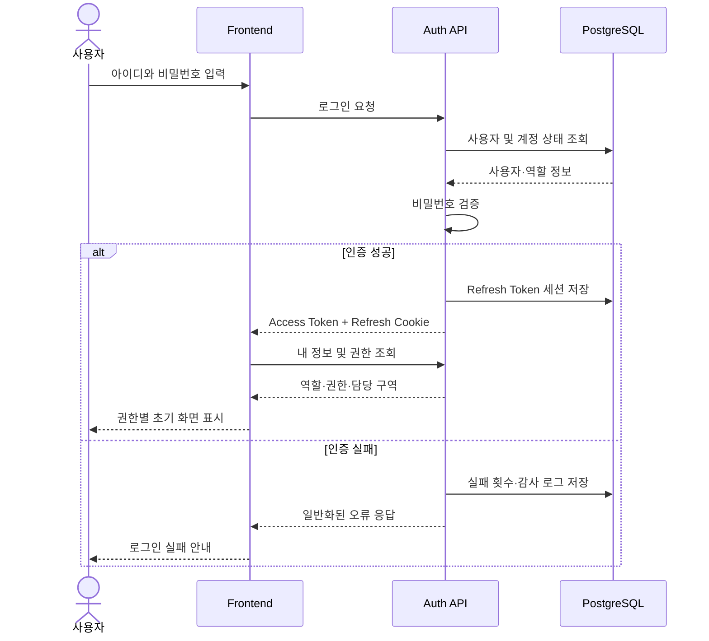

### 7.5 완료 기준

- 인증되지 않은 사용자는 보호 페이지에 접근할 수 없다.
- 역할에 따라 메뉴와 API 접근이 달라진다.
- Frontend에서 버튼을 숨기는 것과 별개로 Backend가 권한을 강제한다.
- 로그아웃 시 Refresh Token이 폐기된다.
- 계정 잠금·비활성화 상태가 적용된다.
- 로그인·로그아웃·권한 변경이 감사 로그에 남는다.
- 테스트에서 정상, 실패, 만료, 권한 부족, 토큰 재사용 시나리오를 검증한다.

---

## 8. 고도화 1-1: 기준정보 등록 및 관리

### 8.1 현재 문제

현재 빗물받이, 센서, 장비, 담당 구역, 담당자 정보를 운영자가 직접 등록·수정하는 화면이 부족하다. 초기 Seed 데이터에 의존하면 실제 운영 데이터 변경이 어렵고, DB를 직접 수정하게 될 가능성이 있다.

### 8.2 관리 대상

| 관리 대상 | 주요 필드 예시 |
|---|---|
| 빗물받이 | 코드, 주소, 위도, 경도, 설치일, 상태, 관할 구역, 비고 |
| 센서 | 센서 ID, 종류, 단위, 측정 범위, 연결 장비, 교정일, 상태 |
| 장비 | Device ID, MQTT Client ID, 인증서, 펌웨어, 마지막 접속 시각 |
| CCTV | URL 또는 스냅샷 경로, 상태, 촬영 주기, 연결 빗물받이 |
| 담당 구역 | 구역명, 행정구역, Polygon 또는 시설 목록 |
| 현장 담당자 | 사용자, 소속, 연락처, 담당 구역, 근무 상태 |
| 위험 정책 | 상태 기준, 자동 작업 생성 조건, 알림 기준 |
| 알림 채널 | 이메일, SMS, 앱 알림, 수신 대상 |
| 데이터 보존 정책 | 원천 데이터와 집계 데이터 보존 기간 |

### 8.3 필요한 화면 구조

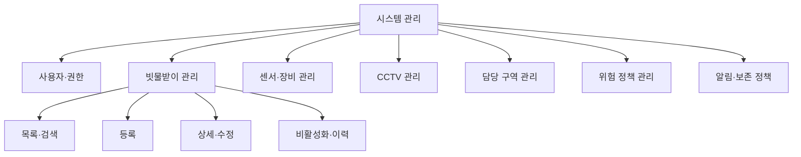

### 8.4 데이터 변경 원칙

- 물리 삭제보다 비활성화 또는 Soft Delete 우선
- 코드와 외부 장비 ID에 Unique 제약조건 적용
- 수정 전후 값을 감사 로그에 저장
- CSV 일괄 등록은 검증·미리보기·오류 보고 후 반영
- 센서와 빗물받이 연결 변경 이력 보존
- 중요한 설정은 승인 또는 재확인 절차 적용
- Optimistic Lock을 위한 `version` 컬럼 검토

### 8.5 와이어프레임 필요 항목

현재 별도 와이어프레임이 없으므로 다음 화면을 우선 설계한다.

1. 빗물받이 목록
2. 빗물받이 등록·수정
3. 센서·장비 목록
4. 센서·장비 등록·연결
5. 담당 구역 지도 편집
6. 사용자와 구역 배정
7. 위험 정책 설정
8. 변경 이력 조회

---

## 9. 고도화 2: 작업 요청과 현장 처리

### 9.1 목표

빗물받이 상태가 위험 조건에 도달하면 관제 관리자가 작업 요청을 생성하거나 시스템이 자동으로 작업을 생성하고, 현장 담당자가 배정된 작업을 모바일과 데스크톱에서 처리할 수 있도록 한다.

### 9.2 작업 생성 방식

| 방식 | 설명 |
|---|---|
| 자동 생성 | 위험 상태, 지속 시간, 강우량, 반복 위험 조건에 따라 생성 |
| 수동 생성 | 관리자가 지도, 목록, 상세 화면에서 생성 |
| 현장 신고 | 담당자가 현장에서 사진과 위치를 첨부해 생성 |
| 외부 연계 | 민원 또는 다른 시스템 요청을 수신해 생성 |

동일 빗물받이에 열린 작업이 이미 존재하면 중복 생성하지 않도록 한다.

### 9.3 작업 상태

| 화면 표시 | 내부 코드 | 설명 |
|---|---|---|
| 접수 | `RECEIVED` | 작업 요청 생성 |
| 배정 대기 | `UNASSIGNED` | 담당자 미배정 |
| 이동 중 | `EN_ROUTE` | 담당자가 작업 수락 후 이동 |
| 현장 도착 | `ARRIVED` | 현장 도착 확인 |
| 조치 중 | `IN_PROGRESS` | 청소 또는 점검 진행 |
| 검토 대기 | `REVIEW_PENDING` | 조치 결과 제출, 관리자 확인 대기 |
| 완료 | `COMPLETED` | 관리자 승인 또는 자동 검증 완료 |
| 반려 | `REJECTED` | 사진·메모 부족 등으로 재작업 필요 |
| 취소 | `CANCELLED` | 중복, 오탐, 정책 변경 등으로 취소 |

### 9.4 작업 상태 머신

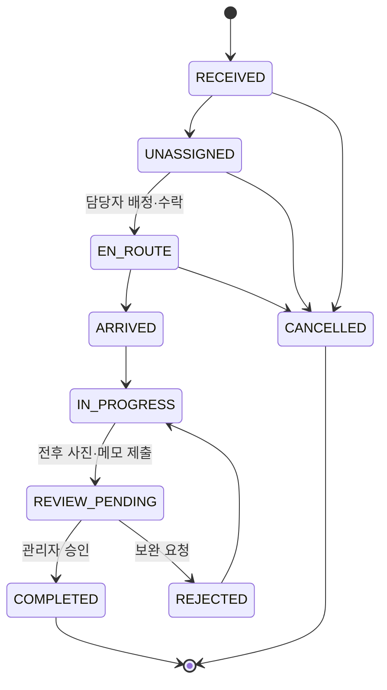

### 9.5 현장 담당자 기능

- 오늘의 배정 작업 요약
- 긴급·거리·요청 시간·위험도 정렬
- 담당 구역 필터
- 작업 상세 확인
- 최신 CCTV 이미지 및 센서 상태 확인
- AI 판단 요약 확인
- 길찾기
- 관리자 연락
- 작업 수락 및 상태 변경
- 현장 도착 기록
- 조치 전 사진
- 조치 후 사진
- 메모 및 처리 유형
- 오프라인 임시 저장
- 네트워크 복구 후 재전송
- 완료 제출
- 반려 사유 확인과 재제출
- 본인 처리 이력과 작업 통계

### 9.6 반응형 원칙

현장에서는 모바일 사용이 많지만, 사무실에서 여러 이미지를 정리해 업로드할 가능성을 고려하여 동일 기능을 반응형으로 제공한다.

| 모바일 우선 | 데스크톱 보완 |
|---|---|
| 큰 터치 영역 | 다중 선택과 일괄 업로드 |
| 하단 고정 주요 버튼 | 좌우 분할 상세 화면 |
| 카메라 직접 촬영 | 파일 Drag & Drop |
| 한 손 조작 | 키보드 접근과 표 기반 관리 |
| 오프라인 임시 저장 | 여러 작업 비교와 검토 |
| 위치·시간 자동 기록 | 이미지 메타데이터 확인 |

### 9.7 첨부 와이어프레임 해석

다음 이미지는 최종 디자인이 아니라 기능과 정보 구조를 참고하기 위한 예시이다.

#### 현장 신고 및 조치 전후 사진

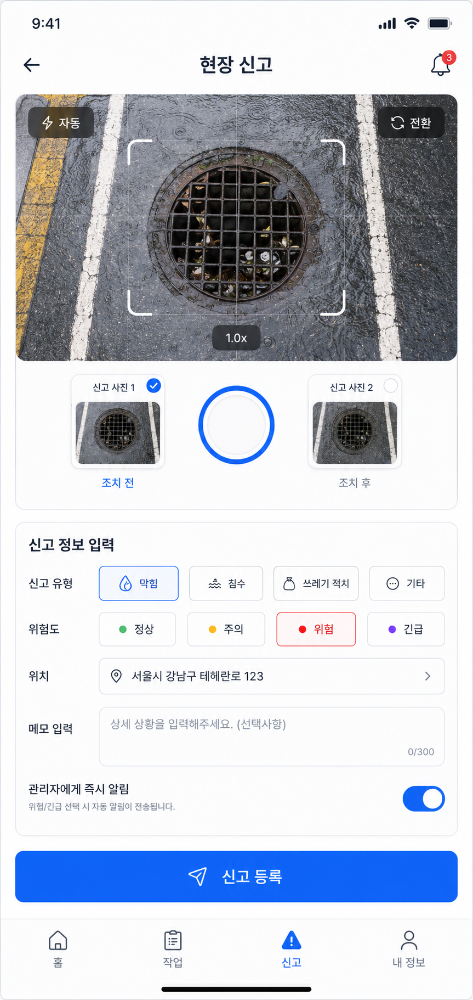

확인된 참고 요소:

- 현장 카메라 영역
- 조치 전·조치 후 이미지 구분
- 신고 유형
- 위험도
- 위치
- 메모
- 관리자 즉시 알림
- 신고 등록 버튼
- 모바일 하단 내비게이션

#### 작업 상세

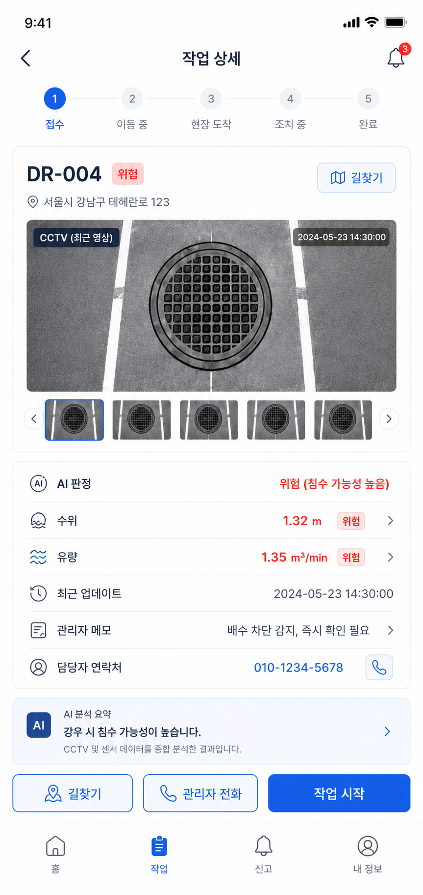

확인된 참고 요소:

- 작업 진행 단계
- 시설 코드와 주소
- 길찾기
- 최근 CCTV 이미지
- AI 판단, 수위, 유량
- 관리자 메모와 연락처
- 작업 시작
- AI 분석 요약

#### 배정 작업 목록

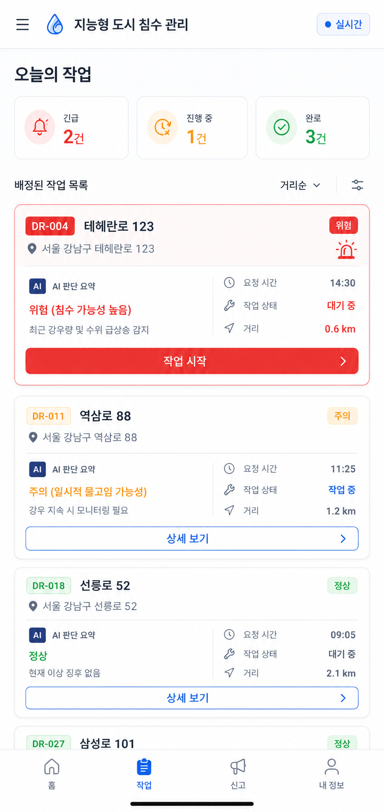

확인된 참고 요소:

- 긴급, 진행 중, 완료 요약
- 배정 작업 목록
- 위험도, 거리, 요청 시간
- 작업 상태
- 작업 시작 또는 상세 보기
- 정렬과 필터
- 모바일 하단 내비게이션

실제 디자인은 현재 SmartDrain의 색상, 타이포그래피, 카드, 지도, 상태 배지 규칙을 우선 적용한다.

### 9.8 사진 기록 기준

- 조치 전과 조치 후를 별도 타입으로 저장
- 업로드 시간과 촬영 시간 구분
- 가능하면 위치 정보 저장
- 원본과 썸네일 분리
- 이미지 크기 제한과 압축
- 중복 업로드 방지용 해시
- 개인정보와 차량 번호 등 민감 정보 검토
- EXIF 보존 여부 정책화
- 업로드 실패 재시도
- 파일 악성 검사 및 MIME 검증
- 조치 결과와 연결되는 불변 이력 보존

### 9.9 작업 생성과 처리 흐름

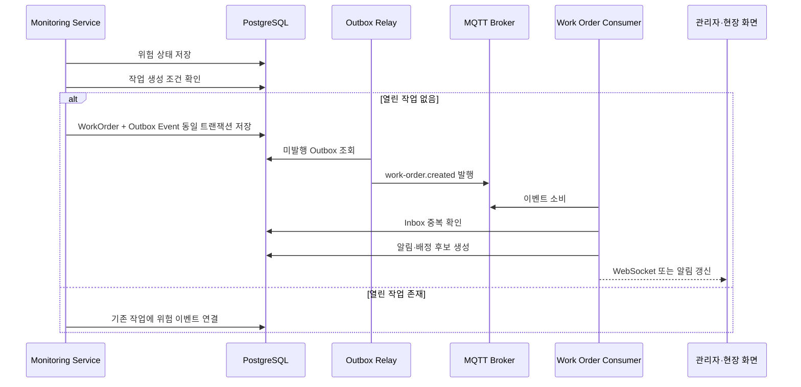

---

## 10. 고도화 3: Callback 중심 구조에서 MQTT 이벤트 중심 구조로 전환

### 10.1 전환 목표

현재 Backend가 AI Service에 요청하고 AI Service가 Callback으로 결과를 반환하는 구조를 MQTT 기반 이벤트 처리 구조로 단계적으로 전환한다.

다만 MQTT는 모든 내부 처리에 무조건 적합한 단일 해답이 아니다. 초기 목표는 다음 두 영역을 분리하는 것이다.

1. 실제 IoT 센서와 장비 데이터 수집: MQTT 사용
2. 분석 요청·결과·작업 생성 등의 비동기 이벤트: MQTT 또는 별도 메시지 브로커 사용

현재 프로젝트 규모에서는 MQTT로 통합할 수 있으나, 처리량·재처리·보존·순서 보장이 커지면 Kafka 또는 RabbitMQ 등 다른 브로커와 비교해야 한다. 에이전트는 기존 요구를 존중하되, 실제 부하와 운영 요구를 근거로 최종 선택을 제안한다.

### 10.2 목표 아키텍처

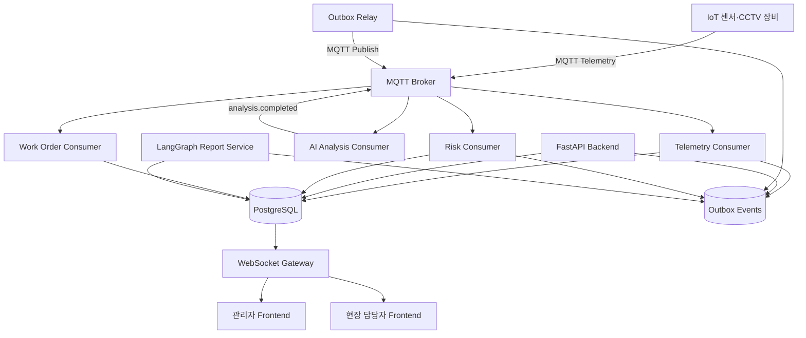

### 10.3 제안 Topic 구조

```text
smartdrain/v1/devices/{deviceId}/telemetry
smartdrain/v1/devices/{deviceId}/status
smartdrain/v1/devices/{deviceId}/commands
smartdrain/v1/drains/{drainId}/analysis/requested
smartdrain/v1/drains/{drainId}/analysis/yolo-completed
smartdrain/v1/drains/{drainId}/analysis/risk-completed
smartdrain/v1/drains/{drainId}/risk/changed
smartdrain/v1/work-orders/created
smartdrain/v1/work-orders/{workOrderId}/assigned
smartdrain/v1/work-orders/{workOrderId}/status-changed
smartdrain/v1/reports/daily/generated
smartdrain/v1/notifications/requested
smartdrain/v1/dead-letter/{eventType}
```

### 10.4 이벤트 Envelope

모든 이벤트에 공통 Envelope를 사용한다.

```json
{
  "eventId": "uuid",
  "eventType": "drain.risk.changed",
  "schemaVersion": 1,
  "occurredAt": "2026-07-06T10:00:00+09:00",
  "producer": "risk-service",
  "correlationId": "uuid",
  "causationId": "uuid",
  "aggregateType": "Drain",
  "aggregateId": "DR-004",
  "sequence": 42,
  "dataSource": "REAL",
  "payload": {}
}
```

필수 고려 사항:

- Event ID 중복 방지
- Correlation ID로 분석 요청부터 작업 생성까지 추적
- Schema Version 관리
- Aggregate 단위 순서 번호
- 실제·시뮬레이션 데이터 출처
- 발생 시각과 수신 시각 분리
- 역직렬화 실패 처리
- 유효성 검증
- 민감 정보 최소화

### 10.5 MQTT 처리 원칙

| 항목 | 권장 원칙 |
|---|---|
| QoS | Telemetry와 중요 이벤트에 따라 QoS 1 중심 검토 |
| Retain | 장비 최신 상태에는 사용 가능, 원천 Telemetry에는 신중 |
| 세션 | 지속 세션과 재연결 전략 검토 |
| 인증 | 장비별 계정 또는 인증서, 최소 Topic ACL |
| TLS | Broker 연결 암호화 |
| 순서 | 동일 장비·시설 단위 순서 관리 |
| 중복 | At-least-once를 전제로 Consumer Idempotency 구현 |
| 재시도 | 지수 백오프와 재시도 횟수 제한 |
| 실패 | Dead Letter Topic 또는 실패 테이블 |
| Backpressure | Consumer 처리량, 배치, Sampling, 제한 정책 |
| 보존 | 원천·집계 데이터 보존 기간 분리 |
| 관측성 | 소비 지연, 실패율, 재시도, 연결 장비 수 모니터링 |

### 10.6 Callback 전환 단계

| 단계 | 내용 |
|---|---|
| 1단계 | 기존 Callback에 Correlation ID, Idempotency, 상태 머신 추가 |
| 2단계 | MQTT Broker와 이벤트 Envelope 도입 |
| 3단계 | 센서 Telemetry를 MQTT로 수집 |
| 4단계 | AI 분석 요청을 Event Publish로 병행 |
| 5단계 | AI 결과를 MQTT Event로 수신하고 Callback과 비교 검증 |
| 6단계 | Callback을 비상 경로 또는 폐기 대상으로 전환 |
| 7단계 | 운영 지표 확인 후 Callback 제거 여부 결정 |

Big Bang 방식으로 한 번에 제거하지 않고, 일정 기간 Dual Write 또는 Shadow Consume으로 결과를 비교한다.

---

## 11. 고도화 3-1: 대량 데이터 대응

### 11.1 예상 문제

- 여러 센서가 짧은 주기로 데이터를 발행
- 동일 빗물받이에서 이미지와 센서 데이터의 시간 정합성 필요
- Broker 재연결 후 중복 전송
- Consumer 지연
- DB Insert 집중
- WebSocket 과다 갱신
- 원천 데이터의 빠른 증가
- 분석 요청 폭주
- AI Service 추론 대기열 증가

### 11.2 대응 전략

| 영역 | 전략 |
|---|---|
| 수집 | 장비별 rate limit, payload 검증, timestamp 허용 범위 |
| Broker | 장비·시설 단위 Topic 설계, 연결 제한, ACL |
| Consumer | Consumer Group, 동시성 제한, 재시도 큐 |
| DB | Batch Insert, 인덱스 최소화, 기간 Partition 검토 |
| 정합성 | Event Time과 Ingest Time 분리, 허용 지연 Window |
| 분석 | 최신 데이터 우선, 중복 요청 합치기, Queue 길이 제한 |
| UI | 모든 Telemetry를 직접 전송하지 않고 집계·상태 변경만 Push |
| 보존 | 원천 데이터, 시간 단위 집계, 일 단위 집계 보존 기간 분리 |
| 장애 | Broker·Consumer·DB 장애별 복구 Runbook |
| 테스트 | k6 또는 전용 Producer로 처리량·지연·실패율 측정 |

### 11.3 WebSocket 갱신 정책

- 센서 원천 데이터가 들어올 때마다 화면 전체를 갱신하지 않는다.
- 위험 상태 변경, 임계값 초과, 지정된 주기 요약만 전송한다.
- 이벤트에 `entityId`, `version`, `updatedAt`을 포함한다.
- Frontend는 오래된 이벤트를 무시한다.
- 재연결 후 REST로 최신 상태를 다시 조회한다.
- 여러 Backend 인스턴스에서는 Redis Pub/Sub 또는 Broker 기반 Fan-out을 사용한다.

---

## 12. 고도화 3-2: Outbox, Inbox, 트랜잭션 보강

### 12.1 현재 위험

DB 저장과 메시지 발행을 별도로 처리하면 다음 문제가 생긴다.

- DB 저장 성공, MQTT 발행 실패
- MQTT 발행 성공, DB 저장 실패
- 동일 이벤트 중복 소비
- Consumer 처리 중 장애
- 역순 이벤트 적용
- 작업 상태와 알림 상태 불일치

### 12.2 Transactional Outbox

도메인 데이터 변경과 Outbox Event 저장을 하나의 DB 트랜잭션으로 처리한다.

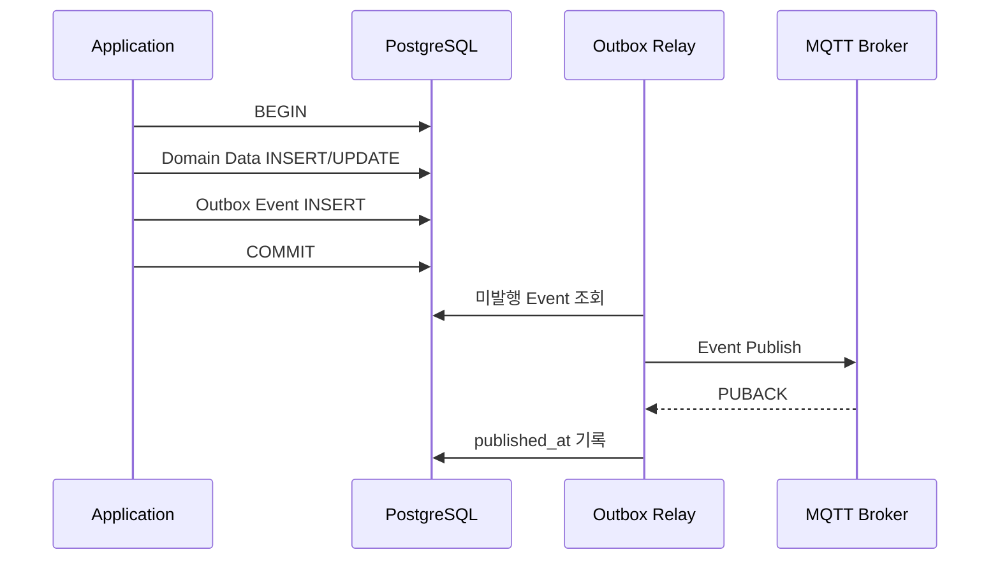

### 12.3 Consumer Inbox

Consumer는 이벤트 처리 전에 Inbox 테이블에서 `event_id`를 확인한다.

```text
1. event_id 조회
2. 이미 처리된 이벤트이면 ACK 후 종료
3. 미처리 이벤트이면 Inbox와 도메인 변경을 동일 트랜잭션으로 저장
4. 성공 후 ACK
5. 실패 시 재시도 또는 Dead Letter 처리
```

### 12.4 제안 테이블

| 테이블 | 목적 |
|---|---|
| `outbox_events` | 발행해야 할 도메인 이벤트 |
| `inbox_events` | Consumer가 처리한 이벤트 ID |
| `event_failures` | 처리 실패, 오류, 재시도 횟수 |
| `audit_logs` | 사용자와 시스템 변경 이력 |
| `work_order_status_history` | 작업 상태 변경 이력 |
| `device_connection_history` | 장비 연결·해제 이력 |

### 12.5 추가 트랜잭션 원칙

- 상태 변경 API는 허용된 이전 상태를 확인한다.
- 작업 완료와 사진 저장 관계를 명시한다.
- 대용량 파일은 Object Storage에 먼저 임시 업로드하고, DB 확정 단계와 보상 처리를 설계한다.
- 동일 빗물받이의 열린 작업은 Unique Partial Index 또는 애플리케이션 Lock으로 중복 방지한다.
- `version`을 이용한 Optimistic Lock을 검토한다.
- 작업 배정 경쟁 조건을 방지한다.
- Callback 또는 Event Consumer가 결과를 여러 번 적용하지 않도록 한다.
- 중요한 변경은 사용자 ID와 Request ID를 남긴다.

---

## 13. 고도화 4: LangChain·LangGraph 일일 보고서

### 13.1 목표

하루 동안 발생한 위험 상태, 센서 이상, 분석 결과, 작업 요청, 조치 완료, 미처리 항목을 수집하여 관리자가 검토할 수 있는 일일 보고서 초안을 자동 생성한다.

### 13.2 LangGraph 사용 이유

일일 보고서는 단순 한 번의 LLM 호출보다 다음 단계가 필요하다.

1. 데이터 수집
2. 누락과 이상치 검증
3. 통계 집계
4. 중요 사건 선택
5. 자연어 초안 생성
6. 근거 연결
7. 사용자 검토
8. 승인과 제출
9. 실패 시 재시도 또는 수동 보완

이 흐름은 상태와 분기, 사용자 승인이 필요하므로 LangGraph 기반 워크플로가 적합하다.

### 13.3 보고서 생성 그래프

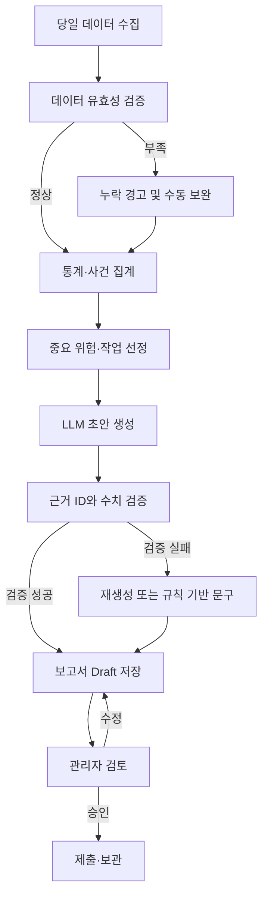

### 13.4 보고서 양식 v1

양식이 없는 상태이므로 다음 기본 템플릿으로 시작한다.

```markdown
# SmartDrain 일일 운영 보고서

## 1. 기본 정보
- 보고 일자:
- 작성자:
- 관할 구역:
- 데이터 집계 시간:
- 보고 상태:

## 2. 금일 요약
- 전체 빗물받이 수:
- 양호:
- 주의:
- 위험:
- 판단불가:
- 신규 작업:
- 완료 작업:
- 미처리 작업:

## 3. 주요 위험 시설
| 시설 | 최고 위험도 | 발생 시각 | 주요 근거 | 현재 조치 상태 |

## 4. 센서 및 장비 이상
| 장비 | 이상 유형 | 최초 발생 | 지속 시간 | 조치 |

## 5. 현장 조치 결과
| 작업 | 담당자 | 조치 내용 | 전후 사진 | 완료 시각 |

## 6. 미처리 및 익일 인계
| 항목 | 사유 | 담당자 | 목표 시각 |

## 7. 특이사항
- 강우량 변화:
- 반복 위험 지점:
- 데이터 누락:
- 관리자 메모:

## 8. AI 생성 요약
- 데이터에 근거한 운영 요약
- 추정 또는 확인되지 않은 표현 금지
```

### 13.5 보고서 데이터 원칙

- LLM은 DB의 구조화된 데이터만 근거로 사용한다.
- 보고서 문장에는 관련 시설·작업·이벤트 ID를 연결한다.
- 수치 계산은 애플리케이션 코드 또는 SQL에서 수행한다.
- LLM이 임의로 수치를 계산하지 않도록 한다.
- 누락 데이터는 숨기지 않고 명시한다.
- `사실`, `추정`, `관리자 의견`을 구분한다.
- 생성 Prompt와 모델 버전을 기록한다.
- 동일 데이터로 재생성할 수 있도록 Snapshot 또는 Query 조건을 저장한다.
- 관리자 승인 전에는 공식 보고서로 간주하지 않는다.

### 13.6 사이드바 정보 구조

현재 햄버거 메뉴 아래 기능을 다음과 같이 구성한다.

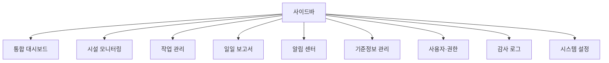

권한에 따라 메뉴를 다르게 표시한다.

### 13.7 보고서 상태

| 상태 | 코드 | 설명 |
|---|---|---|
| 미생성 | `NOT_CREATED` | 당일 보고서 없음 |
| 생성 중 | `GENERATING` | 데이터 수집 또는 LLM 처리 중 |
| 초안 | `DRAFT` | 자동 생성 또는 임시 저장 |
| 검토 중 | `IN_REVIEW` | 관리자가 검토 중 |
| 제출 완료 | `SUBMITTED` | 공식 제출 완료 |
| 재생성 필요 | `REGEN_REQUIRED` | 데이터 변경 또는 생성 실패 |
| 실패 | `FAILED` | 생성 실패, 수동 조치 필요 |

### 13.8 로그아웃 전 보고서 알림

사용자가 로그아웃을 누를 때 Frontend 상태만 확인하지 않고 Backend에서 당일 보고서 상태를 조회한다.

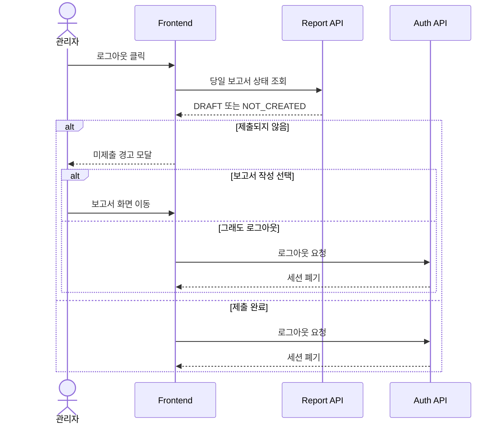

권장 UX:

- 브라우저 기본 `alert`보다 서비스 디자인과 일치하는 Modal 사용
- 선택지: `보고서 작성`, `임시 저장 후 로그아웃`, `그래도 로그아웃`
- 역할과 근무일에 따라 경고 적용
- 로그아웃 시점뿐 아니라 마감 시간 전 Banner·알림 제공
- 세션 만료는 막을 수 없으므로 Draft 자동 저장 필요
- 미제출 상태는 다음 로그인 시 다시 표시

---

## 14. 추가 제안: 모니터링 서비스 관점의 고도화

### 14.1 장비 상태와 데이터 신선도

모니터링 시스템은 위험도뿐 아니라 데이터가 정상적으로 들어오는지도 보여줘야 한다.

| 지표 | 설명 |
|---|---|
| Last Seen | 장비의 마지막 데이터 수신 시각 |
| Data Freshness | 현재 시각과 최신 데이터의 차이 |
| Offline Duration | 장비 연결 끊김 지속 시간 |
| Missing Rate | 기대 측정 횟수 대비 누락 비율 |
| Invalid Rate | 범위 오류, 형식 오류 비율 |
| Battery/Power | 배터리 또는 전원 상태 |
| Firmware | 장비 펌웨어 버전 |
| Calibration Due | 센서 교정 예정일 |

대시보드에는 위험 시설과 별도로 `데이터 미수신`, `센서 이상`, `카메라 장애` 목록이 필요하다.

### 14.2 알림과 에스컬레이션

- 위험 상태 지속 시간에 따른 단계별 알림
- 작업 미배정 시간 초과
- 담당자 미수락
- 현장 도착 지연
- 조치 완료 후 위험 상태 유지
- 동일 시설 반복 위험
- 장비 장기 오프라인
- 보고서 미제출
- 알림 수신 확인과 재전송
- 야간·휴일 당직 정책

### 14.3 SLA 대시보드

| SLA 지표 | 예시 |
|---|---|
| 위험 감지부터 작업 생성까지 | 시스템 처리 시간 |
| 작업 생성부터 담당자 배정까지 | 배정 시간 |
| 배정부터 수락까지 | 응답 시간 |
| 수락부터 현장 도착까지 | 이동 시간 |
| 도착부터 조치 완료까지 | 처리 시간 |
| 전체 평균 해결 시간 | MTTR |
| 재발률 | 완료 후 일정 기간 내 재위험 비율 |

### 14.4 강우량·기상 연동

- 현재 강우량
- 단기 예보
- 누적 강우량
- 호우 특보
- 시설별 과거 위험과 강우량 상관
- 강우 예보에 따른 사전 점검 작업 생성
- 우천 시 위험 기준 조정 여부

기상 데이터는 위험도 판단 근거로 사용하기 전에 출처, 갱신 주기, 누락 처리, 시간대 정합성을 명확히 한다.

### 14.5 반복 위험 지점과 예방 정비

- 최근 7일·30일 위험 발생 횟수
- 반복 청소가 필요한 시설
- 조치 후 재발 시간
- 특정 강우량에서 반복적으로 위험해지는 시설
- 예방 점검 후보
- 센서 교체 또는 시설 개선 후보
- 구역별 위험 Heatmap

### 14.6 운영 관측성

- Prometheus: API 지연, 오류율, Consumer Lag, Queue 크기
- Grafana: 서비스·장비·작업 운영 대시보드
- Loki 또는 중앙 로그: Correlation ID 기반 검색
- 분산 추적: 분석 요청부터 작업 생성까지 Trace
- Alertmanager 또는 알림 연계
- Health, Readiness, Liveness 분리
- AI 추론 시간과 모델 실패율
- MQTT 연결 수, 재연결 수, Publish 실패율
- Outbox 미발행 건수와 최대 지연

### 14.7 현장 사용성

- PWA 설치
- 오프라인 Draft
- 네트워크 복구 후 동기화
- 카메라 촬영과 갤러리 업로드
- 위치 권한 거부 시 수동 확인
- 큰 글자와 고대비
- 장갑 착용을 고려한 큰 버튼
- 처리 단계별 최소 입력
- 이미지 업로드 진행률
- 중복 제출 방지
- 저사양 기기 성능 최적화

### 14.8 감사와 변경 추적

- 누가 어떤 위험 상태를 확인했는지
- 누가 작업을 생성·배정·취소했는지
- 누가 시설·센서 정보를 변경했는지
- 보고서를 누가 생성·수정·승인했는지
- AI 판단을 사람이 변경했는지
- 전후 값과 변경 사유
- 시스템 자동 변경과 사용자 변경 구분

---

## 15. 목표 시스템 아키텍처

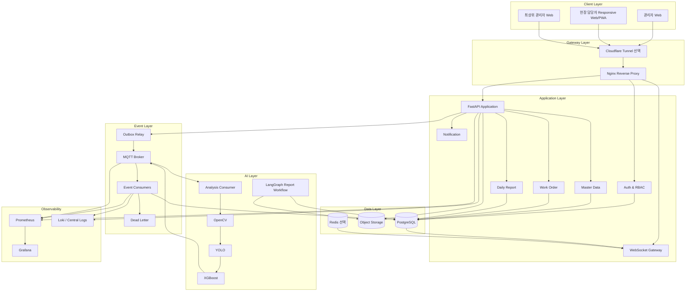

---

## 16. 제안 도메인 모델

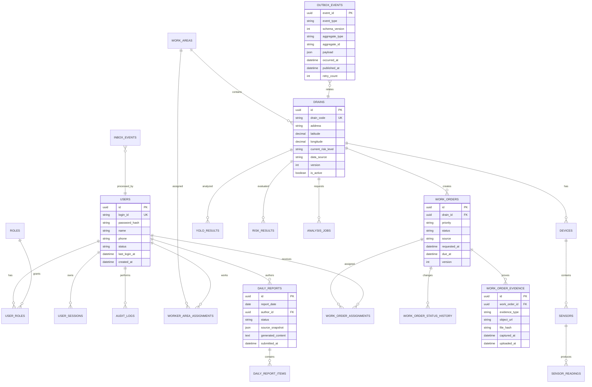

실제 테이블명은 기존 Migration과 충돌하지 않도록 에이전트가 확인한 뒤 결정한다.

---

## 17. 제안 API 범위

### 17.1 인증

```text
POST   /api/auth/login
POST   /api/auth/refresh
POST   /api/auth/logout
GET    /api/auth/me
PATCH  /api/auth/me
PATCH  /api/auth/password
GET    /api/auth/sessions
DELETE /api/auth/sessions/{sessionId}
```

### 17.2 사용자·권한

```text
GET    /api/admin/users
POST   /api/admin/users
GET    /api/admin/users/{userId}
PATCH  /api/admin/users/{userId}
PATCH  /api/admin/users/{userId}/status
PUT    /api/admin/users/{userId}/roles
GET    /api/admin/roles
```

### 17.3 기준정보

```text
GET    /api/admin/drains
POST   /api/admin/drains
GET    /api/admin/drains/{drainId}
PATCH  /api/admin/drains/{drainId}
GET    /api/admin/devices
POST   /api/admin/devices
PATCH  /api/admin/devices/{deviceId}
GET    /api/admin/sensors
POST   /api/admin/sensors
PATCH  /api/admin/sensors/{sensorId}
GET    /api/admin/work-areas
POST   /api/admin/work-areas
PATCH  /api/admin/work-areas/{areaId}
```

### 17.4 작업 관리

```text
GET    /api/work-orders
POST   /api/work-orders
GET    /api/work-orders/{workOrderId}
POST   /api/work-orders/{workOrderId}/assign
POST   /api/work-orders/{workOrderId}/accept
POST   /api/work-orders/{workOrderId}/arrive
POST   /api/work-orders/{workOrderId}/start
POST   /api/work-orders/{workOrderId}/evidence
POST   /api/work-orders/{workOrderId}/submit
POST   /api/work-orders/{workOrderId}/approve
POST   /api/work-orders/{workOrderId}/reject
POST   /api/work-orders/{workOrderId}/cancel
GET    /api/work-orders/{workOrderId}/history
```

### 17.5 일일 보고서

```text
GET    /api/reports/daily/today
POST   /api/reports/daily/generate
PATCH  /api/reports/daily/{reportId}
POST   /api/reports/daily/{reportId}/regenerate
POST   /api/reports/daily/{reportId}/review
POST   /api/reports/daily/{reportId}/submit
GET    /api/reports/daily/{reportId}/sources
GET    /api/reports/daily/{reportId}/export
```

API 경로는 기존 프로젝트 규칙을 확인한 뒤 통일한다.

---

## 18. Frontend 정보 구조

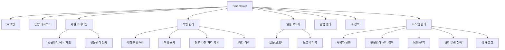

### 18.1 반응형 Breakpoint 원칙

구체적인 픽셀 값은 현재 Tailwind 설정을 확인한 뒤 결정한다.

- Mobile: 현장 작업 중심, 단일 Column
- Tablet: 지도와 작업 상세 전환
- Desktop: 목록·지도·상세 Split View
- Large Desktop: 관제 Dashboard와 다중 패널

### 18.2 공통 UX 원칙

- 위험 상태는 색상만으로 구분하지 않고 텍스트·아이콘 병행
- 상태 변경 버튼은 현재 가능한 다음 상태만 표시
- 저장 중·업로드 중 상태 명확히 표시
- 중복 클릭 방지
- 실패 원인과 재시도 버튼 제공
- 파괴적 작업은 확인 Modal
- 권한 부족은 단순 숨김뿐 아니라 안내 제공
- 긴 폼은 자동 저장 또는 임시 저장
- 이미지 업로드 전 미리보기와 삭제
- 접근성 Label과 키보드 탐색

---

## 19. 보안 설계 체크리스트

### 19.1 사용자 인증

- [ ] Access Token 만료 정책
- [ ] Refresh Token Rotation
- [ ] Refresh Token 폐기
- [ ] 계정 비활성화와 잠금
- [ ] 비밀번호 해시
- [ ] 로그인 실패 제한
- [ ] MFA 확장 가능성
- [ ] 세션 목록과 원격 로그아웃

### 19.2 권한

- [ ] Backend RBAC
- [ ] 시설·구역 단위 접근 제한
- [ ] 본인 작업만 수정 가능한 정책
- [ ] 관리자 API 별도 권한
- [ ] 서비스 계정 최소 권한
- [ ] 권한 변경 감사 로그

### 19.3 서비스 간 통신

- [ ] AI Service 또는 Event Consumer 인증
- [ ] MQTT TLS
- [ ] 장비별 Topic ACL
- [ ] 이벤트 서명 또는 Broker 인증
- [ ] Replay 방지
- [ ] Timestamp·Nonce 또는 Event ID 검증
- [ ] Secret Rotation

### 19.4 파일 업로드

- [ ] 허용 MIME과 확장자
- [ ] 실제 파일 Signature 검사
- [ ] 크기 제한
- [ ] 악성 파일 검사
- [ ] Object Storage Private Bucket
- [ ] Signed URL
- [ ] 파일 해시
- [ ] 개인정보 보존 정책

### 19.5 운영

- [ ] Swagger 운영 노출 정책
- [ ] Rate Limit
- [ ] CORS 제한
- [ ] CSRF 보호
- [ ] 보안 Header
- [ ] Secret Manager 또는 안전한 환경변수
- [ ] DB 최소 권한
- [ ] 감사 로그 위변조 방지
- [ ] 백업 암호화

---

## 20. 테스트와 검증 계획

### 20.1 테스트 피라미드

| 계층 | 대상 |
|---|---|
| Unit | 위험 정책, 상태 전이, 권한 검사, 보고서 집계 |
| Component | Repository, MQTT Publisher, Outbox Relay, LLM Adapter |
| Contract | Frontend-Backend DTO, MQTT Event Schema, AI 결과 Schema |
| Integration | PostgreSQL, Broker, Object Storage, Redis |
| E2E | 로그인부터 작업 완료, 보고서 제출까지 |
| Performance | Telemetry 수집, Consumer 처리량, WebSocket |
| Resilience | Broker 장애, DB 장애, 중복 이벤트, 순서 역전 |
| Security | 권한 우회, 토큰 재사용, 파일 업로드, Topic ACL |

### 20.2 핵심 E2E 시나리오

1. 최상위 관리자가 빗물받이와 센서를 등록한다.
2. 센서 데이터가 MQTT로 들어온다.
3. 분석 요청 이벤트가 생성된다.
4. AI 결과 이벤트가 저장된다.
5. 위험 상태로 변경된다.
6. 작업 요청이 자동 생성된다.
7. 관리자가 담당자를 배정한다.
8. 현장 담당자가 작업을 수락한다.
9. 조치 전 사진을 등록한다.
10. 이동·도착·조치 중 상태를 변경한다.
11. 조치 후 사진과 메모를 제출한다.
12. 관리자가 검토하고 완료한다.
13. 일일 보고서에 해당 작업이 반영된다.
14. 보고서 미제출 상태에서 로그아웃 경고가 표시된다.
15. 보고서를 제출한 뒤 정상 로그아웃한다.

### 20.3 실패 시나리오

- 동일 이벤트 두 번 수신
- XGBoost 완료 이벤트가 YOLO 이벤트보다 먼저 도착
- MQTT 연결 끊김
- Broker 재연결 후 중복 Telemetry
- Outbox Publish 실패
- Consumer 처리 중 프로세스 종료
- 작업 중복 자동 생성
- 두 관리자가 같은 작업을 동시에 배정
- 현장 담당자의 권한 없는 작업 수정
- 사진 업로드 성공 후 DB 저장 실패
- 보고서 생성 중 LLM timeout
- 보고서 수치와 원천 데이터 불일치
- WebSocket 재연결 중 오래된 이벤트 도착
- 시뮬레이션 데이터가 운영 보고서에 포함되는 문제

### 20.4 완료 증거

각 기능은 다음 중 가능한 증거를 남긴다.

- 테스트 코드와 실행 결과
- API 요청·응답 예시
- DB Row 확인
- MQTT Publish·Consume 로그
- WebSocket 이벤트
- 화면 캡처
- Docker Compose 상태
- Jenkins 실행 결과
- 오류 재현과 복구 기록
- 성능 측정 결과
- 보안 테스트 결과

---

## 21. 단계별 고도화 로드맵

### Phase 0. 기준 확정과 코드 크로스체크

목표: 문서와 실제 코드의 차이를 확정한다.

- 최신 브랜치와 Commit 지정
- 디렉터리 구조 확인
- 실제 API, DB, Event, WebSocket 목록 생성
- Simulator 구현 상태 확인
- 테이블명과 문서명 통일
- Docker Compose 전체 기동
- 현재 E2E Smoke Test
- 미사용 코드와 과거 문서 구분

완료 조건:

- `현재 구현`, `부분 구현`, `미구현`, `검증 필요` 표가 실제 코드 근거와 함께 작성됨
- 이후 작업 기준 Commit이 고정됨

### Phase 1. 인증·권한과 기준정보 관리

목표: 운영자가 안전하게 시스템 데이터를 관리할 수 있게 한다.

- 사용자, 역할, 세션 테이블
- 로그인, 로그아웃, Token Refresh
- RBAC
- 로그인·마이페이지
- 사용자 관리
- 빗물받이·센서·장비 관리
- 담당 구역 관리
- 감사 로그
- 관리자 API 테스트

완료 조건:

- 역할별 화면과 API 접근 차단
- DB 직접 수정 없이 기준정보 등록 가능
- 변경 이력 추적 가능

### Phase 2. 작업 요청과 현장 처리

목표: 위험 감지에서 현장 조치 완료까지 연결한다.

- Work Order 도메인
- 자동·수동 생성
- 담당자 배정
- 작업 상태 머신
- 반응형 작업 목록·상세
- 전후 사진
- 알림
- 관리자 검토와 반려
- 작업 SLA

완료 조건:

- 위험 감지부터 완료까지 E2E 시나리오 통과
- 모바일과 데스크톱에서 처리 가능
- 상태 이력과 사진 증빙 보존

### Phase 3. MQTT와 이벤트 신뢰성

목표: IoT 수집과 비동기 처리 구조를 안정화한다.

- MQTT Broker
- Device 인증과 ACL
- Telemetry Consumer
- Event Envelope
- Outbox Relay
- Inbox Idempotency
- Retry와 Dead Letter
- Callback 병행 검증
- 처리량 테스트
- Observability

완료 조건:

- 중복·장애 상황에서 데이터 정합성 유지
- Consumer Lag과 실패를 모니터링
- Callback 제거 또는 보조 경로 결정

### Phase 4. 일일 보고서와 LangGraph

목표: 당일 운영 기록을 근거 기반 보고서로 만든다.

- 보고서 데이터 집계
- LangGraph Workflow
- Draft 자동 저장
- 관리자 검토와 제출
- 근거 링크
- 보고서 이력
- 로그아웃 경고
- 실패 시 규칙 기반 Fallback

완료 조건:

- 수치와 원천 데이터가 일치
- 미제출 경고 동작
- 관리자 승인 전 공식 제출되지 않음
- LLM 실패 시에도 최소 보고서 생성 가능

### Phase 5. 운영 모니터링과 실제 연동

목표: 실제 운영 수준에 가까운 관측성과 장비 연동을 추가한다.

- 장비 상태 대시보드
- 강우량 API
- 실제 센서 또는 RTSP 중 하나의 PoC
- Prometheus·Grafana·로그
- 백업·복원
- 배포 rollback
- 모델 버전 관리
- 데이터 보존 정책

완료 조건:

- 장비·서비스·데이터 품질 이상을 탐지
- 장애 대응 Runbook 존재
- 실제 연동 범위가 문서와 일치

---

## 22. 우선순위 매트릭스

| 고도화 | 사용자 가치 | 기술 리스크 감소 | 구현 난이도 | 우선순위 |
|---|:---:|:---:|:---:|:---:|
| 최신 코드 크로스체크 | 높음 | 높음 | 낮음 | P0 |
| Backend E2E 테스트 | 높음 | 높음 | 중간 | P0 |
| 로그인·RBAC | 높음 | 높음 | 중간 | P0 |
| 기준정보 관리 | 높음 | 중간 | 중간 | P0 |
| 실제·모의 데이터 분리 | 중간 | 높음 | 낮음 | P0 |
| Callback Idempotency | 중간 | 높음 | 중간 | P0 |
| 작업 요청·현장 처리 | 매우 높음 | 중간 | 높음 | P1 |
| Outbox·Inbox | 중간 | 매우 높음 | 높음 | P1 |
| MQTT Telemetry | 높음 | 높음 | 높음 | P1 |
| 운영 모니터링 | 높음 | 높음 | 중간 | P1 |
| 일일 보고서 | 중간 | 중간 | 높음 | P2 |
| LangGraph Workflow | 중간 | 중간 | 높음 | P2 |
| 실제 RTSP | 높음 | 중간 | 매우 높음 | P3 |
| 모델 재학습 | 중간 | 중간 | 매우 높음 | P3 |
| ONNX 양자화 | 낮음 | 낮음 | 중간 | P3 |

---

## 23. 브랜치와 PR 전략

개인 고도화 기준 예시이며 실제 팀 규칙을 우선한다.

```text
main
└─ dev
   ├─ feat/auth-rbac
   ├─ feat/admin-master-data
   ├─ feat/work-order-domain
   ├─ feat/field-worker-ui
   ├─ feat/mqtt-ingestion
   ├─ feat/transactional-outbox
   ├─ feat/daily-report-langgraph
   ├─ feat/observability
   └─ test/end-to-end-hardening
```

큰 기능은 다음 순서로 분리한다.

1. 설계 문서와 Migration
2. Backend Domain·API
3. Frontend UI
4. Event Integration
5. Test
6. Deployment
7. Documentation

PR에는 다음 항목을 포함한다.

```markdown
## 변경 목적
## 현재 문제
## 변경 범위
## 제외 범위
## 아키텍처 영향
## DB Migration
## API 또는 Event 변경
## 보안 영향
## 테스트 결과
## 수동 검증
## Rollback 방법
## 후속 작업
```

---

## 24. 코드 에이전트 1차 분석 지침

### 24.1 1차 작업 원칙

1차 작업에서는 분석만 수행한다.

- 파일 수정 금지
- 패키지 설치 금지
- Migration 실행 금지
- DB 데이터 변경 금지
- Docker Volume 삭제 금지
- 배포 실행 금지
- 환경변수 변경 금지
- Secret 출력 금지
- 분석 보고서 작성 후 사용자 승인 대기

### 24.2 반드시 확인할 항목

#### 저장소와 버전

- 현재 브랜치
- HEAD Commit
- 변경된 파일
- 원격 저장소
- 팀 프로젝트 종료 기준 Commit
- 개인 고도화 시작 기준 Commit

#### Frontend

- 페이지와 Route
- 관리자·상세·지도 화면
- WebSocket 연결과 재연결
- 상태 관리
- API Client
- Simulator UI
- 인증 관련 코드
- 반응형 구조
- 테스트 구성

#### Backend

- FastAPI Router
- Service와 Repository
- SQLAlchemy Model
- Migration
- Transaction 경계
- Callback 처리
- Background Task
- Scheduler
- Simulator
- WebSocket Broadcast
- 인증과 권한
- 테스트

#### AI Service

- 실제 모델 파일
- OpenCV 처리
- YOLO 추론
- XGBoost 로딩
- 요청·결과 Schema
- Callback 재시도
- 비정상 이미지 처리
- 모델 버전

#### Infrastructure

- Dockerfile
- Docker Compose
- Nginx
- Jenkins
- GitHub Actions
- Cloudflare 관련 문서
- Health Check
- Volume
- Secret
- 배포 경로
- Rollback

#### 데이터

- 실제 테이블명
- PK·FK
- Unique·Index
- 실제·모의 데이터 구분
- 분석 작업 상태
- 중복 결과 방지
- 보존 정책
- Seed와 운영 데이터

### 24.3 크로스체크 출력 표

```markdown
| 항목 | 문서 내용 | 코드 근거 | 상태 | 불일치 | 권장 조치 |
|---|---|---|---|---|---|
```

각 코드 근거에는 파일 경로와 Symbol 또는 줄 범위를 적는다.

### 24.4 에이전트가 작성할 결과물

```text
docs/enhancement-analysis/
├─ 01_current_repository_state.md
├─ 02_document_code_gap.md
├─ 03_current_architecture.md
├─ 04_security_and_transaction_risks.md
├─ 05_enhancement_crosscheck.md
├─ 06_priority_and_roadmap.md
├─ 07_test_strategy.md
└─ 08_decisions_required.md
```

### 24.5 에이전트 판정 금지 사항

- 파일 이름만 보고 구현 완료로 판단하지 않는다.
- TODO가 없다는 이유로 완료로 판단하지 않는다.
- Frontend 화면이 있다는 이유로 Backend 기능이 있다고 판단하지 않는다.
- API Route가 있다는 이유로 DB Transaction이 안전하다고 판단하지 않는다.
- 테스트 파일이 있다는 이유로 최근 테스트가 통과했다고 판단하지 않는다.
- Docker 설정이 있다는 이유로 배포가 성공했다고 판단하지 않는다.
- 문서에 적힌 기술이 실제로 사용된다고 가정하지 않는다.
- Mock과 실제 운영 기능을 혼동하지 않는다.

---

## 25. 고도화별 크로스체크 표

에이전트는 다음 표를 실제 코드 근거로 갱신한다.

| 고도화 항목 | 제안 출처 | 문서 존재 | 코드 존재 | 검증 상태 | 선행 조건 | 초기 우선순위 |
|---|---|:---:|:---:|---|---|:---:|
| 관리자 로그인 | 사용자 제안 | 부분 | 확인 필요 | 미확인 | 사용자·역할 모델 | P0 |
| 마이페이지 | 사용자 제안 | 없음 | 확인 필요 | 미확인 | 인증 | P1 |
| 최상위 관리자 | 사용자 제안 | 없음 | 확인 필요 | 미확인 | RBAC | P0 |
| 빗물받이 등록 관리 | 사용자 제안 | 부분 | 확인 필요 | 미확인 | 기준정보 화면 | P0 |
| 센서·장비 등록 관리 | 사용자 제안 | 부분 | 확인 필요 | 미확인 | Device 모델 | P0 |
| 담당 구역 관리 | 사용자 제안 | 없음 | 확인 필요 | 미확인 | 지도·구역 모델 | P1 |
| 작업 요청 | 팀·사용자 제안 | 고도화 항목 | 확인 필요 | 미확인 | Work Order | P1 |
| 현장 작업 목록 | 사용자 제안 | 와이어프레임 | 확인 필요 | 미확인 | 담당자 배정 | P1 |
| 작업 상세 | 사용자 제안 | 와이어프레임 | 확인 필요 | 미확인 | 작업 API | P1 |
| 전후 사진 기록 | 사용자 제안 | 와이어프레임 | 확인 필요 | 미확인 | 파일 저장 | P1 |
| MQTT 수집 | 팀·사용자 제안 | 고도화 항목 | 확인 필요 | 미확인 | Broker·Device 인증 | P1 |
| 분석 이벤트 전환 | 사용자 제안 | 없음 | 확인 필요 | 미확인 | Event Schema | P1 |
| Outbox·Inbox | 사용자 제안 | 없음 | 확인 필요 | 미확인 | Transaction 경계 | P1 |
| 일일 보고서 | 사용자 제안 | 없음 | 확인 필요 | 미확인 | 집계 데이터 | P2 |
| LangChain·LangGraph | 사용자 제안 | LLM 방향 | 확인 필요 | 미확인 | 보고서 Workflow | P2 |
| 로그아웃 미제출 경고 | 사용자 제안 | 없음 | 확인 필요 | 미확인 | 보고서 상태 API | P2 |
| 장비 상태 모니터링 | 본 문서 제안 | 부분 | 확인 필요 | 미확인 | Last Seen | P1 |
| SLA·에스컬레이션 | 본 문서 제안 | 없음 | 확인 필요 | 미확인 | Work Order | P2 |
| 강우량 API | 기존 보고서 | 있음 | 확인 필요 | 미확인 | 외부 API 정책 | P2 |
| 운영 관측성 | 본 문서 제안 | 부분 | 확인 필요 | 미확인 | Metric·Log | P1 |

---

## 26. 주요 설계 결정이 필요한 항목

| 결정 항목 | 선택지 | 결정 기준 |
|---|---|---|
| Token 저장 | HttpOnly Cookie / Memory / 기타 | 보안, SSR, 운영 편의 |
| Refresh Token | DB / Redis | 세션 폐기, 확장성 |
| Broker | Mosquitto / EMQX / 기타 | 운영 기능, 학습 비용, 배포 환경 |
| 내부 이벤트 | MQTT 유지 / RabbitMQ / Kafka | 처리량, 재처리, 보존, 순서 |
| 이미지 저장 | 로컬 / S3 호환 Object Storage | 배포, 백업, URL 보안 |
| 보고서 모델 | 외부 API / 로컬 모델 | 비용, 개인정보, 품질 |
| 보고서 제출 | 관리자 단독 / 2단계 승인 | 실제 업무 절차 |
| 작업 자동 생성 | 규칙 / 모델 / 관리자 확인 | 오탐 비용 |
| 위험 기준 | 모델 결과 / 규칙 보정 / 혼합 | 설명 가능성, 검증 데이터 |
| 현장 앱 | Responsive Web / PWA / Native | 기간, 카메라, 오프라인 |
| 실제·시뮬레이션 환경 | DB 분리 / Schema 분리 / Column 구분 | 오염 방지 수준 |
| 다중 인스턴스 | Redis Pub/Sub / Broker Fan-out | 현재 배포 규모 |

---

## 27. 구현 완료 정의

고도화 기능은 다음 조건을 모두 충족해야 완료로 표시한다.

1. 요구사항과 제외 범위가 문서화되어 있다.
2. DB Migration 또는 Schema 변경이 검토되었다.
3. API 또는 Event Contract가 정의되어 있다.
4. 권한 검사가 Backend에 구현되어 있다.
5. 성공과 실패 경로가 구현되어 있다.
6. Unit 또는 Integration Test가 존재한다.
7. Docker 환경에서 실행 검증되었다.
8. 로그와 오류 메시지가 확인 가능하다.
9. 사용자 화면에서 상태를 확인할 수 있다.
10. 문서와 다이어그램이 최신 코드와 일치한다.
11. Rollback 또는 비활성화 방법이 있다.
12. Mock, 시뮬레이션, 실제 데이터가 구분된다.

---

## 28. 기록과 문서 관리 규칙

### 28.1 파일 인코딩

- 모든 Markdown은 UTF-8로 저장한다.
- Windows 도구 호환을 위해 필요하면 UTF-8 BOM을 사용한다.
- Git 설정과 EditorConfig에서 UTF-8과 LF를 명시한다.
- ZIP 생성 시 한글 파일명을 피하거나 UTF-8 지원 도구를 사용한다.
- 자동화 산출물 파일명은 영문 소문자와 하이픈을 권장한다.

### 28.2 문서 버전

문서 상단에 다음 정보를 유지한다.

```text
문서 버전:
기준 브랜치:
기준 Commit:
작성일:
작성자:
검토자:
상태:
```

### 28.3 과거 문서

과거 문서를 삭제하지 않고 상단에 다음 중 하나를 표시한다.

- `CURRENT`
- `HISTORICAL`
- `SUPERSEDED`
- `DRAFT`

대체 문서 링크와 기준 날짜를 함께 작성한다.

---

## 29. 권장 다음 작업

1. 에이전트에게 저장소 전체를 읽기 전용으로 분석하도록 한다.
2. 실제 브랜치, Commit, API, DB, WebSocket, Simulator 상태를 확정한다.
3. 문서와 코드 차이 보고서를 검토한다.
4. P0 범위를 확정한다.
5. 인증·권한과 기준정보 관리의 ERD·API·와이어프레임을 먼저 작성한다.
6. Work Order 도메인과 상태 전이를 설계한다.
7. Callback 안정화 후 MQTT 전환 실험을 진행한다.
8. Outbox·Inbox를 작은 이벤트 하나에 먼저 적용한다.
9. 보고서 집계 SQL과 양식을 먼저 만들고 LangGraph를 연결한다.
10. 각 Phase 종료 시 문서, 테스트, 배포 증거를 갱신한다.

---

## 30. 최종 요약

SmartDrain의 기존 MVP는 이미지와 센서 데이터를 결합해 빗물받이 위험도를 판단하고, 분석 결과를 DB에 저장한 뒤 WebSocket으로 화면에 반영하는 통합 흐름을 중심으로 구성되어 있다.

다음 고도화의 핵심은 단순히 기능을 추가하는 것이 아니라, 시스템을 운영 가능한 형태로 확장하는 것이다.

- 인증과 권한으로 사용자와 관리 범위를 구분한다.
- 최상위 관리자가 시설·센서·장비·구역을 등록하고 관리한다.
- 위험 감지에서 작업 요청, 현장 조치, 완료 검토까지 연결한다.
- 현장 담당자가 모바일과 데스크톱에서 전후 사진과 처리 이력을 남긴다.
- IoT 수집과 분석 흐름을 MQTT 중심 이벤트 구조로 전환한다.
- Outbox, Inbox, Idempotency, 상태 머신으로 트랜잭션과 실패 복구를 보강한다.
- LangGraph 기반 일일 보고서를 생성하되, 모든 내용은 구조화된 데이터에 근거하고 관리자가 승인한다.
- 장비 상태, 데이터 신선도, SLA, 알림, 운영 메트릭까지 모니터링한다.

실제 구현 순서는 `코드 크로스체크 → 인증·기준정보 → 작업 관리 → 이벤트 신뢰성 → 보고서 → 실제 장비 및 운영 모니터링` 순으로 진행하는 것이 적절하다.
