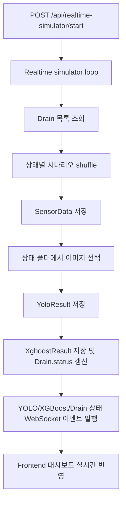

# Step 02. 상태별 시나리오 기반 실시간 시뮬레이터 보강

## 1. 작업 목적과 배경

사용자가 직접 준비한 사진을 상태별 폴더에 넣으면, backend 자동 시뮬레이터가 `양호`, `주의`, `위험`, `판단불가` 시나리오 데이터를 DB에 저장하고 대시보드가 기존 실시간 흐름으로 갱신되도록 보강했다.

이번 작업은 실제 AI Service가 없어도 시연용 데이터 흐름이 반복 가능하도록 만드는 것이 목적이다.

## 2. 변경 전 문제 또는 제약사항

- 기존 `realtime_simulator`는 센서 데이터만 생성한 뒤 외부 AI 분석 요청을 시작했다.
- AI Service가 준비되지 않으면 YOLO/XGBoost 결과와 drain 상태까지 이어지는 시연 흐름이 완성되지 않았다.
- 이미지 매핑은 `drain_{id}.jpg` 중심이라 상태별 사진을 모아두고 무작위로 사용하는 구조가 없었다.

## 3. 실제로 확인한 코드와 구조

| 확인 대상 | 확인 내용 |
| --- | --- |
| `backend/app/services/realtime_simulator.py` | 자동 loop, start/stop/status, drain별 센서 생성 흐름 |
| `backend/app/main.py` | `mock_data/ai_image_samples`를 `/api/mock-images`로 정적 mount |
| `backend/app/models/sensor_data.py` | 수위, 유속, 측정 시각 저장 모델 |
| `backend/app/models/yolo_result.py` | 이미지 URL, 막힘률, YOLO 상태 저장 모델 |
| `backend/app/models/xgboost_result.py` | 위험 점수, 위험 등급, 최종 판단 저장 모델 |
| `backend/app/schemas/api_response.py` | `DRAIN_STATUS_UPDATED` payload 생성 helper |
| `frontend/lib/websocket/drain-status-socket.ts` | `DRAIN_STATUS_UPDATED`, `YOLO_RESULT_UPDATED`, `XGBOOST_RESULT_UPDATED` 수신 구조 |

## 4. 적용한 해결 방법

### 4.1 상태별 시나리오 프로필 추가

`good`, `caution`, `danger`, `unknown`별로 아래 값을 랜덤 범위로 정의했다.

- `water_level_cm`
- `flow_velocity_mps`
- `obstruction_ratio`
- `confidence_score`
- `risk_score`
- `yolo_status`
- `final_decision`

한 tick 안에서는 가능한 한 네 가지 상태가 모두 drain에 배분되도록 시나리오 목록을 섞어서 순환 적용한다.

### 4.2 분석 결과 직접 저장

시나리오 모드에서는 외부 AI Service를 호출하지 않고 backend가 아래 row를 직접 생성한다.

1. `sensor_data`
2. `yolo_results`
3. `xgboost_results`
4. `drains.status` 갱신

기존 수동 분석 API인 `POST /api/analysis/async-run`은 건드리지 않았다.

### 4.3 상태별 이미지 경로 추가

사용자가 이미지를 넣을 경로를 아래처럼 확정했다.

```text
mock_data/ai_image_samples/scenarios/good/
mock_data/ai_image_samples/scenarios/caution/
mock_data/ai_image_samples/scenarios/danger/
mock_data/ai_image_samples/scenarios/unknown/
```

지원 확장자는 `.jpg`, `.jpeg`, `.png`, `.webp`다. 해당 상태 폴더에 이미지가 있으면 무작위로 골라 `/api/mock-images/scenarios/<상태>/<파일명>` URL을 `yolo_results.image_url`에 저장한다. 폴더가 비어 있으면 `image_url`은 `null`로 두고 나머지 데이터 저장은 계속한다.

### 4.4 WebSocket 이벤트 발행

저장 직후 기존 frontend 수신 구조에 맞춰 아래 이벤트를 순서대로 발행한다.

1. `YOLO_RESULT_UPDATED`
2. `XGBOOST_RESULT_UPDATED`
3. `DRAIN_STATUS_UPDATED`

이 덕분에 목록/지도/선택 패널의 상태와 최신 이미지가 기존 실시간 동기화 경로로 갱신된다.

## 5. 해당 방법을 선택한 이유

- 사용자의 목표는 실제 AI 모델 검증보다 상태별 사진과 센서값이 들어간 시연 흐름을 빠르게 돌리는 것이다.
- 외부 AI Service 요청을 유지하면 AI 서버 준비 여부에 따라 DB 저장과 화면 갱신이 끊길 수 있다.
- 기존 DB 테이블을 그대로 사용하므로 migration 없이 구현할 수 있고, 수동 AI callback 통합 흐름과 시연용 synthetic 흐름을 분리할 수 있다.

## 6. 수정한 주요 파일과 각 파일의 역할

| 파일 | 역할 |
| --- | --- |
| `backend/app/services/realtime_simulator.py` | 상태별 시나리오 생성, DB 저장, 이미지 URL 선택, WebSocket 이벤트 발행 |
| `backend/README.md` | 시나리오 모드 동작 방식과 상태별 이미지 경로 안내 |
| `mock_data/ai_image_samples/README.md` | mock 이미지 폴더의 기존 drain별 샘플과 신규 시나리오 폴더 규칙 안내 |
| `mock_data/ai_image_samples/scenarios/*/.gitkeep` | 사용자가 이미지를 넣을 상태별 폴더를 Git에 유지 |

## 7. 주요 데이터 흐름



## 8. 수행한 검증과 결과

| 검증 항목 | 결과 |
| --- | --- |
| `python -m compileall app` (`backend/`) | 실패. 기존 `__pycache__` 파일 교체 권한 문제로 `PermissionError: [WinError 5]` 발생 |
| `python -B -c "ast.parse(... realtime_simulator.py ...)"` (`backend/`) | 통과. 변경 파일 문법 파싱 성공 |
| `python -B -c "from app.services import realtime_simulator ..."` (`backend/`) | 실패. 로컬 Python 환경에 `sqlalchemy` 미설치 |

## 9. 기존 계획과 달라진 내용 및 이유

- 계획에는 README와 steps 문서만 예상했지만, 실제 이미지 배치 위치를 명확히 하기 위해 `mock_data/ai_image_samples/README.md`와 상태별 `.gitkeep` 파일을 추가했다.
- `GET /api/realtime-simulator/status` 응답에 `mode`, `imageRoot`, `scenarioLevels`를 추가했다. frontend guard는 필요한 기존 필드만 검사하므로 현재 UI 호환성에는 영향을 주지 않는다.
- `analysis_jobs.trigger_type=scheduled` 기록은 시나리오 모드에서 생성하지 않는다. 이 모드는 외부 AI 분석 요청이 아니라 synthetic 결과 직접 저장 흐름이기 때문이다.

## 10. 남은 제한사항이나 후속 작업

- 로컬 backend 의존성(`sqlalchemy`)과 DB가 준비된 환경에서 실제 API smoke를 추가로 확인해야 한다.
- 시나리오 모드가 저장하는 결과는 실제 AI 판단이 아니라 시연용 synthetic 데이터다.
- `ai_service` 쪽 일부 문서에는 아직 `drain_5.jpg`를 의도적 누락으로 설명하는 오래된 문구가 남아 있다. 이번 작업 범위는 backend 시나리오 시뮬레이터라 해당 문서 전체 정리는 후속 문서 정리로 분리하는 편이 좋다.
