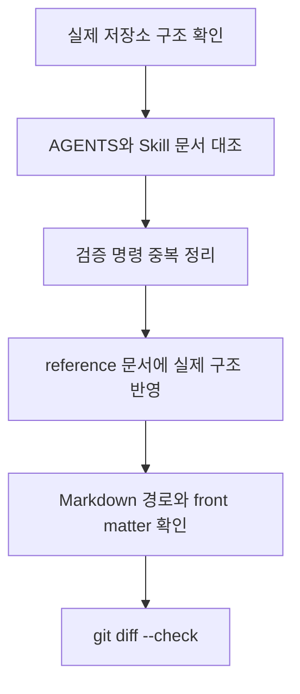

# Step 03. Codex 에이전트 지침 정합성 보정

## 1. 작업 목적과 배경

현재 저장소에 추가한 Codex 작업 지침, 프로젝트 전용 Skill, reference 문서가 실제 SmartDrain 구조와 실행 기준에 맞는지 점검하고 필요한 부분만 교정했다.

이번 작업은 새로운 문서 구조를 설계하는 것이 아니라, 이미 작성된 지침을 실제 저장소의 디렉터리, 의존성 파일, Compose 서비스, Jenkins 구성, 문서 규칙에 맞게 정렬하는 것이 목적이다.

## 2. 변경 전 문제 또는 제약사항

- 검증 명령이 `AGENTS.md`, 서비스별 `AGENTS.md`, Skill, `verification-guide.md`에 반복되어 기준 문서가 분산될 수 있었다.
- Frontend TypeScript 검사를 실제 script처럼 오해할 여지가 있었다. 현재 `frontend/package.json`에는 `typecheck` script가 없다.
- Backend는 현재 pytest 설정이나 테스트 파일이 확인되지 않는데, `python -m pytest`가 항상 가능한 기본 검증처럼 적혀 있었다.
- Steps와 PR 문서 작성 조건이 작은 수정에도 문서 생성을 강제하는 것처럼 읽힐 수 있었다.
- Skill 문서에는 Codex가 목적을 식별하기 쉬운 YAML front matter가 없었다.
- 실제 존재하는 `mock_ai_server/`, Compose 서비스명, Jenkins 스크립트 위치가 reference 문서에 충분히 반영되지 않았다.

## 3. 실제로 확인한 코드와 구조

| 확인 대상 | 확인 내용 |
| --- | --- |
| `git status --short --branch` | 현재 브랜치는 `docs/codex-agent-guidelines` |
| `frontend/package.json` | scripts는 `dev`, `build`, `start`, `lint` |
| `backend/requirements.txt` | Backend Python 의존성 파일 존재 |
| `ai_service/requirements.txt` | AI Service Python 의존성 파일 존재 |
| `ai_service/pytest.ini` | AI Service pytest 설정 존재 |
| `docker-compose.yml` | `db`, `migrate`, `backend`, `ai-service`, `frontend`, `nginx`, `seed` 서비스 확인 |
| `docker-compose.dev.yml` | 개발용 override와 reload command 확인 |
| `Jenkinsfile` | `.jenkins/scripts/`의 shell script를 호출하는 pipeline 확인 |
| `.jenkins/scripts/validate.sh` | Compose config, frontend lint image, AI test image 검증 확인 |
| `docs/plans`, `docs/steps`, `docs/pr` | 루트 작업 문서 위치와 번호 체계 확인 |
| `frontend/docs`, `ai_service/docs` | 서비스별 문서 구조 일부 존재 |
| `backend/docs` | 현재 존재하지 않음 |

## 4. 적용한 해결 방법

### 4.1 루트 공통 규칙 보강

`AGENTS.md`에 사용자 요청과 완료 조건을 구현 전후로 비교하는 원칙을 추가했다.

사용자가 의도와 다른 결과를 지적했을 때 바로 임의 수정하지 않고 기대 결과, 실제 결과, Git diff, 원인 후보를 먼저 확인하도록 정리했다.

같은 문제가 재발할 수 있으면 단순 문서 규칙보다 회귀 테스트나 재현 가능한 검증 절차를 우선하도록 했다.

### 4.2 검증 기준 단일화

서비스별 `AGENTS.md`는 상세 검증 기준을 반복하기보다 `docs/reference/verification-guide.md`를 먼저 확인하도록 수정했다.

Frontend는 현재 `package.json` 기준으로 `lint`, `build`, `dev`, `start` script만 있음을 명시하고, TypeScript 검사는 `pnpm exec tsc --noEmit` 직접 명령으로 구분했다.

Backend는 현재 테스트 설정과 테스트 파일이 확인되지 않으므로, pytest는 실제 테스트가 구성된 경우 실행하는 후보로 낮췄다.

AI Service는 `ai_service/pytest.ini`와 `ai_service.http.app:app` 진입점을 명시했다.

### 4.3 Skill 사용 목적과 문서 생성 조건 정리

네 Skill 문서에 YAML front matter를 추가했다.

```yaml
---
name: ...
description: ...
---
```

또한 작은 오탈자, 한 파일의 단순 문서 교정, 동작을 바꾸지 않는 좁은 범위 수정은 Plans 또는 Steps를 생략할 수 있도록 정리했다.

PR 문서는 사용자가 명시적으로 요청한 경우에만 작성한다는 기준을 유지했다.

### 4.4 실제 저장소 구조 반영

`docs/reference/repository-structure.md`에 `mock_ai_server/`, Jenkins 관련 파일, Compose 서비스명과 실행 진입점을 반영했다.

`docs/reference/documentation-policy.md`에는 현재 `frontend/docs/`와 `ai_service/docs/`는 존재하지만 `backend/docs/`는 없으므로 명확한 필요 없이 새 디렉터리를 만들지 않도록 적었다.

## 5. 해당 방법을 선택한 이유

- 이번 요청은 애플리케이션 동작 변경이 아니라 문서와 지침의 정합성 보정이다.
- 검증 명령은 여러 문서에 흩어질수록 오래된 내용이 남기 쉬우므로 `verification-guide.md`를 기준 문서로 두는 편이 유지보수에 유리하다.
- Plans, Steps, PR 문서는 작업 가시성을 높이지만 작은 수정마다 모두 만들면 작업 비용이 커지므로 생성 조건을 분리했다.
- 존재하지 않는 `backend/docs/` 같은 구조를 문서 작성 편의를 위해 새로 만들지 않고, 현재 저장소 구조를 우선했다.

## 6. 수정한 주요 파일과 각 파일의 역할

| 파일 | 변경 내용 | 역할 |
| --- | --- | --- |
| `AGENTS.md` | 사용자 의도 확인, Plans 생략 가능 조건, 공통 안전 원칙 보강 | 저장소 전체 Codex 공통 지침 |
| `frontend/AGENTS.md` | `verification-guide.md` 참조와 실제 frontend script 기준 보정 | Frontend 전용 작업 지침 |
| `backend/AGENTS.md` | Backend 실행 진입점과 pytest 조건 보정 | Backend 전용 작업 지침 |
| `ai_service/AGENTS.md` | AI Service 실행 진입점과 검증 기준 참조 보정 | AI Service 전용 작업 지침 |
| `.agents/skills/task-planning/SKILL.md` | front matter 추가, Plans 생략 조건과 실제 문서 위치 보정 | 계획 문서 작성 절차 |
| `.agents/skills/implementation-workflow/SKILL.md` | front matter 추가, 검증 기준 참조와 Steps 작성 조건 보정 | 승인된 구현 작업 절차 |
| `.agents/skills/steps-documentation/SKILL.md` | front matter 추가, Steps 생략 조건과 실제 문서 위치 보정 | 작업 기록 문서 작성 절차 |
| `.agents/skills/pr-documentation/SKILL.md` | front matter 추가 | PR 문서 작성 절차 |
| `docs/reference/repository-structure.md` | 실제 디렉터리, Compose 서비스, Jenkins 구조 반영 | 저장소 구조 기준 문서 |
| `docs/reference/documentation-policy.md` | 문서 생성 조건과 서비스별 문서 디렉터리 기준 보정 | 문서 정책 기준 |
| `docs/reference/verification-guide.md` | 실제 script, pytest 구성, Compose/Jenkins 기준 보정 | 검증 명령 기준 문서 |

## 7. 주요 흐름



## 8. 수행한 검증과 결과

| 검증 항목 | 결과 | 비고 |
| --- | --- | --- |
| `git status --short --branch` | 통과 | 브랜치 `docs/codex-agent-guidelines` 확인 |
| `rg --files` | 통과 | 실제 디렉터리와 주요 파일 구조 확인 |
| 주요 파일 존재 확인 | 통과 | package, requirements, Compose, Jenkins, README, docs 경로 확인 |
| Skill front matter 검색 | 통과 | 4개 Skill 모두 `name`, `description` 확인 |
| Markdown 링크 검색 | 통과 | 수정 범위에서 새로 추가한 깨진 링크 없음 |
| `git diff --check` | 통과 | whitespace error 없음. `AGENTS.md` LF/CRLF 경고만 표시 |

애플리케이션 코드, 패키지, Docker, CI/CD 설정은 수정하지 않았으므로 앱 build나 서비스 테스트는 실행하지 않았다.

## 9. Plans와 달라진 내용

이번 작업은 사용자 요청에서 "새 구조 설계가 아니라 이미 작성된 지침 교정"으로 정의되었고, 서비스 책임 변경이나 문서 구조의 대규모 변경이 없었다.

따라서 별도 Plans 문서는 작성하지 않았다.

## 10. 제한사항 및 후속 작업

- `AGENTS.md`는 작업 전부터 수정 상태였고, 하위 `AGENTS.md`, Skill, reference 문서는 untracked 상태였다. 이번 문서는 해당 변경 묶음 안에서 실제 교정 내용을 기록한다.
- Jenkins pipeline과 Docker build는 실제 실행하지 않았다.
- Backend pytest는 현재 설정과 테스트 파일이 확인되지 않아 실행하지 않았다.
- 필요하면 이후 별도 작업에서 기존 README와 legacy 문서까지 더 넓게 실행 명령 정합성을 점검할 수 있다.
