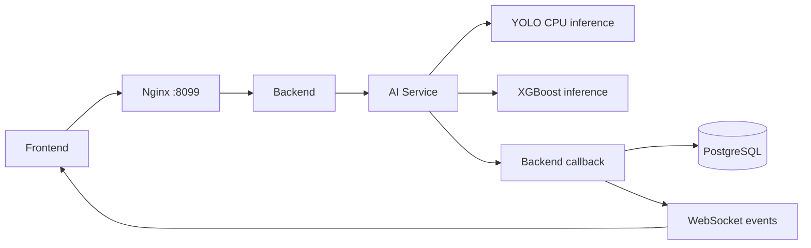

# Step 03. SmartDrain Mac mini·OrbStack 이전 구현 기록

## 1. 기록 목적

이 문서는 SmartDrain을 Windows 노트북의 Linux VM에서 Apple Silicon Mac mini와 OrbStack으로 옮기기 위해 실제로 수행한 작업을 설명한다.

실시간 실행 상태와 다음 작업은 [`step-03-mac-mini-orbstack-migration.md`](step-03-mac-mini-orbstack-migration.md)에서 관리한다. 이 문서는 대화나 실행 로그가 없어도 이전의 배경, 선택 이유, 문제 해결 과정과 검증 결과를 이해할 수 있도록 정리한 구현 기록이다. 이후 Notion이나 기술 블로그 글을 작성할 때 사실 근거로 재사용할 수 있다.

기준 문서는 다음과 같다.

- 사전 분석: [`../verification/18_mac-mini-orbstack-migration-analysis.md`](../verification/18_mac-mini-orbstack-migration-analysis.md)
- 구현 계획: [`../plans/plan-03-mac-mini-orbstack-migration.md`](../plans/plan-03-mac-mini-orbstack-migration.md)
- 실행 상태: [`step-03-mac-mini-orbstack-migration.md`](step-03-mac-mini-orbstack-migration.md)

## 2. 이전 배경

기존 SmartDrain은 Windows 노트북 안의 Linux VM에서 Nginx, Frontend, Backend, AI Service, PostgreSQL을 Docker Compose로 실행했다. Jenkins도 같은 VM에 있었고 서버에서 애플리케이션 이미지를 직접 빌드했다.

런타임 메모리는 서비스 전체를 합쳐도 16GB Mac mini에서 감당할 수 있는 수준이었다. 실제 부담은 AI 컨테이너의 메모리보다 다음 항목에 있었다.

- AI 운영 이미지와 테스트 이미지가 각각 약 10GB로 표시될 정도로 컸다.
- Docker image 전체와 build cache가 VM 디스크의 큰 비중을 차지했다.
- Python dependency가 고정되지 않아 재빌드 시점에 선택되는 패키지가 달라질 수 있었다.
- Apple Silicon에서는 기존 AI dependency와 모델이 Linux/arm64 CPU에서 실제로 추론되는지 확인해야 했다.

이번 이전의 우선 목표는 이미지 최적화가 아니었다. 기존 서비스 계약을 유지하면서 다음 구조를 재현하는 것이 먼저였다.

```text
Mac mini
  → OrbStack
  → Docker Compose
      ├─ PostgreSQL 16
      ├─ Backend
      ├─ AI Service
      ├─ Frontend
      └─ Nginx
           → 127.0.0.1:8099
```

기존 DB는 복사하지 않고 Mac 전용 PostgreSQL volume에서 새로 시작했다. 기존 VM, DB, image, volume과 Cloudflare route는 이전 검증이 끝날 때까지 유지하는 것을 안전 기준으로 삼았다.

## 3. 시작 전에 확인한 위험과 범위

정적 분석에서는 다음과 같은 확정적인 ARM blocker를 찾지 못했다.

- `nvidia/cuda` base image 강제
- NVIDIA runtime 또는 GPU device reservation
- `platform: linux/amd64` 고정
- 애플리케이션 코드의 `.cuda()` 강제

따라서 Apple Silicon 자체를 이유로 코드를 분기하지 않고 Linux/arm64 컨테이너에서 CPU 추론을 직접 실행해 판단하기로 했다.

반면 architecture와 무관하게 현재 Compose 실행을 막을 수 있는 문제는 실제 코드에서 확인됐다.

1. Backend Dockerfile의 Alembic COPY 경로가 build context와 맞지 않았다.
2. Backend 앱 COPY 위치와 `uvicorn app.main:app` 실행 경로가 맞지 않았다.
3. `realtime_simulator.router`를 등록하면서 모듈 import가 빠져 있었다.
4. Backend와 AI Service가 기대하는 sample image 경로가 image 내부에 제공되지 않았다.
5. YOLO `best.pt`는 저장소에 포함하지 않으므로 Mac에 별도로 공급해야 했다.

이 문제는 Mac 전용 Dockerfile이나 wrapper를 추가하지 않고 기존 Dockerfile, Compose와 진입 코드를 직접 수정하는 방식으로 해결했다.

## 4. 적용한 변경과 선택 이유

### 4.1 Backend image 경로 정상화

`backend/Dockerfile`이 repository root를 build context로 사용하면서도 일부 COPY source와 destination을 다른 전제로 작성하고 있었다. Alembic 설정, migration, 애플리케이션 package와 mock image가 runtime이 실제로 찾는 위치에 오도록 기존 COPY를 교체했다.

새 Dockerfile을 추가하지 않은 이유는 amd64와 arm64가 같은 애플리케이션 구조를 사용하기 때문이다. 기존 정의를 정상화하면 Mac 이전과 이후의 자동화에서도 같은 파일을 재사용할 수 있다.

### 4.2 누락된 Backend router import 복구

`backend/app/main.py`는 `realtime_simulator.router`를 등록하지만 해당 모듈을 import하지 않았다. 기존 router 목록에 import를 복구해 애플리케이션 시작 시 발생할 수 있는 이름 오류를 제거했다.

API path, 응답 구조와 시뮬레이터 동작은 변경하지 않았다.

### 4.3 AI 운영 image에 sample 공급

AI Service는 drain ID를 `mock_data/ai_image_samples`의 local image로 해석한 뒤 YOLO에 전달한다. 기존 운영 image에는 이 디렉터리가 없어서 health endpoint는 성공하더라도 실제 추론은 실패할 수 있었다.

`ai_service/Dockerfile`에 기존 sample 디렉터리 COPY를 추가했다. 별도 host mount나 test 전용 분기를 만들지 않아 재기동 후에도 같은 Compose 정의로 재현되도록 했다.

### 4.4 모델 artifact의 저장소 외부 공급

Windows 노트북에서 복사한 `best.pt`를 `ai_service/model/best.pt`에 배치했다. 모델 weight는 `.gitignore` 규칙을 유지해 Git에 포함하지 않았다.

확인한 Mac 복사본은 다음과 같다.

- 크기: 52,067,329 bytes
- SHA256: `d43cef94671907771f30b3316f2728e82af352db2cf4094644e92f6ffbaf16e2`

기존 VM 원본 hash와 실행 결과는 현재 작업 공간에서 확보하지 못했다. 사용자가 Windows 노트북에서 복사한 운영 모델임을 확인했으며, 원본 hash가 확보되면 같은 값인지 추가 확인한다.

### 4.5 Nginx의 Docker DNS 재해석

최초 전체 Compose restart 뒤 모든 컨테이너가 healthy였지만 nginx를 통한 Backend API는 502를 반환했다.

경계를 나눠 확인한 결과는 다음과 같았다.

- Backend 컨테이너 안에서 직접 호출: 200
- Nginx 컨테이너에서 `backend:8000` 직접 호출: 200
- Nginx를 통한 공개 API: 502
- Nginx 로그의 upstream IP: 재시작 전 Backend IP
- 실제 Backend IP: 재시작 뒤 새 IP

Nginx가 시작 시 해석한 Backend IP를 계속 사용한 것이 원인이었다. `nginx/default.conf`에 Docker 내부 resolver `127.0.0.11`과 `resolve` upstream을 적용해 Backend와 Frontend 컨테이너 IP가 바뀌어도 다시 해석하도록 했다.

이 변경은 API나 WebSocket path를 바꾸지 않는다. 전체 restart 뒤 nginx만 따로 재시작하는 운영 절차도 필요하지 않게 한다.

## 5. 주요 변경 파일

| 파일 | 변경 내용 | 시스템에서의 역할 |
| --- | --- | --- |
| `backend/Dockerfile` | Alembic, 앱 package, mock image COPY 경로 교정 | Backend runtime filesystem 구성 |
| `backend/app/main.py` | `realtime_simulator` import 복구 | FastAPI router 등록과 애플리케이션 시작 |
| `ai_service/Dockerfile` | AI sample image 디렉터리 COPY | drain ID 기반 실제 YOLO 입력 공급 |
| `nginx/default.conf` | Docker DNS resolver와 동적 upstream 적용 | restart 뒤 Frontend·Backend proxy 복구 |
| `.env` | Mac Compose namespace, DB service 주소, loopback nginx와 same-origin 값 적용 | Mac 로컬 실행 설정이며 Git 추적 제외 |
| `ai_service/model/best.pt` | 운영 YOLO 모델 배치 | AI 추론 artifact이며 Git 추적 제외 |
| `docs/steps/step-03-mac-mini-orbstack-migration.md` | Phase, Gate, 명령, 측정값과 blocker 갱신 | 실행 상태와 세션 인수인계 |

실제 secret과 `.env` 값, Cloudflare token은 문서와 Git에 기록하지 않았다.

## 6. 검증 흐름과 결과

### 6.1 AI Linux/arm64 검증

OrbStack Docker server가 `arm64/linux`임을 확인한 뒤 AI runtime image를 한 번 빌드했다. 같은 image를 재사용해 다음 항목을 검증했다.

| 검증 | 결과 |
| --- | --- |
| image architecture | `arm64` |
| native dependency import | 성공 |
| OpenCV image decode | 성공 |
| `best.pt` load | 성공 |
| YOLO CPU inference | 성공 |
| XGBoost model load·inference | 성공 |
| 기존 AI pytest | `115 passed` |
| 기존 `smoke_analysis` | 성공 |

확정적인 ARM blocker는 발생하지 않았다. PyTorch는 CPU에서 정상 동작했고 `torch.cuda.is_available()`은 false였다.

다만 dependency 해석 결과 `torch 2.14.0+cu130`과 여러 CUDA 13 package가 image에 포함됐다. 이는 Apple Silicon 실행 실패가 아니라 image 크기 증가 원인이다. CPU-only dependency 재구성은 서비스 이전과 분리해 후속 최적화로 남겼다.

### 6.2 새 PostgreSQL과 전체 Compose 검증

Mac 전용 named volume에서 PostgreSQL 16을 시작하고 Alembic migration을 실행했다.

- migration head: `20260623_0003`
- 핵심 table: `analysis_jobs`, `drains`, `sensor_data`, `xgboost_results`, `yolo_results`
- 빈 DB dashboard API: 200
- seed: 5건 생성
- 장기 실행 서비스: 모두 healthy
- host 공개 port: nginx의 `127.0.0.1:8099`만 존재

전체 Compose restart 뒤 DB data가 유지됐고, Nginx DNS 수정 후 Frontend와 API도 별도 수동 복구 없이 돌아왔다.

### 6.3 Localhost 통합 검증

`http://127.0.0.1:8099`에서 다음 사용자 흐름을 한 번의 실제 분석 요청으로 확인했다.



`DR-002` 분석은 `processing`으로 수락됐고 다음 이벤트가 모두 도착했다.

1. `YOLO_RESULT_UPDATED`
2. `XGBOOST_RESULT_UPDATED`
3. `DRAIN_STATUS_UPDATED`

DB의 해당 job은 `completed`였고 YOLO·XGBoost 결과가 연결됐다. 분석 history와 sample image가 nginx를 통해 제공됐으며, Safari 화면에서도 최신 결과와 `실시간 연결됨` 상태를 확인했다.

## 7. 문제를 분리해서 해결한 과정

### 7.1 Health 성공만으로 AI를 판정하지 않음

AI health endpoint는 HTTP 프로세스 상태만 알려준다. 모델 파일, OpenCV decode, YOLO와 XGBoost 추론까지 보장하지 않으므로 직접 inference와 기존 smoke flow를 Gate A의 통과 조건으로 사용했다.

이 구분 덕분에 ARM 호환성과 단순 웹 서버 기동을 혼동하지 않았다.

### 7.2 컨테이너 health와 실제 proxy 성공을 구분

Nginx stale upstream 문제에서는 모든 컨테이너가 healthy였지만 사용자 API는 502였다. Backend, container network, nginx proxy의 경계를 각각 호출해 문제를 Nginx DNS cache로 좁혔다.

단순히 컨테이너를 다시 시작해 일시 복구하는 대신 같은 전체 restart를 반복해 수정 효과를 검증했다.

### 7.3 실행 도구의 네트워크 격리와 서비스 장애를 구분

Phase 4의 첫 host curl은 `curl: (7)`로 실패했다. 같은 시점에 OrbStack은 8099를 listen했고 nginx 내부 요청은 200이었다. 권한이 허용된 host 네트워크에서 같은 요청이 200을 반환해 서비스 장애가 아니라 작업 도구 sandbox의 localhost 격리로 판정했다.

이후 localhost E2E는 같은 권한 경계에서 실행했다. 이 사례는 검증 도구의 실패를 곧바로 애플리케이션 실패로 해석하지 않아야 한다는 기록으로 남겼다.

## 8. 측정된 시간과 공간 비용

추정값 대신 실제 실행에서 얻은 값만 기록했다.

| 항목 | 측정값 |
| --- | ---: |
| AI image build | 506.78초 |
| Backend image build | 31.53초 |
| Frontend 포함 build | 40.68초 |
| 전체 Compose startup | 32.85초 |
| YOLO model load | 0.268초 |
| YOLO CPU inference | 2.334초 |
| XGBoost model load | 0.006초 |
| XGBoost inference | 0.002초 |
| 실제 분석 수락부터 최종 저장 | 약 7.4초 |
| AI image logical size | 3,666,967,615 bytes |
| AI build 후 image 총량 | 25.94GB |
| AI build 후 build cache | 17.39GB |
| build 후 host 가용 공간 | 136GiB |

AI build를 이후 단계에서 반복하지 않고 같은 image를 재사용했다. image와 cache는 크지만 현재 Mac 저장공간에서 이전 검증을 막는 수준은 아니었다. 최적화는 이전 완료 조건에 섞지 않았다.

## 9. 다중 프로젝트 Cloudflare 공동 운영 판단

Mac mini에는 Health Center, RWR, SmartDrain이 함께 운영될 예정이다. RWR 작업 기록 `4d77fc4 docs: 다중 프로젝트 Cloudflare 조율 기준 기록`에서 다음 공동 방향이 전달됐다.

### 9.1 다른 프로젝트 세션에서 전달된 상태

아래 내용은 SmartDrain 저장소에서 직접 검증한 결과가 아니라 RWR 작업 세션에서 공동 운영 기준으로 전달된 정보다.

| 대상 | 전달된 상태 |
| --- | --- |
| Health Center | 작업 트리 clean, 공통 운영 문서에 Mac host cloudflared 하나와 프로젝트별 localhost route 방향 기록 |
| RWR | `rwr-production`만 실행, origin `http://127.0.0.1:8090`, health path `/api/health`, nginx만 loopback에 공개, production 자동 배포 완료 |
| SmartDrain | localhost E2E 통과, Nginx와 Steps 변경은 commit 전, Cloudflare 전환 미실행 |
| port 배치 | Health Center Frontend 3000, Health Center Backend 8080, RWR 8090, SmartDrain 8099로 충돌 없음 |

이 정보의 프로젝트별 세부 구현은 각 저장소에서 확인하고, SmartDrain 문서에서는 공동 Tunnel의 경계와 SmartDrain origin만 관리한다.

```text
mac-demo.healthq.store       → 127.0.0.1:3000
mac-api.healthq.store        → 127.0.0.1:8080
mac-rwr.healthq.store        → 127.0.0.1:8090
mac-smartdrain.healthq.store → 127.0.0.1:8099
```

프로젝트마다 Tunnel을 만들거나 Compose에 cloudflared를 넣는 대신 Mac host의 remotely-managed Tunnel 하나를 공유하는 방식이다. token과 재부팅 검증 지점이 하나이고, 각 프로젝트는 localhost port와 health path만 소유한다.

SmartDrain 관점에서도 이 선택이 적절하다.

- Compose에는 cloudflared를 추가하지 않는다.
- 외부 공개 책임은 Mac host의 공통 Tunnel에 둔다.
- 운영 hostname을 바로 옮기기 전에 `mac-smartdrain.healthq.store` 같은 검증 hostname으로 HTTPS와 WSS를 확인한다.
- 실패 시 SmartDrain route 하나만 기존 VM 쪽으로 복귀한다.
- 기존 VM Tunnel에 Mac connector를 추가하지 않는다. 서로 다른 DB를 쓰는 두 환경으로 요청이 분산될 수 있기 때문이다.

### 9.2 RWR 기록과 SmartDrain 실측의 차이

RWR 기록에는 Mac `cloudflared`가 설치되어 있지만 서비스 또는 LaunchAgent가 등록되지 않았고 `~/.cloudflared` 설정도 없다고 되어 있다.

SmartDrain 세션에서 같은 Mac을 다시 확인한 결과는 다음과 같다.

- Homebrew user service: 등록되지 않음
- `~/.cloudflared`: 설정 파일 없음
- system service: `/Library/LaunchDaemons/com.cloudflare.cloudflared.plist` 존재
- system `cloudflared` process: 실행 중
- 시작 정책: `RunAtLoad=true`
- 재시작 정책: 실패 종료 시 재시작
- 자격 정보 방식: 별도 token file
- Cloudflare Dashboard: `mac-mini-prod` Tunnel Healthy

따라서 RWR 기록의 “서비스 미등록”은 사용자 범위만 확인했거나 기록 이후 상태가 바뀐 것으로 해석해야 한다. 공통 운영 세션은 새 Tunnel이나 서비스를 추가하기 전에 기존 `mac-mini-prod`, system LaunchDaemon과 token file의 관계를 먼저 확인해야 한다. 중복 connector나 두 번째 host service를 만들면 안 된다.

## 10. 현재 Cloudflare 상태

Cloudflare 설정은 이 작업에서 변경하지 않았다.

| 경로 | 확인된 최신 데이터 시각 | 판단 |
| --- | --- | --- |
| `http://127.0.0.1:8099/api/dashboard/summary` | `2026-09-20` | Mac SmartDrain |
| `https://smartdrain.healthq.store/api/dashboard/summary` | `2026-06-30` | 기존 환경을 계속 사용 중 |

공개 sample image는 정상 응답하지만 API 데이터가 Mac과 다르므로 운영 hostname 전환은 아직 완료되지 않았다.

Cloudflare 변경 소유권은 Health Center 공통 운영 세션에 둔다. SmartDrain 세션에서는 Tunnel, connector, DNS route와 system service를 별도로 만들거나 수정하지 않는다.

## 11. 기존 Plan과 달라진 내용

| 항목 | Plan | 실제 진행 | 이유 |
| --- | --- | --- | --- |
| Nginx restart | 정상 복구 검증 | Docker DNS 동적 upstream 수정 추가 | 실제 전체 restart에서 stale container IP 502 발견 |
| Cloudflare 구조 | SmartDrain Tunnel 연결 후 운영 hostname 전환 | 공통 host Tunnel과 임시 `mac-*` hostname을 우선 사용 | 세 프로젝트의 token·service·재부팅 책임을 한 곳에서 관리 |
| cloudflared 준비 | 설치·로그인·연결 방식 준비 | 기존 `mac-mini-prod`와 system LaunchDaemon 발견 | 중복 설치·서비스 생성을 피해야 함 |
| VM↔Mac 결과 비교 | 조건 확보 시 비교 | 직접 비교하지 못함 | 동일 VM revision과 실행 결과 미확보, ARM 자체 검증은 통과 |

AI image 최적화, dependency pinning, runtime upgrade, multi-arch build, GHCR, GitHub Actions와 Jenkins 제거는 여전히 후속 작업이다.

## 12. 현재 완료 상태

| Gate | 상태 | 근거 |
| --- | --- | --- |
| Gate A — AI Linux/arm64 | 통과 | 실제 YOLO·XGBoost CPU inference, pytest, smoke 성공 |
| Gate B — 전체 Compose | 통과 | 새 DB migration·seed, 전체 health, restart 복구 성공 |
| Gate C — localhost E2E | 통과 | REST, image, WebSocket, callback, DB 저장, UI 반영 성공 |
| Gate D — Cloudflare 공개 E2E | 미실행 | 운영 hostname은 기존 환경 데이터 반환 |
| Server Lifecycle Verification | 미실행 | 공통 Cloudflare 작업과 모든 프로젝트 commit 뒤 수행 예정 |

현재 SmartDrain 서비스는 Mac의 localhost에서 재현 가능하다. 확정적인 ARM blocker는 발견되지 않았다. migration 완료 판단에는 공통 운영 세션의 임시 hostname 검증, 운영 hostname 전환, 공개 HTTPS/WSS 검증과 Mac 재부팅 후 공동 복구 검증이 남아 있다.

## 13. 공동 작업 순서

1. SmartDrain의 Nginx 수정과 실행 기록을 먼저 commit해 localhost 기준을 고정한다.
2. Health Center 공통 운영 세션에서 기존 `mac-mini-prod`와 system LaunchDaemon 구성을 확인한다.
3. 중복 Tunnel을 만들지 않고 기존 공통 Tunnel에 프로젝트별 임시 hostname을 연결한다.
4. SmartDrain은 `mac-smartdrain.healthq.store → http://localhost:8099`에서 HTTPS, WSS, image와 실제 분석 E2E를 확인한다.
5. 임시 hostname이 통과한 프로젝트부터 운영 hostname을 개별 전환한다.
6. 실패하면 해당 hostname만 기존 VM route로 복귀한다.
7. 세 프로젝트의 변경이 모두 commit된 뒤 Mac 재부팅을 한 번 수행한다.
8. PostgreSQL volume, localhost route, Cloudflare 연결과 공개 HTTPS/WSS 복구를 확인한다.
9. 관찰 기간 뒤 기존 VM과 Tunnel 정리는 별도 승인 작업으로 진행한다.

## 14. 남은 제한사항과 후속 작업

- 기존 VM의 commit, AI dependency와 모델 원본 hash를 현재 Mac 결과와 직접 비교하지 못했다.
- Kakao Maps SDK는 localhost 화면에서 로드되지 않아 임시 지도가 표시됐다. 임시·운영 hostname 검증 시 허용 도메인 설정을 확인해야 한다.
- 실제 Mac 재부팅 검증은 다른 프로젝트와 Cloudflare 작업이 완료된 뒤 한 번만 수행한다.
- 기존 VM, PostgreSQL, image, volume과 Tunnel은 관찰 기간과 별도 승인 전까지 삭제하지 않는다.
- AI image와 build cache 최적화는 migration과 분리한 후속 작업으로 유지한다.

## 15. 현재 결론

SmartDrain은 기존 서비스 로직, API, DB schema와 AI callback 계약을 바꾸지 않고 Apple Silicon Mac mini의 OrbStack에서 실행됐다. 새 PostgreSQL을 포함한 전체 Compose와 localhost 사용자 흐름도 재현됐다.

이전 중 실제로 추가 수정이 필요했던 부분은 architecture 분기가 아니라 Docker filesystem 경로, 누락 import, sample 공급과 재기동 시 Nginx DNS 해석이었다. AI Service는 큰 image와 CUDA dependency를 포함하지만 Linux/arm64 CPU에서 실제 추론에 성공해 현재 migration blocker는 아니다.

다음 경계는 Cloudflare다. SmartDrain 내부에서 별도 Tunnel을 추가하지 않고 공통 운영 세션이 기존 Mac system daemon을 기준으로 임시 hostname부터 연결해야 한다. 공개 검증과 공동 재부팅 검증이 끝나기 전에는 기존 VM을 종료하지 않는다.
