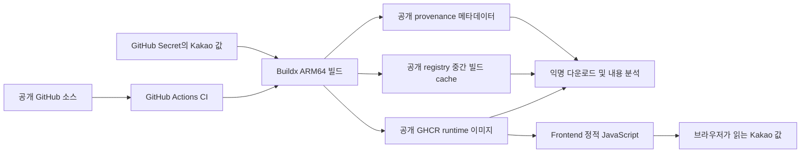

# Step 06. 공개 컨테이너 이미지 보안 기초 점검

## 1. 목적과 운영 판단

SmartDrain은 취업 준비용 팀 MVP에서 출발한 개인 Fork 프로젝트다. 사용자 설명에 따르면 팀원들에게 개인 수정·배포 목적을 공유했으며, 현재는 포트폴리오와 기술 실험을 위해 공개 소스와 공개 이미지를 유지한다.

이번 작업은 공개 이미지를 누구나 내려받아 내부 파일·레이어·메타데이터를 분석할 수 있다는 점을 전제로 한 기초 점검이다. 발견한 문제, 확인하지 못한 부분, 현재 수정하지 않은 이유, 이후 수정 시 필요한 검증을 기록했다. 이미지 비공개 전환이나 운영 설정 변경은 적용하지 않았다.

**점검 결론:** 검사한 범위에서 서버 전용 인증정보의 포함을 발견하지 못했다. 다만 Kakao 값의 공개 산출물 포함, 하위 경로를 충분히 제외하지 않는 `.dockerignore`, 인증 없는 일부 변경 API, 공개 개발 기본값을 사용하는 DB 환경설정은 확인했다. 의존성 취약점과 외부 접근 정책은 미검사 상태이므로 전체 보안 통과로 해석하면 안 된다.

점검 기준은 다음과 같다.

| 대상 | 기준 |
| --- | --- |
| 점검일 | 2026-10-04 |
| 소스 | `dev`, `f003d1c10f76653809131e85afad9e9dc9137303` |
| 공개 이미지 | `ghcr.io/yellow-pang/smartdrain-{backend,ai,frontend}:sha-9b85e3dc62d9d7164d594f9961a1309f3f758eee`, Linux/arm64 |
| 게시 근거 | [Release 실행 37193646542](https://github.com/yellow-pang/smartdrain-agent-upgrade/actions/runs/37193646542): CI·3개 이미지 빌드·manifest 게시 성공, Mac 배포 dispatch는 skip |
| 실행 환경 | 현재 Mac의 `smartdrain-mac` Compose 컨테이너. 로컬 이름의 이미지를 사용하며 공개 이미지와 동일한 artifact인지는 검증하지 않음 |

검토한 `.dockerignore`, Release workflow, 세 Dockerfile과 `frontend/next.config.mjs`는 위 dev SHA와 공개 이미지 소스 SHA 사이에 diff가 없었다. 이 확인은 현재 Mac 실행 이미지의 동일성을 뜻하지 않는다.

공개 tag는 바뀔 수 있으므로, 이후 재검사는 아래 관찰 시점의 arm64 **runtime manifest digest**를 기준으로 한다. attestation을 포함하는 상위 index digest와 구분한다.

| 이미지 | runtime manifest digest |
| --- | --- |
| Backend | `sha256:72a475d30f26bb712f5bb2b564aec97f229f1ca7a907541b37ebaacf4d4119b3` |
| AI | `sha256:1c754fbe7397518490ac38932565b98e714487960fef459c594bb53f7ede5452` |
| Frontend | `sha256:92b41691ab4b72ac0a5ffce2c678e4b4f89575f45bb99580eb2110f61f16e3e3` |

## 2. 확인한 구조와 공개 범위

[`release.yml`](../../.github/workflows/release.yml)은 main push에서 GitHub-hosted runner로 이미지를 빌드하고 GHCR에 게시한다. 실제 비밀값은 이 문서에 기록하지 않는다.

현재 Mac 실행 환경은 별도로 확인했다. 앱 3개와 DB에는 호스트 포트가 없고 Nginx만 `127.0.0.1:8099`에 바인딩되어 있었다. DB는 별도 volume, YOLO 모델은 읽기 전용 host mount로 공급된다. Cloudflare Tunnel/Access가 localhost 서비스를 외부에 연결하는지와 접근 정책은 이번에 검사하지 않았다. 또한 Compose의 Nginx 포트 기본값은 localhost 한정이 아니므로 현재 바인딩이 다음 배포에서도 유지된다고 가정할 수 없다.

## 3. 요청한 19개 항목의 점검 결과

판정에서 **미발견**은 검사 범위 안에서 찾지 못했다는 뜻이다. **보완 필요**는 소스나 실행 설정에서 문제를 확인한 경우이며, **미검사**는 통과 여부를 판단할 근거가 없는 경우다.

| 우선순위·항목 | 판정 | 확인한 사실 | 한계·후속 확인 |
| --- | --- | --- | --- |
| 필수 · Secret 포함 여부 | 부분 확인·미발견 | 현재 tracked text와 검사한 앱 레이어에서 대표 인증 토큰·개인키 패턴 미발견. runtime 이미지 ENV에 DB 비밀번호나 앱 제어 토큰 없음 | Kakao 값은 공개됨. JWT/OAuth/service-role 등 모든 형식·인코딩·파일을 전수 검사한 결과는 아님 |
| 필수 · `.env` 포함 여부 | 부분 확인·미발견 | 검사한 앱 COPY·소유권 변경 레이어에 실제 `.env` 후보 없음. AI에는 `.env.example` 포함 | 하위 `.env*` 제외 공백 및 공개 중간 cache는 별도 확인 필요 |
| 필수 · Docker Layer 기록 | 부분 확인 | 현재 Dockerfile에서 비밀 파일 COPY 후 삭제나 `RUN export`로 비밀값을 쓰는 흐름 미발견. 앱 레이어 14개 검사 | base/dependency 레이어·전체 cache·과거 이미지·삭제된 과거 파일을 전수 검사하지 않음 |
| 필수 · Build ARG / ENV | 보완 필요·공개 설계 확인 | Frontend Kakao 값이 ARG·ENV·Next 공개 환경값으로 전달되며 provenance와 브라우저 bundle에 실제 값 존재 | JavaScript용 키인지 미확인. 서버·관리용 키이면 폐기·교체 필요 |
| 필수 · `.dockerignore` | 보완 필요 | 루트 `.env*`, `.aws/`, `*.pem`, `*.key`, `*.crt`, `secrets/` 규칙은 하위 경로를 모두 보호하지 않음 | 중첩 환경파일·SSH·서비스 계정·dump/backup·개인 설정의 제외와 예외 검증 필요 |
| 필수 · Actions Secret 출력 | 부분 확인·미발견 | 확인한 Release 로그 18개에서 Kakao 원문과 대표 토큰 패턴 미발견. 키 masking·job별 전달 제한 존재 | 과거 실행·인코딩된 값·다른 종류의 비밀값은 미검사. 로그 masking과 artifact 비공개는 별개 |
| 필수 · 실제 데이터 포함 여부 | 부분 확인 | 추적 파일명·앱 레이어에서 DB dump/backup 후보 미발견. seed와 AI sample은 mock 용도로 명시. 추적 이미지 28개 경량 메타데이터 검사 | 실제 DB 행, 이미지 픽셀의 얼굴·번호판, 다른 메타데이터와 데이터 사용 권한은 미검사 |
| 중요 · Private Key/인증서 | 부분 확인·미발견 | 현재 검사한 파일명·텍스트에서 개인키 후보 미발견 | binary·대형 파일·다른 키 형식·전체 레이어 미검사. `.crt`는 공개 인증서일 수도 있어 비밀키와 구분 필요 |
| 중요 · 서비스 계정 파일 | 부분 확인·미발견 | 현재 추적 파일명과 앱 레이어에서 credential JSON 등 후보 미발견 | 이름이 다른 JSON, 중첩 `.aws/.ssh`, 이후 로컬 파일 유입을 막는 규칙 보완 필요 |
| 중요 · 불필요한 파일 COPY | 보완 필요 | repo 전체 `COPY . .`는 없으나 AI는 `ai_service` 전체를 runtime base로, Frontend는 `frontend` 전체를 builder로 COPY | AI tests/docs/scripts와 `.env.example` 포함. Frontend 최종 runner의 제한 COPY만으로 공개 builder cache까지 판단 불가 |
| 중요 · Container 권한 | 앱 non-root 확인 | Backend/AI는 `appuser`, Frontend는 `nextjs`. 실행 컨테이너 5개 privileged=false, Docker socket mount 없음 | DB/Nginx의 프로세스별 UID·capability·권한 최소화는 미검사. 빈 `Config.User`만으로 모든 프로세스가 root라고 단정하지 않음 |
| 중요 · Port 공개 | 현재 인스턴스 부분 확인 | Nginx만 `127.0.0.1:8099`; DB/Backend/AI/Frontend host PortBindings 없음 | Tunnel·실제 외부 URL·다음 배포 설정 미검사. Dockerfile EXPOSE는 host 공개 여부와 구분 |
| 중요 · 디버그 기능 | 부분 확인·보완 필요 | Nginx 경유 `/docs`, `/openapi.json`, `/redoc`는 404. 현재 앱 3개 실행에 `--reload`·`pnpm dev`·`next dev` 없음. FastAPI 앱 자체는 기본 문서 기능 유지 | 개발 override에는 dev 실행이 존재하므로 배포 설정을 구분. 별도 simulator status가 내부 경로·원문 예외를 응답할 수 있음. 변경 API의 인증 공백은 4절 참조 |
| 중요 · 로그 | 부분 확인·보완 필요 | 조사한 소스에 Authorization/password의 명시적 출력 미발견. callback URL·예외·파일명·분석 식별자 로그 존재 | 운영 로그 전체·query token·개인정보 유입은 미검사. 오류 응답과 access log도 확인 필요 |
| 권장 · Base Image | 미검사 | `python:3.12-slim`, `node:22-alpine`, Compose의 PostgreSQL/Nginx 태그 확인 | 태그만으로 오래됨/CVE 여부 판단 불가. 실제 digest별 OS 취약점 검사 필요 |
| 권장 · Dependency 취약점 | 미검사·점검 공백 확인 | Dependabot alerts 비활성 확인. Python requirements 버전 미고정, Frontend frozen lockfile 사용 | npm/pip의 High/Critical 판정은 수행하지 않음. 고정 lockfile도 취약점 부재를 보장하지 않음 |
| 권장 · 이미지 최소화 | 보완 필요 | Frontend는 multi-stage runner. AI runtime은 공통 requirements의 `pytest`와 테스트·문서·스크립트를 포함하는 구조 | 필요한 OpenCV/모델 의존성을 확인한 뒤 제거. 전체 OS/패키지 inventory 미검사 |
| 권장 · 소스맵 | 부분 확인 | Next 설정에 `productionBrowserSourceMaps` 활성화 없음. 개발 UI는 development 조건으로 제한 | 실제 공개 정적 `.map`, 서버 map, public 디렉터리의 과거 산출물 전수 검사는 미실시 |
| 권장 · Docker Compose | 보완 필요 | 공개 개발 DB 비밀번호가 fallback으로 하드코딩됨. 현재 DB 컨테이너 환경값도 그 기본값과 같음 | 실제 DB role 비밀번호는 인증해 확인하지 않음. runtime 설정 문제이며 GHCR 이미지에 해당 비밀번호가 포함됐다는 뜻은 아님 |

## 4. 현재 문제, 수정 유예 이유, 이후 필수 조치

이번에는 사용자 요청에 따라 배포를 유지하며 점검 기록만 남겼다. 아래 구성 문제의 수정에 유료 서비스를 반드시 도입해야 하는 것은 아니다. 유예 이유는 포트폴리오 운영을 계속하면서 변경 범위와 검증을 별도 작업으로 다루기로 했기 때문이다. 운영 계정의 실제 요금·사용량·quota는 확인하지 않았다.

### R1. 공개 기본값을 사용하는 DB 환경설정

- **문제:** [`docker-compose.yml`](../../docker-compose.yml)의 DB 비밀번호와 여러 `DATABASE_URL` fallback이 공개 개발 기본값을 사용한다. 현재 컨테이너 환경값도 기본값과 같다. 실제 DB role의 비밀번호와 권한은 미검증이다.
- **유예 이유:** 현재 DB에는 host 포트가 없지만 이것이 안전 보장은 아니다. 자격증명 변경은 DB volume·Backend·migration·seed의 연결을 함께 확인해야 하므로 이번 문서 작업에서 적용하지 않았다.
- **필수 후속:** 실제 DB role의 인증·권한을 비밀값 출력 없이 확인하고, 고유 비밀번호로 교체한다. 새 연결 성공과 옛 비밀번호 거절을 TCP 인증으로 확인하고 migration·기동을 재검증한다. 기존 DB에서는 `.env`의 `POSTGRES_PASSWORD`만 바꿔도 role 비밀번호가 자동 변경되지 않는다. volume을 지우는 대신 백업·복구 가능성을 확인하고 DB role 및 소비자의 접속 설정을 함께 갱신한다. [PostgreSQL 공식 이미지의 초기화 규칙](https://github.com/docker-library/docs/blob/master/postgres/README.md#environment-variables)

### R2. 하위 민감 파일과 공개 build cache의 예방 공백

- **문제:** [`.dockerignore`](../../.dockerignore)는 중첩 `.env`, 인증 파일, dump 등을 충분히 제외하지 않는다. [`ai_service/Dockerfile`](../../ai_service/Dockerfile)의 전체 디렉터리 COPY와 [`frontend/Dockerfile`](../../frontend/Dockerfile)의 builder COPY가 해당 경로의 로컬 파일을 받아들일 수 있다. 공개 registry cache는 `mode=max`이다.
- **유예 이유:** 검사한 현재 앱 레이어에서 실제 비밀 파일은 발견하지 못했다. 제외 규칙·COPY 변경은 모델과 mock sample 공급을 깨뜨릴 수 있어 재현 검증을 포함한 별도 변경으로 남긴다.
- **필수 후속:** `**`를 활용해 하위 민감 경로를 제외하고 `.env.example` 예외는 필요한 위치만 허용한다. 실제 키 대신 가짜 sentinel을 중첩 경로에 놓아 build context, 각 COPY 레이어, 삭제 이전 레이어, 공개 중간 cache, history/config/provenance, 로그에서 값과 파일이 남지 않는지 확인한다. `.gitignore`가 Docker context를 대신 보호한다고 가정하지 않는다. [Dockerignore 규칙](https://docs.docker.com/build/concepts/context/#dockerignore-files), [registry cache의 중간 단계](https://docs.docker.com/build/cache/backends/registry/)

### R3. Kakao 값 공개와 키 용도·사용 제한 미확인

- **문제:** Kakao 실제 값이 공개 provenance의 build argument, Frontend bundle 및 일부 서버 산출물에 포함된다. GitHub Secrets 저장이나 `add-mask`, build summary/upload 비활성화로 이 공개를 막을 수 없다.
- **유예 이유:** 브라우저용 JavaScript 키는 클라이언트에서 사용하는 설계다. 현재 키가 그 종류인지, 허용 도메인과 사용량 제한이 적절한지 계정 설정을 확인하지 못했으므로 서버 secret 유출로 단정하지 않았다.
- **필수 후속:** Kakao 개발자 설정에서 키 종류·허용 도메인·사용량·요금/알림을 확인한다. 서버·관리·인증용 키라면 즉시 폐기·교체하고 공개 산출물 노출을 처리한다. 진짜 build secret은 ARG/ENV 대신 BuildKit secret mount를 사용하되, 최종 JavaScript에 삽입하면 여전히 공개된다. 공개 키를 숨기기 위해 provenance만 끄는 것으로 해결됐다고 판단하지 않는다. [Kakao Maps 사용 안내](https://apis.map.kakao.com/web/guide/), [Next 공개 환경값](https://nextjs.org/docs/app/guides/environment-variables), [공개 provenance의 build arguments](https://docs.docker.com/build/ci/github-actions/attestations/), [BuildKit secrets](https://docs.docker.com/build/building/secrets/)

### R4. 데모 경로 밖의 변경 API와 callback에 인증 공백

- **문제:** [`demo.py`](../../backend/app/routers/demo.py)는 enabled/token 제한을 적용하지만, 별도 [`realtime_simulator.py`](../../backend/app/routers/realtime_simulator.py)의 start/stop, [`drains.py`](../../backend/app/routers/drains.py)와 [`sensor_data.py`](../../backend/app/routers/sensor_data.py)의 POST, [`analysis.py`](../../backend/app/routers/analysis.py)의 분석 요청, [`ai_callback.py`](../../backend/app/routers/ai_callback.py)의 callback에는 송신자 인증이 없다. Nginx에는 일반 `/api/` 프록시가 있다. 실제 외부 접근·악용 가능성은 미검증이다.
- **영향:** 운영 데이터의 무단 변경과 제어, `/analysis/async-run` 반복 요청에 따른 AI 작업·자원 사용 가능성이 있다. callback은 request/job 조회·중복 처리를 하므로 모든 임의 payload가 수락된다는 뜻은 아니다. Backend의 동기 YOLO 경로는 stub이며 실제 YOLO 부하로 단정하지 않는다.
- **유예 이유:** 인증 경계 변경은 조회자·운영자·AI callback 송신자와 기존 UI의 동작을 함께 정의해야 한다. 현재 demo가 꺼져 있다는 사실만으로 다른 경로까지 보호된다고 보지 않으며, 이번 요청의 범위를 넘어 임의 계약 변경을 하지 않았다.
- **필수 후속:** 공개 조회와 운영자 변경 권한을 구분하고, 내부 callback 송신·수신을 함께 보호한다. 실제 외부 URL/Access 정책, 누락·오류 인증 거절과 DB/WebSocket 무변경, 정상 분석·재시도·중복 callback 호환성, 자원 제한을 검증한다. 공개 URL에서 인증 없이 변경 가능한 것이 확인되면 데모 유지 판단보다 접근 제한 조치를 먼저 진행한다.

### R5. 로그·오류 응답·데모 데이터의 개인정보 검증 부족

- **문제:** [`callback_sender.py`](../../ai_service/http/callback_sender.py)는 callback URL과 예외를 기록한다. simulator status에는 내부 `imageRoot`와 원문 예외 기반 `lastError`가 들어갈 수 있다. 추적 이미지 28개를 경량 검사했고 `frontend/public/placeholder.jpg`의 EXIF 컨테이너에서 GPS·카메라·촬영 일시·serial 식별 태그를 발견하지 못했다. 이 검사는 이미지 픽셀의 얼굴·번호판, 다른 메타데이터, 사용 권한이나 실제 DB 데이터 검사를 대신하지 않는다.
- **유예 이유:** 현재 조사한 소스에서 토큰·비밀번호의 직접 출력은 발견하지 못했다. 개인정보 포함 여부가 확인되지 않은 상태에서 sample이나 로그 동작을 임의로 제거하지 않았다.
- **필수 후속:** query·header·오류에 넣은 가짜 토큰이 로그/응답에 남지 않는지 검사하고 필요한 식별자만 기록한다. 공개 오류에는 내부 경로·원문 예외를 제한한다. DB dump·백업은 이미지/context 밖으로 관리하고 sample 출처·공개 권한·EXIF/식별정보를 확인한다. Git 추적 XGBoost JSON은 의도한 모델 자산이며 인증정보와 구분하되 모델 공개 권한은 별도 확인한다.

### R6. 취약점 검사 공백과 재현성

- **문제:** Dependabot alerts가 비활성화되어 있고 실제 image digest별 OS/npm/pip 취약점 검사를 수행하지 않았다. Backend/AI requirements 버전 미고정과 mutable base tag로 재빌드 결과가 달라질 수 있다.
- **유예 이유:** 이번은 기존 도구를 사용한 기초 점검이다. 로컬에 Trivy/Gitleaks/Syft가 없었고 도구 설치나 CI 의존성 변경을 하지 않았다. High/Critical이 없다는 판정이나 특정 CVE가 있다는 추측을 하지 않는다.
- **필수 후속:** 무료 도구로도 수행 가능한 dependency·image 검사와 SBOM을 적용할지 결정한다. 세 이미지와 실행 DB/Nginx의 실제 digest를 대상으로 설치 inventory를 확보하고, High/Critical의 수정 버전·실행 경로·예외 사유를 기록한다. Frontend는 실제 pnpm 그래프를 검사하며, Python은 새 requirements resolve 결과가 기존 이미지와 같다고 가정하지 않는다. package/base 변경 후 frozen install 또는 Python 재현 설치, Linux/arm64의 모델 로딩·추론·callback·기동을 검증한다. 실행 가능한 중대한 취약점이 확인되면 해결 우선순위를 다시 정한다.

### R7. AI runtime 자산 최소화와 source map 확인

- **문제:** [`ai_service/requirements.txt`](../../ai_service/requirements.txt)의 `pytest`와 전체 서비스 COPY 때문에 runtime에 테스트 자산 등이 포함되는 구조다. production browser source map 활성화는 없지만 실제 공개 `.map` 전수 검사는 하지 않았다.
- **유예 이유:** 테스트 stage가 있다고 runtime에서 테스트 도구가 제거되는 것은 아니다. 이미지 크기 최적화는 현재 포트폴리오 실행보다 우선하지 않으며 실제 모델·OpenCV 의존성을 확인해야 한다.
- **필수 후속:** runtime/test dependency와 COPY 범위를 분리한 뒤 실제 추론·sample 경로·모델 mount를 검증한다. source map을 공개할 의도가 없다면 최종 정적 파일·public 디렉터리·웹 응답을 검사한다. 서버 내부 map과 공개 browser map을 구분한다. [Next production browser source maps](https://nextjs.org/docs/app/api-reference/config/next-config-js/productionBrowserSourceMaps)

## 5. 수행한 검증과 방법의 한계

읽기 전용 점검을 이미지·빌드, API·운영 노출, 의존성·데이터의 세 범위로 나누어 교차 검토했다. 이미지는 실행하지 않았고 DB 변경 요청이나 외부 API 악용 검증을 보내지 않았다. 결과에는 비밀값 원문을 저장하지 않았다.

| 실행·검사 | 결과 | 검증 범위 |
| --- | --- | --- |
| `git status --short --branch`, `git ls-files`, Dockerfile·Compose·Nginx·workflow·router 검토 | 완료 | 현재 구현을 우선 확인. 기존 비공개 전환 초안의 미커밋 변경은 이번 작업과 분리 |
| Python으로 429개 tracked text 검사 | 대표 credential 패턴 미발견 | 2MB 이하 비binary 텍스트. 주요 GitHub/AWS/Google/Slack/JWT/개인키 형태 및 일부 literal 후보 검사; 임의 형식 전체 검사가 아님 |
| `git rev-list --objects --all`의 민감 파일명 검사 | 비example 민감 파일명 후보 미발견 | 로컬 Git 객체의 파일명만 검사. 과거 blob 본문 전수 검사는 미실시 |
| 추적 JPEG/PNG/WebP 28개의 메타데이터 컨테이너 검사 | EXIF 컨테이너 1개; 조사한 식별 태그 미발견 | JPEG APP1·PNG eXIf/text/comment 등 경량 검사. 값 출력 없음. 픽셀·전체 메타데이터·라이선스는 미검사 |
| 익명 GHCR manifest/config/provenance/cache config 조회 | 공개 접근과 Kakao build argument 포함 확인 | 임시 pull token을 쓰는 익명 접근. 토큰·키 원문 출력 없이 타입·파일명·포함 여부만 기록 |
| GHCR 앱 COPY·소유권 변경 레이어의 tar 스트림 검사 | Backend 6개·AI 4개·Frontend 4개 레이어 검사. AI `.env.example` 외 민감 파일명 후보 없음 | 총 481회 텍스트 검사에는 중복 레이어 파일 포함. 압축 20MB/레이어, 비압축 200MB/레이어, 텍스트 2MB 한도; node_modules·binary·대형 파일 제외. 모든 base/dependency/cache·과거 image는 미검사 |
| `gh api repos/yellow-pang/smartdrain-agent-upgrade/actions/runs/37193646542/logs` 다운로드 후 메모리 내 검사 | 로그 18개에서 Kakao 원문·대표 토큰 패턴 미발견 | 검사 범위는 해당 실행의 받은 로그. archive/실제 키를 저장·출력하지 않음 |
| `gh api repos/yellow-pang/smartdrain-agent-upgrade/dependabot/alerts` | 403, 응답 이유가 alerts disabled임을 확인 | 취약점 0건이나 단순 권한 부족으로 해석하지 않음 |
| 선택 필드만 Docker inspect, 실제 env는 기본값과 동일 여부만 비교 | 5개 healthy, 앱 non-root, privileged/socket/port 및 DB 기본값 설정 확인. 앱 실행은 Uvicorn/`node server.js`, dev 실행 없음 | 전체 env/config/실행 명령 원문을 출력하지 않음. DB role 비밀번호 인증과 프로세스별 권한 검사는 미실시 |
| localhost GET `/`, `/docs`, `/openapi.json`, `/redoc`, `/api/demo/status` | 순서대로 200, 404, 404, 404, 404 | Nginx 경유 GET만 검사. 외부 URL·변경 POST·Tunnel 정책 미검사 |

이 작업에서는 앱 소스·패키지·배포 설정을 변경하지 않아 lint/build/pytest와 전체 서비스 재배포를 반복하지 않았다. 확인한 Release 성공은 기능 빌드 결과이며 보안 scanner 통과를 뜻하지 않는다. Dependabot 비활성화와 위 보완점은 기존 상태에서 확인한 것으로, 이번 문서 변경으로 발생한 앱 오류는 없다. 문서의 링크·Markdown·변경 범위는 별도로 검증했다.

## 6. 변경 파일과 기존 계획과의 차이

| 파일 | 적용 결과 |
| --- | --- |
| `docs/steps/step-06-public-image-security-review.md` | 19개 항목, 근거·한계, 현재 문제와 유예 이유, 이후 수정의 필수 검증을 한 문서로 기록 |
| `docs/steps/README.md` | 완료 기록에서 점검 문서를 찾을 수 있도록 링크 추가 |
| `docs/README.md` | 문서 빠른 링크에 공개 이미지 보안 점검 추가 |

이전 비공개 이미지 전환 제안은 사용자가 공개 운영 유지로 방향을 바꾸어 적용하지 않았다. 비공개 전환 계획 초안과 그 index 변경은 이번 커밋에서 제외한다. 이번 결과는 보안 개선 구현 완료가 아니라 기초 점검 및 후속 작업 기록이다.

다음 작업은 R3의 키 용도·사용 제한, R4의 실제 외부 접근 정책, R1의 실제 DB 인증을 먼저 확인하고 수정 범위를 정하는 것이다. 실제 서버 secret 노출, 과금 가능한 키의 오용, 개인정보 포함, 외부에서 가능한 무단 변경이나 실행 가능한 중대한 취약점이 확인되면 이번 유예 판단을 다시 검토해야 한다. 각 변경은 관련 Docker/CI·환경변수·인증 계약에 대한 승인 범위와 검증 결과를 남긴다.
