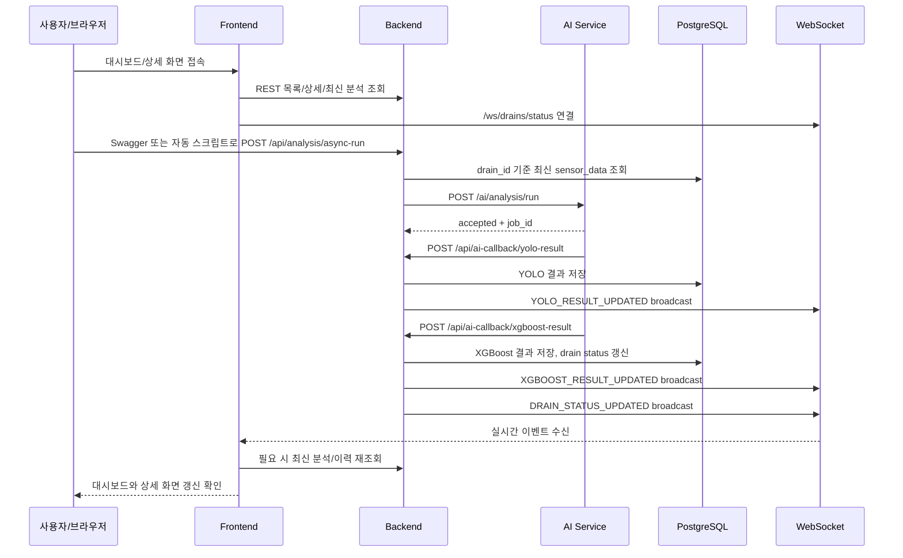

# 08 AI-프론트-백엔드 통합 테스트 계획

## 1. 작업 개요

| 항목 | 내용 |
|---|---|
| 브랜치 | `test/be-fe-ai-integration-test` |
| 작업 범위 | `/frontend/docs` 내부 통합 테스트 계획과 테스트 데이터 추가 |
| 테스트 대상 | Frontend, Backend, AI Service, DB, WebSocket |
| 목적 | 프론트-백엔드 통합이 완료된 상태에서 AI 서버까지 포함한 전체 비동기 분석 흐름을 자동/수동으로 검증한다. |

이번 작업은 코드 수정이 아니라 통합 테스트 실행 계획을 세우는 작업이다. 사용자가 직접 Swagger, 브라우저, DevTools로 따라 할 수 있는 수동 테스트와, 반복 검증을 위한 자동 테스트 기준을 함께 정리한다.

## 2. 확인한 문서와 코드

| 문서/파일 | 확인 내용 |
|---|---|
| `frontend/AGENTS.md` | `/frontend` 내부 작업 범위, plan 문서 작성 기준, 검증 기준 |
| `frontend/docs/convention/documentation-convention.md` | plan 문서 작성 기준과 한국어 문서화 기준 |
| `frontend/docs/plans/plan-07-front-back-integration-after-ws.md` | 기존 프론트-백엔드 WebSocket 통합 테스트 계획 |
| `frontend/docs/steps/step-09-front-back-integration-after-ws-result.md` | 프론트-백엔드 통합 테스트 수동 통과 결과 |
| `docs/SmartDrain 백엔드-AI 서버 비동기 분석 API 정리.md` | Backend -> AI -> Backend callback 비동기 분석 계약 |
| `ai_service/README.md` | AI Service 역할, 실행 명령, 테스트 명령 |
| `ai_service/HTTP_API_DESIGN.md` | `/ai/analysis/run` 요청과 callback payload 계약 |
| `backend/app/routers/analysis.py` | `POST /api/analysis/async-run` 백엔드 분석 시작 API |
| `backend/app/routers/ai_callback.py` | AI callback 수신 후 WebSocket broadcast 흐름 |
| `backend/app/services/analysis_async_service.py` | request/job 매핑, YOLO/XGBoost 저장, 이벤트 payload 생성 |

## 3. 현재 상태 판단

| 구분 | 현재 상태 | 이번 테스트에서 확인할 것 |
|---|---|---|
| 프론트-백엔드 REST | 이전 통합 테스트에서 통과 | AI callback 이후 REST 최신 데이터가 화면에 유지되는지 확인 |
| WebSocket | `DRAIN_STATUS_UPDATED`, `YOLO_RESULT_UPDATED`, `XGBOOST_RESULT_UPDATED` 통과 기록 있음 | AI 서버 callback으로 발생한 이벤트도 같은 방식으로 수신되는지 확인 |
| 백엔드-AI 연동 | 비동기 분석 API와 callback 구조가 있음 | 백엔드가 최신 센서값으로 AI 서버에 요청하고 callback을 정상 저장하는지 확인 |
| AI Service | FastAPI adapter, fake YOLO, rule-based XGBoost baseline 구현 | 실제 모델이 아니어도 계약 기반 end-to-end 흐름이 안정적인지 확인 |
| 자동화 테스트 | AI service 내부 pytest는 존재, 프론트 E2E 자동화는 아직 없음 | 현재 가능한 자동 테스트와 후속 자동화 범위를 분리 |

## 4. 전체 통합 흐름



## 5. 이번 작업 산출물

| 파일 | 목적 |
|---|---|
| `docs/plans/plan-08-ai-front-back-integration-test.md` | AI까지 포함한 자동/수동 통합 테스트 계획 |
| `docs/test/ai-front-back-integration/test-data.json` | Swagger, curl, Postman에서 복사해 쓸 테스트 payload와 기대 이벤트 예시 |

## 6. 테스트 환경 준비

### 6.1 브랜치와 변경 상태 확인

루트 경로에서 확인한다.

```powershell
git status --short --branch
```

기대값:

| 항목 | 기대 결과 |
|---|---|
| 브랜치 | `test/be-fe-ai-integration-test` |
| 변경 범위 | `frontend/docs` 내부 계획/테스트 데이터 중심 |

### 6.2 DB와 백엔드 실행

루트 경로에서 실행한다.

```powershell
docker compose up -d db
.\.venv\Scripts\activate
alembic upgrade head
cd backend
uvicorn app.main:app --reload
```

확인 URL:

| URL | 기대 결과 |
|---|---|
| `http://localhost:8000/` | Backend health 정상 |
| `http://localhost:8000/docs` | Swagger 표시 |

루트 `.env` 또는 `backend/.env` 확인값:

```env
AI_SERVER_ENABLED=true
AI_SERVER_BASE_URL=http://localhost:9000
AI_SERVER_TIMEOUT_SECONDS=10
CORS_ORIGINS=http://localhost:3000
```

### 6.3 AI Service 실행

루트 경로에서 실행한다.

```powershell
python -m pip install -r ai_service\requirements.txt
python -m uvicorn ai_service.http.app:app --host 0.0.0.0 --port 9000 --reload
```

확인 URL:

| URL | 기대 결과 |
|---|---|
| `http://localhost:9000/docs` | AI Service Swagger 표시 |
| `POST http://localhost:9000/ai/analysis/run` | accepted response 반환 |

AI Service 환경변수 확인값:

```env
BACKEND_BASE_URL=http://localhost:8000
BACKEND_CALLBACK_TIMEOUT_SECONDS=10
BACKEND_CALLBACK_RETRY_COUNT=1
```

### 6.4 프론트엔드 실행

`frontend/.env.local` 확인값:

```env
NEXT_PUBLIC_API_BASE_URL=http://localhost:8000
```

실행:

```powershell
cd frontend
pnpm dev
```

확인 URL:

| URL | 기대 결과 |
|---|---|
| `http://localhost:3000` | 대시보드 표시 |
| `http://localhost:3000/drains/DR-004` | 대표 상세 화면 표시 |

## 7. 테스트 데이터 준비

기본 데이터는 백엔드 seed를 우선 사용한다.

```powershell
cd backend
python -m app.seeds.seed_mock_data
```

대표 테스트 drain:

| drain code | 용도 |
|---|---|
| `DR-004` | 위험 상태와 상세 화면 대표 검증 |
| `DR-003` | 주의 상태 검증 |
| `DR-001` | 정상 상태 검증 |

추가 payload가 필요하면 아래 파일을 사용한다.

```text
frontend/docs/test/ai-front-back-integration/test-data.json
```

중요:

- 프론트 화면 URL은 문자열 drain code인 `DR-004`를 사용한다.
- 백엔드가 AI 서버로 보낼 때는 DB 숫자 ID를 사용한다.
- `POST /api/analysis/async-run`은 프론트/사용자가 `drainId`만 보내고, 백엔드가 최신 센서값을 찾아 AI 서버에 전달한다.

## 8. 자동 테스트 계획

자동 테스트는 “모델 정확도”가 아니라 “계약과 연결 흐름”을 검증하는 것이 목적이다.

### 8.1 AI Service 단위/계약 테스트

루트 경로에서 실행한다.

```powershell
python -m pytest ai_service
```

확인 기준:

| 항목 | 기대 결과 |
|---|---|
| 요청 검증 | 잘못된 payload는 실패한다 |
| fake YOLO | 계약에 맞는 obstruction/confidence/status를 반환한다 |
| XGBoost baseline | risk_score, risk_level, final_decision을 반환한다 |
| callback payload | 백엔드 callback schema와 맞는 JSON을 생성한다 |
| HTTP endpoint | `/ai/analysis/run`이 accepted response를 반환한다 |

### 8.2 백엔드 분석 API 자동 smoke test

백엔드와 AI Service가 켜진 상태에서 실행한다.

```powershell
curl -X POST http://localhost:8000/api/analysis/async-run `
  -H "Content-Type: application/json" `
  -d "{\"drainId\":\"DR-004\"}"
```

기대 결과:

| 확인 항목 | 기대 결과 |
|---|---|
| HTTP status | 200 |
| `success` | `true` |
| `data.requestId` | `REQ_`로 시작 |
| `data.jobId` | `AI_JOB_`로 시작 |
| `data.drainId` | `DR-004` |
| `data.status` | `processing` 또는 백엔드 저장 상태 |
| `data.sensorSummary` | 최신 센서 데이터 요약 |

### 8.3 callback 저장 자동 확인

async-run 호출 후 몇 초 뒤 아래 API를 확인한다.

```powershell
curl http://localhost:8000/api/drains/DR-004/analysis/history?limit=5
curl http://localhost:8000/api/drains/DR-004/analysis/latest
curl http://localhost:8000/api/drains/DR-004/risk-history?limit=5
```

확인 기준:

| API | 기대 결과 |
|---|---|
| analysis history | AI callback으로 생성된 YOLO/XGBoost 결과가 추가됨 |
| analysis latest | 최신 YOLO/XGBoost 결과가 반환됨 |
| risk history | XGBoost 결과가 위험 이력에 추가됨 |

### 8.4 WebSocket 자동화 후보

현재 frontend에는 Playwright 또는 WS 테스트 스크립트가 없다. 새 패키지 설치는 승인 항목이므로 이번 계획에서는 자동화 후보로만 둔다.

후속 자동화 방향:

| 후보 | 목적 | 필요 조건 |
|---|---|---|
| Node WebSocket smoke script | `/ws/drains/status` 연결 후 이벤트 타입 수신 검증 | `ws` 패키지 또는 Node 기본 WebSocket 사용 가능 여부 확인 |
| Playwright E2E | 브라우저에서 대시보드/상세 화면 갱신 검증 | 새 패키지 설치 승인 필요 |
| Backend pytest 통합 테스트 | AI callback까지 DB 저장 검증 | 테스트 DB와 async client fixture 필요 |

## 9. 사용자 수동 테스트 계획

### Step 1. 서버 3개가 모두 켜져 있는지 확인

| 서버 | URL | 기대 결과 |
|---|---|---|
| Backend | `http://localhost:8000/docs` | Swagger 표시 |
| AI Service | `http://localhost:9000/docs` | Swagger 표시 |
| Frontend | `http://localhost:3000` | 대시보드 표시 |

### Step 2. 프론트에서 WebSocket 연결 확인

브라우저 DevTools에서 확인한다.

```text
F12 > Network > WS > /ws/drains/status > Messages
```

확인 기준:

| 항목 | 기대 결과 |
|---|---|
| WS 연결 | `ws://localhost:8000/ws/drains/status` 연결 |
| 화면 상태 | connected 또는 정상 연결 상태 표시 |

### Step 3. 대시보드와 상세 화면 열기

아래 두 화면을 모두 열어 둔다.

```text
http://localhost:3000
http://localhost:3000/drains/DR-004
```

기록할 값:

| 항목 | 분석 실행 전 값 |
|---|---|
| 위험도 | 테스트 중 기록 |
| 위험 점수 | 테스트 중 기록 |
| 막힘률 | 테스트 중 기록 |
| CCTV 이미지 | 테스트 중 기록 |
| 최종 판단 | 테스트 중 기록 |

### Step 4. 백엔드 Swagger에서 AI 분석 시작

Swagger에서 실행한다.

```text
POST /api/analysis/async-run
```

Request body:

```json
{
    "drainId": "DR-004"
}
```

확인 기준:

| 항목 | 기대 결과 |
|---|---|
| 응답 성공 | `success: true` |
| requestId | `REQ_`로 시작 |
| jobId | `AI_JOB_`로 시작 |
| sensorSummary | 최신 센서값 포함 |

### Step 5. 백엔드와 AI Service 로그 확인

백엔드 로그에서 아래 요청을 확인한다.

```text
POST /api/analysis/async-run
POST /api/ai-callback/yolo-result
POST /api/ai-callback/xgboost-result
```

AI Service 로그에서 아래 요청을 확인한다.

```text
POST /ai/analysis/run
```

확인 기준:

| 항목 | 기대 결과 |
|---|---|
| Backend -> AI | AI 서버가 요청을 받음 |
| AI -> Backend YOLO | YOLO callback 200 응답 |
| AI -> Backend XGBoost | XGBoost callback 200 응답 |

### Step 6. WebSocket 이벤트 확인

DevTools WS Messages에서 아래 이벤트를 확인한다.

| 이벤트 | 기대 payload |
|---|---|
| `YOLO_RESULT_UPDATED` | `drainId`, `yoloResultId`, `obstructionRatio`, `confidenceScore`, `yoloStatus` |
| `XGBOOST_RESULT_UPDATED` | `drainId`, `xgboostResultId`, `riskLevel`, `riskScore`, `finalDecision` |
| `DRAIN_STATUS_UPDATED` | 최종 위험도, 위험 점수, 센서값, 막힘률, 참조 ID |

중요:

- 이벤트의 `payload.drainId`가 현재 상세 화면의 `DR-004`와 일치해야 한다.
- AI Service가 반환하는 YOLO 상태 `good`, `dirty`, `blocked`는 백엔드에서 프론트 표시용 `clear`, `partially_blocked`, `blocked`로 정규화될 수 있다.

#### Step 6-A. 자동화 실패 항목 수동 확인

자동 테스트에서는 WebSocket 연결 `Open`까지는 확인했지만, PowerShell 자동 스크립트에서 메시지 본문을 안정적으로 잡지 못했다. 이 항목은 브라우저 DevTools에서 직접 확인한다.

확인 순서:

1. Chrome에서 대시보드를 연다.

```text
http://localhost:3000
```

2. DevTools를 열고 Network 탭으로 이동한다.

```text
F12 > Network > WS
```

3. 목록에서 아래 WebSocket 요청을 선택한다.

```text
/ws/drains/status
```

4. `Messages` 탭을 열어 둔다.
5. 다른 탭에서 Swagger를 열고 아래 API를 실행한다.

```text
http://localhost:8000/docs
POST /api/analysis/async-run
```

Request body:

```json
{
    "drainId": "DR-004"
}
```

6. DevTools의 WebSocket `Messages` 탭에 이벤트가 추가되는지 확인한다.

반드시 확인할 이벤트:

| 순서 | 이벤트 | 확인할 필드 |
|---:|---|---|
| 1 | `YOLO_RESULT_UPDATED` | `payload.drainId`, `payload.yoloResultId`, `payload.obstructionRatio`, `payload.confidenceScore`, `payload.yoloStatus` |
| 2 | `XGBOOST_RESULT_UPDATED` | `payload.drainId`, `payload.xgboostResultId`, `payload.yoloResultId`, `payload.riskLevel`, `payload.riskScore`, `payload.finalDecision` |
| 3 | `DRAIN_STATUS_UPDATED` | `payload.drainId`, `payload.riskLevel`, `payload.riskScore`, `payload.waterLevelCm`, `payload.flowVelocityMps`, `payload.obstructionRatio` |

정상 판정 기준:

| 항목 | 정상 기준 |
|---|---|
| 이벤트 수 | 3개 이벤트가 순서대로 오거나, 최소한 같은 분석 요청 직후 모두 도착 |
| drainId | 모두 `DR-004` |
| riskLevel | `good`, `caution`, `danger`, `unknown` 중 하나 |
| riskScore | 0~1 숫자 |
| obstructionRatio | 0~1 숫자 |
| 최종 화면 반영 | 대시보드와 상세 화면의 위험도/점수/막힘률이 최신값으로 갱신 |

기대 이벤트 예시는 아래 파일의 `expectedWebSocketMessages`를 기준으로 비교한다.

```text
frontend/docs/test/ai-front-back-integration/test-data.json
```

주의:

- 테스트를 반복하면 `yoloResultId`, `xgboostResultId`, `sensorDataId`, timestamp 값은 계속 바뀐다.
- 따라서 ID 숫자와 시간은 정확히 일치하지 않아도 된다.
- `type`, `payload.drainId`, 위험도/점수/막힘률 필드 존재 여부를 우선 확인한다.
- `imageUrl`이 `ai-server://mock/4`이면 현재 AI Service 목업 이미지 정책상 정상이다.

기록 양식:

| 항목 | 결과 | 실제 값 또는 메모 |
|---|---|---|
| WS 연결 |  | 예: connected / Open |
| YOLO_RESULT_UPDATED 수신 |  |  |
| XGBOOST_RESULT_UPDATED 수신 |  |  |
| DRAIN_STATUS_UPDATED 수신 |  |  |
| payload.drainId 일치 |  |  |
| 대시보드 반영 |  |  |
| 상세 화면 반영 |  |  |

실패 시 기록할 내용:

| 실패 유형 | 기록할 내용 |
|---|---|
| WS 요청이 없음 | Network 탭 스크린샷, 현재 URL, 프론트 콘솔 오류 |
| WS 연결이 끊김 | Close code, 콘솔 오류, 백엔드 로그 |
| 이벤트가 안 옴 | Swagger async-run 응답, AI 서버 callback 로그, 백엔드 로그 |
| 이벤트는 오지만 화면 미반영 | 이벤트 payload, 현재 화면 URL, 새로고침 후 REST 값 |

### Step 7. 대시보드 화면 반영 확인

| 영역 | 기대 결과 |
|---|---|
| 요약 카드 | 위험/주의/정상 수가 callback 이후 상태와 맞음 |
| 지도 | `DR-004` 마커 상태가 최신 위험도와 맞음 |
| 위험 시설 목록 | 위험도와 위험 점수 최신값 표시 |
| 선택 패널 | 수위, 유속, 막힘률, 최종 판단 최신값 표시 |
| 실시간 상태 | WebSocket 연결 유지 |

### Step 8. 상세 화면 반영 확인

| 영역 | 기대 결과 |
|---|---|
| 상단 요약 | 최신 위험도와 위험 점수 표시 |
| CCTV/YOLO | AI callback으로 저장된 `ai-server://mock/{id}` 또는 fallback 표시 |
| YOLO 탭 | 막힘률, 신뢰도, 상태 표시 |
| XGBoost 탭 | 위험 점수, 위험 등급, 최종 판단, 참조 ID 표시 |
| 이력 탭 | YOLO/XGBoost 이력이 추가됨 |

`ai-server://mock/{id}`는 브라우저에서 실제 이미지로 표시되지 않을 수 있다. 이 경우 이미지 렌더링 실패가 아니라 AI 서버 MVP 목업 URL 정책으로 기록한다.

### Step 9. 새로고침 유지 확인

대시보드와 상세 화면을 새로고침한다.

확인 기준:

| 항목 | 기대 결과 |
|---|---|
| 대시보드 | REST 조회 기준 최신 상태 유지 |
| 상세 화면 | 최신 AI 분석 결과 유지 |
| 분석 이력 | callback으로 생성된 결과가 남아 있음 |

### Step 10. 오류 케이스 확인

| 시나리오 | 실행 방법 | 기대 결과 |
|---|---|---|
| AI 서버 중지 | AI Service 종료 후 async-run 실행 | Backend가 503 계열 오류를 반환하고 화면은 깨지지 않음 |
| 센서 데이터 없음 | 센서가 없는 drain으로 async-run 실행 | Backend가 `Sensor data not found` 반환 |
| 잘못된 drainId | `DR-NOT-FOUND` 요청 | Backend가 drain not found 오류 반환 |
| callback 순서 오류 | XGBoost callback을 YOLO보다 먼저 직접 호출 | Backend가 409 또는 오류 상태 반환 |
| WebSocket 미연결 | 브라우저 WS 차단 또는 백엔드 중지 | 화면에 error/reconnecting 상태 표시 |

## 10. 수동 테스트 체크리스트

| 번호 | 항목 | 기대 결과 | 결과 |
|---:|---|---|---|
| 1 | Backend Swagger 접속 | `http://localhost:8000/docs` 표시 |  |
| 2 | AI Service Swagger 접속 | `http://localhost:9000/docs` 표시 |  |
| 3 | Frontend 접속 | `http://localhost:3000` 표시 |  |
| 4 | WebSocket 연결 | `/ws/drains/status` connected |  |
| 5 | async-run 실행 | requestId/jobId 반환 |  |
| 6 | AI accepted 응답 | `accepted: true` |  |
| 7 | YOLO callback 저장 | history에 YOLO 결과 추가 |  |
| 8 | XGBoost callback 저장 | history에 XGBoost 결과 추가 |  |
| 9 | YOLO 이벤트 수신 | `YOLO_RESULT_UPDATED` 수신 |  |
| 10 | XGBoost 이벤트 수신 | `XGBOOST_RESULT_UPDATED` 수신 |  |
| 11 | 최종 상태 이벤트 수신 | `DRAIN_STATUS_UPDATED` 수신 |  |
| 12 | 대시보드 반영 | 지도/목록/선택 패널 갱신 |  |
| 13 | 상세 화면 반영 | 요약/탭/이력 갱신 |  |
| 14 | 새로고침 유지 | REST 기준 최신값 유지 |  |
| 15 | AI 서버 중지 오류 | 503 또는 명확한 오류 표시 |  |

상태 값은 `통과`, `실패`, `보류`, `해당 없음` 중 하나로 기록한다.

## 11. 완료 기준

아래 조건을 만족하면 AI-프론트-백엔드 통합 테스트를 완료로 본다.

1. 백엔드가 `POST /api/analysis/async-run`으로 AI 서버에 분석 요청을 보낸다.
2. AI 서버가 `/ai/analysis/run` 요청에 accepted response를 반환한다.
3. AI 서버가 YOLO callback과 XGBoost callback을 백엔드로 전송한다.
4. 백엔드가 callback 결과를 DB에 저장한다.
5. 백엔드가 `YOLO_RESULT_UPDATED`, `XGBOOST_RESULT_UPDATED`, `DRAIN_STATUS_UPDATED`를 WebSocket으로 발행한다.
6. 프론트가 대시보드와 상세 화면에서 최신 AI 분석 결과를 표시한다.
7. 새로고침 후에도 REST 조회 기준으로 최신 결과가 유지된다.
8. AI 서버 중지, 잘못된 drainId, 센서 데이터 없음 같은 오류 케이스가 화면을 깨뜨리지 않는다.

## 12. 남은 리스크

| 리스크 | 설명 | 대응 |
|---|---|---|
| 실제 모델 미적용 | 현재 AI Service는 fake YOLO와 rule-based XGBoost baseline이다. | 이번 테스트는 모델 정확도가 아니라 연동 계약 검증으로 한정한다. |
| AI 이미지 URL | callback 저장 시 `ai-server://mock/{id}` 형태라 실제 이미지가 표시되지 않을 수 있다. | fallback 표시를 정상 동작으로 기록하고, 실제 이미지 제공은 후속 과제로 둔다. |
| callback best-effort | AI Service callback은 persistent retry queue가 없다. | 실패 시 로그와 DB 반영 여부를 함께 기록한다. |
| 자동 브라우저 테스트 부재 | Playwright 같은 E2E 자동화 도구가 아직 없다. | 새 패키지 설치 승인 후 후속 자동화 브랜치에서 진행한다. |
| 테스트 DB 오염 | 반복 테스트 시 이력이 누적된다. | 테스트 전 seed 기준 drain과 실행 시각을 기록하고, 필요 시 DB 초기화 절차를 별도 문서화한다. |

## 13. 추천 후속 산출물

이번 plan 이후 실제 테스트가 끝나면 아래 문서를 추가한다.

| 파일 | 목적 |
|---|---|
| `docs/steps/step-10-ai-front-back-integration-result.md` | 실제 자동/수동 테스트 결과 기록 |
| `docs/pr/pr-13-ai-front-back-integration-test.md` | PR 요약 문서 |

## 14. 추천 커밋 메시지

제목:

```text
docs: AI 포함 통합 테스트 계획 추가
```

내용:

```text
- 프론트-백엔드-AI 비동기 분석 통합 테스트 계획을 정리한다.
- 자동 smoke test와 사용자 수동 테스트 절차를 분리한다.
- Swagger와 HTTP 테스트에 사용할 AI 통합 테스트 데이터를 추가한다.
```
