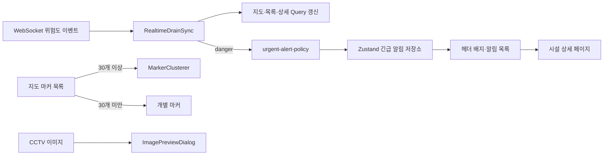

# 13 Dashboard UI Profiler Baseline 기록

## 1. 목적

UI 개선 전 기준선(Baseline) 렌더링 지표를 기록한다.

- 시나리오별 commit 수
- 주요 컴포넌트 렌더 횟수
- 선택 변경 시 목록 item 갱신 범위

## 2. 측정 환경

| 항목          | 값                                                          |
| ------------- | ----------------------------------------------------------- |
| 브랜치        | `refactor/dashboard-ui-responsiveness`                      |
| URL           | `http://localhost:3000/`                                    |
| 브라우저      | Chrome + React DevTools                                     |
| Profiler 옵션 | `Record why each component rendered while profiling` 활성화 |

## 3. 시나리오 정의

| 시나리오 | 동작                    |
| -------- | ----------------------- |
| A        | 지도 마커 1회 클릭      |
| B        | 위험 목록 item 1회 클릭 |
| C        | 지도 마커 3회 연속 클릭 |

## 4. Baseline 측정 표

| 시나리오 | Commit 수 | DashboardPage 렌더 횟수 | DrainRiskList 렌더 횟수 | 선택/직전 외 item 렌더 여부 | 비고                    |
| -------- | --------: | ----------------------: | ----------------------: | --------------------------- | ----------------------- |
| A        |         1 |                       1 |         관찰됨(약 10ms) | 있음                        | 전체 duration 약 26.8ms |
| B        |         1 |                       1 |        관찰됨(약 9.6ms) | 있음                        | 전체 duration 약 25.5ms |
| C        |         1 |                       1 |       관찰됨(약 16.7ms) | 있음                        | 전체 duration 약 33.5ms |

요약 판단:

- 사용자 동작 1회당 commit 1회로 측정되어 연속 commit 폭증은 보이지 않았다.
- Test C(마커 변경)에서 목록/상세/지도 갱신이 함께 일어나 A/B 대비 비용이 상대적으로 높았다.
- 단계 1~3에서 목록 item 경계와 선택 상태 전달 범위를 줄이는 개선이 유효하다.

## 5. 캡처 첨부 규칙

1. 파일명

- `baseline-A.png`
- `baseline-B.png`
- `baseline-C.png`

2. 저장 위치

- `frontend/docs/images/`

3. 문서 링크(캡처 후 업데이트)

- A: 사용자 첨부 예정
- B: 사용자 첨부 예정
- C: 사용자 첨부 예정

## 6. 측정 절차 체크리스트

1. Profiler `Clear`
2. `Record`
3. 시나리오 동작 수행
4. `Stop`
5. 최대 렌더 commit 선택
6. 표에 수치 입력
7. 캡처 저장 및 링크 반영

## 7. 다음 단계 진입 조건

다음 조건이 채워지면 단계 1(UI 개선 코드 변경)로 진행한다.

1. 시나리오 A/B/C 수치가 표에 입력됨
2. 캡처 3장이 `frontend/docs/images/`에 저장됨
3. 선택/직전 외 item 렌더 여부가 기록됨
4. 단계 1(UI 안정화) 코드 변경 착수 승인됨

## 8. 단계 종료 시 Git 확인 및 커밋 메시지 제안

이 단계 종료 시 아래 순서로 진행한다.

1. `git status -sb`로 미커밋 변경 파일 확인
2. 변경 파일별 핵심 diff 요약
3. 한글 커밋 메시지 제안

커밋 제목 템플릿:

- `docs: 대시보드 프로파일러 기준선 기록 정리`

커밋 본문 템플릿:

- 대시보드 UI 개선 전 Baseline 측정 목적과 범위를 문서화한다.
- 시나리오 A/B/C 기준 측정 표와 체크리스트를 추가한다.
- 사용자 캡처 저장 규칙과 다음 단계 진입 조건을 명시한다.

## 9. 현재 진행 현황 업데이트

이 문서는 Baseline 기록으로 시작했지만, 토큰 제한으로 작업 주체가 바뀌어도 바로 이어갈 수 있도록 현재 상태를 함께 정리한다.

1. 완료된 범위

- 단계 0: Baseline 측정 표 기록 완료
- 단계 1: 메인 대시보드의 모바일 높이, 텍스트 처리, 날짜 포맷, 상세 정보 우선순위 조정 완료
- 단계 2: 위험 목록 item 디자인 정리와 item 단위 memoization 적용 완료
- 단계 3: 선택 변경 시 콜백/렌더 경계 일부 안정화 완료
- 테마 기능: 시스템/라이트/다크 순환 토글과 초기 테마 동기화 오류 수정 완료

2. 최근에 반영된 주요 UI/구조 변경

- 모바일/태블릿에서는 고정 바텀시트 대신 인라인 요약 카드로 상세 정보를 노출한다.
- 데스크톱 상세 패널은 큰 화면에서만 유지한다.
- 헤더는 모바일에서 짧은 제목을 사용하도록 분기했다.
- 대시보드 스크롤 영역은 커스텀 스크롤바 스타일을 사용한다.
- 날짜 표시는 공통 포맷 유틸 기준으로 통일했다.

3. 최근 오류 수정 상태

- `next/script` 기반 테마 초기화는 제거하고 `app/layout.tsx`의 `head` 인라인 스크립트로 전환했다.
- `ThemeToggle`은 SSR/CSR 초기 렌더 불일치를 피하도록 hydration-safe 패턴으로 정리했다.

## 10. 현재 검증 상태

1. 확인 완료

- `cmd /c pnpm lint` 기준 신규 error는 없다.
- 남은 lint warning은 `components/fallback-image.tsx`의 기존 `img` 사용 경고 1건이다.
- 브라우저 재로드 후 테마 버튼과 `html[data-theme-mode]` 반영은 정상 확인했다.

2. 마지막 확인 기준

| 항목                             | 상태      |
| -------------------------------- | --------- |
| 테마 초기화 스크립트 오류        | 해결      |
| ThemeToggle hydration mismatch   | 해결      |
| 메인 화면 모바일/태블릿 레이아웃 | 반영 완료 |
| 전/후 Profiler 비교 문서화       | 미완료    |
| 상세 화면 UI 개선                | 미착수    |

## 11. 다음 에이전트 인수인계 메모

다음 작업자는 아래 순서로 이어서 진행한다.

1. 우선순위 1: 단계 4 문서화

- 단계 0 Baseline 표를 기준으로 개선 후 Profiler 결과를 다시 측정해 전/후 비교 문서를 정리한다.
- commit 수, 주요 컴포넌트 렌더 횟수, 체감 개선 포인트, 남은 리스크를 함께 기록한다.

2. 우선순위 2: 상세 화면 UI 개선

- 사용자 요청 순서상 메인 화면 정리가 먼저이며, 그 다음 상세 화면 UX를 다룬다.
- 메인 화면의 반응형/테마 방향성과 어긋나지 않게 상세 화면을 확장한다.

3. 작업 전 확인 파일

- `app/page.tsx`
- `app/layout.tsx`
- `app/globals.css`
- `components/app-header.tsx`
- `components/drain-risk-list.tsx`
- `components/drain-summary-panel.tsx`
- `components/risk-map.tsx`
- `components/theme-toggle.tsx`
- `components/theme-provider.tsx`
- `lib/date-format.ts`

4. 작업 전 검증 루틴

- 현재 브랜치와 변경 파일 상태를 먼저 확인한다.
- `components/theme-toggle.tsx`는 직전 수정 이력이 있으므로 새 편집 전 반드시 최신 내용을 다시 읽는다.
- UI 수정 후 `cmd /c pnpm lint`와 브라우저 재검증을 함께 수행한다.

5. 단계 종료 공통 처리

- `git status -sb`로 변경 파일 확인
- 변경 요약 3~5줄 정리
- 한글 커밋 메시지 제목/본문 제안

## 12. 단계 4 전/후 비교 초안

메인 대시보드의 코드 변경은 완료되어 있어, Baseline 수치와 개선 근거를 먼저 정리한다. After 열의 실제 Profiler 수치는 Chrome React DevTools에서 같은 시나리오를 다시 녹화한 뒤 입력한다. 현재 작업 환경에서는 DevTools Profiler 세션을 직접 실행할 수 없으므로 측정하지 않은 값을 추정치로 기록하지 않는다.

| 시나리오                   | 개선 전 Baseline                              | 개선 후 구현 상태                                       | After Profiler 수치 | 판정 기준                                               |
| -------------------------- | --------------------------------------------- | ------------------------------------------------------- | ------------------- | ------------------------------------------------------- |
| A: 지도 마커 1회 클릭      | 1 commit, 목록 전체 item 갱신 관찰, 약 26.8ms | `DrainRiskListItem` memoization과 안정된 선택 콜백 적용 | 사용자 재측정 필요  | 선택 전/후 item 외 렌더가 보이지 않아야 함              |
| B: 목록 item 1회 클릭      | 1 commit, 목록 전체 item 갱신 관찰, 약 25.5ms | 목록 item props 비교로 선택 상태가 바뀐 item만 갱신     | 사용자 재측정 필요  | 선택 전/후 item 외 렌더가 보이지 않아야 함              |
| C: 지도 마커 3회 연속 클릭 | 1 commit, 목록 갱신 관찰, 약 33.5ms           | 목록 데이터 정렬과 선택 상태의 파생 값을 분리           | 사용자 재측정 필요  | 연속 선택에서도 불필요한 item 렌더가 누적되지 않아야 함 |

코드 기준 확인 사항:

- `DashboardPage` 자체는 `selectedDrainId`를 사용하므로 선택마다 다시 렌더되는 것이 정상이다.
- `DrainRiskListItem`은 `memo`와 `areRiskListItemPropsEqual`을 사용하며, `onSelect`는 `useCallback`으로 안정화되어 있다.
- 따라서 After 측정의 핵심은 상위 컴포넌트의 렌더 횟수 감소가 아니라 비선택 목록 item 렌더 범위 감소다.

재측정 후 기록할 항목:

1. A/B/C별 commit 수와 최대 commit duration
2. `DashboardPage`, `DrainRiskList`, 선택 전/후 item의 렌더 횟수
3. 비선택 item이 렌더된 경우 해당 원인(정렬, 데이터 참조 변경, 부모 props 변경)
4. `after-A.png`, `after-B.png`, `after-C.png`를 `docs/images/`에 저장하고 본 문서에 링크

현재 판정: 전/후 비교 문서의 코드 근거와 재측정 기준은 정리했으며, 단계 4의 수치 확정은 사용자 Profiler 캡처가 추가될 때 완료한다.

## 13. 후속 UI 개선: 이미지 확대, 지도 밀집도, 긴급 알림

### 13.1 반영 내용

| 항목             | 구현                                                                                                                       |
| ---------------- | -------------------------------------------------------------------------------------------------------------------------- |
| CCTV 이미지 확대 | 상세 페이지의 CCTV 카드와 대시보드 요약 패널에서 이미지를 모달로 확대한다. 닫기 버튼, 배경 클릭, Escape 키로 닫을 수 있다. |
| 지도 클러스터    | 유효 시설 마커가 30개 이상일 때만 `MarkerClusterer`를 사용한다. 30개 미만은 개별 마커로 바로 표시한다.                     |
| 지도 안내 문구   | 실제 조작 기능이 아닌 클러스터 안내 문구를 제거한다.                                                                       |
| 긴급 알림        | WebSocket 상태 변경 이벤트 중 `danger`만 헤더 알림 목록에 표시한다.                                                        |
| 중복 처리        | 동일 시설의 반복 `danger` 이벤트는 시설 ID 기준 기존 알림의 시각과 판단 문구를 갱신한다.                                   |

### 13.2 알림 정책

- 정책 파일: `lib/urgent-alert-policy.ts`
- 현재 기준: 위험(`danger`)만 긴급 알림 대상, 최대 20개 표시, 시설 ID별 병합
- 사용자 확인 흐름: 헤더 배지 → 긴급 알림 목록 → 항목 선택 시 상세 페이지 이동 및 읽음 처리
- 범위 제한: 브라우저가 열려 있는 동안의 화면 내 알림이다. 웹 푸시·SMS·이메일·알림톡은 수신자/권한/발송 이력 API가 필요한 고도화 작업으로 유지한다.

### 13.3 후속 검토 사항

1. 실제 운영에서 반복 위험 알림의 재알림 간격이 필요하면 정책 파일에 cooldown 값을 추가한다.
2. 외부 알림을 도입할 때는 `notification_log_data`를 발송 상태와 실패 사유까지 기록하는 테이블로 구체화한다.
3. 실제 시설 수가 30개 이상인 지도 데이터를 기준으로 클러스터 밀집도와 대표 위험도 표시 정책을 재검증한다.

## 14. 대시보드 UI 1차 고도화 완료 기록

### 14.1 완료 범위와 기준 커밋

이번 1차 고도화는 Baseline 문서 추가 커밋부터 긴급 알림·이미지 확대 커밋까지를 기준으로 한다. 작업 트리 기준으로는 `79c329a^..03cc96f` 범위이며, 코드·문서 18개 파일이 변경되었다.

| 영역             | 반영 커밋            | 완료 내용                                                                               |
| ---------------- | -------------------- | --------------------------------------------------------------------------------------- |
| 계획·Baseline    | `79c329a`            | Profiler 시나리오, 수치 입력 표, 단계 종료 루틴을 정리                                  |
| 반응형 기본 구조 | `fa03593`            | 메인 화면의 모바일 높이·텍스트 처리·모바일 헤더 가독성을 개선                           |
| 목록 렌더 경계   | `5b7f65d`, `863e0fa` | 위험 목록 item 디자인을 정리하고 `memo`·안정된 선택 콜백으로 선택 변경 영향을 축소      |
| 테마와 공통 UI   | `bb28ccc`, `c086757` | 시스템/라이트/다크 순환 토글, 초기 테마 동기화, hydration 안정화, 커스텀 스크롤바 적용  |
| 상세 화면        | `c418636`            | 상세 화면의 다크 테마, 모바일 여백·텍스트 처리, 날짜·유량 단위 표기를 통일              |
| 이미지·지도·알림 | `03cc96f`            | CCTV 이미지 확대 모달, 30개 이상 마커 클러스터, 화면 내 긴급 알림과 중복 병합 정책 적용 |

### 14.2 화면별 변경 전/후

| 화면 또는 영역 | 변경 전                                                                       | 변경 후                                                                                  |
| -------------- | ----------------------------------------------------------------------------- | ---------------------------------------------------------------------------------------- |
| 메인 대시보드  | 작은 화면에서 지도·목록·상세 패널의 높이 압박이 크고 긴 텍스트가 밀릴 수 있음 | 모바일/태블릿은 인라인 요약 카드, 큰 화면은 상세 패널을 사용해 정보 우선순위를 분리      |
| 위험 시설 목록 | 선택할 때 목록 item의 불필요한 재렌더 가능성과 시각적 위계 부족               | rank·시설 ID·상태·수치·최근 업데이트를 정리하고 선택된 item과 변경 전 item 중심으로 갱신 |
| 헤더·테마      | 고정 알림 배지와 테마 초기화 시 SSR/CSR 불일치 가능성                         | 시스템/라이트/다크 토글을 안정화하고 실제 긴급 알림 수를 배지에 반영                     |
| 상세 정보      | 라이트 테마 기준 스타일과 화면별 날짜 형식이 혼재                             | 다크 테마까지 카드·탭·이력·빈 상태를 맞추고 날짜는 공통 formatter로 통일                 |
| CCTV 이미지    | 확대 아이콘이 있어도 동작하지 않음                                            | 상세·요약 패널 모두 모달 확대, 배경 클릭·닫기·Escape 복귀 제공                           |
| 지도 마커      | 소규모 mock에서도 클러스터 안내 문구가 항상 표시                              | 30개 이상일 때만 클러스터링하고 정적 안내 문구를 제거                                    |

### 14.3 구현 흐름

### 14.4 긴급 알림 정책 상세

1. 수신 조건

- `DRAIN_STATUS_UPDATED` WebSocket 이벤트의 `riskLevel === "danger"`만 긴급 알림으로 처리한다.
- YOLO·XGBoost 분석 결과 이벤트 자체는 알림을 직접 생성하지 않는다. 최종 상태 변경 이벤트를 단일 기준으로 삼아 중복을 줄인다.

2. 중복 방지와 읽음 처리

- 저장 키는 `drainId`다.
- 같은 시설에서 위험 이벤트가 다시 오면 새 항목을 추가하지 않고 판단 문구·갱신 시각을 덮어쓴다.
- 알림 목록의 시설을 선택하면 해당 상세 페이지로 이동하며 읽음 상태가 된다. `모두 읽음`도 제공한다.
- 화면에는 최대 20개 시설만 유지한다. 세 기준은 `lib/urgent-alert-policy.ts`에서 조정한다.

3. 이번 단계에서 제외한 범위

- 브라우저가 닫혀 있어도 전송되는 웹 푸시, SMS, 이메일, 카카오 알림톡은 구현하지 않았다.
- 외부 알림에는 수신자·권한·사용자 동의·재전송 간격·발송 실패·발송 이력 API가 필요하다. 루트 설계의 `notification_log_data`를 기반으로 별도 고도화 단계에서 추가한다.

### 14.5 검증 결과

| 구분               | 명령 또는 확인                                   | 결과      | 비고                                                                                                     |
| ------------------ | ------------------------------------------------ | --------- | -------------------------------------------------------------------------------------------------------- |
| 정적 검사          | `cmd /c pnpm lint`                               | 통과      | 신규 error 없음. `components/fallback-image.tsx`의 native `` warning 1건은 기존 항목                |
| 타입 검사          | `pnpm exec tsc --noEmit`                         | 통과      | TypeScript 오류 없음                                                                                     |
| diff 검사          | `git diff --check`                               | 통과      | 공백 오류 없음                                                                                           |
| production build   | `cmd /c pnpm build`                              | 미통과    | 코드 오류가 아니라 실행 중인 Node 프로세스가 `.next/app-path-routes-manifest.json`을 점유해 `EPERM` 발생 |
| 브라우저 수동 확인 | 모달·실제 WebSocket danger 이벤트·30개 이상 마커 | 확인 필요 | 이 작업 환경에는 브라우저 자동화와 대량 지도 데이터가 없음                                               |

### 14.6 1차 완료 판정과 후속 작업

1차 UI 고도화의 코드·문서 범위는 완료로 판정한다. 단, Profiler After 수치와 브라우저 실측은 다음 확인이 필요하다.

1. React DevTools로 Baseline A/B/C 시나리오를 다시 녹화해 12절의 After 열과 캡처 링크를 채운다.
2. 360~430px 모바일, 태블릿, 데스크톱에서 모달·다크 테마·상세 화면의 실제 레이아웃을 확인한다.
3. 테스트 WebSocket으로 같은 시설의 `danger` 이벤트를 두 번 보내 알림이 한 건으로 갱신되는지 확인한다.
4. 30개 이상의 좌표 데이터를 준비해 클러스터 표시와 클릭 동작을 확인한다.
