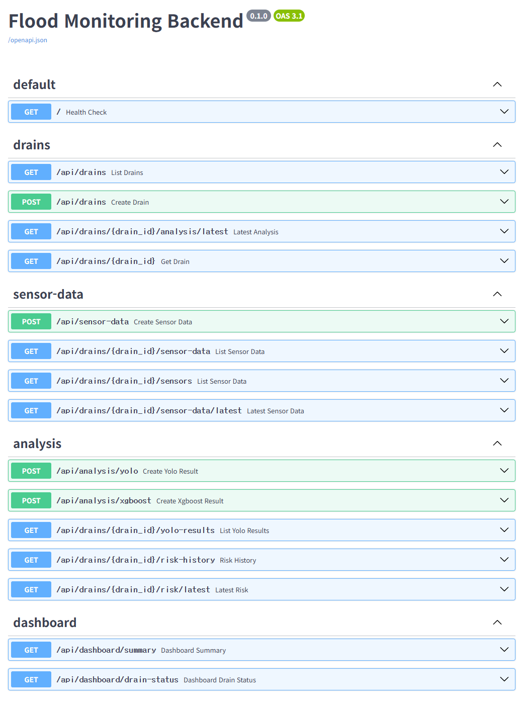
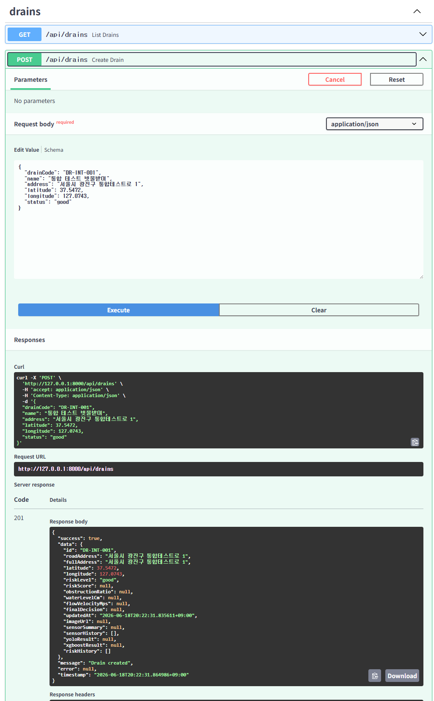
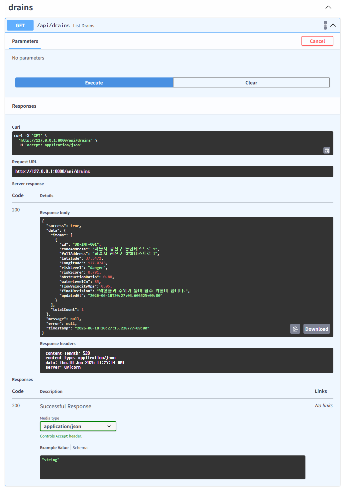
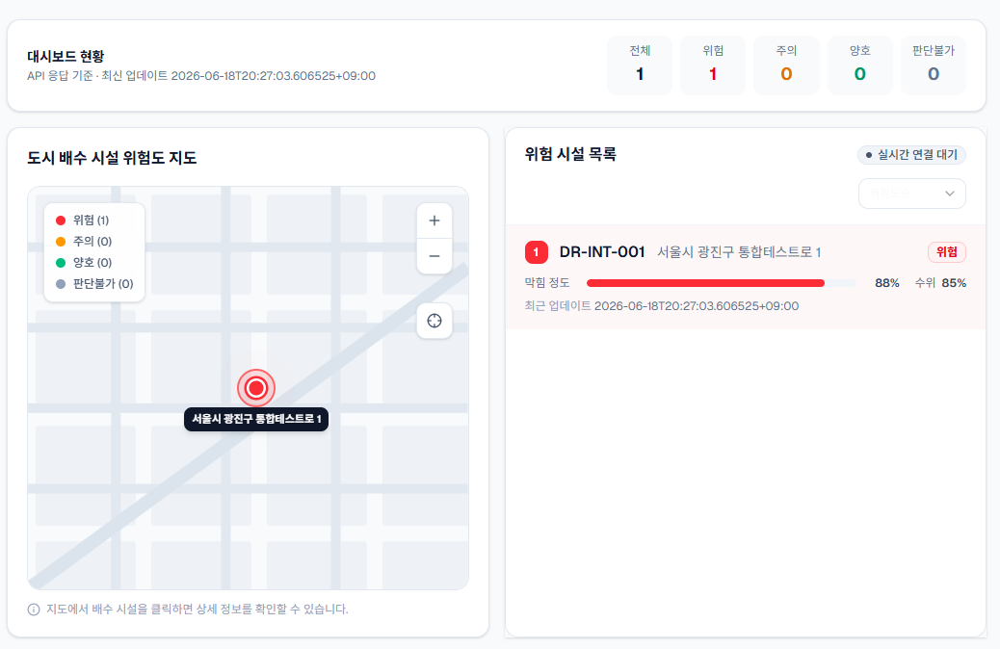
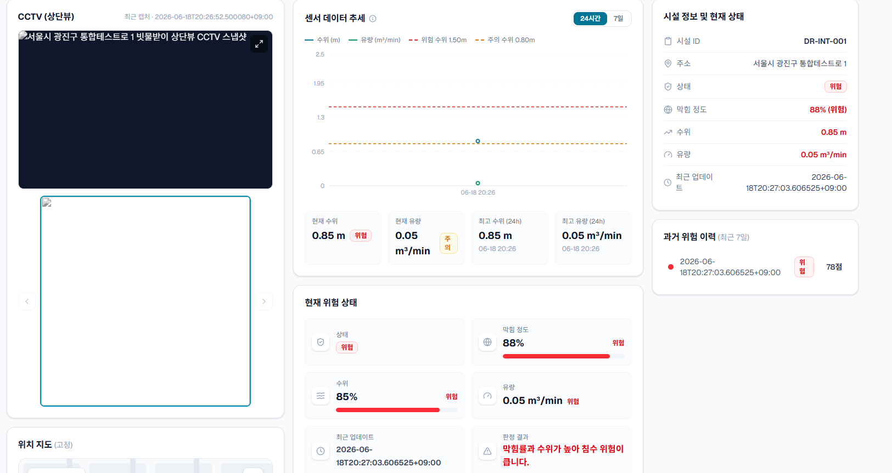

# SmartDrain 프론트엔드-백엔드 API 연동 테스트 완료 문서

## 1. 문서 개요

| 항목             | 내용                                                                             |
| ---------------- | -------------------------------------------------------------------------------- |
| 프로젝트명       | SmartDrain                                                                       |
| 문서명           | 프론트엔드-백엔드 API 연동 테스트 완료 문서                                      |
| 작성 위치        | `frontend/docs/steps/step-03-front-back-integration-test.md`                     |
| 테스트 목적      | FastAPI 백엔드와 Next.js 프론트엔드가 REST API 기준으로 정상 연동되는지 확인     |
| 테스트 브랜치    | `text/front-back-first-merge-test`                                               |
| 테스트 기준 문서 | `frontend/docs/front-back-integration-test-guideline.md`                         |
| API 명세 기준 1  | `docs/reference/11_API명세서.md`                                                           |
| API 명세 기준 2  | `frontend/docs/api-spec/2026-06-18_mvp_api_spec_v1.md`                           |
| 테스트 방식      | Swagger를 통해 테스트 데이터를 생성한 뒤, 프론트엔드 화면에서 API 연동 결과 확인 |
| WebSocket 테스트 | 이번 문서에서는 제외                                                             |

## 2. 프로젝트 배경

SmartDrain은 지능형 도시 침수 관리 및 빗물받이/배수구 모니터링 시스템이다.

이 프로젝트는 빗물받이 또는 배수구의 상태를 관리자가 쉽게 확인할 수 있도록 다음 정보를 제공하는 것을 목표로 한다.

| 구분         | 설명                                              |
| ------------ | ------------------------------------------------- |
| 시설 정보    | 배수구 또는 빗물받이의 위치, 이름, 상태 정보      |
| 센서 정보    | 수위, 유속 등 침수 위험 판단에 필요한 센서 데이터 |
| AI 분석 정보 | YOLO 이미지 분석 결과, XGBoost 위험도 분석 결과   |
| 대시보드     | 전체 위험 상태 요약 및 주요 시설 목록             |
| 상세 페이지  | 특정 시설의 센서, 위험 이력, 최신 분석 결과 확인  |

이번 테스트의 목적은 **백엔드에서 제공하는 REST API 응답이 프론트엔드 화면에 정상적으로 연결되는지 확인하는 것**이다.

## 3. 테스트 범위

### 3.1 포함 범위

이번 통합 테스트에서는 REST API 연동을 중심으로 확인하였다.

| 구분               | 테스트 항목                          | 포함 여부 |
| ------------------ | ------------------------------------ | --------- |
| 백엔드 실행        | FastAPI 서버 실행                    | 포함      |
| DB 마이그레이션    | Alembic 적용                         | 포함      |
| 테스트 데이터 생성 | Swagger를 통한 POST API 호출         | 포함      |
| API 조회           | Swagger 및 프론트엔드 연동 확인      | 포함      |
| 대시보드 화면      | API 데이터 표시 여부 확인            | 포함      |
| 상세 페이지 화면   | 특정 시설 상세 데이터 표시 여부 확인 | 포함      |

### 3.2 제외 범위

| 제외 항목                              | 제외 사유                                                    | 상태      |
| -------------------------------------- | ------------------------------------------------------------ | --------- |
| WebSocket 연동 테스트                  | 현재 프론트엔드에 WebSocket 수신 기능이 구현되어 있지 않음   | 제외      |
| `ws://localhost:8000/ws/drains/status` | 백엔드 엔드포인트 존재 여부와 별개로 프론트 연동 대상이 아님 | 미확인    |
| `DRAIN_STATUS_UPDATED` 이벤트 수신     | 프론트 수신 로직 미구현                                      | 미확인    |
| 자동화 테스트                          | 이번 테스트는 수동 통합 확인 중심                            | 미확인    |
| 에러 응답 테스트                       | 정상 API 연동 확인을 우선 진행                               | 확인 필요 |

## 4. 테스트 환경

| 구분               | 값                                               |
| ------------------ | ------------------------------------------------ |
| Python 버전        | Python 3.12                                      |
| Backend Framework  | FastAPI                                          |
| Database           | PostgreSQL                                       |
| ORM / Migration    | SQLAlchemy, Alembic                              |
| Frontend Framework | Next.js App Router                               |
| Backend URL        | `http://localhost:8000`                          |
| Swagger URL        | `http://localhost:8000/docs`                     |
| Frontend URL       | `http://localhost:3000`                          |
| API Base URL       | `NEXT_PUBLIC_API_BASE_URL=http://localhost:8000` |
| CORS 설정          | `CORS_ORIGINS=["http://localhost:3000"]`         |

## 5. 환경 설정 시 주의사항

### 5.1 Python 버전

이번 테스트는 Python 3.12 기준으로 진행하였다.

| 항목      | 설명                                                               |
| --------- | ------------------------------------------------------------------ |
| 권장 버전 | Python 3.12                                                        |
| 주의 버전 | Python 3.14                                                        |
| 주의 사유 | Python 3.14에서는 일부 의존성 설치 또는 실행 문제가 발생할 수 있음 |

따라서 팀원이 동일한 테스트를 재현할 때는 Python 3.12 환경을 기준으로 맞추는 것이 안전하다.

### 5.2 CORS 설정

프론트엔드와 백엔드가 다른 포트에서 실행되므로 CORS 설정이 필요하다.

| 항목            | 값                          |
| --------------- | --------------------------- |
| 프론트엔드 주소 | `http://localhost:3000`     |
| 백엔드 주소     | `http://localhost:8000`     |
| CORS 허용 값    | `["http://localhost:3000"]` |

`.env` 예시는 다음과 같다.

```env
CORS_ORIGINS=["http://localhost:3000"]
```

주의할 점은 `pydantic-settings`에서 `CORS_ORIGINS`를 list 타입으로 읽기 때문에 문자열 하나가 아니라 **JSON 배열 형식**으로 작성해야 한다는 점이다.

잘못된 예시는 다음과 같다.

```env
CORS_ORIGINS=http://localhost:3000
```

올바른 예시는 다음과 같다.

```env
CORS_ORIGINS=["http://localhost:3000"]
```

### 5.3 백엔드 실행

루트 경로에서 `backend`로 이동한 뒤 진행한다.

```powershell
cd backend
py -3.12 -m venv .venv
.\.venv\Scripts\activate
python --version
pip install -r requirements.txt
copy .env.example .env
python -m alembic upgrade head
python -m uvicorn app.main:app --reload
```

`python --version`이 `Python 3.12.x`가 아니면 venv를 잘못 만든 상태이므로, 통합 테스트를 시작하지 않고 Python 3.12 venv를 다시 만든다.

#### Anaconda/Miniconda 사용 시

Anaconda 또는 Miniconda를 사용하는 경우에도 프로젝트 실행 환경은 반드시 **Python 3.12**로 맞춘다.

기존 `venv` 대신 Conda 환경을 사용할 수 있으며, 루트 경로에서 `backend`로 이동한 뒤 다음과 같이 진행한다.

```powershell
cd backend
conda create -n smartdrain-py312 python=3.12
conda activate smartdrain-py312
python --version
pip install -r requirements.txt
copy .env.example .env
python -m alembic upgrade head
python -m uvicorn app.main:app --reload
```

`python --version` 결과가 `Python 3.12.x`가 아니면 통합 테스트를 시작하지 않는다.

이 경우 현재 활성화된 Conda 환경을 확인한 뒤 Python 3.12 환경을 새로 생성하거나 다시 활성화한다.

```powershell
conda info --envs
conda activate smartdrain-py312
python --version
```

주의: Conda 환경과 `.venv`를 동시에 활성화하지 않는다.  
프로젝트에서는 `venv` 방식과 Conda 방식 중 하나만 선택하여 사용한다.

### 5.4 프론트엔드 실행

프론트엔드 경로에서 진행한다.

```powershell
cd frontend
pnpm install
pnpm dev
```

프론트엔드 실행 후 다음 주소로 접속한다.

```text
http://localhost:3000
```

프론트엔드에서 백엔드 API를 호출하기 위해 `.env.local` 또는 프로젝트 환경 변수에 다음 값을 설정한다.

```env
NEXT_PUBLIC_API_BASE_URL=http://localhost:8000
```

## 6. 테스트 진행 순서

이번 테스트는 다음 순서로 진행하였다.

| 순서 | 작업                           | 목적                                |
| ---- | ------------------------------ | ----------------------------------- |
| 1    | PostgreSQL 실행 확인           | 백엔드가 DB에 연결 가능한지 확인    |
| 2    | `cd backend` 후 `python -m alembic upgrade head` 실행 | DB 테이블 구조가 최신 상태인지 확인 |
| 3    | 백엔드 서버 실행               | FastAPI API 서버 실행 확인          |
| 4    | 프론트엔드 서버 실행           | Next.js 화면 실행 확인              |
| 5    | Swagger에서 테스트 데이터 생성 | 프론트에서 조회할 데이터 준비       |
| 6    | Swagger에서 REST API 조회      | API 응답 구조 확인                  |
| 7    | 프론트엔드 대시보드 확인       | 목록 및 요약 데이터 표시 확인       |
| 8    | 프론트엔드 상세 페이지 확인    | 특정 시설의 상세 데이터 표시 확인   |

## 7. 테스트 데이터 생성 순서

Swagger에서 다음 순서로 테스트 데이터를 생성하였다.

| 순서 | API                          | 목적                             | 결과 |
| ---- | ---------------------------- | -------------------------------- | ---- |
| 1    | `POST /api/drains`           | 배수구/빗물받이 시설 데이터 생성 | 통과 |
| 2    | `POST /api/sensor-data`      | 센서 데이터 생성                 | 통과 |
| 3    | `POST /api/analysis/yolo`    | YOLO 분석 결과 생성              | 통과 |
| 4    | `POST /api/analysis/xgboost` | XGBoost 위험도 분석 결과 생성    | 통과 |

테스트 데이터 생성은 Swagger UI를 기준으로 진행하였다.

### 7.1 증빙 이미지




## 8. REST API 조회 테스트 결과

다음 API를 기준으로 백엔드 응답과 프론트엔드 연동 여부를 확인하였다.

| 순서 | API                                          | 확인 목적                  | 결과 | 메모                                  |
| ---- | -------------------------------------------- | -------------------------- | ---- | ------------------------------------- |
| 1    | `GET /api/drains`                            | 시설 목록 조회             | 통과 | 대시보드 목록 데이터 연동 확인        |
| 2    | `GET /api/drains/{drain_id}`                 | 특정 시설 상세 조회        | 통과 | 상세 페이지 기본 정보 연동 확인       |
| 3    | `GET /api/drains/{drain_id}/sensors`         | 특정 시설 센서 데이터 조회 | 통과 | 상세 페이지 센서 데이터 연동 확인     |
| 4    | `GET /api/drains/{drain_id}/risk-history`    | 특정 시설 위험도 이력 조회 | 통과 | 위험도 이력 데이터 연동 확인          |
| 5    | `GET /api/drains/{drain_id}/analysis/latest` | 최신 AI 분석 결과 조회     | 통과 | YOLO/XGBoost 최신 분석 결과 연동 확인 |
| 6    | `GET /api/dashboard/summary`                 | 대시보드 요약 정보 조회    | 통과 | 전체 현황 요약 데이터 연동 확인       |

### 8.1 증빙 이미지



## 9. 화면 연동 확인 결과

### 9.1 대시보드 화면

| 확인 항목              | 결과      | 메모                                   |
| ---------------------- | --------- | -------------------------------------- |
| 프론트엔드 서버 접속   | 통과      | `http://localhost:3000` 기준           |
| 대시보드 화면 표시     | 통과      | 화면 정상 표시 확인                    |
| 백엔드 API 데이터 표시 | 통과      | API 연동 결과 정상 확인                |
| 시설 목록 표시         | 통과      | `GET /api/drains` 연동 기준            |
| 요약 정보 표시         | 통과      | `GET /api/dashboard/summary` 연동 기준 |
| loading 상태           | 확인 필요 | 별도 테스트 결과 없음                  |
| error 상태             | 확인 필요 | 별도 테스트 결과 없음                  |
| empty 상태             | 확인 필요 | 별도 테스트 결과 없음                  |

### 9.2 대시보드 증빙 이미지



### 9.3 상세 페이지 화면

| 확인 항목                 | 결과      | 메모                                                   |
| ------------------------- | --------- | ------------------------------------------------------ |
| 상세 페이지 진입          | 통과      | 특정 drain 기준 상세 페이지 확인                       |
| 시설 기본 정보 표시       | 통과      | `GET /api/drains/{drain_id}` 연동 기준                 |
| 센서 데이터 표시          | 통과      | `GET /api/drains/{drain_id}/sensors` 연동 기준         |
| 위험도 이력 표시          | 통과      | `GET /api/drains/{drain_id}/risk-history` 연동 기준    |
| 최신 분석 결과 표시       | 통과      | `GET /api/drains/{drain_id}/analysis/latest` 연동 기준 |
| 존재하지 않는 drain 접근  | 확인 필요 | 별도 테스트 결과 없음                                  |
| API 실패 시 fallback 화면 | 확인 필요 | 별도 테스트 결과 없음                                  |

### 9.4 상세 페이지 증빙 이미지



## 10. 전체 테스트 결과 요약

| 구분       | 테스트 항목                                  | 결과      | 메모                             |
| ---------- | -------------------------------------------- | --------- | -------------------------------- |
| DB         | DB 실행 결과                                 | 통과      | 테스트 진행 가능 상태 확인       |
| Migration  | `cd backend` 후 `python -m alembic upgrade head` 결과 | 통과      | 마이그레이션 적용 후 테스트 진행 |
| Backend    | 백엔드 서버 실행 결과                        | 통과      | `http://localhost:8000` 기준     |
| Frontend   | 프론트 서버 실행 결과                        | 통과      | `http://localhost:3000` 기준     |
| Create API | `POST /api/drains`                           | 통과      | Swagger 기준 테스트 데이터 생성  |
| Create API | `POST /api/sensor-data`                      | 통과      | Swagger 기준 테스트 데이터 생성  |
| Create API | `POST /api/analysis/yolo`                    | 통과      | Swagger 기준 테스트 데이터 생성  |
| Create API | `POST /api/analysis/xgboost`                 | 통과      | Swagger 기준 테스트 데이터 생성  |
| Read API   | `GET /api/drains`                            | 통과      | 시설 목록 조회 확인              |
| Read API   | `GET /api/drains/{drain_id}`                 | 통과      | 시설 상세 조회 확인              |
| Read API   | `GET /api/drains/{drain_id}/sensors`         | 통과      | 센서 데이터 조회 확인            |
| Read API   | `GET /api/drains/{drain_id}/risk-history`    | 통과      | 위험도 이력 조회 확인            |
| Read API   | `GET /api/drains/{drain_id}/analysis/latest` | 통과      | 최신 분석 결과 조회 확인         |
| Read API   | `GET /api/dashboard/summary`                 | 통과      | 대시보드 요약 조회 확인          |
| WebSocket  | `ws://localhost:8000/ws/drains/status`       | 제외      | 프론트엔드 WebSocket 기능 미구현 |
| WebSocket  | `DRAIN_STATUS_UPDATED` 이벤트 수신           | 제외      | 프론트엔드 WebSocket 기능 미구현 |
| 화면       | 대시보드 화면 확인                           | 통과      | API 연동 화면 확인               |
| 화면       | 상세 페이지 화면 확인                        | 통과      | API 연동 화면 확인               |
| Error Case | 에러 응답 테스트                             | 확인 필요 | 정상 연동 테스트 우선 진행       |

## 11. 발견 이슈

| 번호 | 문제 내용                         | 재현 순서                                  | 기대 결과                                     | 실제 결과                                    | 심각도 | 상태                  |
| ---- | --------------------------------- | ------------------------------------------ | --------------------------------------------- | -------------------------------------------- | ------ | --------------------- |
| 1    | WebSocket 프론트 연동 테스트 불가 | WebSocket 테스트 시도                      | 프론트에서 `DRAIN_STATUS_UPDATED` 이벤트 수신 | 현재 프론트엔드에 WebSocket 수신 기능 미구현 | 낮음   | 이번 테스트 범위 제외 |
| 2    | 에러 응답 테스트 미진행           | 잘못된 drain_id 또는 서버 오류 상황 테스트 | error/fallback UI 확인                        | 별도 테스트 결과 없음                        | 중간   | 확인 필요             |

## 12. 남은 리스크

| 리스크                | 설명                                                                | 대응 방향                                      |
| --------------------- | ------------------------------------------------------------------- | ---------------------------------------------- |
| 에러 응답 처리 미확인 | API가 실패했을 때 프론트 화면이 어떻게 동작하는지 확인되지 않음     | 404, 500, 네트워크 오류 테스트 추가            |
| Empty 상태 미확인     | 데이터가 없을 때 화면이 정상적으로 안내 문구를 표시하는지 확인 필요 | 빈 DB 또는 조건 없는 데이터 상태에서 테스트    |
| Loading 상태 미확인   | API 응답이 지연될 때 로딩 UI가 정상 표시되는지 확인 필요            | 네트워크 지연 또는 mock delay 테스트           |
| WebSocket 미연동      | 실시간 상태 갱신 기능은 아직 프론트에서 확인 불가                   | 프론트 WebSocket 구현 후 별도 테스트 문서 작성 |
| 테스트 자동화 미구현  | 현재는 수동 테스트 중심                                             | 추후 Playwright 또는 API 테스트 자동화 검토    |

## 13. 최종 판단

이번 프론트엔드-백엔드 API 연동 테스트에서는 FastAPI 백엔드에서 제공하는 REST API 응답이 Next.js 프론트엔드 화면에 정상적으로 표시되는 것을 확인하였다.

대시보드 화면과 상세 페이지 화면에서 주요 REST API 연동은 정상 동작하였으며, Swagger를 이용한 테스트 데이터 생성 및 조회도 정상적으로 진행되었다.

다만 이번 테스트는 정상 연동 흐름을 우선 확인한 수동 테스트이므로, 다음 항목은 후속 테스트에서 추가 확인이 필요하다.

| 후속 확인 항목 | 설명                                                        |
| -------------- | ----------------------------------------------------------- |
| Error 상태     | API 실패, 잘못된 drain_id, 서버 오류 발생 시 화면 처리 확인 |
| Empty 상태     | 데이터가 없는 경우 안내 문구 또는 빈 화면 처리 확인         |
| Loading 상태   | API 응답 지연 시 로딩 UI 표시 확인                          |
| WebSocket 연동 | 프론트엔드 WebSocket 수신 기능 구현 후 별도 테스트 필요     |
| 자동화 테스트  | Playwright 또는 API 테스트 도구를 이용한 반복 검증 검토     |

따라서 이번 테스트 결과는 **REST API 기준 프론트엔드-백엔드 1차 연동 완료**로 판단한다.

