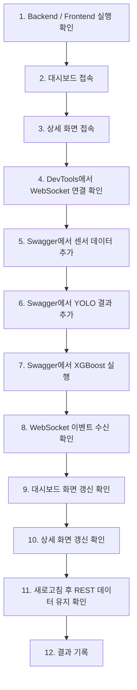

> 결과만 확인하고 싶은 경우 8번을 확인할 것.
> 

## 1. 테스트 목적

이번 수동 테스트의 목적은 자동/CLI 테스트에서 확인한 WebSocket 연동 결과를 실제 브라우저 화면에서 다시 확인하는 것이다.

검증 핵심은 아래 3가지다.

| 핵심 검증 | 설명 |
| --- | --- |
| WebSocket 연결 확인 | 프론트엔드가 `/ws/drains/status`에 정상 연결되는지 확인 |
| 이벤트 수신 확인 | Swagger에서 XGBoost 실행 후 `DRAIN_STATUS_UPDATED` 이벤트가 발생하는지 확인 |
| 화면 반영 확인 | 대시보드와 상세 화면의 위험도, 수위, 유속, 막힘률 등이 갱신되는지 확인 |

이번 테스트에서는 **과거 이미지 이동 기능은 완료 기준에서 제외**한다.

현재 구조상 상세 화면에는 최신 이미지 중심 데이터만 전달되므로, 이미지 이력 UI는 후속 개선 대상으로 기록한다.

---

## 2. 테스트 대상

| 항목 | 값 |
| --- | --- |
| 브랜치 | `test/realtime-websocket-verification` |
| Backend URL | `http://localhost:8000` |
| Swagger URL | `http://localhost:8000/docs` |
| Frontend URL | `http://localhost:3000` |
| WebSocket endpoint | `ws://localhost:8000/ws/drains/status` |
| 기준 이벤트 | `DRAIN_STATUS_UPDATED` |
| 테스트 시설 | `DR-WS-017879` |
| 상세 화면 URL | `http://localhost:3000/drains/DR-WS-017879` |

---

## 3. 테스트 전 준비할 것

### 3.1 서버 실행 확인

테스트 전에 아래 2개가 모두 실행되어 있어야 한다.

| 구분 | 확인 URL | 기대 결과 |
| --- | --- | --- |
| Backend | `http://localhost:8000/` | `success: true`, `data.status: ok` |
| Swagger | `http://localhost:8000/docs` | Swagger 문서 표시 |
| Frontend | `http://localhost:3000` | 대시보드 화면 표시 |

---

### 3.2 테스트 이미지 준비

프론트엔드의 `public` 폴더 아래에 테스트 이미지를 넣는다.

권장 경로:

```
frontend/public/test-snapshots/
```

필요 이미지:

```
drain-001-a.jpg
drain-001-b.jpg
drain-001-c.jpg
drain-broken-placeholder.jpg
```

브라우저에서 아래 주소로 이미지가 열리면 준비 완료다.

```
http://localhost:3000/test-snapshots/drain-001-a.jpg
http://localhost:3000/test-snapshots/drain-001-b.jpg
http://localhost:3000/test-snapshots/drain-001-c.jpg
```

주의:

```
/test-snapshots/drain-001-c.jpg
```

처럼 Swagger에는 `/test-snapshots/...` 경로만 입력한다.

`http://localhost:3000` 전체 주소를 넣지 않는다.

---

### 3.3 브라우저 DevTools 준비

Chrome 기준으로 아래 순서로 연다.

```
F12 → Network 탭 → WS 필터 선택
```

확인할 WebSocket 항목:

```
/ws/drains/status
```

기대 상태:

```
Status Code: 101 Switching Protocols
```

또는 Network의 WS 항목이 계속 연결 상태로 유지되면 정상이다.

---

## 4. 수동 테스트 전체 순서

수동 테스트는 아래 순서로 진행한다.



---

## 5. 실제 테스트 방법

## Step 1. Backend 상태 확인

브라우저에서 접속한다.

```
http://localhost:8000/
```

기대 결과:

| 항목 | 기대값 |
| --- | --- |
| success | `true` |
| data.status | `ok` |

정상 표시되지 않으면 WebSocket 테스트를 진행하지 않는다.

먼저 백엔드 실행 상태를 확인한다.

---

## Step 2. Frontend 대시보드 확인

브라우저에서 접속한다.

```
http://localhost:3000
```

확인 항목:

| 확인 항목 | 기대 결과 |
| --- | --- |
| 대시보드 표시 | 화면이 깨지지 않고 표시됨 |
| 시설 목록 | `DR-WS-017879` 또는 테스트 대상 시설이 보임 |
| 실시간 상태 chip | `실시간 연결됨`, `connected`에 해당하는 UI 표시 |
| 지도 영역 | 마커 또는 fallback UI 표시 |

---

## Step 3. 상세 화면 확인

브라우저에서 접속한다.

```
http://localhost:3000/drains/DR-WS-017879
```

확인 항목:

| 확인 항목 | 기대 결과 |
| --- | --- |
| 상세 화면 표시 | 화면이 정상 렌더링됨 |
| 시설 ID | `DR-WS-017879` 표시 |
| 현재 위험 상태 | 기존 DB 기준 상태 표시 |
| CCTV 이미지 | `/test-snapshots/drain-001-c.jpg` 또는 현재 최신 이미지 표시 |
| 센서 차트 | 데이터가 1건 이상이면 표시 |
| 위험 이력 | 데이터가 1건 이상이면 표시 |

---

## Step 4. WebSocket 연결 확인

Chrome DevTools에서 확인한다.

```
F12 → Network → WS → /ws/drains/status 선택
```

기대 결과:

| 확인 항목 | 기대 결과 |
| --- | --- |
| WebSocket 요청 | `/ws/drains/status` 존재 |
| Status | `101` 또는 연결 유지 |
| 화면 상태 chip | connected 상태 표시 |

실패 시 확인할 것:

| 증상 | 확인할 부분 |
| --- | --- |
| WS 요청이 없음 | 프론트에서 WebSocket 연결 코드가 실행되는지 확인 |
| 404 | endpoint 경로가 `/ws/drains/status`인지 확인 |
| 연결 실패 | 백엔드 서버 실행 여부 확인 |
| CORS 또는 origin 문제 | 백엔드 WebSocket 허용 설정 확인 필요 |
| 화면 chip이 계속 error | 프론트 연결 상태 처리 로직 확인 |

---

## Step 5. Swagger에서 센서 데이터 추가

Swagger 접속:

```
http://localhost:8000/docs
```

Endpoint:

```
POST /api/sensor-data
```

Request body 예시:

```json
{
  "drainId": 2,
  "waterLevelCm": 120,
  "flowVelocityMps": 0.02,
  "measuredAt": "2026-06-19T12:40:00+09:00"
}
```

기대 결과:

| 확인 항목 | 기대값 |
| --- | --- |
| HTTP status | `201` |
| success | `true` |
| data.drainId | `DR-WS-017879` |
| data.waterLevelCm | `120` |
| data.flowVelocityMps | `0.02` |
| data.id | 다음 XGBoost 요청의 `sensorDataId` 후보 |

중요:

Swagger 응답에서 `data.id` 값을 반드시 기록한다.

기록 예시:

| 항목 | 값 |
| --- | --- |
| 새 sensorDataId | `Swagger 응답의 data.id` |

---

## Step 6. Swagger에서 YOLO 결과 추가

Endpoint:

```
POST /api/analysis/yolo
```

### 6.1 첫 번째 YOLO 이미지

```json
{
  "drainId": 2,
  "imageUrl": "/test-snapshots/drain-001-a.jpg",
  "obstructionRatio": 0.35,
  "confidenceScore": 0.78,
  "yoloStatus": "partially_blocked",
  "capturedAt": "2026-06-19T12:41:00+09:00"
}
```

### 6.2 두 번째 YOLO 이미지

```json
{
  "drainId": 2,
  "imageUrl": "/test-snapshots/drain-001-b.jpg",
  "obstructionRatio": 0.76,
  "confidenceScore": 0.88,
  "yoloStatus": "blocked",
  "capturedAt": "2026-06-19T12:42:00+09:00"
}
```

### 6.3 세 번째 YOLO 이미지

```json
{
  "drainId": 2,
  "imageUrl": "/test-snapshots/drain-001-c.jpg",
  "obstructionRatio": 0.18,
  "confidenceScore": 0.82,
  "yoloStatus": "clear",
  "capturedAt": "2026-06-19T12:43:00+09:00"
}
```

기대 결과:

| 확인 항목 | 기대값 |
| --- | --- |
| HTTP status | 각 요청 `201` |
| data.imageUrl | 요청한 이미지 경로 |
| data.obstructionRatio | 요청한 막힘률 |
| data.id | 다음 XGBoost 요청의 `yoloResultId` 후보 |

중요:

마지막으로 사용할 YOLO 결과의 `data.id`를 기록한다.

기록 예시:

| 항목 | 값 |
| --- | --- |
| 새 yoloResultId | `Swagger 응답의 data.id` |

---

## Step 7. Swagger에서 XGBoost 실행

Endpoint:

```
POST /api/analysis/xgboost
```

Request body:

```json
{
  "drainId": 2,
  "sensorDataId": 2,
  "yoloResultId": 4
}
```

주의:

위 값은 예시다.

반드시 앞 단계 Swagger 응답에서 받은 실제 ID로 바꿔 넣는다.

예시:

```json
{
  "drainId": 2,
  "sensorDataId": 5,
  "yoloResultId": 8
}
```

기대 결과:

| 확인 항목 | 기대값 |
| --- | --- |
| HTTP status | `201` |
| success | `true` |
| data.riskLevel | `good`, `caution`, `danger`, `unknown` 중 하나 |
| data.riskScore | 숫자 값 |
| data.finalDecision | 최종 판단 값 |
| WebSocket event | `DRAIN_STATUS_UPDATED` 발생 |

---

## Step 8. WebSocket 이벤트 수신 확인

XGBoost 실행 직후 DevTools에서 확인한다.

```
Network → WS → /ws/drains/status → Messages
```

기대 메시지 예시:

```json
{
  "type": "DRAIN_STATUS_UPDATED",
  "payload": {
    "drainId": "DR-WS-017879",
    "riskLevel": "danger",
    "riskScore": 0.82,
    "waterLevelCm": 120,
    "flowVelocityMps": 0.02,
    "obstructionRatio": 0.76,
    "finalDecision": "...",
    "updatedAt": "2026-06-19T12:43:00+09:00"
  }
}
```

확인 항목:

| 확인 항목 | 기대 결과 |
| --- | --- |
| type | `DRAIN_STATUS_UPDATED` |
| payload.drainId | `DR-WS-017879` |
| payload.riskLevel | XGBoost 응답과 동일 |
| payload.riskScore | XGBoost 응답과 동일하거나 화면 표시 기준으로 변환 가능 |
| payload.waterLevelCm | 방금 입력한 센서 수위 |
| payload.flowVelocityMps | 방금 입력한 유속 |
| payload.obstructionRatio | 선택한 YOLO 결과의 막힘률 |
| payload.updatedAt | 최신 시간 |

---

## Step 9. 대시보드 화면 확인

XGBoost 실행 후 대시보드에서 아래 항목을 확인한다.

| 구분 | 확인 항목 | 기대 결과 | 실제 결과 | 상태 |
| --- | --- | --- | --- | --- |
| Dashboard | WebSocket 상태 chip | 실시간 연결됨 표시 | 정상 | 연결 |
| Dashboard | 시설 목록 | `DR-WS-017879` 값 갱신 | 정상 | 연결 |
| Dashboard | 위험도 | XGBoost 결과 기준으로 변경 | 정상 | 연결 |
| Dashboard | 위험 점수 | XGBoost 결과 기준으로 변경 | 정상 | 연결 |
| Dashboard | 막힘률 | YOLO 결과 기준으로 변경 | 정상 | 연결 |
| Dashboard | 수위 | 센서 데이터 기준으로 변경 | 정상 | 연결 |
| Dashboard | 유속 | 센서 데이터 기준으로 변경 | 정상 | 연결 |
| Dashboard | 지도 마커 | 위험도 색상 변경 | 정상 | 연결 |
| Dashboard | 위험 시설 목록 | 위험도순 재정렬 확인 | 정상 | 연결 |
| Dashboard | 선택 시설 패널 | 선택된 시설 값 갱신 | 정상 | 연결 |

최소 완료 기준:

```
대시보드의 지도, 위험 시설 목록, 선택 시설 패널 중 2개 이상에서 값 변경을 확인한다.
```

---

## Step 10. 상세 화면 확인

상세 화면에서 아래 항목을 확인한다.

| 구분 | 확인 항목 | 기대 결과 | 실제 결과 | 상태 |
| --- | --- | --- | --- | --- |
| Detail | WebSocket 상태 | connected 상태 표시 | 정상 | 연결 |
| Detail | 현재 위험 상태 | XGBoost 결과 기준으로 변경 | 정상 | 연결 |
| Detail | 위험 점수 | XGBoost 결과 기준으로 변경 | 정상 | 연결 |
| Detail | 수위 | 새 센서 데이터 기준으로 변경 | 정상 | 연결 |
| Detail | 유속 | 새 센서 데이터 기준으로 변경 | 정상 | 연결 |
| Detail | 막힘률 | 새 YOLO 결과 기준으로 변경 | 정상 | 연결 |
| Detail | CCTV 최신 이미지 | 최신 imageUrl 표시 | 정상 | 연결 |
| Detail | 센서 차트 | 새 센서 데이터 반영 | 정상 | 연결 |
| Detail | 위험 이력 | 새 XGBoost 결과 행 추가 | 정상 | 연결 |
| Detail | 과거 이미지 이동 | 현재 구조상 보류 | 보류 | 보류 |

주의:

과거 이미지 이전/다음 버튼은 이번 테스트의 통과 기준으로 보지 않는다.

현재 API 구조상 여러 이미지 배열이 상세 화면으로 전달되지 않는다면 정상 검증이 어렵다.

---

## Step 11. 새로고침 후 상태 유지 확인

XGBoost 실행 후 브라우저를 새로고침한다.

확인 URL:

```
http://localhost:3000
http://localhost:3000/drains/DR-WS-017879
```

확인 항목:

| 확인 항목 | 기대 결과 |
| --- | --- |
| 대시보드 새로고침 | WebSocket으로 갱신된 값이 REST 조회 결과에도 유지 |
| 상세 화면 새로고침 | 최신 위험 상태가 유지 |
| CCTV 이미지 | 최신 imageUrl 유지 |
| 위험 이력 | XGBoost 실행 결과가 남아 있음 |

이 단계가 중요한 이유:

WebSocket은 화면을 실시간으로 바꾸는 역할이고, 새로고침 후에도 값이 유지되려면 DB 저장과 REST 조회도 정상이어야 한다.

---

## 6. 추가 테스트 시나리오

## 6.1 다른 시설 이벤트 무시 테스트

목적:

상세 화면이 `DR-WS-017879`일 때, 다른 시설의 WebSocket 이벤트가 들어와도 상세 화면이 잘못 바뀌지 않는지 확인한다.

방법:

1. 상세 화면을 연다.

```
http://localhost:3000/drains/DR-WS-017879
```

1. Swagger에서 `DR-INT-001` 대상 XGBoost를 실행한다.
2. WebSocket 이벤트가 발생하는지 확인한다.
3. 상세 화면의 `DR-WS-017879` 값이 다른 시설 값으로 바뀌지 않는지 확인한다.

기대 결과:

| 확인 항목 | 기대 결과 |
| --- | --- |
| WebSocket 이벤트 | 발생 가능 |
| 상세 화면 시설 ID | `DR-WS-017879` 유지 |
| 상세 화면 값 | 다른 시설 값으로 덮어쓰이지 않음 |

---

## 6.2 WebSocket 재연결 테스트

목적:

백엔드가 재시작되거나 WebSocket 연결이 끊겼을 때 프론트 화면이 멈추지 않는지 확인한다.

방법:

1. 대시보드 또는 상세 화면을 열어둔다.
2. 백엔드 서버를 잠시 종료한다.
3. 화면의 WebSocket 상태 chip을 확인한다.
4. 백엔드 서버를 다시 실행한다.
5. WebSocket 상태가 다시 connected로 돌아오는지 확인한다.

기대 결과:

| 상황 | 기대 UI |
| --- | --- |
| 백엔드 종료 | reconnecting 또는 error 표시 |
| 백엔드 재실행 | connected 상태로 복구 |
| 화면 | 전체 화면이 하얗게 깨지지 않음 |

---

## 6.3 이미지 fallback 테스트

목적:

잘못된 이미지 경로가 들어와도 화면이 깨지지 않고 placeholder가 표시되는지 확인한다.

YOLO 요청 예시:

```json
{
  "drainId": 2,
  "imageUrl": "/test-snapshots/not-found-image.jpg",
  "obstructionRatio": 0.45,
  "confidenceScore": 0.72,
  "yoloStatus": "partially_blocked",
  "capturedAt": "2026-06-19T12:50:00+09:00"
}
```

이후 XGBoost를 실행한다.

기대 결과:

| 확인 항목 | 기대 결과 |
| --- | --- |
| 상세 CCTV 이미지 | 깨진 이미지 아이콘만 보이지 않음 |
| placeholder | 대체 이미지 또는 fallback UI 표시 |
| 레이아웃 | 이미지 오류 때문에 카드가 깨지지 않음 |

---

## 6.4 모바일 화면 테스트

Chrome DevTools에서 responsive mode로 확인한다.

```
F12 → Toggle device toolbar → iPhone 또는 Galaxy 크기 선택
```

확인 항목:

| 확인 항목 | 기대 결과 |
| --- | --- |
| 카드 배치 | 세로로 자연스럽게 쌓임 |
| CCTV 이미지 | 화면 밖으로 넘치지 않음 |
| 지도 영역 | 카드와 겹치지 않음 |
| 위험 이력 | 가로 스크롤 또는 적절한 줄바꿈 |
| 버튼 | 터치 가능한 크기 유지 |

---

## 7. 테스트 중 확인해야 할 우선순위

수동 테스트는 아래 순서로 판단한다.

| 우선순위 | 항목 | 통과 기준 |
| --- | --- | --- |
| 1 | WebSocket 연결 | `/ws/drains/status`가 연결됨 |
| 2 | 이벤트 발생 | XGBoost 실행 후 `DRAIN_STATUS_UPDATED` 수신 |
| 3 | 대시보드 반영 | 지도, 목록, 선택 패널 중 2개 이상 갱신 |
| 4 | 상세 화면 반영 | 현재 위험 상태가 갱신 |
| 5 | 새로고침 유지 | REST 조회 기준 최신 상태 유지 |
| 6 | 이미지 표시 | 최신 imageUrl 표시 |
| 7 | fallback | 잘못된 이미지에서 화면이 깨지지 않음 |
| 8 | 과거 이미지 이동 | 현재 구조상 보류 |
| 9 | 이미지 크기/레이아웃 | 후속 UI 개선 이슈 |

---

## 8. 수동 테스트 결과 기록 양식

테스트 완료 후 아래 양식으로 기록한다.

| 구분 | 확인 항목 | 기대 결과 | 실제 결과 | 상태 |
| --- | --- | --- | --- | --- |
| 준비 | Backend 상태 | 정상 응답 | 성공 | 성공 |
| 준비 | Frontend 상태 | 대시보드 표시 | 성공 | 성공 |
| 준비 | 테스트 이미지 | 이미지 URL 직접 접근 가능 | 성공 | 성공 |
| WS | WebSocket 연결 | `/ws/drains/status` 연결 | 성공 | 성공 |
| WS | 이벤트 수신 | `DRAIN_STATUS_UPDATED` 수신 | 성공 | 성공 |
| Swagger | 센서 데이터 생성 | 201 응답 | 성공 | 성공 |
| Swagger | YOLO 결과 생성 | 201 응답 | 성공 | 성공 |
| Swagger | XGBoost 실행 | 201 응답 | 성공 | 성공 |
| Dashboard | 상태 chip | connected 표시 | 성공 | 성공 |
| Dashboard | 지도 마커 | 위험도 색상 변경 | 성공 | 성공 |
| Dashboard | 위험 시설 목록 | 값 또는 순서 변경 | 성공 | 성공 |
| Dashboard | 선택 시설 패널 | 값 갱신 | 성공 | 성공 |
| Detail | 현재 위험 상태 | 값 갱신 | 성공 | 성공 |
| Detail | 센서 차트 | 새 데이터 반영 | 성공 | 성공 |
| Detail | CCTV 최신 이미지 | 최신 imageUrl 표시 | 성공 | 성공 |
| Detail | 위험 이력 | 새 이력 추가 | 성공 | 성공 |
| Error | 잘못된 imageUrl | placeholder 표시 | 성공 | 성공 |
| Error | WebSocket 끊김 | reconnecting/error 표시 | 성공 | 성공 |
| Layout | 이미지 크기 | 영역 밀림 없음 | 성공 | 성공 |
| 보류 | 과거 이미지 이동 | 현재 구조상 보류 | 보류 | 보류 |

---

## 9. 테스트 완료 기준

이번 수동 테스트는 아래 조건을 만족하면 완료로 본다.

| 번호 | 완료 기준 |
| --- | --- |
| 1 | 대시보드와 상세 화면에서 WebSocket 연결 상태가 connected로 표시된다. |
| 2 | Swagger에서 XGBoost 실행 후 `DRAIN_STATUS_UPDATED` 이벤트가 수신된다. |
| 3 | 대시보드 지도, 위험 시설 목록, 선택 시설 패널 중 2개 이상에서 값 변경을 확인한다. |
| 4 | 상세 화면의 현재 위험 상태가 XGBoost 결과 기준으로 바뀐다. |
| 5 | 새로고침 후에도 최신 상태가 유지된다. |
| 6 | 최신 imageUrl 표시는 확인한다. |
| 7 | 과거 이미지 이동은 현재 구조상 보류로 기록한다. |
| 8 | 이미지 크기/레이아웃 문제는 후속 UI 개선 이슈로 남긴다. |

---

## 10. 실패 시 원인 분리 기준

문제가 생기면 아래 기준으로 원인을 나눈다.

| 증상 | 가능 원인 | 담당 확인 |
| --- | --- | --- |
| Swagger XGBoost 실패 | 입력 ID 오류, 데이터 미존재 | Backend |
| WebSocket 연결 안 됨 | endpoint 오류, 서버 미실행, 연결 코드 문제 | Backend / Frontend |
| 이벤트는 오는데 화면 안 바뀜 | 프론트 이벤트 parser 또는 state update 문제 | Frontend |
| 대시보드는 바뀌고 상세는 안 바뀜 | 상세 화면 구독/필터링 로직 문제 | Frontend |
| 상세는 바뀌고 새로고침하면 사라짐 | DB 저장 또는 REST 조회 문제 | Backend |
| 이미지가 안 보임 | public 경로 오류 또는 imageUrl 처리 문제 | Frontend |
| 이미지가 너무 커서 레이아웃 밀림 | CSS max-height, object-fit 문제 | Frontend |
| 과거 이미지 버튼이 작동 안 함 | 이미지 이력 API 또는 snapshots 배열 부족 | Backend / Frontend 후속 개선 |

---

## 11. 후속 개선 이슈로 분리할 항목

이번 테스트에서 실패로 보지 않고 후속 개선으로 분리할 항목은 아래와 같다.

| 항목 | 후속 개선 방향 |
| --- | --- |
| 과거 이미지 이동 | YOLO 이미지 목록 API 또는 상세 응답에 snapshots 배열 필요 |
| 이미지 크기 | CCTV 카드에 max-height, object-fit 적용 |
| 썸네일 UI | 고정 높이와 object-cover 적용 |
| 이전/다음 버튼 | 이미지가 1장일 때 disabled 또는 숨김 처리 |
| 잘못된 payload 테스트 | 백엔드에서 테스트 이벤트 발행 API가 있으면 검증 가능 |
| 수동 테스트 편의성 | seed 데이터 생성 API 또는 테스트 스크립트 제공 검토 |

---